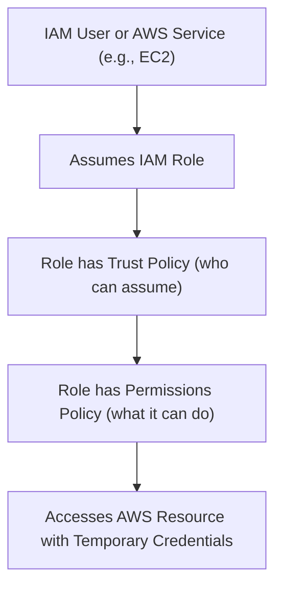

## IAM: Users, Groups, Roles, and Policies
### Core Concepts

*   **Identity and Access Management (IAM):** The AWS service that helps you securely control who (or what) is authenticated and authorized to use AWS resources.
*   **IAM User:** An entity representing a person or application that needs to interact with AWS. Has unique credentials (password for console, access keys for programmatic access). Best practice is to enable MFA.
*   **IAM Group:** A collection of IAM users. Policies attached to a group apply to all users within that group. Simplifies permission management for multiple users with similar access needs.
*   **IAM Role:** An identity with specific permissions, but no credentials. Roles are designed to be assumed by trusted entities (e.g., AWS services like EC2, other AWS accounts, or external identities). They provide temporary credentials.
*   **IAM Policy:** A document (in JSON format) that explicitly defines permissions.
    *   **Identity-based Policies:** Attached to users, groups, or roles. Grant permissions to the identity.
    *   **Resource-based Policies:** Attached to a resource (e.g., S3 bucket policy, SQS queue policy). Specify who has access to that specific resource and what actions they can perform on it.

### Key Details & Nuances

*   **Policy Evaluation Logic:**
    *   By default, all access is denied.
    *   An explicit `Allow` statement overrides the default `Deny`.
    *   An explicit `Deny` statement always overrides any `Allow` statement.
    *   Policies are evaluated in a specific order: resource-based `Deny`, identity-based `Deny`, resource-based `Allow`, identity-based `Allow`.
*   **Managed vs. Inline Policies:**
    *   **AWS Managed Policies:** Pre-defined policies created and managed by AWS (e.g., `AmazonS3ReadOnlyAccess`). Convenient but often too permissive for least privilege.
    *   **Customer Managed Policies:** Policies created and managed by you. Reusable across multiple identities. Recommended for fine-grained control.
    *   **Inline Policies:** Policies directly embedded within a user, group, or role. They are deleted if the identity is deleted. Not reusable, difficult to manage at scale.
*   **Trust Policy (Role Specific):** An essential component of an IAM Role that defines *who* (which principal) is allowed to assume the role. This is separate from the permissions policy attached to the role, which defines *what* the assumed role can do.
*   **Permissions Boundary:** An advanced IAM feature that limits the maximum permissions an identity-based policy can grant to an IAM entity (user or role). Useful for delegating administrative responsibilities without granting full administrative power. The effective permissions are the intersection of the permissions boundary and the identity-based policies.
*   **Least Privilege:** The security principle of granting only the minimum permissions required for an entity to perform its intended function. Critical for reducing the blast radius in case of compromise.
*   **Root User Account:** The account created when you first sign up for AWS. It has unrestricted access. **Never use the root user for daily tasks or grant its credentials.** Always create and use IAM users/roles with least privilege.

### Practical Examples

#### IAM Role Assumption Flow



#### Example Customer Managed IAM Policy (S3 Read-Only for Specific Bucket)

```json
{
  "Version": "2012-10-17",
  "Statement": [
    {
      "Effect": "Allow",
      "Action": [
        "s3:GetObject",
        "s3:ListBucket"
      ],
      "Resource": [
        "arn:aws:s3:::my-private-data-bucket",
        "arn:aws:s3:::my-private-data-bucket/*"
      ]
    }
  ]
}
```

#### Creating an IAM Role for EC2 Instance to Access S3 via AWS CLI

```sh
# 1. Create a trust policy JSON file (e.g., ec2-trust-policy.json)
# This policy allows the EC2 service to assume this role.
cat <<EOF > ec2-trust-policy.json
{
  "Version": "2012-10-17",
  "Statement": [
    {
      "Effect": "Allow",
      "Principal": {
        "Service": "ec2.amazonaws.com"
      },
      "Action": "sts:AssumeRole"
    }
  ]
}
EOF

# 2. Create the IAM role using the trust policy
aws iam create-role \
  --role-name MyEC2S3AccessRole \
  --assume-role-policy-document file://ec2-trust-policy.json \
  --description "Role for EC2 instances to access S3"

# 3. Attach a permissions policy to the role
# (e.g., the built-in AmazonS3ReadOnlyAccess managed policy or a custom one)
aws iam attach-role-policy \
  --role-name MyEC2S3AccessRole \
  --policy-arn arn:aws:iam::aws:policy/AmazonS3ReadOnlyAccess

# 4. Create an instance profile (if needed for EC2) and add the role to it
# (aws ec2 run-instances will use this profile)
aws iam create-instance-profile --instance-profile-name MyEC2S3AccessProfile
aws iam add-role-to-instance-profile --role-name MyEC2S3AccessRole --instance-profile-name MyEC2S3AccessProfile
```

### Common Pitfalls & Trade-offs

*   **Over-privileged Policies:** Granting more permissions than necessary (`"Resource": "*"`, `"Action": "*"`) is a major security risk. Trade-off: simpler initial setup vs. higher security risk.
*   **Using the Root Account:** Daily operations with the root account are extremely dangerous as it has full administrative access and cannot be restricted by IAM policies.
*   **Hardcoding Credentials:** Embedding AWS access keys directly in application code. This is an anti-pattern. Use IAM roles for EC2 instances, AWS Secrets Manager, or environment variables instead.
*   **Misunderstanding `Deny`:** An explicit `Deny` always wins, regardless of any `Allow` statements. This can lead to unexpected access issues.
*   **Managing Policies at Scale:** With many users, groups, and roles, policy management can become complex. Strategies like group-based permissions, customer-managed policies, and Infrastructure-as-Code (IaC) are crucial.
*   **Cross-Account Access:** Setting up roles for cross-account access can be tricky, involving both the resource policy in the target account and the assume role policy in the source account.

### Interview Questions

1.  **Differentiate between IAM Users and Roles. When would you use one over the other?**
    *   **Answer:** An **IAM User** represents a human or persistent application and has permanent credentials (password, access keys). It's used when a distinct identity needs long-term access. An **IAM Role** is an identity that does not have permanent credentials; it's designed to be assumed by trusted entities (AWS services, other accounts, federated users) to obtain temporary credentials.
    *   **Use Cases:** Use **Users** for individual developers, administrators, or persistent applications running outside AWS. Use **Roles** for EC2 instances needing to access S3, Lambda functions needing DynamoDB access, cross-account access, or federated users logging into AWS. Roles enforce least privilege by providing temporary, revocable access.

2.  **Explain the principle of least privilege in IAM and how you'd apply it.**
    *   **Answer:** The principle of least privilege dictates that an entity (user, role, service) should only be granted the minimum permissions required to perform its specific task, and no more.
    *   **Application:**
        *   Start with no permissions and add only what's necessary.
        *   Use specific `Action` and `Resource` definitions instead of wildcards (`*`).
        *   Attach policies to groups or roles rather than individual users where possible for scalability.
        *   Regularly review and audit permissions to ensure they are still appropriate and remove unused ones.
        *   Utilize `Condition` keys in policies for even finer-grained control (e.g., access only from specific IPs, during certain times).

3.  **How do IAM Policies work? Describe the key components of a policy document.**
    *   **Answer:** IAM Policies are JSON documents that define permissions. They are attached to identities (users, groups, roles) or resources. When an entity makes a request to AWS, IAM evaluates all applicable policies to determine if the request is allowed or denied.
    *   **Key Components:**
        *   `Version`: The policy language version (almost always "2012-10-17").
        *   `Statement`: An array of individual permission statements.
        *   `Sid` (Statement ID): An optional identifier for the statement.
        *   `Effect`: Required. Can be `Allow` or `Deny`. An explicit `Deny` always overrides an `Allow`.
        *   `Action`: Required. Specifies the AWS service actions allowed or denied (e.g., `s3:GetObject`, `ec2:RunInstances`).
        *   `Resource`: Required. Specifies the AWS resources to which the action applies (e.g., `arn:aws:s3:::my-bucket/*`). Can be `*` for all resources, but this is less secure.
        *   `Principal`: (Only in resource-based policies and trust policies for roles). Specifies the user, account, or service that is allowed or denied access to the resource/to assume the role.
        *   `Condition`: Optional. Specifies conditions under which a policy statement takes effect (e.g., `aws:SourceIp`, `aws:CurrentTime`).

4.  **What is an IAM Permissions Boundary and when is it useful?**
    *   **Answer:** An IAM Permissions Boundary is an advanced feature that sets the *maximum* permissions that an identity-based policy can grant to an IAM entity (user or role). It acts as an "upper limit" on what the entity can do, regardless of other policies attached to it.
    *   **Use Case:** It's particularly useful in large organizations for **delegated administration**. For example, a central security team can delegate the creation of IAM users/roles to development teams but enforce that these new entities can *never* exceed certain permissions (e.g., they can't create an IAM user with `AdministratorAccess`), even if the development team attaches a broad policy to them. This ensures compliance and maintains central control over overall security posture.

5.  **You need to grant an EC2 instance access to an S3 bucket. How would you achieve this securely?**
    *   **Answer:** I would achieve this using an **IAM Role with an Instance Profile**.
        1.  **Create an IAM Role:** Define a new IAM role specifically for EC2 instances.
        2.  **Define a Trust Policy:** For this role, the trust policy would allow the `ec2.amazonaws.com` service to assume the role (`"Principal": {"Service": "ec2.amazonaws.com"}`).
        3.  **Attach a Permissions Policy:** Attach an IAM policy to this role that grants the necessary S3 permissions (e.g., `s3:GetObject`, `s3:PutObject`) to the specific S3 bucket(s) required (following the principle of least privilege).
        4.  **Associate with EC2 Instance:** When launching the EC2 instance, I would associate this IAM role with the instance via an Instance Profile.
    *   **Benefit:** The EC2 instance can then securely obtain temporary credentials from the EC2 metadata service without needing to store any static AWS access keys on the instance, significantly improving security and manageability.