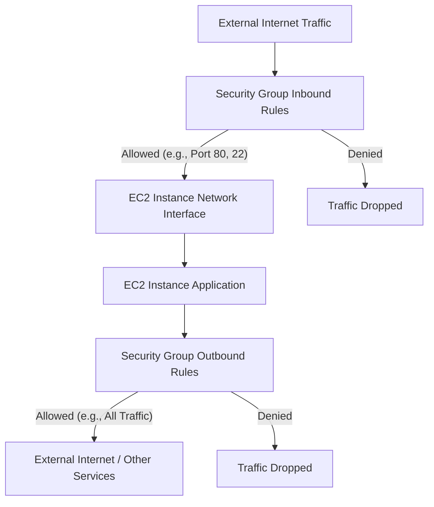

## EC2: Instances, Security Groups, and EBS
### Core Concepts

*   **EC2 Instances (Elastic Compute Cloud):**
    *   Virtual servers (VMs) in the cloud. Core compute offering.
    *   Provide resizable compute capacity. Quick to provision, scale, and de-provision.
    *   Accessed via SSH (Linux) or RDP (Windows).
    *   **AMI (Amazon Machine Image):** Blueprint for launching instances. Includes OS, software, configuration.
    *   **Instance Type:** Defines CPU, memory, storage, and networking capacity (e.g., `t3.micro`, `m6g.large`).

*   **Security Groups (SGs):**
    *   Act as virtual firewalls for instances.
    *   Control inbound and outbound traffic at the instance level.
    *   **Stateful:** If an inbound rule allows traffic, return traffic (outbound) is automatically allowed, and vice versa.
    *   Applied to network interfaces of EC2 instances.

*   **EBS (Elastic Block Store):**
    *   Persistent block storage volumes for EC2 instances.
    *   Acts like a virtual hard drive that can be attached to a running instance.
    *   Data persists independently of the instance's lifecycle.
    *   **Snapshots:** Point-in-time backups of EBS volumes stored on S3. Incremental.

### Key Details & Nuances

*   **EC2 Pricing Models:**
    *   **On-Demand:** Pay for compute capacity by the hour or second. Ideal for unpredictable workloads.
    *   **Reserved Instances (RIs):** Significant discount (up to 75%) for committing to 1 or 3 years. Best for steady-state workloads.
    *   **Spot Instances:** Up to 90% discount, but can be interrupted by AWS with 2-minute notice. Ideal for fault-tolerant, flexible workloads (e.g., batch processing).
    *   **Savings Plans:** Flexible pricing model that offers discounts similar to RIs in exchange for a commitment to a consistent amount of compute usage.

*   **EC2 Instance Store vs. EBS:**
    *   **Instance Store:** Temporary block storage physically attached to the host machine. Data *lost* when instance stops/terminates. High I/O performance.
    *   **EBS:** Network-attached storage. Data *persists* independently. Can be detached/reattached.

*   **Security Group Rules:**
    *   **Allow-only:** You only define `allow` rules. Implicit `deny` for anything not explicitly allowed.
    *   **Referencing SGs:** Can reference another Security Group as a source/destination, allowing traffic between instances associated with those SGs.
    *   **Order of Rules:** All rules are evaluated; the most permissive rule takes precedence if overlapping.

*   **EBS Volume Types (Performance vs. Cost):**
    *   **SSD-backed (Transactional Workloads):**
        *   **`gp2`/`gp3` (General Purpose SSD):** Balances price and performance. Good for most workloads. `gp3` offers independent IOPS/throughput provisioning.
        *   **`io1`/`io2` (Provisioned IOPS SSD):** Highest performance, most expensive. For I/O-intensive workloads (large databases). `io2 Block Express` for highest throughput/IOPS.
    *   **HDD-backed (Throughput Workloads):**
        *   **`st1` (Throughput Optimized HDD):** Good for large, sequential workloads (e.g., big data, log processing). Cannot be a boot volume.
        *   **`sc1` (Cold HDD):** Lowest cost, lowest performance. For infrequent access, large datasets. Cannot be a boot volume.

### Practical Examples

**1. Launching an EC2 Instance with a Security Group (Simplified CLI)**

```sh
# 1. Create a Security Group (if not already exists)
aws ec2 create-security-group \
    --group-name MyWebSG \
    --description "Web access for EC2 instances"

# Output will include GroupId, e.g., sg-0abcdef1234567890

# 2. Add an Ingress Rule to allow SSH (port 22) and HTTP (port 80)
aws ec2 authorize-security-group-ingress \
    --group-name MyWebSG \
    --protocol tcp \
    --port 22 \
    --cidr 0.0.0.0/0 # NOT for production! Be specific with IP ranges.

aws ec2 authorize-security-group-ingress \
    --group-name MyWebSG \
    --protocol tcp \
    --port 80 \
    --cidr 0.0.0.0/0 # NOT for production! Be specific with IP ranges.

# 3. Launch an EC2 Instance with the Security Group
aws ec2 run-instances \
    --image-id ami-0abcdef1234567890 \
    --instance-type t2.micro \
    --key-name MyKeyPair \
    --security-groups MyWebSG \
    --tag-specifications 'ResourceType=instance,Tags=[{Key=Name,Value=MyWebServer}]'
```

**2. Visualizing Security Group Traffic Flow**



### Common Pitfalls & Trade-offs

*   **Security Group Misconfigurations:**
    *   **Over-permissive rules:** `0.0.0.0/0` for critical ports (SSH, RDP) allows access from anywhere, greatly increasing attack surface. **Trade-off:** Ease of access vs. Security.
    *   **Forgetting outbound rules:** While stateful, explicit outbound rules might be needed for specific protocols or if troubleshooting.
    *   **Applying SGs to wrong resources:** SG rules only apply to resources *associated* with them.

*   **EBS Volume Type Mismatch:**
    *   Using `gp2`/`gp3` for high-throughput, sequential workloads that would benefit more from `st1` (costly over-provisioning).
    *   Using `st1`/`sc1` for databases requiring high IOPS (poor performance).
    *   **Trade-off:** Performance vs. Cost. Always right-size based on workload characteristics.

*   **Data Persistence with EC2:**
    *   Thinking data on an EC2 instance's root volume (if instance store-backed or if EBS is deleted on termination) persists after instance termination/stop. It doesn't.
    *   **Trade-off:** Convenience of root volume vs. Durability/Availability with separate EBS.
    *   **Solution:** Store critical data on separate EBS volumes, use snapshots, or leverage other persistent services like S3 or RDS.

### Interview Questions

1.  **Question:** "Explain the difference between Security Groups and Network Access Control Lists (NACLs) in AWS. When would you use one over the other?"
    *   **Answer:** Security Groups (SGs) operate at the instance/ENI level, are stateful, and process `allow` rules. NACLs operate at the subnet level, are stateless, and process both `allow` and `deny` rules in numbered order. SGs are for instance-specific security, while NACLs provide an additional, coarser layer of network security for entire subnets, often used as a defensive "net" or for explicit deny rules. SGs are generally preferred for most application-level filtering due to statefulness and instance-level granularity.

2.  **Question:** "You need to run a large batch processing job that can tolerate interruptions and needs to be completed as cost-effectively as possible. Which EC2 pricing model would you choose and why? What are the implications?"
    *   **Answer:** I would choose **Spot Instances**. They offer the deepest discounts (up to 90%) and are designed for fault-tolerant workloads that can handle interruptions. The implication is that my job *can* be terminated by AWS with a two-minute warning if Spot capacity is reclaimed. This requires the application to be designed for fault tolerance, checkpointing, or distributed processing that can restart/resume from where it left off.

3.  **Question:** "Describe the different EBS volume types and provide use cases for when you would select each type."
    *   **Answer:**
        *   **`gp3` (General Purpose SSD):** Default, balanced performance and cost. Good for boot volumes, dev/test environments, or low-latency interactive apps. (e.g., Web servers, small databases).
        *   **`io2` (Provisioned IOPS SSD):** Highest performance, most expensive. For I/O-intensive, mission-critical applications requiring consistent high IOPS and low latency. (e.g., Large OLTP databases like MySQL, PostgreSQL, Oracle, SAP HANA).
        *   **`st1` (Throughput Optimized HDD):** Cost-effective for large, sequential I/O operations. (e.g., Log processing, data warehousing, big data workloads like Kafka, Hadoop).
        *   **`sc1` (Cold HDD):** Lowest cost, for large, infrequently accessed data. (e.g., Archival, infrequent backups).

4.  **Question:** "How would you ensure data persistence for an application running on EC2 instances, considering EC2 instances can be ephemeral?"
    *   **Answer:** I would use **EBS volumes** for any critical application data.
        *   Attach separate EBS volumes (not the root volume if it's ephemeral) to the EC2 instances.
        *   Configure the EBS volumes to *not* delete on instance termination.
        *   Implement a robust **snapshot strategy** for EBS volumes to back up data to S3 regularly. This ensures point-in-time recovery.
        *   For database persistence, I'd generally prefer **AWS RDS** or **DynamoDB** over self-managed databases on EC2/EBS for managed persistence, backup, and high availability.
        *   For large files or objects, **Amazon S3** would be used, accessed directly from the EC2 instance.