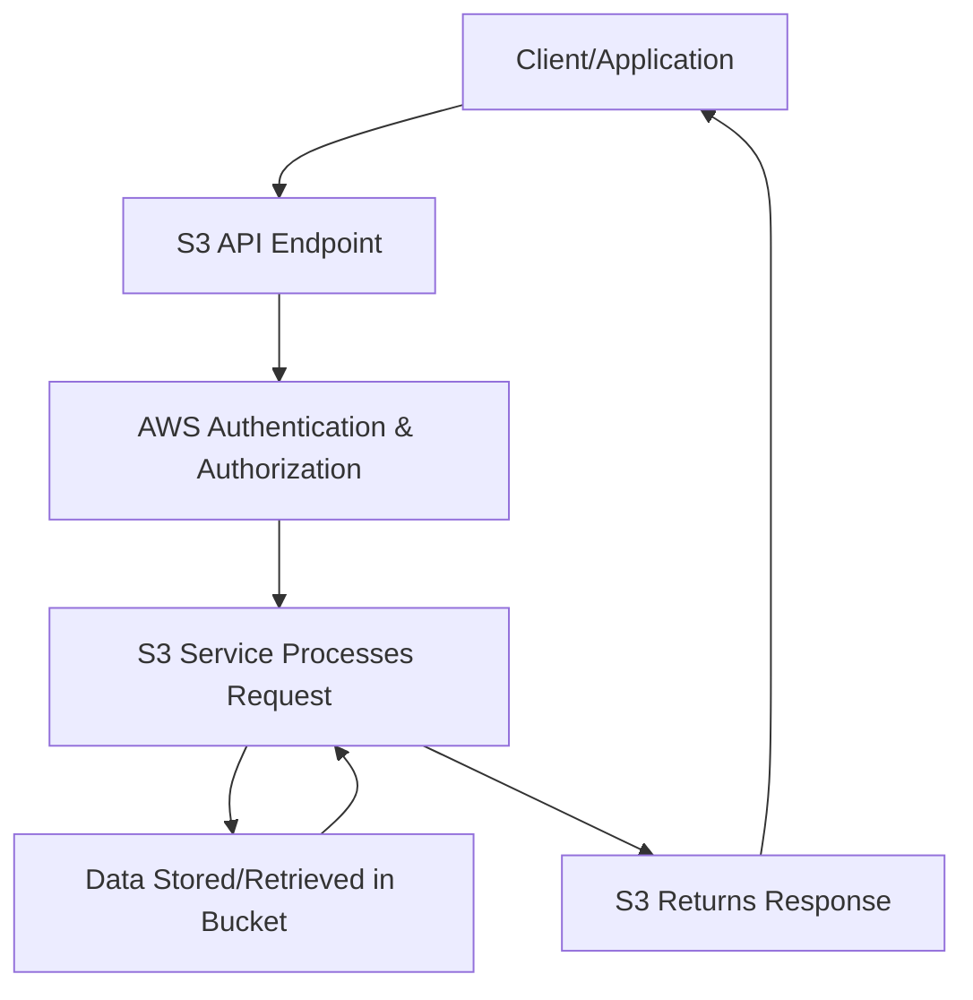

## S3: Buckets, Objects, and Storage Classes
### Core Concepts
*   **Object Storage:** S3 (Simple Storage Service) is a highly scalable, durable, and available object storage service. It stores data as "objects" rather than traditional files or blocks.
*   **Buckets:** Logical containers for objects.
    *   Unique globally (e.g., `my-unique-app-data-123`).
    *   Region-specific (data resides in the chosen region).
    *   Flat structure (no true folders/directories; prefixes simulate them).
*   **Objects:** Fundamental storage unit in S3.
    *   Composed of: `Key` (unique identifier within a bucket, includes path prefix), `Value` (the data itself), `Metadata` (system-defined and user-defined), and `Version ID` (if versioning is enabled).
    *   Immutable: An object cannot be modified; any "change" creates a new version or overwrites the existing one.
    *   Max size: 5 TB for a single object (multipart upload recommended for > 100 MB).

### Key Details & Nuances
*   **Data Consistency:**
    *   **Read-after-write consistency:** For `PUT` operations of *new* objects. Immediately after a successful write, you can read the object.
    *   **Eventual consistency:** For `PUT` overwrites and `DELETE` operations. It may take some time for the change to propagate globally across all S3 replicas.
*   **Storage Classes (Cost vs. Access Patterns):**
    *   **S3 Standard:** Default. High durability (11 nines), availability, low latency, frequently accessed data.
    *   **S3 Intelligent-Tiering:** Automatically moves objects between two access tiers (frequent and infrequent) based on access patterns, optimizing cost. Includes an archive access tier.
    *   **S3 Standard-IA (Infrequent Access):** Lower cost per GB, higher retrieval cost. For data accessed less frequently but requiring rapid access when needed.
    *   **S3 One Zone-IA:** Same as Standard-IA but stored in a single Availability Zone (AZ). Lower cost, but data is lost if the AZ is destroyed.
    *   **S3 Glacier:** Very low cost, but retrieval times range from minutes to hours. For archival data with infrequent access.
    *   **S3 Glacier Deep Archive:** Lowest cost, retrieval times from hours to days. For long-term archival.
    *   **Key Consideration:** Choose based on access frequency, required retrieval time, and budget. Cost comprises storage, requests, and data transfer.
*   **Versioning:**
    *   Keeps multiple versions of an object in the same bucket.
    *   Protects against accidental deletions or overwrites.
    *   Each version has a unique `Version ID`.
    *   Adds to storage costs as old versions are retained.
*   **Lifecycle Policies:**
    *   Automate object transitions between storage classes (e.g., from Standard to Standard-IA after 30 days).
    *   Automate object expiration/deletion after a set period.
*   **Access Control:**
    *   **IAM Policies:** Recommended for controlling access at the user/role level.
    *   **Bucket Policies:** JSON-based policies attached directly to a bucket to define permissions for users, roles, or even other AWS accounts.
    *   **Access Control Lists (ACLs):** Legacy, granular permissions at object/bucket level. Generally discouraged in favor of IAM/Bucket Policies unless specific cross-account legacy patterns require them.
    *   **Default Deny:** S3 buckets are private by default.
*   **Pre-signed URLs:** Grant temporary, time-limited access to specific objects to users without AWS credentials.

### Practical Examples

**1. S3 Basic Operations (AWS CLI)**

```sh
# Create a new S3 bucket (name must be globally unique)
aws s3 mb s3://my-unique-app-bucket-2023-11-20 --region us-east-1

# Upload a file to the bucket
aws s3 cp ./my-local-file.txt s3://my-unique-app-bucket-2023-11-20/data/my-remote-file.txt

# List objects in a bucket
aws s3 ls s3://my-unique-app-bucket-2023-11-20/data/

# Download a file from the bucket
aws s3 cp s3://my-unique-app-bucket-2023-11-20/data/my-remote-file.txt ./downloaded-file.txt

# Delete an object
aws s3 rm s3://my-unique-app-bucket-2023-11-20/data/my-remote-file.txt
```

**2. S3 Object Upload (TypeScript/Node.js SDK v3)**

```typescript
import { S3Client, PutObjectCommand } from "@aws-sdk/client-s3";

const s3Client = new S3Client({ region: "us-east-1" });
const BUCKET_NAME = "my-unique-app-bucket-2023-11-20";
const OBJECT_KEY = "users/data/user-profile.json";

async function uploadUserProfile(userId: string, profileData: any) {
  try {
    const command = new PutObjectCommand({
      Bucket: BUCKET_NAME,
      Key: OBJECT_KEY, // e.g., "users/data/user-123.json"
      Body: JSON.stringify(profileData),
      ContentType: "application/json",
      // Optional: Specify Storage Class
      StorageClass: "STANDARD_IA", // or "GLACIER", "ONEZONE_IA", etc.
    });

    const response = await s3Client.send(command);
    console.log(`Successfully uploaded object: ${OBJECT_KEY}`, response);
    // Response will contain ETag and VersionId if versioning is enabled
  } catch (error) {
    console.error(`Error uploading object: ${OBJECT_KEY}`, error);
  }
}

// Example usage
uploadUserProfile("user-123", { name: "Alice", email: "alice@example.com" });
```

**3. S3 Basic Data Flow**



### Common Pitfalls & Trade-offs
*   **Public Buckets:** A common security misconfiguration. Always review bucket policies and ACLs, use Block Public Access, and limit public access.
*   **Cost Optimization:**
    *   Incorrect Storage Class: Using S3 Standard for rarely accessed data significantly increases costs. Use Intelligent-Tiering or IA classes.
    *   Lack of Lifecycle Policies: Not transitioning or expiring old data leads to unnecessary storage costs.
*   **Eventual Consistency Misunderstandings:** Building systems assuming immediate consistency for all operations can lead to data integrity issues or race conditions, especially with read-modify-write patterns.
*   **Access Control Complexity:** Over-reliance on ACLs or overly complex bucket policies can lead to security gaps or difficult-to-debug permission issues. Prefer IAM roles and simple bucket policies.
*   **Performance for Small Objects:** S3 is optimized for larger objects. Storing millions of tiny objects (e.g., < 1 KB) can lead to high request costs and slower overall performance due to overhead. Consider aggregating small objects.

### Interview Questions
1.  **Describe the S3 consistency model. How does it impact application design, especially for read-after-write scenarios or frequent updates?**
    *   **Answer:** New `PUT`s are read-after-write consistent (immediate visibility). Overwrites and `DELETE`s are eventually consistent (may take time to propagate). This means an application might read stale data after an overwrite or see a deleted object briefly. For applications needing immediate consistency on updates, compensatory actions (e.g., using a database for metadata or a consistent cache) might be needed, or design around eventual consistency.
2.  **You need to store financial audit logs that are frequently accessed for the first month, then rarely accessed for the next 6 years before being deleted. Which S3 storage classes and features would you recommend to optimize cost and access?**
    *   **Answer:** Start with **S3 Standard** for the first month (frequent access). Implement a **Lifecycle Policy** to transition objects to **S3 Standard-IA** after 30 days (infrequent access, quick retrieval). After perhaps 90-180 days, transition to **S3 Glacier Deep Archive** for the remaining 5+ years (lowest cost, long-term archival). Finally, add an expiration rule to delete objects after 6 years and 1 month. This leverages the tiered storage model to minimize costs.
3.  **How would you secure an S3 bucket to ensure it's private and only accessible by a specific EC2 instance's IAM role and no one else? What are the key components you'd use?**
    *   **Answer:** First, ensure "Block Public Access" settings are enabled on the bucket. Then, attach an **IAM Role** to the EC2 instance with an IAM policy granting `s3:GetObject` and `s3:PutObject` (or specific actions) permissions to that bucket. Additionally, create a **Bucket Policy** on the S3 bucket that explicitly allows actions from that specific IAM role's ARN and implicitly denies all other access. This provides a strong, auditable, and easily manageable access control mechanism.
4.  **When would you use S3 Pre-signed URLs, and what are their security implications?**
    *   **Answer:** Pre-signed URLs are used to grant temporary, time-limited access to private S3 objects (uploading or downloading) without requiring AWS credentials. This is useful for user-generated content uploads (e.g., direct browser uploads) or sharing private files with external users. Security implications include: if leaked, the URL grants access for its duration; ensure the expiration time is appropriate, and consider minimum necessary permissions for the IAM user/role generating the URL.
5.  **What are some common strategies for optimizing performance when dealing with S3, especially for large files or high-throughput scenarios?**
    *   **Answer:**
        *   **Multipart Upload:** For files > 100 MB, split into parts and upload concurrently to improve throughput and resilience.
        *   **Range GETs:** For downloading large files, specify byte ranges to retrieve parts concurrently or resume interrupted downloads.
        *   **Prefix Design:** Distribute objects across multiple S3 prefixes to avoid hot spots if you expect extremely high request rates (> 3,500 PUT/5,500 GET requests per second for a prefix). S3 scales automatically, but a well-distributed prefix strategy can help.
        *   **Regional Proximity:** Place buckets in regions geographically close to your users/applications.
        *   **Client-Side Optimizations:** Use AWS SDKs which often handle retry logic, connection pooling, and multipart uploads automatically.