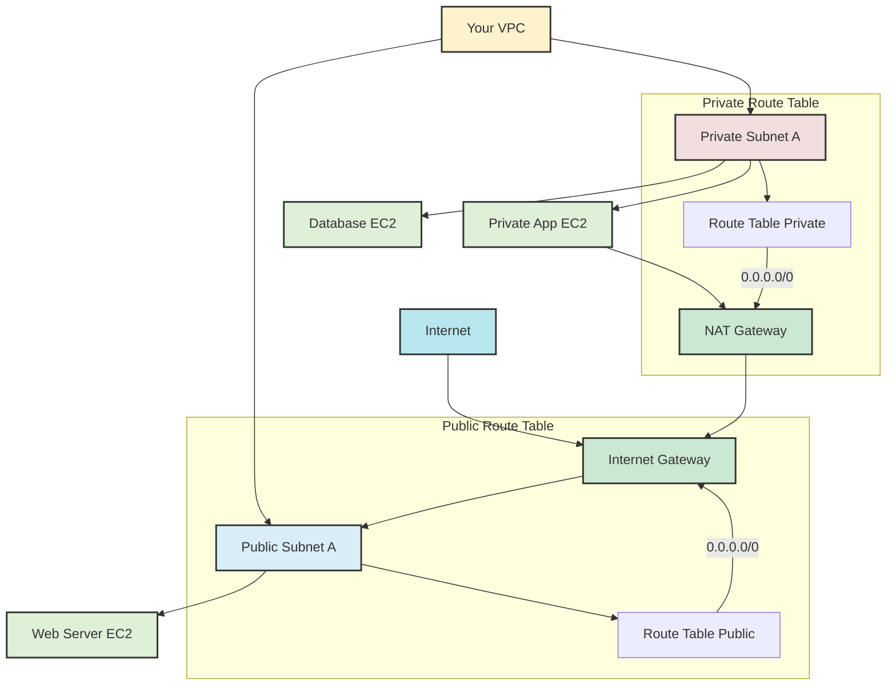

## VPC: Subnets (Public vs. Private), Route Tables, NAT vs. Internet Gateway
### Core Concepts
*   **Virtual Private Cloud (VPC):** Your own logically isolated virtual network within AWS, where you launch AWS resources. It's a fundamental building block for AWS infrastructure.
*   **Subnets:** Divisions of a VPC's IP address range. They allow you to segment your network within a VPC.
    *   **Public Subnet:** A subnet whose route table has a route to an Internet Gateway (IGW) for `0.0.0.0/0` (all internet traffic). Instances in a public subnet typically have public IP addresses for direct internet access (inbound and outbound).
    *   **Private Subnet:** A subnet whose route table does *not* have a route to an Internet Gateway for `0.0.0.0/0`. Instances in a private subnet cannot be directly accessed from the internet and cannot directly reach the internet.
*   **Route Tables:** A set of rules that determine where network traffic from your subnet or gateway is directed. Each subnet must be associated with one route table.
    *   Contains destination CIDR blocks and target (e.g., IGW, NAT Gateway, another VPC, virtual private gateway).
*   **Internet Gateway (IGW):** A highly available, horizontally scaled VPC component that allows communication between your VPC and the internet. It acts as a target for internet-bound traffic in public route tables and enables inbound internet traffic.
*   **NAT Gateway (Network Address Translation Gateway):** A managed service that enables instances in a private subnet to connect to the internet or other AWS services (e.g., S3, DynamoDB) outside the VPC, *without* allowing inbound connections from the internet. It provides a public IP address and translates private IPs for outbound traffic.
*   **NAT Instance (Network Address Translation Instance):** A deprecated, self-managed EC2 instance configured to perform NAT. Requires manual scaling, patching, and high availability setup. NAT Gateway is the preferred, managed alternative.

### Key Details & Nuances
*   **Subnet Availability Zone (AZ) Scope:** Subnets are always tied to a single Availability Zone. For high availability and fault tolerance, resources are spread across subnets in different AZs within a VPC.
*   **CIDR Block Allocation:**
    *   VPC CIDR block (`/16` to `/28`).
    *   Subnet CIDR blocks must be sub-ranges of the VPC CIDR and must not overlap.
    *   AWS reserves the first four and last IP address in each subnet for internal use.
*   **Route Table Association:**
    *   Each VPC has a "main" route table by default. Newly created subnets are implicitly associated with it unless explicitly associated with a custom route table.
    *   Best practice is to create custom route tables for specific subnets to enforce network segregation and control.
*   **Internet Gateway Mechanics:** An IGW is not a 'device' you pass traffic *through* in the traditional sense; it's a logical connection that provides a target for routes and enables public IP addresses on EC2 instances to be publicly routable. It acts as the gateway for public subnets.
*   **NAT Gateway vs. NAT Instance Differentiators:**
    *   **Management:** NAT Gateway is fully managed by AWS (highly available, scalable); NAT Instance requires self-management (updates, scaling, HA via ASG/secondary ENI).
    *   **Availability:** NAT Gateway automatically provides high availability within its AZ; NAT Instance is a single point of failure unless custom HA is configured.
    *   **Bandwidth:** NAT Gateway supports up to 100 Gbps; NAT Instance is limited by the EC2 instance type's network performance.
    *   **Cost:** NAT Gateway has a higher cost due to hourly charge and data processing charge; NAT Instance primarily incurs EC2 instance costs. **NAT Gateway is almost always preferred for new designs.**
*   **Private Subnet Outbound Connectivity:** Instances in private subnets needing internet access (e.g., for OS updates, S3 access, API calls) must route their traffic through a NAT Gateway or NAT Instance.

### Practical Examples

### Common Pitfalls & Trade-offs
*   **Misunderstanding IGW vs. NAT Gateway:**
    *   **IGW:** For instances needing *both* inbound and outbound internet access (e.g., web servers in public subnets).
    *   **NAT Gateway:** For instances needing *only outbound* internet access (e.g., application servers, databases in private subnets).
    *   Traffic *to* an IGW doesn't flow *through* it like a device; it's a routing target. Traffic *through* a NAT Gateway does flow through it for address translation.
*   **NAT Gateway Cost:** Can be a significant cost driver due to data processing charges (per GB) and hourly charges, especially for high-traffic environments. Evaluate necessity and traffic patterns.
*   **Missing Route Table Entry:** A common mistake is forgetting to add the `0.0.0.0/0` route to the IGW (for public subnets) or NAT Gateway (for private subnets) in the respective route tables.
*   **Security Group vs. Network ACL:** While subnets and route tables define *how* traffic flows, Security Groups (instance-level) and Network ACLs (subnet-level) define *what* traffic is allowed. These work in conjunction to control network access.
*   **CIDR Overlaps:** Ensuring non-overlapping CIDR blocks within your VPC and with any peered VPCs or on-premises networks is critical to avoid routing conflicts.

### Interview Questions
1.  **Explain the core difference between a public and private subnet in AWS VPC. How does an EC2 instance in each type of subnet gain internet connectivity?**
    *   **Answer:** A public subnet has a route in its route table pointing `0.0.0.0/0` (all internet traffic) to an Internet Gateway (IGW). Instances within it can have public IPs for direct inbound/outbound internet access. A private subnet does *not* have a direct route to an IGW. Instances in a private subnet can only gain *outbound* internet access by routing their `0.0.0.0/0` traffic through a NAT Gateway (or deprecated NAT Instance), which resides in a public subnet. They cannot receive unsolicited inbound connections from the internet.
2.  **When would you choose to deploy a NAT Gateway over a NAT Instance, and vice versa? What are the key considerations?**
    *   **Answer:** For new deployments, NAT Gateway is almost always preferred due to being a fully managed, highly available, and scalable AWS service. Key considerations:
        *   **NAT Gateway:** Managed, highly available (within AZ), automatically scales up to 100 Gbps, zero operational overhead, higher cost (hourly + data processing).
        *   **NAT Instance:** Self-managed EC2 instance, requires manual scaling/HA (e.g., ASG, secondary ENI), limited by instance type performance, lower cost (just EC2). Best used only for very specific legacy needs or extreme cost sensitivity for very low traffic.
3.  **An application server running in a private subnet needs to download security patches from the internet. Describe the exact networking components and configurations required to enable this, assuming the VPC already exists.**
    *   **Answer:**
        1.  **NAT Gateway:** Create a NAT Gateway in a *public* subnet within the same VPC. This NAT Gateway needs an Elastic IP address.
        2.  **Private Subnet Route Table:** Modify or create a custom route table for the private subnet(s) where the application server resides.
        3.  **Route Entry:** Add a new route to this private subnet's route table:
            *   **Destination:** `0.0.0.0/0`
            *   **Target:** The newly created NAT Gateway ID.
        This configuration ensures that all outbound internet-bound traffic from the private subnet is routed through the NAT Gateway, which then uses its public IP to reach the internet via the Internet Gateway in the public subnet.
4.  **You're designing a multi-tier application for high availability. How do subnets and route tables contribute to achieving this goal within a VPC?**
    *   **Answer:** For high availability, you deploy redundant components across multiple Availability Zones (AZs). Subnets are fundamentally tied to a single AZ. Therefore, you create:
        *   **Multiple Public Subnets:** One in each AZ, to host internet-facing components (e.g., Load Balancers, public web servers).
        *   **Multiple Private Subnets:** One in each AZ, to host internal application and database servers.
        *   **Route Tables:** Each subnet in each AZ will have a route table configured appropriately (pointing to an IGW for public subnets, or a NAT Gateway/VPC Endpoint for private subnets in that specific AZ).
    *   This setup ensures that if one AZ experiences an outage, your application components in other AZs (and their respective subnets and routing) remain operational, providing fault tolerance. Load balancers can distribute traffic across public subnets in different AZs.
5.  **What's the purpose of `0.0.0.0/0` in a route table, and how does its target differ for public vs. private subnets?**
    *   **Answer:** `0.0.0.0/0` represents all IPv4 addresses that are *not* explicitly covered by more specific routes in the route table (it's the default or "catch-all" route).
    *   **For Public Subnets:** The target for `0.0.0.0/0` is the **Internet Gateway (IGW)**. This allows instances in the public subnet to directly send and receive traffic to/from the internet.
    *   **For Private Subnets:** The target for `0.0.0.0/0` is typically a **NAT Gateway** (or sometimes a VPC Endpoint for specific AWS services like S3). This allows instances in the private subnet to initiate outbound connections to the internet or other AWS services, but prevents unsolicited inbound connections from the internet.