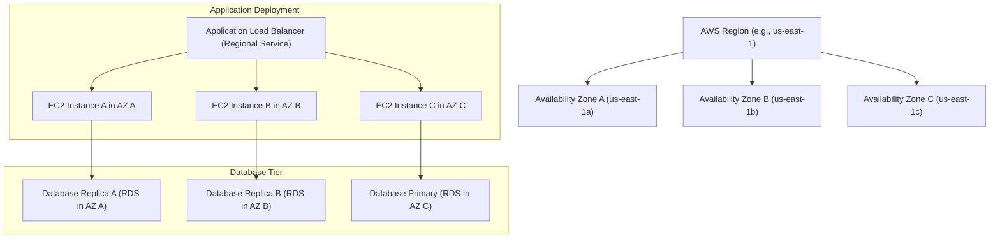

## Global Infrastructure: Regions vs. Availability Zones
### Core Concepts

*   **AWS Region:** A distinct geographic area where AWS services are hosted. Each region is completely independent, isolated from other regions, and designed to be resilient to failures in other regions.
    *   **Purpose:** Data residency (compliance, legal requirements), latency optimization (closer to users), disaster recovery (cross-region replication).
    *   **Example:** `us-east-1` (N. Virginia), `eu-west-1` (Ireland).
*   **Availability Zone (AZ):** One or more discrete data centers within an AWS Region. Each AZ has independent power, cooling, and networking.
    *   **Purpose:** Provide high availability and fault tolerance within a single region. If one AZ fails, your application deployed across multiple AZs remains operational.
    *   **Interconnection:** AZs in a region are connected by low-latency, high-throughput, and redundant network links.
    *   **Naming:** Designated by a region code followed by a letter (e.g., `us-east-1a`, `us-east-1b`). The exact physical location for a given `us-east-1a` can vary per AWS account.

### Key Details & Nuances

*   **Isolation:** Regions offer the highest level of isolation for disaster recovery. AZs offer isolation within a region for high availability.
*   **Fault Tolerance:**
    *   **Region-level:** Protects against natural disasters, large-scale power outages, or major network disruptions affecting an entire geographic area. Requires cross-region replication for disaster recovery.
    *   **AZ-level:** Protects against localized failures like power outages in a single data center, network issues, or equipment failures.
*   **Latency:** Critical for performance. Deploy applications in regions geographically closest to your end-users. Within a region, the low-latency links between AZs are designed for synchronous replication and high-performance distributed applications.
*   **Data Residency:** A key driver for region selection, especially for applications dealing with sensitive data subject to specific regulations (e.g., GDPR in Europe).
*   **Services Scope:**
    *   Most services (EC2, RDS, VPC) are **regional** and require you to select a region. Resources provisioned within these services are then often AZ-specific (e.g., EC2 instance in `us-east-1a`).
    *   Some services are **global** (e.g., IAM, Route 53, CloudFront) and do not require region selection, though they have underlying regional components.

### Practical Examples

**Deploying an application across multiple Availability Zones for High Availability:**



**Checking Available AZs via AWS CLI:**

```sh
# List all regions
aws ec2 describe-regions --output table

# List Availability Zones for a specific region (e.g., us-east-1)
aws ec2 describe-availability-zones --region us-east-1 --output table
```

### Common Pitfalls & Trade-offs

*   **Single AZ Deployment:** A common anti-pattern for production workloads requiring high availability. A single AZ deployment is susceptible to an entire data center failure.
*   **Cross-AZ Data Transfer Costs:** While traffic within an AZ is free, data transfer *between* AZs within the same region incurs a cost (in and out), which can accumulate for high-volume data transfers. Design data replication strategies carefully.
*   **Network Latency Misconception:** While AZs have low-latency links, running an application across multiple regions will inherently introduce higher latency. Understand the difference between inter-AZ and inter-region latency.
*   **Misunderstanding Service Scope:** Not all services are multi-AZ by default (e.g., EC2 instances are tied to a single AZ). You must actively design for multi-AZ deployment for many services (e.g., deploying multiple EC2 instances, setting up Multi-AZ RDS).
*   **Data Consistency vs. Availability:** Synchronous data replication across AZs (e.g., Multi-AZ RDS) offers high data consistency and availability, but may have slightly higher write latency compared to single-AZ deployments. Asynchronous cross-region replication is common for disaster recovery, offering lower RPO/RTO but potential data loss.

### Interview Questions

1.  **Question:** "You're designing a highly available, fault-tolerant application on AWS. How would you leverage AWS Global Infrastructure to achieve this, specifically differentiating between Regions and Availability Zones?"
    *   **Answer:** I would deploy the application across multiple Availability Zones *within a single AWS Region* to ensure high availability and fault tolerance against localized data center failures. Each AZ would host redundant components (e.g., multiple EC2 instances behind an ALB, multi-AZ RDS). For disaster recovery and business continuity against a regional outage, I would implement a multi-region strategy (e.g., active-passive or active-active) with cross-region data replication (e.g., S3 Cross-Region Replication, RDS Read Replicas/snapshots to another region). Regions provide full isolation, while AZs provide high availability within that isolation boundary.

2.  **Question:** "When would you choose to deploy your application in multiple AWS Regions versus just multiple Availability Zones within a single Region?"
    *   **Answer:** Multiple AZs within a single region are for high availability against localized failures (e.g., power outage in one data center). This is the default for most highly available applications. Multiple Regions are chosen for disaster recovery (DR) against large-scale regional outages, compliance requirements (data residency), or to serve geographically dispersed users with lower latency by being closer to them. A multi-region deployment is more complex and costly, so it's typically reserved for critical systems requiring the highest RTO/RPO.

3.  **Question:** "What are the cost implications of data transfer related to AWS Regions and Availability Zones, and how might this influence your architecture decisions?"
    *   **Answer:** Data transfer *within* the same Availability Zone is generally free. However, data transfer *between* Availability Zones within the same Region incurs a cost (in and out). Data transfer *between* different AWS Regions is significantly more expensive. This influences architecture by encouraging co-location of tightly coupled services within the same AZ where possible to minimize cross-AZ traffic, or using services optimized for cross-AZ data transfer (like S3's internal replication). For multi-region deployments, cost-optimized data synchronization strategies are crucial.

4.  **Question:** "Explain the concept of 'logical' vs. 'physical' Availability Zone identifiers (e.g., `us-east-1a` vs. the actual data center it maps to). Why is this important?"
    *   **Answer:** AWS uses logical AZ identifiers (e.g., `us-east-1a`, `us-east-1b`) that are mapped independently for each AWS account. This means `us-east-1a` in my account might map to a different physical data center than `us-east-1a` in your account. This is important because it helps distribute customer resources more evenly across the physical data centers. When designing for high availability, you simply need to ensure your resources are distributed across *multiple distinct logical AZs* (e.g., `us-east-1a`, `us-east-1b`) within your own account, knowing AWS will handle the underlying physical distribution.