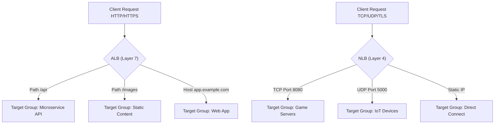

## Elastic Load Balancing (ALB vs. NLB)
### Core Concepts

*   **Elastic Load Balancing (ELB):** A service that automatically distributes incoming application traffic across multiple targets, such as EC2 instances, containers, and IP addresses, in multiple Availability Zones. It increases the fault tolerance of applications and provides high availability.
*   **Application Load Balancer (ALB):** Operates at Layer 7 (Application Layer) of the OSI model. It is best suited for load balancing HTTP and HTTPS traffic, offering advanced request routing capabilities.
*   **Network Load Balancer (NLB):** Operates at Layer 4 (Transport Layer) of the OSI model. It is designed to handle extremely high performance, low latency, and high-throughput TCP, UDP, and TLS traffic.

### Key Details & Nuances

*   **ALB (Layer 7):**
    *   **Protocol Support:** HTTP, HTTPS, WebSockets.
    *   **Routing:** Supports content-based routing (e.g., host-based, path-based, query string, HTTP header routing) to different target groups.
    *   **Visibility:** Does *not* preserve client IP address by default (uses X-Forwarded-For, X-Forwarded-Proto, X-Forwarded-Port headers).
    *   **Features:** Sticky sessions (cookie-based), host-based/path-based routing, request tracing, integration with AWS WAF, health checks at application level.
    *   **Use Cases:** Microservices, container-based applications (ECS, EKS), web applications requiring advanced routing.
    *   **SSL Offloading:** Can decrypt SSL/TLS traffic and re-encrypt for backend or send plain HTTP.
*   **NLB (Layer 4):**
    *   **Protocol Support:** TCP, UDP, TLS.
    *   **Routing:** Routes connections to targets based on IP address and port.
    *   **Visibility:** Preserves client IP address by default (passes it directly to the target).
    *   **Features:** Ultra-high performance, static IP addresses (ELBs get their own IPs, but NLB provides a static IP per AZ for easier whitelisting/DNS management), zone-level failover.
    *   **Use Cases:** Gaming, IoT, high-performance computing, critical applications requiring extremely low latency, non-HTTP/S protocols, direct IP address exposure.
    *   **TLS Offloading:** Supports TLS termination, but primarily for performance and direct TCP pass-through.

### Practical Examples

**Conceptual Traffic Flow & Routing Differences**

### Common Pitfalls & Trade-offs

*   **Incorrect Load Balancer Choice:**
    *   **Pitfall:** Using ALB for very high-throughput TCP-only applications or NLB for complex HTTP routing needs.
    *   **Trade-off:** ALB adds latency due to Layer 7 processing but offers advanced features. NLB provides raw performance but lacks application-layer intelligence.
*   **Client IP Preservation:**
    *   **Pitfall:** Expecting client IP to be directly visible on backend instances behind an ALB without parsing `X-Forwarded-For` headers.
    *   **Trade-off:** ALB provides more routing flexibility but requires application awareness for client IP. NLB simplifies logging/security by preserving IP but offers less control over traffic.
*   **Cost Implications:**
    *   **Trade-off:** NLB generally costs less per GB processed for very high throughput due to its "pay per LCU" model focused on connections/bandwidth, whereas ALB has more features (rule evaluation, new connections) that can increase costs at scale. Evaluate your traffic patterns carefully.
*   **SSL Offloading Complexity:**
    *   **Pitfall:** Assuming ALB or NLB can offload SSL for *any* protocol. NLB specifically supports TLS termination, not generic SSL. ALB handles HTTP/HTTPS.
    *   **Trade-off:** ALB provides more robust SSL certificate management and re-encryption options for diverse backend setups.

### Interview Questions

1.  **When would you choose an Application Load Balancer (ALB) over a Network Load Balancer (NLB), and vice-versa?**
    *   **ALB:** For HTTP/HTTPS applications, microservices with diverse routing needs (path, host), containerized applications, sticky sessions, or when integrating with WAF.
    *   **NLB:** For extreme performance/low latency, non-HTTP/HTTPS protocols (TCP/UDP/TLS), applications requiring static IP addresses, or when preserving client IP to the backend is critical.

2.  **Explain how ALB and NLB differ in preserving the client's source IP address.**
    *   **ALB:** Does not preserve the client's original IP. It uses the `X-Forwarded-For` HTTP header to pass the client IP to the target instances. The source IP seen by the target is the ALB's private IP.
    *   **NLB:** Preserves the client's original IP address. The target instance directly sees the client's IP as the source IP for the connection, simplifying logging and security.

3.  **A team is building a new gaming platform that requires very low latency and high throughput for UDP traffic. Which AWS load balancer would you recommend and why?**
    *   I would recommend a **Network Load Balancer (NLB)**. NLB is optimized for extremely low latency and high throughput, specifically supporting UDP traffic at Layer 4. This is crucial for real-time gaming applications where every millisecond counts and UDP is often preferred for its connectionless nature.

4.  **Can you use an NLB to route traffic based on the URL path, for example, `/users` to one service and `/products` to another? Explain why or why not.**
    *   No, an NLB cannot route traffic based on URL path. NLB operates at Layer 4 (Transport Layer) and only sees IP addresses and ports. URL paths are part of the HTTP protocol, which operates at Layer 7 (Application Layer). To route based on URL paths, an Application Load Balancer (ALB) would be required.