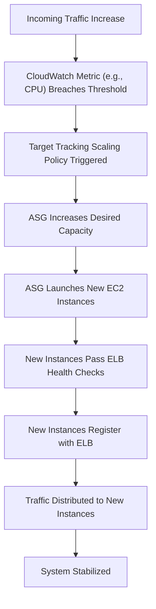

## Auto Scaling Groups (ASG)
### Core Concepts

*   **What:** An AWS service that automatically adjusts the number of EC2 instances in a group based on demand, defined schedules, or instance health.
*   **Purpose:**
    *   **High Availability & Fault Tolerance:** Distributes instances across multiple Availability Zones (AZs) and automatically replaces unhealthy instances.
    *   **Cost Optimization:** Scales down capacity during low demand, ensuring you pay only for the resources needed.
    *   **Performance & Responsiveness:** Scales up to handle peak loads, maintaining application performance and user experience.
    *   **Automation:** Reduces manual operational effort for capacity management.
*   **Key Components:**
    *   **Launch Template (or Launch Configuration):** Defines the blueprint for new EC2 instances (AMI, instance type, security groups, user data, etc.).
    *   **Min/Max/Desired Capacity:** Sets the lower, upper, and target bounds for the number of instances in the group.
    *   **Scaling Policies:** Rules that dictate when and how the ASG should scale in (decrease) or out (increase).
    *   **Health Checks:** Monitors the health of instances to identify and replace unhealthy ones.

### Key Details & Nuances

*   **Launch Templates vs. Launch Configurations:**
    *   **Launch Template (Recommended):** The modern, preferred method. Supports versioning, multiple instance types, purchasing options (On-Demand, Spot), and more advanced network configurations.
    *   **Launch Configuration (Legacy):** Older, simpler; lacks versioning and some features available in Launch Templates.
*   **Scaling Policies:**
    *   **Target Tracking Scaling (Most Recommended):** Automatically adjusts capacity to maintain a specified metric (e.g., average CPU utilization) at a target value. Simplest and most effective for most workloads.
    *   **Step Scaling:** Scales based on a CloudWatch alarm and a set of `step adjustments`. Provides more granular control over how much to scale.
    *   **Simple Scaling:** Scales based on a single CloudWatch alarm, performing a single, fixed adjustment. Less dynamic due to mandatory cooldown periods.
    *   **Scheduled Scaling:** Scales based on a predictable schedule (e.g., scale up every weekday morning).
    *   **Predictive Scaling:** Uses machine learning to forecast future load and proactively scale capacity.
*   **Health Checks:**
    *   **EC2 Health Checks:** Basic status checks on the EC2 instance itself (e.g., system status, instance status).
    *   **ELB Health Checks (Preferred for Web Apps):** Monitors if an instance is responding to application requests (e.g., HTTP 200 on `/health`). Instances failing ELB health checks are marked unhealthy and replaced by the ASG.
*   **Lifecycle Hooks:**
    *   Enable custom actions to be performed when an instance is `pending` (launching) or `terminating`.
    *   Useful for installing software, configuring applications, registering/deregistering from service discovery, or draining connections before termination.
    *   Provides a configurable `Heartbeat Timeout` to allow time for actions to complete.
*   **Instance Protection:**
    *   **Instance Termination Protection:** Prevents ASG or manual termination of specific instances.
    *   **Instance Scale-in Protection:** Prevents ASG from terminating specific instances during a scale-in event. Useful for instances running long-lived, critical tasks.
*   **Default Cooldown:** A period after a scaling activity (in or out) during which ASG does not initiate further scaling actions, preventing rapid, oscillating capacity changes. Can be overridden per policy.

### Practical Examples

Illustrates the typical flow of an Auto Scaling Group responding to increased load.

### Common Pitfalls & Trade-offs

*   **Scaling Oscillation (Throttling):**
    *   **Pitfall:** Overly aggressive scaling policies or very short cooldown periods can lead to rapid scale-in/out cycles, which increases costs and can degrade application performance.
    *   **Trade-off:** Balancing responsiveness to demand vs. stability and cost. Longer cooldowns or more conservative target metrics can mitigate oscillation.
*   **Incorrect Health Check Configuration:**
    *   **Pitfall:** Overly strict checks can prematurely terminate instances that are just warming up. Too lenient checks can keep truly unhealthy instances in rotation, causing service degradation.
    *   **Trade-off:** Availability vs. Stability. ELB health checks are generally more reliable for application-level health.
*   **Warm-up Time & Instance Readiness:**
    *   **Pitfall:** New instances might take time to fully initialize (e.g., install dependencies, load data) before they are ready to serve traffic. If not accounted for, traffic could be sent to unprepared instances.
    *   **Solution:** Use `DefaultInstanceWarmup` parameter in scaling policies or implement lifecycle hooks to ensure instances are fully ready before serving traffic.
*   **Over-provisioning vs. Under-provisioning:**
    *   **Pitfall:** Setting `min capacity` too high incurs unnecessary costs. Setting `max capacity` too low prevents scaling during peak loads, leading to performance bottlenecks and service unavailability.
    *   **Trade-off:** Cost vs. Performance/Availability. Requires careful monitoring and tuning based on traffic patterns.

### Interview Questions

1.  **Explain the core benefits of using Auto Scaling Groups in a production environment.**
    *   **Answer:** ASGs provide high availability (distributing instances across AZs, replacing unhealthy ones), fault tolerance (automatic recovery from instance failures), cost optimization (scaling out/in based on demand, paying only for what's needed), and performance maintenance (scaling up for peak loads). They automate capacity management, reducing operational overhead.
2.  **Differentiate between Launch Configurations and Launch Templates. Which should you prefer and why?**
    *   **Answer:** Launch Configurations are an older, simpler way to define instance launch parameters. Launch Templates are the recommended modern alternative as they offer more features like versioning, support for multiple instance types, purchasing options (On-Demand, Spot), and more granular network configurations. Versioning is crucial for managing changes and rollbacks.
3.  **Describe various scaling policies and when you would use each. Which is generally recommended for web applications?**
    *   **Answer:** **Target Tracking Scaling** (recommended for web apps) aims to maintain a metric (e.g., CPU utilization) at a specific target, ideal for steady performance. **Step Scaling** adjusts capacity in steps based on alarm breaches, offering more granular control for complex scenarios. **Simple Scaling** reacts to a single alarm with a fixed adjustment, less dynamic due to cooldowns. **Scheduled Scaling** is for predictable load changes. **Predictive Scaling** uses ML for proactive scaling based on historical data. Target tracking is generally preferred due to its simplicity and effectiveness.
4.  **How do ASGs contribute to high availability and fault tolerance?**
    *   **Answer:** ASGs ensure high availability by distributing instances across multiple Availability Zones, minimizing the impact of an AZ outage. For fault tolerance, they continuously monitor the health of instances (via EC2 and ELB health checks) and automatically replace any unhealthy instances, ensuring that the desired capacity is always met and applications remain operational even if individual instances fail.
5.  **What are Lifecycle Hooks, and where would you use them? Provide an example.**
    *   **Answer:** Lifecycle Hooks allow you to pause instance launches or terminations within an ASG to perform custom actions. This is useful for tasks that need to happen *before* an instance serves traffic or *before* it's fully terminated.
    *   **Example Use Case:**
        *   **On Launch (`pending` state):** Install necessary software (e.g., monitoring agents), register the instance with a service discovery system, or pull configuration from a centralized store.
        *   **On Termination (`terminating` state):** Deregister from a load balancer (if not automatically handled by ELB), drain connections, upload logs, or unregister from service discovery.
        *   This ensures instances are fully prepared before serving traffic and gracefully shut down without data loss.