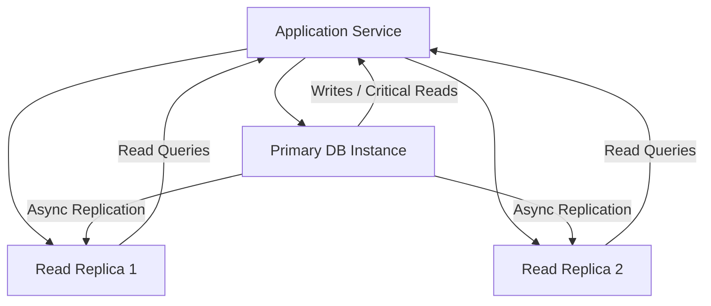

## RDS: Managed Relational Databases & Read Replicas
### Core Concepts

*   **AWS Relational Database Service (RDS):** A managed service that simplifies the setup, operation, and scaling of relational databases in the cloud. It automates common administrative tasks like patching, backups, point-in-time recovery, failure detection, and repair.
    *   **Supported Engines:** PostgreSQL, MySQL, MariaDB, Oracle, SQL Server, and Amazon Aurora (a highly performant, MySQL/PostgreSQL-compatible service designed for the cloud).
    *   **Benefits:** Reduces operational overhead, offers high availability, durability, and scalability, allowing developers to focus on application logic.
*   **RDS Read Replicas:** Asynchronous copies of a primary RDS DB instance. They are designed to improve scalability for read-heavy applications and enhance disaster recovery capabilities for read traffic.
    *   **Purpose:**
        1.  **Read Scaling:** Offload read queries from the primary DB instance, distributing read load across multiple replicas.
        2.  **Disaster Recovery (for reads):** In case of primary instance failure, a Read Replica can be promoted to a standalone DB instance, reducing recovery time.
    *   **Replication:** Data is asynchronously replicated from the primary instance to the Read Replica(s).

### Key Details & Nuances

*   **Multi-AZ vs. Read Replicas:**
    *   **Multi-AZ (High Availability):** Synchronous replication to a standby instance in a different Availability Zone. Primarily for **disaster recovery (automatic failover)** and high availability. The standby instance is not available for reads. Failover is automatic.
    *   **Read Replicas (Read Scaling):** Asynchronous replication to one or more instances. Primarily for **scaling read operations** and improving read performance. Can be in the same or different AZs/regions. Failover for Read Replicas is manual promotion.
*   **Replication Lag:** Due to asynchronous replication, there can be a delay (lag) between the primary instance and its Read Replicas. This can lead to "eventual consistency" issues where a read from a replica might not reflect the absolute latest write.
    *   **Monitoring:** Monitor `ReplicaLag` metric in CloudWatch.
    *   **Mitigation:** Application-level consistency checks, routing critical reads to the primary, or using Aurora (which has lower replica lag due to shared storage).
*   **Read Replica Promotion:** A Read Replica can be manually promoted to a standalone primary DB instance. This is a common step in a disaster recovery scenario when the original primary is unrecoverable.
*   **Cross-Region Read Replicas:** Replicas can be created in different AWS regions for global read scaling or improved disaster recovery strategy.
*   **Cost Implications:** Each Read Replica is a separate DB instance and incurs its own costs (compute, storage, I/O, data transfer).
*   **Limitations:**
    *   Read Replicas cannot be directly written to (they are read-only).
    *   Asynchronous replication means potential data lag.
    *   Schema changes on the primary will propagate to replicas, but require careful planning.

### Practical Examples

**1. AWS CLI: Creating an RDS MySQL Instance with a Read Replica**

```sh
# Create a primary MySQL RDS instance
aws rds create-db-instance \
    --db-instance-identifier my-primary-db \
    --db-instance-class db.t3.micro \
    --engine mysql \
    --master-username admin \
    --master-user-password yourstrongpassword \
    --allocated-storage 20 \
    --vpc-security-group-ids sg-xxxxxxxxxxxxxxxxx \
    --db-subnet-group-name my-db-subnet-group \
    --no-multi-az # Explicitly not Multi-AZ for simplicity, can add it later

# Wait for the primary to be available (takes a few minutes)
# Then create a Read Replica from the primary
aws rds create-db-instance-read-replica \
    --db-instance-identifier my-read-replica \
    --source-db-instance-identifier my-primary-db \
    --db-instance-class db.t3.micro \
    --publicly-accessible # Set to false in production usually
```

**2. Architecture Flow: Application with Read Replicas**



### Common Pitfalls & Trade-offs

*   **Confusing Multi-AZ with Read Replicas:** A very common mistake. Multi-AZ is for High Availability (failover), Read Replicas are for Read Scaling. A primary instance can be Multi-AZ *and* have Read Replicas.
*   **Ignoring Read Replica Lag:** Not monitoring or designing the application for eventual consistency can lead to stale data being read by users, causing functional issues.
*   **Over-reliance on Read Replicas for DR:** While useful for read-only DR, promoting a Read Replica involves manual steps and potential data loss (if the primary failed before all changes replicated). Multi-AZ offers more robust automatic failover.
*   **Over-provisioning:** Creating too many or overly powerful Read Replicas when not necessary can lead to significant cost increases.
*   **Writes to Replicas:** Attempting to write to a Read Replica will fail, as they are read-only. All writes must go to the primary.

### Interview Questions

1.  **When would you choose an RDS Multi-AZ deployment over a Read Replica for an RDS instance, and vice versa? Can you use both together?**
    *   **Answer:** Choose Multi-AZ for high availability, automatic failover, and durability, where the primary concern is minimal downtime for the *write* operations and ensuring data integrity across AZs. It provides a synchronous standby that takes over in case of primary failure. Choose Read Replicas for **read scalability** (offloading read traffic from the primary) and to enhance read performance, or for read-heavy disaster recovery scenarios. Yes, you can use both: A Multi-AZ primary for high availability and one or more Read Replicas stemming from that primary for read scaling.
2.  **Describe the implications of Read Replica lag. How would you monitor and mitigate it in an application?**
    *   **Answer:** Read Replica lag implies "eventual consistency" – data written to the primary might not be immediately available on the replica, leading to users seeing stale data. This is critical for operations where immediate data consistency is required (e.g., e-commerce order confirmation). Monitor using the `ReplicaLag` CloudWatch metric. Mitigation strategies include: routing highly consistent reads back to the primary, implementing application-level logic to ensure consistency (e.g., read-after-write consistency checks), choosing a faster replica engine (like Aurora), or scaling up replica instances to handle the replication load.
3.  **You have an application with extremely read-heavy workloads (e.g., a news site). How would you architect your database layer using RDS to handle this efficiently, considering high availability?**
    *   **Answer:** I would start with an RDS primary instance deployed in a Multi-AZ configuration for high availability and automatic failover. Then, I would create multiple Read Replicas (potentially in different AZs or regions) to distribute the read load. For the application, I would implement a connection router or use a database driver that intelligently directs write operations to the primary endpoint and read operations to the Read Replica endpoints. For critical or immediate reads, I might still direct them to the primary to ensure strong consistency. Monitoring `ReplicaLag` would be crucial to ensure optimal performance. Considering Amazon Aurora for its high performance and lower replica lag would also be a strong option.
4.  **Explain the process and considerations if you needed to promote an RDS Read Replica to a standalone DB instance after a primary instance failure.**
    *   **Answer:** Promoting a Read Replica is a manual process. You'd use the AWS console or CLI (`promote-read-replica` command). **Considerations:**
        *   **Data Loss:** Since replication is asynchronous, there might be some data loss if the primary failed and not all transactions had replicated to the chosen replica.
        *   **Downtime:** The promotion process itself incurs some downtime for the replica as it transitions to a primary.
        *   **Connectivity:** Applications need to be reconfigured to point to the new primary's endpoint.
        *   **Backup/Restore:** The promoted instance will become a new primary, and you'll need to ensure proper backup strategies are re-established for it.
        *   **New Replicas:** If you still need read scaling, you'll have to create new Read Replicas from the newly promoted primary.