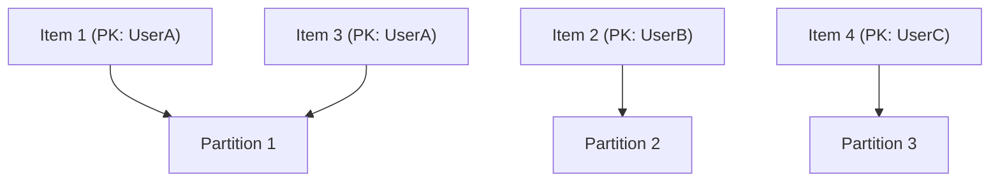

## DynamoDB: Core Concepts (Partitions, Keys, Consistency)
### Core Concepts

*   **NoSQL Database:** DynamoDB is a fully managed, serverless, key-value and document NoSQL database service offered by AWS.
*   **Schema-less:** Tables do not enforce a fixed schema for attributes (columns) beyond the primary key.
*   **Core Components:**
    *   **Tables:** Collections of items.
    *   **Items:** Analogous to rows or records, composed of attributes.
    *   **Attributes:** Analogous to columns, can be scalar, list, or map types.
*   **Scalability & Performance:** Designed for high-performance, low-latency applications at virtually any scale, automatically distributing data and traffic across multiple servers (partitions).

### Key Details & Nuances

*   **Primary Keys:** Uniquely identify each item in a table and determine data distribution and access patterns.
    *   **Partition Key (Hash Key):**
        *   A single attribute whose value is hashed to determine the physical partition where the item is stored.
        *   **Crucial for distribution:** A good partition key design ensures even data distribution and prevents "hot partitions."
        *   All items with the same partition key are stored together on the same partition.
    *   **Sort Key (Range Key):**
        *   An optional second attribute that, in conjunction with the partition key, forms a **composite primary key**.
        *   Items with the same partition key are stored in sorted order based on the sort key value.
        *   Enables efficient range queries (e.g., "get all orders for a user between date X and Y").
*   **Partitions:**
    *   DynamoDB automatically partitions your data across multiple servers (partitions) based on the partition key.
    *   Each partition has a finite amount of storage and throughput capacity.
    *   Proper partition key design is paramount for efficient scaling and avoiding performance bottlenecks.
*   **Consistency Models for Reads:**
    *   **Eventually Consistent Reads (Default):**
        *   **Faster & Cheaper:** Data is returned immediately, but a read might not reflect the results of a recently completed write.
        *   **Propagation Delay:** Changes propagate through the system, and all copies of the data typically reach consistency within milliseconds.
        *   **Use Case:** Ideal for scenarios where minor data staleness is acceptable (e.g., social media feeds, session state).
    *   **Strongly Consistent Reads:**
        *   **Higher Latency & Cost:** Data is guaranteed to be up-to-date, reflecting all successful writes that occurred before the read.
        *   **Guaranteed Accuracy:** Ensures that you always read the most recent data.
        *   **Use Case:** Critical business logic where immediate accuracy is required (e.g., financial transactions, user authentication).

### Practical Examples

**1. Table Definition with Keys (Conceptual)**

```typescript
// Define a table for 'Products' with a composite primary key
const ProductTable = {
  TableName: 'Products',
  KeySchema: [
    { AttributeName: 'Category', KeyType: 'HASH' }, // Partition Key
    { AttributeName: 'ProductId', KeyType: 'RANGE' } // Sort Key
  ],
  AttributeDefinitions: [
    { AttributeName: 'Category', AttributeType: 'S' },
    { AttributeName: 'ProductId', AttributeType: 'S' }
  ],
  ProvisionedThroughput: {
    ReadCapacityUnits: 5,
    WriteCapacityUnits: 5
  }
};
```

**2. Querying Data using Keys**

```typescript
// Get a single item using its full primary key
const getItemParams = {
  TableName: 'Products',
  Key: {
    'Category': { S: 'Electronics' },
    'ProductId': { S: 'LAPTOP-XYZ' }
  }
};
// dynamodb.getItem(getItemParams);

// Query items using only the Partition Key and a condition on the Sort Key
const queryItemsParams = {
  TableName: 'Products',
  KeyConditionExpression: 'Category = :category AND ProductId BETWEEN :startId AND :endId',
  ExpressionAttributeValues: {
    ':category': { S: 'Electronics' },
    ':startId': { S: 'LAPTOP-A001' },
    ':endId': { S: 'LAPTOP-Z999' }
  }
};
// dynamodb.query(queryItemsParams);
```

**3. Data Distribution by Partition Key**



### Common Pitfalls & Trade-offs

*   **Hot Partitions:** Occurs when a single partition key value (or a small set of values) receives a disproportionately high volume of read/write requests, leading to throttling and degraded performance.
    *   **Mitigation:** Choose a partition key with high cardinality and even access patterns. Consider adding a random suffix or prefix to the partition key for bursty writes to a single logical entity.
*   **Scan Operations:** Using `Scan` (reads all items in a table or index) is generally inefficient and expensive for large tables as it consumes throughput proportionally to table size.
    *   **Trade-off:** Use `Query` whenever possible, leveraging primary keys or secondary indexes for targeted data retrieval. `Scan` is suitable only for small tables or infrequent administrative tasks.
*   **Over-reliance on Strongly Consistent Reads:** While guaranteeing immediate consistency, they are slower and cost more.
    *   **Trade-off:** Use them only when absolutely necessary. Default to eventually consistent reads where possible to optimize performance and cost.

### Interview Questions

1.  **Explain the significance of a good partition key design in DynamoDB. What issues can arise from a poorly chosen partition key, and how would you mitigate them?**
    *   **Answer:** A good partition key is critical for distributing data evenly across partitions, enabling parallel processing and preventing "hot partitions." A poorly chosen key can lead to hot partitions, causing throttling, increased latency, and wasted provisioned throughput. Mitigation strategies include selecting high-cardinality attributes, adding random prefixes/suffixes for bursty writes, or using composite primary keys to distribute items more broadly.

2.  **When would you choose an 'Eventually Consistent Read' over a 'Strongly Consistent Read' in DynamoDB, and what are the implications of each choice?**
    *   **Answer:** Choose "Eventually Consistent Reads" when immediate data accuracy isn't critical (e.g., social media feeds, product listings) because they are faster and cheaper. The implication is that a read might not reflect a very recent write. Choose "Strongly Consistent Reads" when immediate data accuracy is paramount (e.g., financial transactions, user login verification) despite higher latency and cost. The implication is guaranteed up-to-date data.

3.  **Describe how DynamoDB distributes data internally. How do primary keys (both partition and sort keys) play a role in this distribution and data access?**
    *   **Answer:** DynamoDB hashes the partition key value of an item to determine which physical partition it belongs to. All items with the same partition key reside on the same partition. If a sort key is also defined, items within that partition are stored in sorted order based on the sort key. This design enables efficient `GetItem` (direct lookup by full primary key) and `Query` operations (retrieving all items for a given partition key, optionally filtered/sorted by sort key).

4.  **You are designing a DynamoDB table for an e-commerce platform storing customer orders. Each order has a `CustomerId`, `OrderId`, `OrderDate`, and `TotalAmount`. What primary key design would you choose, and why? How would you retrieve all orders for a specific customer?**
    *   **Answer:** I would choose `CustomerId` as the **Partition Key** and `OrderDate` (or `OrderId` if sequential) as the **Sort Key**.
        *   **Why `CustomerId` as PK:** This groups all orders for a specific customer together on a partition, allowing efficient retrieval of all orders for that customer.
        *   **Why `OrderDate` as SK:** This allows orders for a customer to be stored in chronological order and enables powerful range queries (e.g., "get all orders for customer X placed last month").
    *   **Retrieval:** To retrieve all orders for a specific customer, I would use a `Query` operation specifying the `CustomerId` for the `KeyConditionExpression`. For example, `KeyConditionExpression: "CustomerId = :customerId"`.