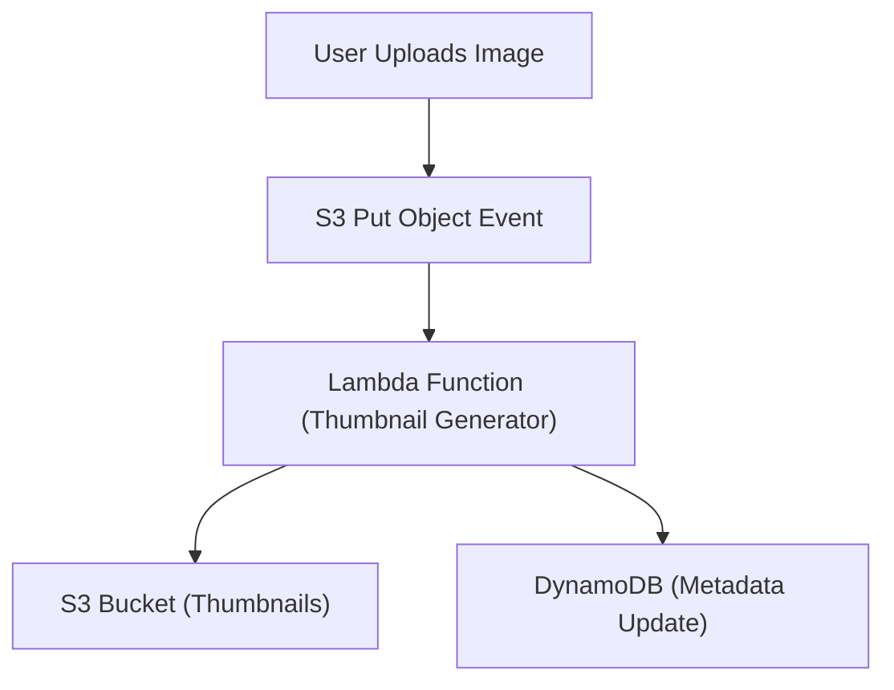

## Lambda: Serverless compute and event-driven architecture
### Core Concepts

*   **Serverless Compute (Function-as-a-Service - FaaS):** Lambda allows you to run code without provisioning or managing servers. You only pay for the compute time consumed.
*   **Event-Driven Architecture:** Lambda functions are typically triggered by events from various AWS services (e.g., S3 object creation, DynamoDB stream updates, API Gateway requests, SQS messages, CloudWatch alarms) or custom applications.
*   **Stateless Execution:** Each invocation of a Lambda function is isolated. Functions should be designed to be stateless; any persistent data must be stored externally (e.g., S3, DynamoDB, RDS).
*   **Automatic Scaling:** Lambda automatically scales your application by running code in parallel as new events arrive, handling potentially millions of requests per second.

### Key Details & Nuances

*   **Execution Model:**
    *   **Execution Context:** Lambda provides a temporary execution environment for your code. This includes CPU, memory, a file system (`/tmp`), and configuration.
    *   **Cold Starts:** When a function is invoked for the first time, or after a period of inactivity, Lambda needs to initialize the execution environment (download code, set up runtime). This "cold start" adds latency.
    *   **Warm Starts:** Subsequent invocations on an already initialized environment (within a short timeframe) benefit from a "warm" container, leading to lower latency.
*   **Concurrency:**
    *   **Concurrent Executions:** The number of requests your function is processing at any given time.
    *   **Concurrency Limits:** AWS sets default account-level concurrency limits (e.g., 1000 concurrent executions per region). You can request increases and set reserved concurrency for critical functions to prevent others from consuming all available capacity.
    *   **Provisioned Concurrency:** Pre-initializes a requested number of execution environments, reducing cold starts for a consistent latency experience. Useful for latency-sensitive applications (e.g., APIs).
*   **Resource Configuration:**
    *   **Memory:** Configurable from 128 MB to 10,240 MB. CPU power is allocated proportionally to the memory setting.
    *   **Timeout:** Maximum execution duration (1 second to 15 minutes).
    *   **Ephemeral Storage (`/tmp`):** Up to 10 GB of temporary, writable storage unique to each invocation. Cleared after execution.
*   **VPC Integration:**
    *   To access resources within a VPC (e.g., RDS instances, EC2), a Lambda function must be configured to run within that VPC.
    *   This involves creating Elastic Network Interfaces (ENIs) for the function, which can add significant cold start latency for the initial invocation of a new container.
*   **Pricing:** Based on the number of requests and the duration (GB-seconds) of execution time. Free tier available.
*   **Lambda Layers:** Package common dependencies (libraries, runtimes, custom logic) that multiple functions can share, reducing deployment package size and promoting code reuse.
*   **Dead Letter Queues (DLQ):** For asynchronous invocations, failed events can be sent to an SQS queue or SNS topic for later analysis or retry, ensuring event durability.
*   **Error Handling & Retries:**
    *   **Synchronous Invocations (e.g., API Gateway):** Lambda does not automatically retry. The client is responsible for retries.
    *   **Asynchronous Invocations (e.g., S3, SQS):** Lambda automatically retries failed invocations up to 2 times, with exponential backoff, before sending to a DLQ (if configured).

### Practical Examples

#### Simple Lambda Handler (TypeScript)

```typescript
// src/handlers/myProductHandler.ts

import { APIGatewayProxyEvent, APIGatewayProxyResult } from 'aws-lambda';

/**
 * Handles GET requests to retrieve product information.
 * @param event The API Gateway proxy event.
 * @returns An API Gateway proxy result.
 */
export const getProduct = async (event: APIGatewayProxyEvent): Promise<APIGatewayProxyResult> => {
    console.log('Received event:', JSON.stringify(event, null, 2));

    const productId = event.pathParameters?.id;

    if (!productId) {
        return {
            statusCode: 400,
            body: JSON.stringify({ message: 'Product ID is required.' }),
            headers: { 'Content-Type': 'application/json' },
        };
    }

    try {
        // In a real application, you would fetch product data from a database (e.g., DynamoDB)
        // For demonstration, we'll return a mock product.
        const product = {
            id: productId,
            name: `Product ${productId}`,
            description: `This is a sample product with ID ${productId}.`,
            price: 29.99,
        };

        return {
            statusCode: 200,
            body: JSON.stringify(product),
            headers: { 'Content-Type': 'application/json' },
        };
    } catch (error) {
        console.error('Error fetching product:', error);
        return {
            statusCode: 500,
            body: JSON.stringify({ message: 'Internal server error.' }),
            headers: { 'Content-Type': 'application/json' },
        };
    }
};
```

#### Event-Driven Flow: Image Processing



### Common Pitfalls & Trade-offs

*   **Cold Starts:** For latency-sensitive applications, cold starts can be an issue, especially with large packages or VPC-enabled functions. Mitigation: Provisioned Concurrency, proper memory allocation, keeping package size small, Lambda Layers.
*   **Monolithic Functions (Fat Lambdas):** Combining too much logic into one function increases complexity, deployment time, and cold start times. Promotes tightly coupled services.
    *   **Trade-off:** Simpler initial deployment vs. maintainability, reusability, and targeted scaling. Favor smaller, single-purpose functions where possible.
*   **State Management:** Forgetting the stateless nature can lead to incorrect assumptions about data persistence between invocations. Use external data stores (DynamoDB, S3, RDS) for state.
*   **Cost Optimization:**
    *   **Memory Allocation:** Over-provisioning memory wastes money; under-provisioning leads to slower execution and higher duration costs. Test and optimize.
    *   **Execution Duration:** Long-running functions can be expensive. Consider if Lambda is the right fit or if services like Fargate/ECS are more cost-effective for sustained workloads.
*   **VPC Connection Overhead:** Functions in a VPC incur additional cold start latency due to ENI creation. Only connect to a VPC if necessary to access private resources.
*   **Debugging & Monitoring:** Distributed nature makes debugging challenging. Rely heavily on CloudWatch Logs, X-Ray for tracing, and structured logging.
*   **Vendor Lock-in:** Deep integration with AWS services can make migration to another cloud provider complex.
*   **Dependency Management:** Large `node_modules` or `vendor` directories can inflate package size and cold start times. Use Lambda Layers effectively.

### Interview Questions

1.  **Explain "cold start" in AWS Lambda and discuss strategies to mitigate its impact on application performance.**
    *   **Answer:** A cold start occurs when Lambda initializes a new execution environment for a function (e.g., first invocation, after inactivity, scaling up). This involves downloading code, setting up runtime, and potentially connecting to a VPC. Mitigation strategies include:
        *   **Provisioned Concurrency:** Pre-initializes a specified number of execution environments.
        *   **Memory Optimization:** Allocating enough memory can speed up initialization, as CPU scales with memory.
        *   **Small Deployment Packages:** Minimize code size and dependencies. Use Lambda Layers for common libraries.
        *   **Keep-Alive/Warmers:** Periodically invoking functions (e.g., with CloudWatch Events) to keep containers warm (less effective than Provisioned Concurrency, but can help for less critical functions).
        *   **VPC Configuration:** Only put Lambda in a VPC if truly necessary, as ENI creation adds significant cold start latency.
2.  **When would you choose AWS Lambda over EC2 or ECS/Fargate for deploying an application? What are the key decision factors?**
    *   **Answer:**
        *   **Lambda:** Ideal for event-driven, short-lived, stateless, highly variable workloads. Pay-per-execution model, zero server management, automatic scaling. Best for microservices, APIs, data processing, chatbots.
        *   **EC2/ECS/Fargate:** Suitable for long-running processes, stateful applications, consistent high-traffic workloads, applications requiring specific OS or low-level control, or those with complex custom runtimes. Provides more control and potentially lower cost for very high, consistent utilization.
        *   **Decision Factors:** Cost model (pay-per-use vs. always-on), operational overhead (zero vs. some server management), scaling needs (event-driven vs. constant capacity), execution duration (short vs. long), statefulness, vendor lock-in concerns.
3.  **How do you handle state management and persistence in a serverless application built with AWS Lambda? Provide examples.**
    *   **Answer:** Lambda functions are stateless, meaning each invocation is independent. State must be externalized.
    *   **Examples:**
        *   **Databases:** DynamoDB (NoSQL), Aurora Serverless (Relational), RDS for persistent data.
        *   **Storage:** S3 for files, images, logs, or static content.
        *   **Caching:** ElastiCache (Redis/Memcached) for frequently accessed, temporary data.
        *   **Session Management:** DynamoDB, ElastiCache, or signed cookies for user sessions.
        *   **Queueing/Messaging:** SQS/SNS for durable event queues and inter-service communication.
        *   **Step Functions:** For managing workflow state across multiple Lambda functions.
4.  **You are designing a data processing pipeline where files uploaded to an S3 bucket need to be processed by a Lambda function. Describe the architecture, how you would handle potential failures, and ensure data integrity.**
    *   **Answer:**
        *   **Architecture:** Configure an S3 event notification to trigger a Lambda function whenever a new object is created in a specific S3 bucket. The Lambda function will process the file (e.g., parse, transform, analyze). Processed data can be stored in DynamoDB, another S3 bucket, or a data warehouse like Redshift.
        *   **Failure Handling:**
            *   **Idempotency:** Design the Lambda function to be idempotent, so reprocessing the same file multiple times (due to retries) doesn't cause issues.
            *   **DLQ (Dead Letter Queue):** For asynchronous S3 triggers, configure a DLQ (SQS queue or SNS topic) for the Lambda. If the function fails after all retries, the event is sent to the DLQ for manual inspection or automated reprocessing.
            *   **Logging & Monitoring:** Use CloudWatch Logs for function output and errors, and CloudWatch Metrics for invocations, errors, and duration. Set up alarms for error rates.
            *   **X-Ray:** For distributed tracing to identify bottlenecks or failures across services.
        *   **Data Integrity:**
            *   **Transactional Updates:** If updating multiple data stores, use eventual consistency patterns or orchestrate with AWS Step Functions to ensure atomicity.
            *   **Error Handling:** Implement robust `try-catch` blocks within the Lambda function to gracefully handle processing errors.
            *   **Validation:** Validate input data from S3 before processing.
            *   **Version Control (S3):** Enable S3 versioning on the source bucket to prevent accidental overwrites and allow recovery.