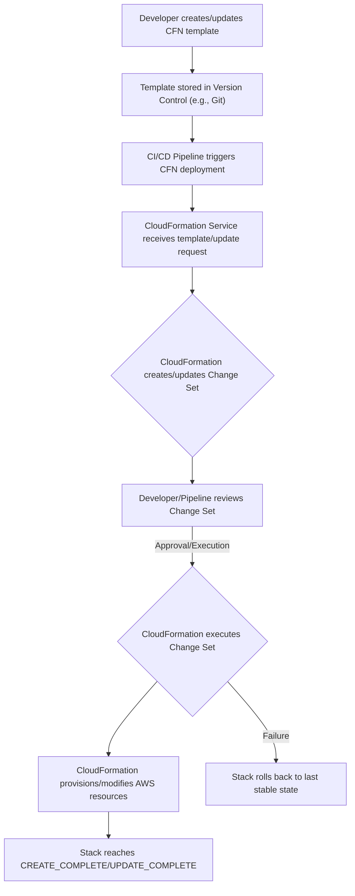

## Infrastructure as Code (IaC) with CloudFormation
### Core Concepts
*   **Infrastructure as Code (IaC):** Managing and provisioning infrastructure through machine-readable definition files (e.g., YAML, JSON) rather than manual configurations or interactive tools. Enables versioning, automation, and consistency.
*   **CloudFormation (CFN):** AWS's native IaC service. It allows you to model, provision, and manage AWS and third-party resources declaratively.
*   **Declarative vs. Imperative:** CFN is declarative – you define the desired *end state* of your infrastructure, and CFN figures out the steps to achieve it. This contrasts with imperative approaches (e.g., shell scripts) where you specify the *steps* to take.
*   **Templates:** Text files (YAML or JSON) that describe the AWS resources you want to provision, along with their properties and dependencies.
*   **Stacks:** A collection of AWS resources created and managed as a single unit by CloudFormation, based on a single template. CloudFormation tracks the state of the stack and its resources.
*   **Idempotency:** Applying the same CloudFormation template multiple times will result in the same infrastructure state, without creating duplicate resources or errors (if the template and state are consistent).

### Key Details & Nuances
*   **Components of a Template:**
    *   `AWSTemplateFormatVersion`: (Optional) Template language version.
    *   `Description`: (Optional) Textual description.
    *   `Metadata`: (Optional) Arbitrary objects.
    *   `Parameters`: Input values that you can pass to your template at runtime (e.g., environment name, instance type).
    *   `Mappings`: Key-value pairs that you can use to specify conditional parameter values (e.g., AMIs for different regions).
    *   `Conditions`: Statements that control whether resources are created or properties are assigned.
    *   `Resources`: The core section where you declare the AWS resources (e.g., `AWS::S3::Bucket`, `AWS::EC2::Instance`).
    *   `Outputs`: Values that are returned by the stack, which can be referenced by other stacks or retrieved manually.
*   **Intrinsic Functions:** Built-in functions for logic within templates.
    *   `Ref`: Returns the value of a specified parameter or resource (e.g., `Ref: MyS3Bucket` returns the bucket name).
    *   `Fn::GetAtt`: Returns an attribute value from a resource (e.g., `Fn::GetAtt: [MyEC2Instance, PrivateIp]`).
    *   `Fn::Join`, `Fn::Sub`, `Fn::FindInMap`, `Fn::If`, etc.
*   **Change Sets:** A preview of proposed changes to your stack. Before executing an update, you can create a Change Set to understand exactly which resources will be added, modified, or deleted. Critical for risk management.
*   **Rollbacks:** If a stack update fails, CloudFormation automatically rolls back the stack to its last stable state, ensuring consistency. You can also manually roll back.
*   **Nested Stacks:** Enables modularity by allowing a template to call other templates as sub-stacks. Useful for breaking down large deployments into reusable components.
*   **StackSets:** Extends stacks to allow deployment of a common CloudFormation template across multiple AWS accounts and regions from a single administrator account. Ideal for multi-account/multi-region strategies.
*   **Drift Detection:** Identifies when stack resources have been modified outside of CloudFormation (e.g., manual console changes). Helps maintain infrastructure consistency and ensures CFN remains the single source of truth.

### Practical Examples

**1. Simple S3 Bucket Template (YAML)**

```yaml
AWSTemplateFormatVersion: '2010-09-09'
Description: A simple CloudFormation template to create an S3 bucket.

Parameters:
  BucketNamePrefix:
    Type: String
    Default: my-app-data
    Description: Prefix for the S3 bucket name.

Resources:
  MyS3Bucket:
    Type: AWS::S3::Bucket
    Properties:
      BucketName: !Sub "${BucketNamePrefix}-${AWS::AccountId}-${AWS::Region}"
      Tags:
        - Key: Environment
          Value: !Ref AWS::StackName
        - Key: Project
          Value: InterviewPrep

Outputs:
  BucketArn:
    Description: The ARN of the created S3 bucket.
    Value: !GetAtt MyS3Bucket.Arn
  BucketName:
    Description: The name of the created S3 bucket.
    Value: !Ref MyS3Bucket
```

**2. CloudFormation Deployment Workflow**



### Common Pitfalls & Trade-offs
*   **Template Complexity:** Large, monolithic templates become hard to manage, test, and debug. Use nested stacks or break into smaller, reusable templates.
*   **State Management:** CFN manages the desired state. External changes (drift) can cause issues during updates. Regular drift detection and remediation are crucial.
*   **Debugging:** Error messages can be cryptic. Using `Fn::GetAtt` or `Ref` incorrectly, or referencing non-existent resources are common issues. Validate templates locally (`aws cloudformation validate-template`).
*   **Resource Limits:** AWS accounts have soft and hard limits on resources and stacks. Design with these in mind.
*   **Cost Overruns:** Forgetting to delete stacks or creating resources with high running costs (e.g., large EC2 instances, expensive databases) can lead to unexpected bills.
*   **CloudFormation vs. AWS CDK/Terraform:**
    *   **CloudFormation (Raw YAML/JSON):** Native AWS, deep integration, granular control, steep learning curve for complex logic.
    *   **AWS CDK (Cloud Development Kit):** Higher-level abstraction, write IaC in familiar programming languages (TypeScript, Python, Java, etc.). CDK *synthesizes* raw CloudFormation templates. Offers better reusability, testing, and modern developer experience. Often preferred for complex applications.
    *   **Terraform:** Cloud-agnostic, widely adopted, strong community, extensive provider ecosystem. Requires separate state management.
    *   **Trade-off:** Simplicity for AWS-only small projects (raw CFN) vs. developer experience/modularity (CDK) vs. multi-cloud/hybrid (Terraform).

### Interview Questions
1.  **What problem does CloudFormation solve, and why is IaC important for modern cloud deployments?**
    *   **Answer:** CloudFormation solves the problem of manual, inconsistent, and error-prone infrastructure provisioning. IaC ensures infrastructure is:
        *   **Consistent & Repeatable:** Identical environments can be spun up reliably.
        *   **Version-Controlled:** Infrastructure changes are tracked, reviewed, and rolled back like application code.
        *   **Automated:** Reduces manual effort and human error.
        *   **Self-Documenting:** Templates serve as documentation of the infrastructure.
        *   **Scalable:** Enables rapid provisioning of complex environments.

2.  **Explain the purpose of CloudFormation Change Sets and why they are critical in a production environment.**
    *   **Answer:** Change Sets provide a preview of how an update to a stack will affect its resources before the changes are actually applied. They are critical because:
        *   **Risk Mitigation:** They allow you to review exactly what will be added, modified, or deleted, preventing unintended resource changes or accidental data loss (e.g., deleting a database).
        *   **Transparency:** Provides a clear audit trail of proposed infrastructure changes.
        *   **Decision Support:** Helps assess the impact of an update before committing.

3.  **How do you manage multi-environment (dev, staging, prod) and multi-region deployments using CloudFormation?**
    *   **Answer:**
        *   **Parameters:** Use parameters in templates to pass environment-specific configurations (e.g., instance types, database sizes, VPC IDs).
        *   **Nested Stacks:** Break down infrastructure into reusable components (e.g., VPC stack, EKS cluster stack, application stack). Different environments can consume these nested stacks with different parameters.
        *   **StackSets:** For multi-region/multi-account deployments, StackSets allow deploying the same template to target accounts and regions from a central administrative account, managing drift across all instances.
        *   **CI/CD:** Integrate CloudFormation deployments into a CI/CD pipeline to automate the promotion of templates across environments.

4.  **When would you choose AWS CDK over raw CloudFormation templates (YAML/JSON), and what are the main advantages?**
    *   **Answer:** I'd choose AWS CDK for more complex applications, larger teams, or when I need higher levels of abstraction and code-based extensibility. Main advantages are:
        *   **Familiar Languages:** Write IaC in TypeScript, Python, Java, C#, etc., leveraging existing developer skills and tooling (IDEs, linters).
        *   **Abstraction & Reusability:** Create high-level constructs that encapsulate multiple CloudFormation resources, promoting code reuse and reducing boilerplate.
        *   **Testing:** Write unit and integration tests for your infrastructure code.
        *   **Modularity:** Easier to organize and manage large infrastructure definitions using standard programming paradigms.
        *   **Reduced Boilerplate:** CDK generates the verbose CloudFormation YAML/JSON, abstracting away much of the low-level syntax.

5.  **How do you handle sensitive information (e.g., database passwords, API keys) when deploying resources with CloudFormation?**
    *   **Answer:** Never hardcode sensitive information directly in CloudFormation templates. Instead, use secure mechanisms:
        *   **AWS Systems Manager Parameter Store:** Store secrets as `SecureString` types. CloudFormation can retrieve these at deployment time using dynamic references (e.g., `{{resolve:ssm-secure:/my/db/password}}`).
        *   **AWS Secrets Manager:** Dedicated service for managing secrets. Can also be referenced dynamically in CloudFormation templates (e.g., `{{resolve:secretsmanager:/my/app/secret}}`).
        *   **KMS Encryption:** Encrypt sensitive values at rest and ensure proper IAM permissions for decryption during deployment.
        *   **No Echo Parameters:** While parameters can be marked `NoEcho: true` to mask output, they are still visible in console events. They are generally *not* for storing highly sensitive data, but rather for runtime inputs that shouldn't be publicly visible. Use Parameter Store/Secrets Manager for actual secrets.