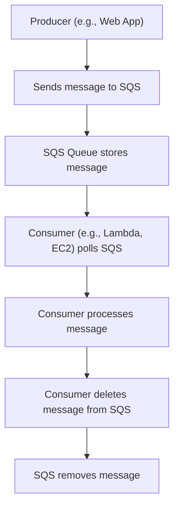

## SQS: Message Queues for Decoupling
### Core Concepts

*   **What is SQS?** Amazon Simple Queue Service (SQS) is a fully managed message queuing service that enables you to decouple and scale microservices, distributed systems, and serverless applications.
*   **Decoupling:** SQS acts as a buffer between components. Producers send messages to a queue without needing to know if or when consumers are available, and consumers retrieve messages without needing to know about producers. This increases fault tolerance and system resilience.
*   **Asynchronous Communication:** Facilitates non-blocking operations. A component can send a request (message) and continue its work, without waiting for the response from the receiving component.
*   **Two Main Types:**
    *   **Standard Queues:**
        *   Offer "at-least-once" message delivery. Messages might be delivered more than once, so consumers must be idempotent.
        *   Support high throughput (nearly unlimited messages per second).
        *   Message ordering is not guaranteed (best-effort ordering).
    *   **FIFO (First-In-First-Out) Queues:**
        *   Offer "exactly-once" message processing and guarantee message ordering.
        *   Lower throughput compared to Standard queues (up to 3,000 messages/second with batching, 300 without).
        *   Ideal for scenarios where the order of operations and no duplication are critical (e.g., financial transactions, order processing).

### Key Details & Nuances

*   **Message Retention:** Messages can be stored for 1 minute to 14 days; default is 4 days.
*   **Message Size:** Max message size is 256 KB. For larger payloads, use S3 for the data and store an S3 pointer in the SQS message.
*   **Visibility Timeout:**
    *   When a consumer receives a message, it becomes "invisible" in the queue for a specified duration (default 30 seconds, max 12 hours).
    *   If the consumer processes and deletes the message within this timeout, it's successful.
    *   If the consumer fails or doesn't delete the message within the timeout, the message becomes visible again and can be processed by another consumer, leading to potential duplicates (Standard queues).
    *   **Interview Insight:** Misconfiguring visibility timeout is a common anti-pattern, leading to redundant processing or message re-delivery before processing completes.
*   **Dead-Letter Queues (DLQ):**
    *   A separate queue where messages are sent after a maximum number of processing attempts (redrive policy) fails.
    *   Essential for debugging failed messages and preventing poison pill messages from blocking queues.
*   **Polling:**
    *   **Short Polling:** Returns immediately, even if the queue is empty. Increases empty responses and API calls.
    *   **Long Polling:** Waits for messages to arrive (up to 20 seconds) before returning. Reduces empty responses and improves cost efficiency. **Always prefer Long Polling.**
*   **FIFO Specifics:**
    *   **Message Deduplication ID:** Used to prevent duplicate messages within the 5-minute deduplication interval. Can be provided explicitly or derived from message content (content-based deduplication).
    *   **Message Group ID:** Guarantees that all messages with the same Group ID are processed in order by a single consumer. Messages with different Group IDs can be processed in parallel.

### Practical Examples

#### **SQS Message Flow**



#### **Sending a Message (TypeScript)**

```typescript
import { SQSClient, SendMessageCommand } from "@aws-sdk/client-sqs";

const sqsClient = new SQSClient({ region: "us-east-1" });
const queueUrl = "YOUR_SQS_QUEUE_URL"; // e.g., https://sqs.us-east-1.amazonaws.com/123456789012/my-queue

async function sendMessage(messageBody: string, customAttributes: Record<string, any>) {
  try {
    const command = new SendMessageCommand({
      QueueUrl: queueUrl,
      MessageBody: messageBody,
      MessageAttributes: Object.entries(customAttributes).reduce((acc, [key, value]) => {
        acc[key] = {
          DataType: typeof value === 'number' ? 'Number' : 'String',
          StringValue: String(value),
        };
        return acc;
      }, {}),
      // For FIFO queues:
      // MessageDeduplicationId: "unique-id-for-deduplication",
      // MessageGroupId: "order-123",
    });

    const response = await sqsClient.send(command);
    console.log("Message sent:", response.MessageId);
    return response;
  } catch (error) {
    console.error("Error sending message:", error);
    throw error;
  }
}

// Example usage
sendMessage(
  JSON.stringify({ orderId: "ABC-123", status: "PENDING" }),
  { orderType: "E-commerce", priority: 5 }
);
```

### Common Pitfalls & Trade-offs

*   **At-Least-Once Delivery (Standard SQS):** Consumers *must* be idempotent. Design your processing logic so that re-processing the same message multiple times has the same outcome as processing it once.
*   **Choosing Standard vs. FIFO:**
    *   **Standard:** Default choice for high-throughput, general-purpose decoupling where exact order isn't critical (e.g., logging, analytics events). Favors throughput over strict ordering/deduplication.
    *   **FIFO:** Use when order and exactly-once processing are paramount (e.g., financial transactions, command queues). Has throughput limitations and additional complexity (deduplication IDs, group IDs).
*   **Visibility Timeout Misconfiguration:** Too short, and messages get re-processed prematurely. Too long, and failed messages take longer to be re-attempted by other consumers, reducing responsiveness. Tune based on average processing time.
*   **Message Size Limits:** Storing large data directly in SQS is an anti-pattern. Use S3 for large payloads and pass the S3 object key in the SQS message.
*   **Polling Strategy:** Using short polling excessively can lead to higher costs and latency due to empty responses. Always configure long polling unless there's a specific, rare reason not to.

### Interview Questions

1.  **Explain the core difference between SQS Standard and SQS FIFO queues. When would you choose one over the other?**
    *   **Answer:** Standard queues offer "at-least-once" delivery and high throughput without guaranteed order. Choose for general decoupling where idempotency is handled (e.g., event streams, logging). FIFO queues guarantee "exactly-once" processing and strict message ordering (per message group) but have lower throughput. Choose for critical workflows requiring strict order and no duplicates (e.g., financial transactions, order processing).
2.  **What is the SQS visibility timeout? How does it help prevent duplicate processing, and what happens if a consumer fails to process a message within this timeout?**
    *   **Answer:** Visibility timeout is a period during which a message is hidden from other consumers after being received by one. It prevents other consumers from processing the same message concurrently. If a consumer fails to process and delete the message within this time, the message becomes visible again and can be picked up by another consumer, potentially leading to duplicate processing (in Standard queues).
3.  **How would you handle a "poison pill" message in an SQS queue?**
    *   **Answer:** Implement a Dead-Letter Queue (DLQ). Configure the source SQS queue's redrive policy to send messages to the DLQ after a specified number of unsuccessful processing attempts (e.g., 3-5 times). This isolates problematic messages, prevents them from blocking the main queue, and allows for manual inspection and debugging.
4.  **Describe the concept of "at-least-once delivery" in SQS Standard queues and explain why consumers need to be idempotent.**
    *   **Answer:** "At-least-once delivery" means SQS guarantees a message will be delivered, but it might be delivered more than once (e.g., due to consumer failure, timeout issues). Consumers must be idempotent, meaning processing the same message multiple times has the same effect as processing it once. This is crucial to prevent unintended side effects (e.g., charging a customer twice, duplicating a database record).
5.  **You have a high-traffic application sending many messages to SQS. How would you optimize for cost and latency when consuming these messages?**
    *   **Answer:** Use SQS Long Polling instead of Short Polling. Long Polling significantly reduces the number of empty receives and API calls, leading to lower costs and improved latency by waiting for messages to become available before returning a response. Ensure your consumers are designed to handle batching if applicable to further reduce API calls (e.g., `receiveMessage` with `MaxNumberOfMessages > 1`).