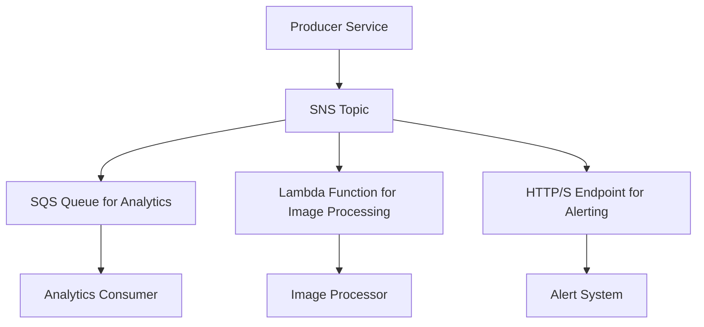

## SNS: Pub/Sub Messaging
### Core Concepts
*   **Fully Managed Pub/Sub:** AWS Simple Notification Service (SNS) is a highly available, durable, secure, and fully managed publish/subscribe messaging service.
*   **Decoupling:** Enables asynchronous communication between disparate application components (publishers) and services (subscribers), fostering a decoupled architecture. This prevents direct dependencies, improving resilience, scalability, and maintainability.
*   **Topics:** Publishers send messages to an SNS Topic. Subscribers register with a topic to receive messages published to it. A topic acts as an access point for publishers and subscribers.
*   **Fan-out Pattern:** A key capability where a single message published to an SNS topic can be delivered to multiple subscriber endpoints of different types simultaneously.

### Key Details & Nuances
*   **Subscriber Types:** SNS supports various endpoint types, allowing for diverse fan-out patterns:
    *   **SQS Queues:** Guarantees message delivery and enables consumer polling for robust, durable processing. (Most common for microservices)
    *   **AWS Lambda Functions:** Triggers serverless functions directly upon message receipt.
    *   **HTTP/S Endpoints:** Delivers messages to custom webhooks or application servers.
    *   **Email/SMS:** Sends notifications directly to users.
    *   **Mobile Push Notifications:** Integrates with mobile push services.
*   **Message Attributes:** Publishers can include structured metadata (key-value pairs) with messages, which subscribers can use for filtering.
*   **Message Filtering Policies:** Subscribers can define filtering policies based on message attributes. Only messages matching the policy are delivered, reducing unnecessary processing.
*   **Message Durability:** Messages are redundantly stored across multiple Availability Zones until delivered, ensuring high durability.
*   **At-Least-Once Delivery:** SNS guarantees that messages will be delivered to eligible subscribers at least once. Consumers must be designed to be idempotent to handle potential duplicate deliveries.
*   **SNS FIFO Topics:** Provide strict message ordering and deduplication within a message group, unlike standard SNS topics which do not guarantee ordering. Useful for scenarios requiring strict sequence.

### Practical Examples

#### SNS Fan-out Architecture


#### Publishing a Message with Attributes (TypeScript)
```typescript
import { SNSClient, PublishCommand } from "@aws-sdk/client-sns";

const snsClient = new SNSClient({ region: "us-east-1" });
const TOPIC_ARN = "arn:aws:sns:us-east-1:123456789012:MyApplicationTopic";

async function publishOrderEvent(orderId: string, orderStatus: string, customerId: string) {
    const message = {
        orderId: orderId,
        timestamp: new Date().toISOString()
    };

    const command = new PublishCommand({
        TopicArn: TOPIC_ARN,
        Message: JSON.stringify(message),
        MessageAttributes: {
            // Attributes for filtering by subscribers
            OrderStatus: {
                DataType: "String",
                StringValue: orderStatus,
            },
            CustomerId: {
                DataType: "String",
                StringValue: customerId,
            },
            EventType: {
                DataType: "String",
                StringValue: "OrderEvent",
            },
        },
    });

    try {
        const data = await snsClient.send(command);
        console.log(`Message published: ${data.MessageId}`);
        return data.MessageId;
    } catch (error) {
        console.error("Error publishing message:", error);
        throw error;
    }
}

// Example Usage:
// publishOrderEvent("ORD-001", "PROCESSED", "CUST-123");
// publishOrderEvent("ORD-002", "SHIPPED", "CUST-456");
```

### Common Pitfalls & Trade-offs
*   **Message Ordering:** Standard SNS does not guarantee the order of message delivery. If strict ordering is required, consider SNS FIFO topics or an SQS FIFO queue as a subscriber.
*   **Duplicate Messages:** Due to at-least-once delivery, consumers *must* implement idempotency to safely process the same message multiple times without adverse effects.
*   **Payload Size Limits:** Messages are limited to 256KB. For larger payloads, store the data in S3 and send an SNS message containing the S3 object key.
*   **Dead-Letter Queues (DLQs):** While SNS supports DLQs for failed Lambda or SQS deliveries, it's crucial to set them up and monitor them to capture and reprocess messages that couldn't be delivered to subscribers. Without them, messages could be lost.
*   **Subscription Management:** In large systems, managing numerous subscriptions can become complex. Infrastructure as Code (e.g., CloudFormation, Terraform) is essential.

### Interview Questions

1.  **When would you choose AWS SNS over SQS, and vice versa, for asynchronous communication in a microservices architecture?**
    *   **SNS:** Choose when you need to *fan out* a single message to multiple, potentially different, consumers simultaneously (publish/subscribe). Ideal for event-driven architectures, broadcasting updates, or triggering diverse workflows from a single event source. SNS doesn't retain messages after delivery to subscribers.
    *   **SQS:** Choose when you need a *queue* for point-to-point communication, reliable message buffering, or when multiple workers need to process messages from a shared queue. SQS retains messages until processed by a consumer or the retention period expires, providing a robust buffer for messages that might not be immediately processed.

2.  **Explain the "fan-out" capability of SNS. How does it enhance system design from a scalability and decoupling perspective?**
    *   Fan-out means one message sent to an SNS topic can be delivered to multiple subscribed endpoints (e.g., SQS, Lambda, HTTP/S).
    *   **Scalability:** Allows adding new consumers without modifying the publisher. Each subscriber can scale independently to handle its share of messages.
    *   **Decoupling:** The publisher only needs to know about the SNS topic, not the specific downstream consumers. This reduces direct dependencies, making the system more modular, resilient to failures in individual components, and easier to evolve.

3.  **How would you ensure message delivery and handle potential failures or undeliverable messages when using SNS?**
    *   **SQS Subscriptions:** Subscribe SQS queues to SNS topics. SQS queues provide message durability and guaranteed delivery to consumers, acting as a buffer if consumers are temporarily unavailable.
    *   **DLQs:** Configure Dead-Letter Queues (DLQs) for SNS subscriptions (e.g., for Lambda, SQS) to capture messages that fail to be delivered or processed after a certain number of retries. Monitoring DLQs is crucial for operational visibility and reprocessing.
    *   **Idempotency:** Design consumers to be idempotent to safely handle the "at-least-once" delivery guarantee, preventing side effects from duplicate messages.
    *   **Observability:** Implement robust logging and monitoring (e.g., CloudWatch metrics for delivered messages, errors, failed messages to DLQ).

4.  **What are some key limitations of AWS SNS, and how might you mitigate them in a production system?**
    *   **No Message Ordering (Standard SNS):** Mitigate by using SNS FIFO topics for strict ordering, or processing messages through an SQS FIFO queue subscriber.
    *   **Message Size Limit (256KB):** For larger payloads, store the content in S3 and send the S3 object key/path in the SNS message. The consumer then fetches the full content from S3.
    *   **At-Least-Once Delivery:** Requires consumers to be idempotent.
    *   **No Built-in Message Filtering (pre-delivery to all subscribers):** This is handled by **Message Filtering Policies** on subscriptions, which filter *after* the message hits SNS but *before* it's delivered to the specific subscriber.

5.  **Describe a practical scenario where SNS message filtering would be highly beneficial, and how you would implement it.**
    *   **Scenario:** An e-commerce system publishes "Order Events" to an SNS topic. Different microservices need to react to specific order states:
        *   Inventory Service: Needs only "OrderPlaced" and "OrderCancelled" events.
        *   Shipping Service: Needs only "OrderProcessed" and "OrderShipped" events.
        *   Billing Service: Needs only "OrderProcessed" and "PaymentFailed" events.
    *   **Implementation:**
        1.  Publisher includes `OrderStatus` and `EventType` as `MessageAttributes` (e.g., `{"OrderStatus": {"DataType": "String", "StringValue": "ORDER_PLACED"}}`).
        2.  Each subscriber (e.g., SQS queue, Lambda) subscribes to the SNS topic.
        3.  For each subscription, a **Message Filtering Policy** is defined:
            *   Inventory Service Subscription Policy: `{"OrderStatus": ["ORDER_PLACED", "ORDER_CANCELLED"]}`
            *   Shipping Service Subscription Policy: `{"OrderStatus": ["ORDER_PROCESSED", "ORDER_SHIPPED"]}`
            *   Billing Service Subscription Policy: `{"EventType": ["OrderProcessed", "PaymentFailed"]}`
    *   This ensures only relevant messages are delivered to each service, reducing unnecessary processing and network traffic for consumers.