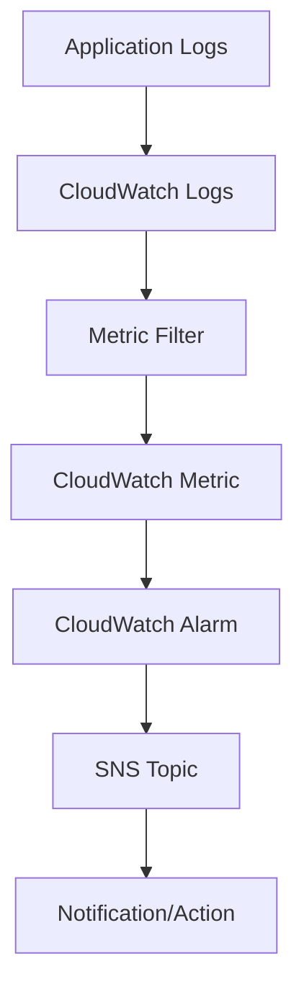

## CloudWatch: Metrics, Alarms, and Logs
### Core Concepts
*   **AWS CloudWatch**: A monitoring and observability service providing data and actionable insights for applications, infrastructure, and services. It collects data from various sources (EC2, Lambda, RDS, custom apps) and presents it as metrics, logs, and events.
*   **Metrics**: Time-ordered sets of data points published to CloudWatch. Represent a variable to be monitored, such as CPU utilization, request count, or error rate.
    *   **Dimensions**: Key-value pairs that help uniquely identify a metric and provide context (e.g., `InstanceId`, `FunctionName`).
    *   **Namespaces**: Containers for metrics, allowing grouping and preventing naming collisions (e.g., `AWS/EC2`, `MyApplication`).
*   **Alarms**: Monitor metrics for specific thresholds and trigger actions when those thresholds are breached for a specified period.
    *   **States**: `OK`, `ALARM`, `INSUFFICIENT_DATA`.
    *   **Actions**: Notifications (SNS), Auto Scaling actions, EC2 actions (stop, terminate, recover, reboot), SSM Automation.
*   **Logs**: Centralized logging service for applications and AWS services.
    *   **Log Groups**: Logical groupings of log streams that share the same retention, monitoring, and access control settings.
    *   **Log Streams**: Sequences of log events from the same source (e.g., a specific EC2 instance, a Lambda function invocation).
    *   **Log Events**: Individual records containing a timestamp and a message.

### Key Details & Nuances
*   **Metrics Resolution**:
    *   **Standard Resolution**: Data points every 1 minute.
    *   **High Resolution**: Data points every 1, 5, 10, or 30 seconds. Higher cost, useful for rapid issue detection in critical, volatile systems.
*   **Custom Metrics**: Publish application-specific metrics using SDKs, CLI, or CloudWatch Agent. Essential for deeper application-level observability beyond default AWS metrics.
*   **Alarms Evaluation**: Alarms evaluate based on data points over a period. `DatapointsToAlarm` and `EvaluationPeriods` determine how many consecutive data points must be in `ALARM` state to trigger.
*   **Composite Alarms**: Combine multiple simple alarms using boolean logic (`AND`, `OR`, `NOT`) to reduce noise and provide more intelligent alerts for complex conditions.
*   **CloudWatch Logs Insights**: A powerful query language to interactively search and analyze log data. Useful for debugging, troubleshooting, and generating ad-hoc reports.
*   **Subscription Filters**: Configure real-time processing of log events. Can forward log events to Lambda, Kinesis Data Streams, or Kinesis Firehose for custom processing, analytics, or archival.
*   **Integration**: Seamless integration with most AWS services (Lambda automatically sends logs, EC2 requires CloudWatch Agent, RDS provides enhanced monitoring).

### Practical Examples

#### 1. Publishing a Custom Metric via AWS CLI
```sh
aws cloudwatch put-metric-data \
    --namespace "MyApplication/Inventory" \
    --metric-name "LowStockItems" \
    --value 15 \
    --dimensions "Region=us-east-1,ProductCategory=Electronics" \
    --timestamp 2023-10-27T10:00:00Z
```

#### 2. CloudWatch Log Flow to Alarm
This diagram illustrates how application logs are processed, filtered, and can trigger an alarm.



### Common Pitfalls & Trade-offs
*   **Cost Management**: High-resolution metrics and long log retention periods can incur significant costs. Balance granularity/retention with budget.
*   **Alert Fatigue**: Too many alarms or alarms on non-actionable metrics lead to engineers ignoring alerts. Focus on actionable, critical alarms. Use composite alarms to aggregate related issues.
*   **Insufficient Data**: Alarms can enter `INSUFFICIENT_DATA` state if no metric data is available, potentially masking issues. Configure `TreatMissingData` appropriately (e.g., `notBreaching`, `breaching`, `ignore`, `missing`).
*   **Over-reliance on Default Metrics**: While useful, default AWS service metrics might not provide enough insight into application-specific health. Custom metrics are crucial for true observability.
*   **Log Volume Management**: Uncontrolled log verbosity can lead to high costs and make it difficult to find relevant information. Implement structured logging and adjust log levels.

### Interview Questions
1.  **Question**: Describe a scenario where you would use a CloudWatch Composite Alarm instead of multiple individual alarms. What are the benefits?
    *   **Answer**: You'd use a Composite Alarm when a system's health depends on multiple conditions being met (or not met) simultaneously, and you want to avoid noise from individual component failures that don't represent a true system-level issue. For example, triggering an alarm only when "EC2 CPU utilization is high" `AND` "Database connections are maxed out" `AND` "Application error rate is increasing." The benefits are reduced alert fatigue, more actionable alerts, and a clearer overall system health picture.
2.  **Question**: How would you go about setting up custom application-level metrics for a Node.js Lambda function, and then create an alarm based on a specific business logic metric?
    *   **Answer**: For a Node.js Lambda, you'd use the AWS SDK to `putMetricData` within your Lambda function's code. For instance, if you want to track "successful order placements", you'd increment a counter metric.
        ```typescript
        import { CloudWatchClient, PutMetricDataCommand } from "@aws-sdk/client-cloudwatch";

        const cloudWatchClient = new CloudWatchClient({ region: process.env.AWS_REGION });

        async function recordSuccessfulOrder() {
            const params = {
                MetricData: [
                    {
                        MetricName: "SuccessfulOrders",
                        Dimensions: [{ Name: "Environment", Value: "Production" }],
                        Unit: "Count",
                        Value: 1,
                    },
                ],
                Namespace: "MyApp/Orders",
            };
            const command = new PutMetricDataCommand(params);
            await cloudWatchClient.send(command);
        }
        ```
        Then, in CloudWatch, you'd create an alarm on the `MyApp/Orders` namespace, `SuccessfulOrders` metric. You might configure it to trigger if the `Sum` of `SuccessfulOrders` is below a certain threshold over a 5-minute period, indicating a problem with order processing.
3.  **Question**: You are troubleshooting a sudden spike in errors for your service. How would you use CloudWatch Logs Insights to efficiently pinpoint the root cause?
    *   **Answer**: First, I'd navigate to the relevant CloudWatch Log Group. Then, I'd open CloudWatch Logs Insights. I would start by querying for logs within the time range of the error spike, filtering by log level `ERROR` or `CRITICAL`.
        ```sql
        fields @timestamp, @message
        | filter @logStream like /my-service-prod/
        | filter @message like /ERROR|FAIL/
        | sort @timestamp desc
        | limit 100
        ```
        I'd then refine the query to look for specific error codes, exception types, or correlated requests (if I have request IDs in logs). I might use `parse` commands to extract specific fields from the log messages, `stats` commands to count occurrences of different errors, or `display` commands to view parsed data. This iterative refinement allows me to quickly identify patterns or specific failure points.
4.  **Question**: When would you consider using high-resolution metrics over standard resolution, and what are the trade-offs?
    *   **Answer**: High-resolution metrics (1-second granularity) are beneficial for applications where rapid changes in metrics need immediate detection, such as real-time trading platforms, critical microservices where latency is paramount, or systems with very short-lived bursts of activity. The trade-off is significantly higher cost due to the increased data ingestion and storage. Standard resolution (1-minute) is suitable for most general-purpose monitoring where immediate detection isn't as critical, or for metrics that don't fluctuate rapidly. It offers a balance of cost and observability.