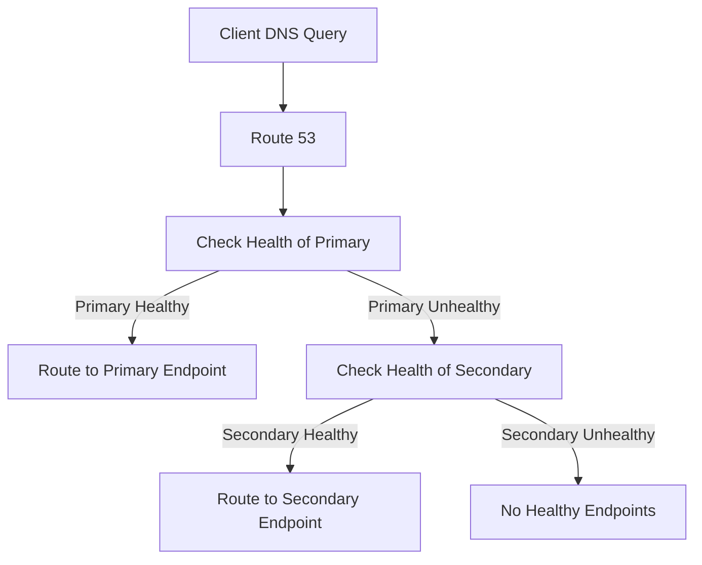

## Route 53: DNS and Routing Policies
### Core Concepts

*   **Domain Name System (DNS):** A hierarchical, decentralized naming system for computers, services, or any resource connected to the Internet or a private network. It translates human-readable domain names (e.g., `example.com`) into machine-readable IP addresses (e.g., `192.0.2.1`).
*   **AWS Route 53:** AWS's highly available and scalable cloud DNS web service. It also acts as a domain registrar and provides health checking capabilities.
    *   **Decoupling:** Enables architectural flexibility by abstracting service locations. Clients resolve DNS names, allowing backend IP addresses or services to change without client-side modifications. This is fundamental for microservices and highly dynamic environments.
    *   **Global Service:** Route 53 is not region-specific; its records are globally distributed.
    *   **Authoritative DNS:** Route 53 acts as an authoritative DNS server for your domains, meaning it holds the definitive DNS records for your hosted zones.

### Key Details & Nuances

*   **Record Types (Common Interview Focus):**
    *   **A (Address):** Maps a domain name to an IPv4 address.
    *   **AAAA (IPv6 Address):** Maps a domain name to an IPv6 address.
    *   **CNAME (Canonical Name):** Maps one domain name to another domain name (e.g., `blog.example.com` to `example.wordpress.com`).
        *   **Crucial Limitation:** A CNAME record **cannot** be used for the root domain (e.g., `example.com`), only for subdomains.
    *   **ALIAS:** An AWS-specific virtual record type that maps a domain name to an AWS resource (e.g., ELB, CloudFront distribution, S3 bucket, another Route 53 record).
        *   **Key Advantages:**
            *   Can be used for the **root domain** (e.g., `example.com`).
            *   Automatically tracks IP address changes of the target AWS resource.
            *   No extra charges for ALIAS queries.
            *   Behaves like an A record but points to an AWS resource's DNS name, not an IP.
    *   **MX (Mail Exchange):** Specifies mail servers for the domain.
    *   **TXT (Text):** Stores arbitrary text, often used for SPF/DKIM (email validation) or domain verification.
    *   **NS (Name Server):** Specifies the authoritative name servers for a zone.
    *   **SOA (Start of Authority):** Contains administrative information about the zone.
*   **Routing Policies:**
    *   **Simple:** Routes all traffic to a single resource. No health checks.
    *   **Weighted:** Distributes traffic to multiple resources based on weights (e.g., A/B testing, blue/green deployments). Requires health checks.
    *   **Latency:** Routes traffic to the resource that provides the lowest latency for the user. Requires health checks.
    *   **Failover:** Routes traffic to a primary resource if healthy; otherwise, to a secondary resource. **Requires health checks** on both primary and secondary.
    *   **Geolocation:** Routes traffic based on the user's geographical location.
    *   **Geoproximity (Traffic Flow only):** Routes traffic based on the geographic location of users and resources. Allows "bias" to shift traffic.
    *   **Multivalue Answer:** Returns up to 8 healthy records (randomly ordered) in response to DNS queries. Useful for simple client-side load balancing or for determining endpoint health. Requires health checks.
*   **Health Checks:**
    *   Monitor the health of endpoints (e.g., EC2 instance, ELB, arbitrary IP).
    *   Can check HTTP, HTTPS, TCP, or string matching.
    *   Essential for Failover, Weighted, and Multivalue routing policies to remove unhealthy endpoints from DNS responses.
*   **Hosted Zones:**
    *   **Public Hosted Zone:** Manages DNS records for internet-resolvable domains.
    *   **Private Hosted Zone:** Manages DNS records for domains resolvable only within specified Amazon VPCs.

### Practical Examples

**Failover Routing Policy with Health Checks**

This diagram illustrates how Route 53 uses a Failover routing policy. When a client makes a DNS query, Route 53 checks the health of the primary endpoint. If healthy, traffic goes to the primary. If unhealthy, it fails over to the secondary.

### Common Pitfalls & Trade-offs

*   **TTL (Time To Live) Mismanagement:**
    *   **High TTL:** Faster DNS resolution (cached), reduces load on DNS servers, but delays propagation of DNS changes (e.g., during failovers or migrations).
    *   **Low TTL:** Faster propagation of changes, but increases DNS query load and potentially latency if resolvers have to frequently re-query.
    *   **Trade-off:** Balance change propagation speed vs. DNS query performance/cost. For critical applications requiring rapid failover, use a low TTL.
*   **CNAME vs. ALIAS Misunderstanding:** A common mistake is trying to use a CNAME for the root domain, which is not allowed by DNS standards. Always use ALIAS records for AWS resources at the root domain.
*   **Health Check Configuration:**
    *   Insufficiently granular health checks can mask underlying issues (e.g., checking only a port when the app is crashed).
    *   Overly aggressive health checks can lead to "flapping" (rapid state changes) or false positives, causing unnecessary failovers.
    *   Not configuring health checks for routing policies that require them (Weighted, Failover, Multivalue Answer) will result in unpredictable behavior or continuous routing to an unhealthy endpoint.
*   **Choosing the Wrong Routing Policy:** Using Simple routing where Failover or Weighted is needed, leading to single points of failure or uneven traffic distribution.

### Interview Questions

1.  **Explain the difference between CNAME and ALIAS records in Route 53. When would you use each, especially considering a root domain (e.g., `example.com`)?**
    *   **Answer:** CNAME (Canonical Name) maps a domain to another domain name, but cannot be used for the root/apex domain (e.g., `example.com`). ALIAS is an AWS-specific virtual record type that maps a domain to an AWS resource (ELB, CloudFront, S3 bucket etc.) and *can* be used for the root domain. Use CNAME for subdomains pointing to non-AWS external services (e.g., `blog.example.com` to `blogger.com`). Use ALIAS for any domain, especially the root, pointing to an AWS resource because it handles IP changes automatically and supports the root domain.
2.  **You have a multi-region application with endpoints in `us-east-1` and `eu-west-1`. How would you configure Route 53 to route users to the closest healthy endpoint?**
    *   **Answer:** I would use a **Latency Routing Policy** combined with **Route 53 Health Checks**. For each region's endpoint, I'd create an A record with the Latency policy and associate a health check. Route 53 automatically determines which region has the lowest latency for the end user and directs them to a *healthy* endpoint in that region. If the closest endpoint is unhealthy, it will route to the next closest healthy endpoint.
3.  **What is the impact of a very low TTL (Time To Live) on your DNS records, and when might it be desirable?**
    *   **Answer:** A very low TTL (e.g., 60 seconds) means DNS resolvers cache records for a shorter period. This leads to more frequent DNS queries, increasing the load on DNS servers and potentially adding latency for users due to more frequent lookups. However, it's highly desirable during critical migrations, failovers, or blue/green deployments where rapid propagation of DNS changes is paramount. It ensures that traffic quickly shifts to new or healthy endpoints.
4.  **Describe a scenario where you would use Weighted Routing Policy versus Latency Routing Policy.**
    *   **Answer:**
        *   **Weighted:** Use when you need to distribute traffic across multiple resources based on a defined ratio, regardless of geographic location. Ideal for A/B testing (e.g., 90% to version A, 10% to version B), or controlled rollout of new features (e.g., sending 5% of traffic to a new service instance).
        *   **Latency:** Use when you want to minimize the time it takes for users to access your application by routing them to the geographic region that provides the fastest response. Ideal for global applications where performance is critical, and you have deployments in multiple regions.
5.  **How do Route 53 Health Checks contribute to the high availability of your applications? What types of issues can they detect?**
    *   **Answer:** Route 53 Health Checks are crucial for high availability because they allow DNS to become "application-aware." They continuously monitor the health of your endpoints (e.g., web servers, load balancers, database connections). If an endpoint becomes unhealthy, Route 53 can automatically stop routing traffic to it, directing users to healthy alternatives based on the configured routing policy (e.g., Failover, Weighted, Multivalue). They can detect issues like:
        *   Service unresponsiveness (HTTP/HTTPS errors, TCP connection failures).
        *   Application-level failures (e.g., specific string not found in the response body, indicating a broken application component).
        *   Calculated health based on the health of other health checks.