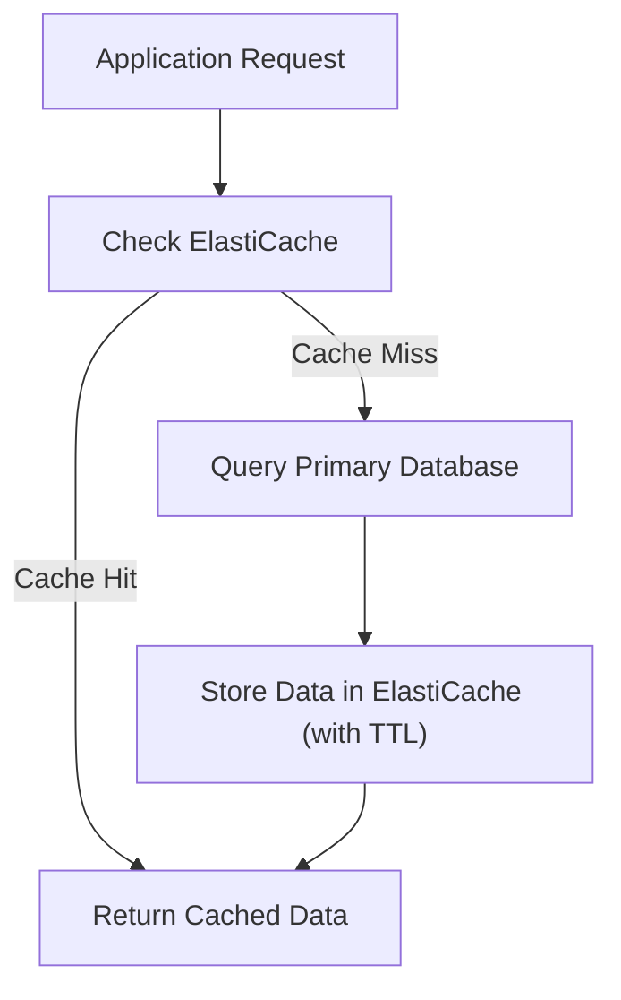

## ElastiCache: In-Memory Caching (Redis vs. Memcached)
### Core Concepts

*   **ElastiCache:** A fully managed AWS service for deploying, operating, and scaling popular open-source in-memory data stores (Redis and Memcached).
*   **Purpose:** Primarily used for caching frequently accessed data to reduce latency, offload databases, and improve application performance and scalability. It's a key component in **decoupling** data access layers and enhancing **observability** by providing cache metrics.
*   **In-Memory Caching:** Stores data in RAM, offering significantly faster read/write operations compared to disk-based databases.

### Key Details & Nuances

**Redis vs. Memcached in ElastiCache**

| Feature              | Redis                                                                        | Memcached                                                                   |
| :------------------- | :--------------------------------------------------------------------------- | :-------------------------------------------------------------------------- |
| **Data Structures**  | Richer: Strings, Hashes, Lists, Sets, Sorted Sets, Bitmaps, HyperLogLogs, Geospatial indexes. | Simple: Strings (key-value pairs only).                                     |
| **Persistence**      | Yes (RDB snapshots, AOF logging) - allows data recovery.                   | No - pure volatile cache; data lost on restart.                             |
| **Replication**      | Yes (Primary-replica architecture) - for high availability (read replicas).  | No built-in replication; requires client-side sharding for distribution.    |
| **High Availability**| Yes - automatic failover to a replica in case of primary node failure.       | Limited - achieved via client-side distribution and redundancy.             |
| **Scaling**          | Supports sharding (cluster mode) for horizontal scaling.                     | Horizontal scaling by adding more nodes to the pool (client manages).       |
| **Use Cases**        | Caching, session management, Pub/Sub, leaderboards, real-time analytics, rate limiting. | Simple caching, session store (if non-critical), frequently accessed lookups. |
| **Transactions**     | Yes (MULTI/EXEC) - atomic operations.                                        | No.                                                                         |
| **Pub/Sub**          | Yes - allows message brokering.                                              | No.                                                                         |
| **Multi-threading**  | Single-threaded (efficient I/O multiplexing).                                | Multi-threaded (can utilize multiple cores per node).                       |

**ElastiCache Specifics:**
*   **Managed Service:** AWS handles patching, backups, failure recovery, monitoring, and scaling.
*   **Security:** Integration with VPC, Security Groups, IAM, and encryption at rest/in transit.
*   **Monitoring:** CloudWatch metrics for cache hits, misses, CPU, memory, network, etc., crucial for **observability**.

### Practical Examples

**1. Cache-Aside Pattern with ElastiCache**



**2. Node.js/TypeScript Example (using `ioredis` for Redis)**

```typescript
import Redis from 'ioredis';

// Configure Redis client to connect to ElastiCache endpoint
// ElastiCache endpoints are typically found in the AWS Console for your cluster.
const redis = new Redis({
  host: 'my-redis-cluster.xxxxxx.clustercfg.usw2.cache.amazonaws.com', // Replace with your ElastiCache endpoint
  port: 6379,
  // Add TLS/SSL configuration if your ElastiCache cluster uses encryption in transit
  // tls: {
  //   checkServerIdentity: () => undefined, // Or a proper cert validation for production
  // },
});

async function getUserData(userId: string): Promise<any> {
  const cacheKey = `user:${userId}`;

  try {
    // 1. Check cache (cache-aside pattern)
    const cachedData = await redis.get(cacheKey);
    if (cachedData) {
      console.log(`Cache Hit for ${userId}`);
      return JSON.parse(cachedData);
    }

    console.log(`Cache Miss for ${userId}. Fetching from DB...`);
    // 2. Data not in cache, fetch from database (simulated)
    const userDataFromDB = await simulateDatabaseFetch(userId);

    // 3. Store in cache with an expiration (e.g., 5 minutes)
    await redis.setex(cacheKey, 300, JSON.stringify(userDataFromDB)); // SETEX: SET with EXpiration

    return userDataFromDB;
  } catch (error) {
    console.error('Error interacting with ElastiCache or DB:', error);
    // Fallback to directly querying DB or handling error gracefully
    return await simulateDatabaseFetch(userId);
  }
}

// --- Simulated Database Function ---
async function simulateDatabaseFetch(userId: string): Promise<any> {
  return new Promise(resolve => {
    setTimeout(() => {
      console.log(`Fetched user ${userId} from DB.`);
      resolve({ id: userId, name: `User ${userId} Name`, email: `user${userId}@example.com` });
    }, 500); // Simulate network latency
  });
}

// Example Usage
(async () => {
  await getUserData('123'); // First call: cache miss, fetch from DB, set cache
  await getUserData('123'); // Second call: cache hit
  await getUserData('456'); // Another user
})();

```

### Common Pitfalls & Trade-offs

*   **Cache Invalidation:** The hardest problem in computer science. Strategies:
    *   **Time-To-Live (TTL):** Data expires automatically. Simple, but can lead to stale data until expiration.
    *   **Write-Through/Write-Aside:** Write to cache and database simultaneously or sequentially. Ensures consistency but adds write latency.
    *   **Explicit Invalidation:** Delete items from cache when underlying data changes. Requires careful coordination (e.g., event-driven invalidation).
*   **Stale Data:** A trade-off between consistency and performance. Caching inherently introduces potential for stale data. Design systems to tolerate eventual consistency or implement strong invalidation strategies.
*   **Thundering Herd Problem:** When a cache item expires, and many concurrent requests hit the backend database simultaneously. Mitigate with:
    *   **Cache Stampede Prevention:** Single flight (only one request goes to DB, others wait for its result).
    *   **Proactive Caching/Refresh:** Refresh cache before expiration.
    *   **Jitter:** Add random variance to TTLs.
*   **Over-Caching:** Caching data that changes frequently or is rarely accessed can lead to wasted resources and increased complexity for minimal gain.
*   **Cost Management:** ElastiCache instances can be expensive. Choose appropriate instance types and size clusters correctly. Auto-scaling is not directly available for ElastiCache; you need to manually scale or use specific Redis Cluster features.
*   **Network Latency:** Even with in-memory caches, network latency between your application and ElastiCache can impact performance. Place them in the same VPC/Availability Zone where possible.

### Interview Questions

1.  **When would you choose ElastiCache Redis over ElastiCache Memcached, and vice versa?**
    *   **Redis:** Choose when you need persistence, high availability (replication/failover), rich data structures (lists, sets, hashes for leaderboards, queues), Pub/Sub, transactions, or are building complex caching patterns.
    *   **Memcached:** Choose for simpler, pure key-value caching where high availability isn't critical (as data is ephemeral), or when you need to horizontally scale out simpler cache nodes more easily across multiple cores/threads per node without complex replication setups. Ideal for basic object caching.

2.  **Explain the cache-aside pattern and its implications regarding consistency and performance.**
    *   **Explanation:** The application first checks the cache for data. If a "cache hit" occurs, it returns cached data. If a "cache miss," it fetches data from the primary data source (e.g., database), stores it in the cache (often with a TTL), and then returns the data.
    *   **Implications:**
        *   **Performance:** Significantly improves read performance by reducing database load.
        *   **Consistency:** Introduces eventual consistency. There's a window where the cache might hold stale data if the source data changes before the cache entry expires or is explicitly invalidated. Managing this trade-off is crucial.

3.  **How do you handle cache invalidation and stale data in a distributed system using ElastiCache?**
    *   **Strategies:**
        *   **TTL (Time-To-Live):** The simplest method, data expires automatically. Accepts eventual consistency.
        *   **Write-Through/Write-Aside:** Updates both the cache and the database during writes. Ensures consistency but adds write latency.
        *   **Event-Driven/Explicit Invalidation:** When data changes in the primary database, publish an event (e.g., via SQS/SNS) to trigger cache invalidation (deletion) for the affected keys. This offers stronger consistency but adds complexity.
    *   **Stale Data:** Acknowledging the trade-off. For highly critical data, shorter TTLs or aggressive invalidation is needed. For less critical data, longer TTLs and eventual consistency are acceptable. Implement defensive coding to handle cases where cached data might be unexpectedly missing or stale.

4.  **Describe how ElastiCache enhances application performance and resilience.**
    *   **Performance:** By serving frequently accessed data from fast in-memory stores, it dramatically reduces latency for read-heavy workloads, offloads the primary database, and allows it to scale reads without hitting the database every time.
    *   **Resilience:**
        *   **Database Offloading:** Reduces stress on the database, making it more resilient to spikes in traffic.
        *   **Fault Tolerance (Redis):** Primary-replica architecture with automatic failover ensures the cache remains available even if a primary node fails.
        *   **Decoupling:** Separates the data access logic, making the system more modular.
        *   **Scalability:** Allows scaling the data access layer independently of the database.

5.  **What data structures in Redis are particularly useful for real-time analytics or leaderboards, and why?**
    *   **Sorted Sets (ZSETs):** Ideal for leaderboards. They store unique string members associated with a score, ordered by score. Redis commands like `ZRANK`, `ZSCORE`, `ZREVRANGE` allow efficient retrieval of ranks, scores, and ranges (e.g., top 100 players).
    *   **Hashes (HSETs):** Useful for storing structured objects (e.g., user profiles) where you need to access individual fields within an object efficiently. This can be combined with sorted sets for more complex leaderboard scenarios where each user entry might have multiple attributes.
    *   **HyperLogLogs (PFADD, PFCOUNT):** Excellent for approximate distinct counting (e.g., unique visitors to a website) with very low memory footprint, useful in real-time analytics dashboards.