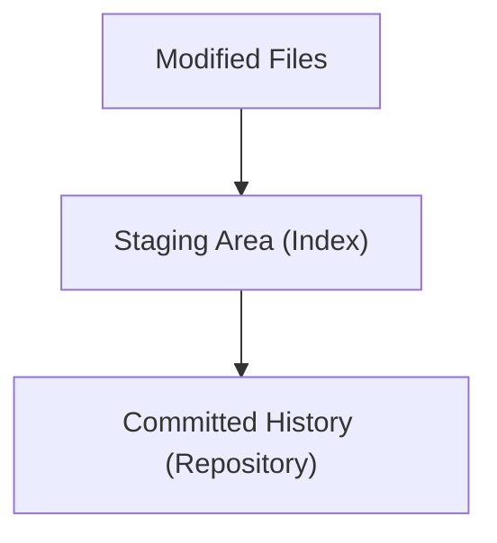

## The Three States (Modified, Staged, Committed)
### Core Concepts

*   **Git's Three States:** Git tracks changes through three primary states:
    *   **Modified:** Files in your working directory have been changed but not yet staged.
    *   **Staged:** Files have been marked for inclusion in the next commit. This is a staging area.
    *   **Committed:** Changes have been permanently saved to your local repository history.

### Key Details & Nuances

*   **`git add`:** The command to move files from the **Modified** state to the **Staged** state.
    *   Allows granular control over what goes into a commit. You can stage specific parts of a file (`git add -p`).
*   **`git commit`:** The command to move files from the **Staged** state to the **Committed** state.
    *   Creates a snapshot of the staged changes.
    *   Requires a commit message describing the changes.
*   **Working Directory vs. Staging Area vs. Repository:**
    *   **Working Directory:** Your local filesystem where you edit files.
    *   **Staging Area (Index):** A middle ground where you prepare your next commit.
    *   **Repository (.git directory):** Where Git stores the history of your project (commits).
*   **State Transitions:**
    *   Modified -> Staged (`git add`)
    *   Staged -> Committed (`git commit`)
    *   Committed -> Modified (by checking out an older commit, or making new changes)
    *   Staged -> Modified (by unstaging: `git restore --staged <file>`)

### Practical Examples

*   **Workflow:**



*   **Commands:**

```sh
# 1. Make changes to a file (Modified state)
echo "This is a new line." >> my_file.txt

# 2. Stage the changes (move from Modified to Staged)
git add my_file.txt

# 3. Make further changes (now you have Modified and Staged files)
echo "Another change." >> my_file.txt

# 4. Stage the second change
git add my_file.txt

# 5. Commit the staged changes
git commit -m "Add new lines to my_file.txt"
```

### Common Pitfalls & Trade-offs

*   **Committing Everything at Once:** Seniors avoid this by staging only related changes for a single commit, leading to clearer history and easier reverting.
*   **Misunderstanding `git add`:** It's not saving; it's selecting for the *next* save.
*   **Losing Staged Changes:** While rare, if you checkout a branch without committing staged changes, Git *might* discard them if there are conflicts (though it often tries to preserve them). Always be mindful of what's staged.

### Interview Questions

1.  **Question:** Explain the difference between "modified," "staged," and "committed" in Git.
    **Answer:** "Modified" refers to files changed in your working directory that Git is aware of. "Staged" is a special area where you prepare changes for the next commit by using `git add`. "Committed" means those staged changes have been permanently saved as a snapshot in your local repository's history. This three-stage system allows for granular control over commit content.

2.  **Question:** How would you stage only *some* of the changes within a single modified file?
    **Answer:** You would use the `git add -p` (or `git add --patch`) command. This command interactively walks you through your changes, allowing you to select specific hunks (sections) of the file to stage for the next commit.

3.  **Question:** What is the purpose of the staging area?
    **Answer:** The staging area acts as an intermediate buffer. It allows you to curate precisely which modifications should be included in your next commit, rather than committing all outstanding changes at once. This is crucial for creating logical, atomic commits with clear descriptions, improving code reviewability and history management.