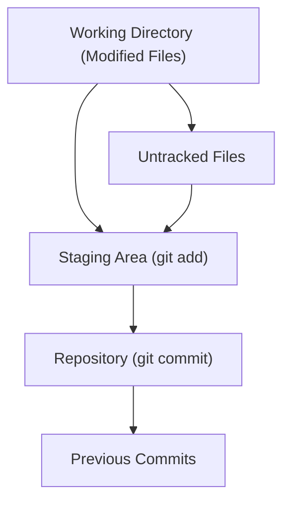

## git add, git commit, git status
### Core Concepts

*   **Git:** A distributed version control system that tracks changes in source code during software development.
*   **Working Directory:** The files you are currently editing.
*   **Staging Area (Index):** An intermediate area where you prepare your next commit. Files are added here before committing.
*   **Commit:** A snapshot of your project at a specific point in time, along with a commit message explaining the changes.

### Key Details & Nuances

*   **`git status`:**
    *   **Purpose:** Shows the current state of the working directory and staging area.
    *   **Output:**
        *   **`Changes not staged for commit`**: Files modified in the working directory but *not* added to the staging area.
        *   **`Changes to be committed`**: Files that have been added to the staging area and are ready for the next commit.
        *   **`Untracked files`**: New files in the working directory that Git is not currently tracking.
    *   **Interview Value:** Demonstrates understanding of Git's internal states and how to navigate them. Crucial for avoiding accidental commits.
*   **`git add <file>`:**
    *   **Purpose:** Moves changes from the working directory to the staging area.
    *   **Functionality:**
        *   Stages new files.
        *   Stages modifications to tracked files.
        *   Stages deletions of tracked files (use `git add -u` or `git add .` for this).
    *   **Granularity:** Can add specific files (`git add file1.txt`), multiple files (`git add file1.txt file2.txt`), all changes in a directory (`git add src/`), or all changes in the repository (`git add .`).
    *   **Interview Value:** Shows understanding of how to selectively stage changes for a commit, allowing for atomic commits.
*   **`git commit -m "<message>"`:**
    *   **Purpose:** Records the staged changes into the repository's history.
    *   **Commit Message:**
        *   **Convention:** Typically starts with a concise subject line (e.g., "feat: Add user authentication").
        *   **Body:** Provides more detail about the changes, motivations, and context. Use a blank line between subject and body.
        *   **Importance:** Good commit messages are crucial for understanding project history and collaboration.
    *   **`--amend`:** Replaces the most recent commit with staged changes and a new commit message. Useful for fixing typos or adding forgotten files to the last commit.
    *   **Interview Value:** Highlights attention to detail in project history and best practices for commit messages.

### Practical Examples

This sequence illustrates the basic workflow:

```sh
# 1. Check initial status (no changes yet)
git status

# 2. Modify an existing file (e.g., index.js)
echo "console.log('Hello');" > index.js

# 3. Check status - shows index.js as modified
git status

# 4. Stage the changes in index.js
git add index.js

# 5. Check status - shows index.js as staged for commit
git status

# 6. Create a new, untracked file
echo "const x = 5;" > utils.js

# 7. Check status - shows index.js staged AND utils.js untracked
git status

# 8. Stage the new file
git add utils.js

# 9. Check status - both files are now staged
git status

# 10. Commit the staged changes with a message
git commit -m "feat: Initial setup with console log and utility variable"

# 11. Check status - working directory is clean
git status
```

**Git Workflow Visualization:**



### Common Pitfalls & Trade-offs

*   **Committing Everything (`git add .`)**: While convenient, it can lead to large, noisy commits with unrelated changes. This makes reviewing code and reverting specific changes harder.
*   **Vague Commit Messages**: "fix bug," "update," or "changes." These provide little value for future debugging or understanding.
*   **Forgetting to `git add`**: Changes in the working directory are not tracked or committed until explicitly added to the staging area. `git status` is the best tool to prevent this.
*   **Staging Intermediate/Broken Work**: Using the staging area for atomic commits is key. Avoid staging code that is incomplete or known to be broken if it's not part of a logical unit of work.

### Interview Questions

1.  **Question:** What is the purpose of the staging area in Git, and why is it important?
    **Answer:** The staging area acts as an intermediary between the working directory and the repository. It allows developers to selectively choose which changes from their working directory will be included in the next commit. This is crucial for creating atomic commits, meaning commits that represent a single, logical unit of work, making the project history cleaner, easier to review, and simpler to revert or cherry-pick changes later.

2.  **Question:** How would you stage only specific lines of a file for commit?
    **Answer:** You can use `git add -p` (patch mode). This command interactively walks you through the changes in a file, allowing you to select specific hunks (groups of changes) or even individual lines to stage for the next commit.

3.  **Question:** What does `git status` tell you, and how can it help prevent mistakes?
    **Answer:** `git status` shows the state of the working directory and staging area. It highlights which files have been modified but not staged, which files are staged and ready for commit, and which files are untracked. By regularly checking `git status`, you can verify that you are only staging and committing the intended changes, preventing accidental inclusion of unfinished code or unrelated files, and ensuring you don't miss staging new files.

4.  **Question:** What is `git commit --amend`, and when would you use it?
    **Answer:** `git commit --amend` allows you to modify the most recent commit. It's typically used to fix a mistake in the last commit's message, add a forgotten file, or combine staged changes with the previous commit. It's important to note that amending a commit rewrites history, so it should be used with caution, especially on commits that have already been pushed and shared with others.