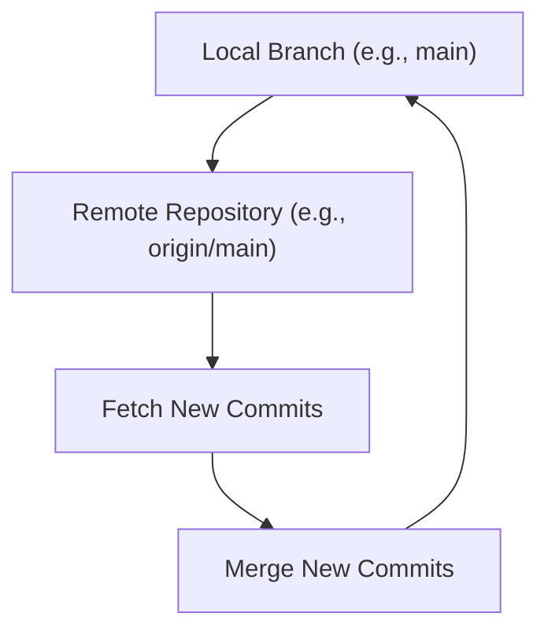

## git push, git pull
### Core Concepts

*   **`git push`**: Uploads local commits from your current branch to a remote repository.
*   **`git pull`**: Fetches commits from a remote repository and merges them into your current local branch. It's a combination of `git fetch` and `git merge`.

### Key Details & Nuances

*   **`git push`**:
    *   **Default Behavior**: Pushes the current branch to its upstream counterpart.
    *   **`--set-upstream` (or `-u`)**: Sets up tracking information for the branch. Future `git push` and `git pull` on this branch will use this upstream.
    *   **Pushing Specific Branches**: `git push <remote_name> <branch_name>` (e.g., `git push origin main`).
    *   **Force Pushing (`--force`, `--force-with-lease`)**:
        *   `--force`: Overwrites the remote branch with your local branch, discarding any commits on the remote that aren't in your local history. **Dangerous!**
        *   `--force-with-lease`: Safer. Only forces the push if the remote branch hasn't been updated since your last fetch. Prevents overwriting someone else's work.
    *   **Pushing Tags**: `git push --tags` to push all local tags.
*   **`git pull`**:
    *   **Under the Hood**: Equivalent to `git fetch <remote_name> <branch_name>` followed by `git merge <remote_name>/<branch_name>`.
    *   **`--rebase`**: Fetches commits and then rebases your current branch onto the fetched branch, rather than merging. This creates a cleaner, linear history.
    *   **Conflicting Changes**: If local and remote branches have diverged, a merge conflict may occur, requiring manual resolution.
    *   **Remote Tracking**: `git pull` automatically uses the configured upstream branch.

### Practical Examples

**Pushing a new branch with upstream tracking:**

```sh
# Make some commits locally
git add .
git commit -m "feat: Add new feature"

# Push the current branch (e.g., 'feature/new-widget') to 'origin'
# and set up upstream tracking for future pulls/pushes
git push --set-upstream origin feature/new-widget
```

**Pulling changes from the upstream branch:**

```sh
# Ensure you are on the branch you want to update (e.g., 'main')
git checkout main

# Pull the latest changes from the remote's 'main' branch
git pull origin main
# Or if upstream is set:
git pull
```

**Using `--force-with-lease`:**

```sh
# Example: You rebased a branch locally and need to update the remote
git rebase -i HEAD~3 # Reordered/edited commits
git push --force-with-lease origin feature/my-rebased-branch
```

**Visualizing `git pull` (fetch + merge):**



### Common Pitfalls & Trade-offs

*   **Pitfall: Forgetting to `git pull`**: Leads to merge conflicts or pushing outdated code.
*   **Pitfall: Using `--force` without understanding**: Can overwrite remote history, causing issues for collaborators. Always prefer `--force-with-lease`.
*   **Trade-off: `git merge` vs. `git rebase`**:
    *   **Merge**: Preserves history exactly as it happened, creating merge commits. Can lead to a cluttered, non-linear history. Safer for shared branches.
    *   **Rebase**: Creates a clean, linear history by reapplying commits on top of the latest remote changes. **Rewrites history**, so use with caution on branches others are working on. `git pull --rebase` is often preferred for personal feature branches.

### Interview Questions

1.  **What is the difference between `git fetch` and `git pull`?**
    *   **Answer:** `git fetch` downloads commits, files, and refs from a remote repository into your local repo. It updates your remote-tracking branches (e.g., `origin/main`) but does *not* merge them into your working branches. `git pull` is `git fetch` followed by `git merge` (or `git rebase` if configured). `git pull` integrates the remote changes into your current local branch.

2.  **When would you use `git push --force-with-lease` and why is it preferred over `git push --force`?**
    *   **Answer:** You'd use `git push --force-with-lease` when you've rewritten your local branch's history (e.g., via `rebase` or `amend`) and need to update the remote branch to match your local one. It's preferred over `git push --force` because it's safer. `--force-with-lease` checks if the remote branch has changed since your last fetch. If it has, the push is aborted, preventing you from accidentally overwriting someone else's work. `--force` blindly overwrites, regardless of remote changes.

3.  **Describe a scenario where you'd encounter a merge conflict after a `git pull` and how you would resolve it.**
    *   **Answer:** A merge conflict occurs when `git pull` (which performs a `git merge`) tries to integrate changes from the remote branch into your local branch, but both branches have modified the same lines in the same file(s) differently. To resolve:
        1.  Identify the conflicting files (Git will list them).
        2.  Open each conflicting file. You'll see conflict markers (`<<<<<<<`, `=======`, `>>>>>>>`).
        3.  Manually edit the file to keep the desired changes, removing the markers.
        4.  Stage the resolved file: `git add <conflicted_file>`.
        5.  Commit the merge: `git commit` (Git often pre-populates a commit message). If you used `git pull --rebase`, you'd use `git rebase --continue` after resolving and staging.