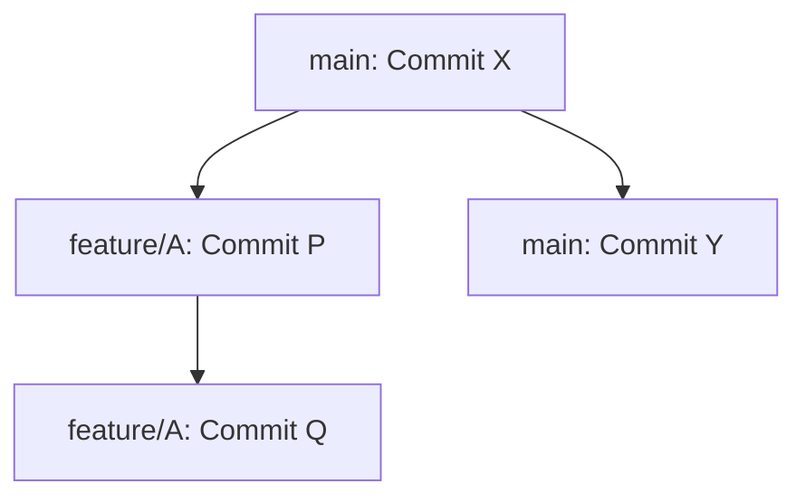
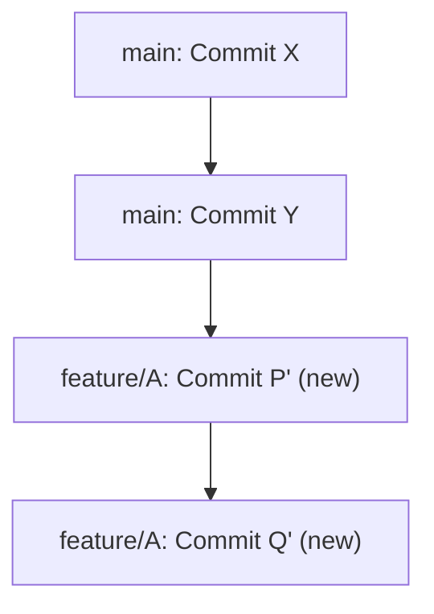

## git rebase (and when not to use it)
### Core Concepts

*   **`git rebase`:** Rewrites commit history by reapplying commits from one branch onto another.
*   **Purpose:** To maintain a linear, clean commit history, often used to integrate changes from a main branch into a feature branch or to clean up local commits before sharing.
*   **Contrast with `git merge`:**
    *   `merge`: Creates a merge commit, preserving history, but can lead to a "noisy" graph with many merge commits.
    *   `rebase`: Moves the base of a branch to a new commit, creating a cleaner, linear history, but rewrites commits.

### Key Details & Nuances

*   **How it works:**
    *   Finds the common ancestor of the two branches.
    *   Temporarily saves commits from the current branch that are not on the target branch.
    *   Resets the current branch to the tip of the target branch.
    *   Reapplies the saved commits one by one onto the new base.
*   **Interactive Rebase (`git rebase -i`):**
    *   Powerful tool for manipulating commits *before* they are reapplied.
    *   **Commands:** `pick`, `reword`, `edit`, `squash`, `fixup`, `drop`, `reorder`.
    *   **Use cases:**
        *   **Squashing:** Combining multiple small commits into a single, meaningful one.
        *   **Rewording:** Changing commit messages.
        *   **Editing:** Modifying the content of a commit.
        *   **Reordering:** Changing the sequence of commits.
        *   **Dropping:** Removing commits.
*   **`git rebase --onto`:** Advanced usage to move a specific set of commits onto a new base.
*   **"What is a commit?" (Rebase context):** Rebasing creates *new* commits with the same changes and commit messages, but different SHA-1 hashes. This is why it's history rewriting.

### Practical Examples

**Scenario:** Feature branch `feature/A` branched off `main` at commit `X`. `main` has since advanced to commit `Y`.



Now, rebase `feature/A` onto `main`:

```sh
git checkout feature/A
git rebase main
```

**Resulting History:**



**Interactive Rebase Example:** Squashing two commits into one.

Assume `feature/A` has `Commit R` and `Commit S` on top of `main`.

```sh
git checkout feature/A
git rebase -i HEAD~2 # Rebase the last 2 commits
```

In the interactive editor:

```
pick <hash_R> Commit message R
squash <hash_S> Commit message S
```

This will combine `S` into `R`, prompting for a new combined commit message.

### Common Pitfalls & Trade-offs

*   **The Golden Rule of Rebasing:** **NEVER rebase commits that have already been pushed to a shared remote repository.**
    *   **Reason:** It rewrites history, causing divergence for collaborators who have based their work on the original commits. This leads to complex merge conflicts and confusion.
    *   **Instead:** Use `git merge` for integrating shared history.
*   **Merge Conflicts:** Rebasing can introduce more frequent, granular conflicts if changes overlap significantly. Resolving these requires careful attention as each commit is reapplied.
*   **Loss of Context:** While rebasing cleans history, it can obscure when a feature branch was actually created relative to the main branch at that time. Merging preserves this temporal context.
*   **Interactive Rebase Errors:** Incorrectly using interactive rebase (e.g., mistyping commands, mishandling conflicts during `edit`) can lead to a messy or broken branch.

### Interview Questions

1.  **When would you choose `git rebase` over `git merge`, and vice-versa?**
    *   **Answer:** Use `rebase` for **local cleanup** before pushing (squashing, rewording, reordering) or to **update a feature branch with upstream changes** (e.g., `main` into your branch) to maintain a linear history. Use `merge` to **integrate completed features back into a main branch** (like `main` or `develop`) to preserve the context of the integration and avoid rewriting shared history.

2.  **What are the risks of using `git rebase`?**
    *   **Answer:** The primary risk is rewriting **public** history, which can cause significant problems for collaborators. It can also lead to more complex conflict resolution if changes overlap frequently. Mishandling interactive rebase can corrupt the branch.

3.  **Explain `git rebase -i` and give an example of its utility.**
    *   **Answer:** `git rebase -i` (interactive rebase) allows you to rewrite a series of commits. You can reorder, squash (combine multiple commits into one), reword commit messages, edit commit content, or drop commits. For example, if you made several small, incremental commits while developing a feature (e.g., "WIP", "fix typo", "add test"), you can use `git rebase -i` to squash them into a single, coherent commit with a descriptive message before merging.

4.  **How does `git rebase` handle merge conflicts?**
    *   **Answer:** When a rebase encounters a conflict, it pauses. Git informs you which commit caused the conflict and where. You must resolve the conflicts in the affected files, stage the changes (`git add`), and then continue the rebase with `git rebase --continue`. If you want to abandon the rebase, you can use `git rebase --abort`. It's important to note that conflicts are resolved commit-by-commit as they are reapplied.