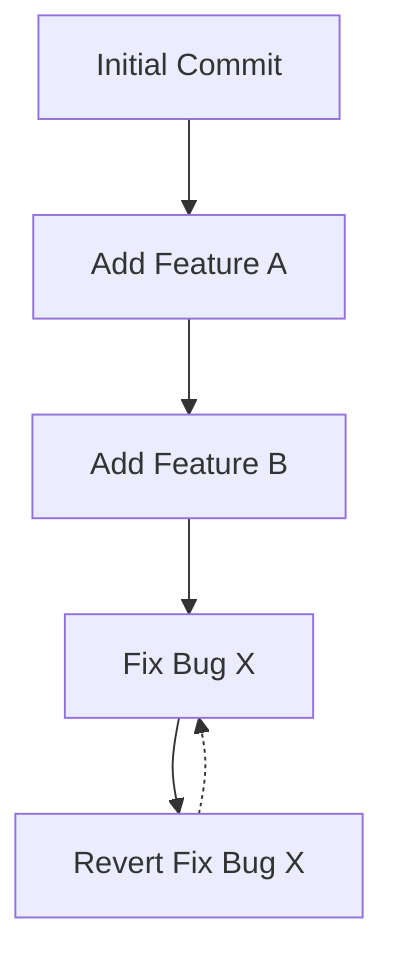

## git revert
### Core Concepts

*   **`git revert`**: Creates a **new commit** that undoes the changes introduced by one or more previous commits. It **does not rewrite history**.
*   **Reversible Operation**: The primary purpose is to safely back out specific changes without altering the existing commit history, preserving collaboration.
*   **Inverse Commit**: Generates a commit whose diff is the inverse of the target commit's diff.

### Key Details & Nuances

*   **Non-Destructive**: Unlike `git reset`, `git revert` does not remove commits from history. It adds new commits.
*   **Safety for Shared History**: Ideal for undoing changes on branches that have already been pushed and shared with others.
*   **Reverting Merges**:
    *   Reverting a merge commit requires specifying the parent to revert *from*.
    *   `git revert -m <parent-number> <merge-commit-hash>`
    *   The parent number is typically `1` for the first parent (the branch being merged into) and `2` for the second parent (the branch that was merged).
*   **Reverting Multiple Commits**:
    *   Can revert a range of commits: `git revert <commit-A>^..<commit-B>` (reverts B and all commits after it up to A, inclusive).
    *   Can revert multiple individual commits: `git revert <commit-1> <commit-2>` (reverts them in the order provided).
*   **Commit Message**: By default, `git revert` creates a commit message indicating which commit is being reverted. This can be edited or overridden.
*   **Conflicts**: If the changes being reverted conflict with subsequent changes, `git revert` will pause, requiring manual conflict resolution.

### Practical Examples

**Reverting a Single Commit:**

```sh
# Assume commit 'abcdef1' introduced unwanted changes
git revert abcdef1
```

This will open your editor to craft a commit message for the new revert commit.

**Reverting a Merge Commit (Reverting changes from branch `feature-x` into `main`):**

```sh
# Assuming `merge-commit-hash` is the hash of the merge commit
# We want to revert the changes introduced by `feature-x` (the second parent)
git revert -m 2 merge-commit-hash
```

**Visualizing Revert:**



### Common Pitfalls & Trade-offs

*   **Confusion with `git reset`**: `git revert` is **not** `git reset`. `reset` rewrites history by moving HEAD and optionally removing commits. `revert` adds new commits. Using `reset` on shared history is dangerous.
*   **Reverting a Revert**: If you revert a commit that was itself a revert, you are effectively reintroducing the original changes.
*   **Accidental Reintroduction of Bugs**: If a revert commit itself contains bugs or conflicts, it can be tricky to manage.
*   **Complexity with Many Reverts**: A long history of reverts can make understanding the true state of the code more challenging.

### Interview Questions

1.  **When would you use `git revert` versus `git reset`?**
    *   **Answer:** `git revert` is used to undo changes by creating a new commit that reverses the changes of a previous commit. It's safe for shared history because it doesn't rewrite existing commits. `git reset` rewrites history by moving the branch pointer and potentially discarding commits. Use `reset` for local cleanup or on unpushed commits, but **never** on commits that others have already based their work on.

2.  **How do you revert a merge commit, and what does the `-m` flag do?**
    *   **Answer:** You revert a merge commit using `git revert -m <parent-number> <merge-commit-hash>`. The `-m` flag specifies which parent's changes to undo. Parent `1` is typically the branch that the other branch was merged into (e.g., `main`), and parent `2` is the branch that was merged (e.g., `feature`). If you want to undo the changes brought in by the feature branch, you'd typically use `-m 2`.

3.  **What happens if a `git revert` operation encounters a conflict?**
    *   **Answer:** If the changes introduced by the revert (the inverse of the target commit) conflict with subsequent changes in the branch, Git will pause the revert operation. It will mark the conflicting files and require you to manually resolve the conflicts. After resolving, you stage the changes (`git add <resolved-files>`) and continue the revert process (`git revert --continue`). You can also abort the revert (`git revert --abort`).