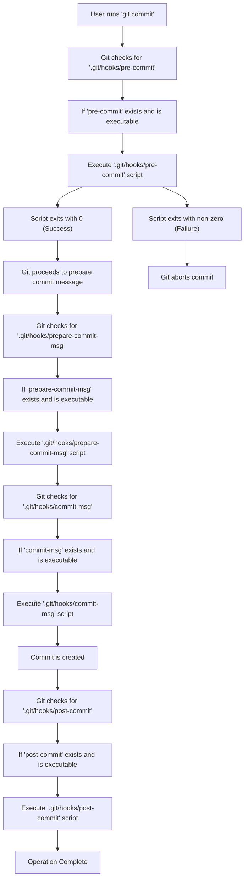

## Git Hooks
### Core Concepts

*   **Git Hooks:** Scripts that Git executes automatically before or after specific Git events (e.g., `commit`, `push`, `rebase`).
*   **Purpose:** Automate workflows, enforce coding standards, validate commits, trigger CI/CD pipelines.
*   **Location:** Stored in the `.git/hooks/` directory of a Git repository.
*   **Execution:** Git checks for executable files in `.git/hooks/` with specific names corresponding to Git events.

### Key Details & Nuances

*   **Hook Types:**
    *   **Client-Side Hooks:** Run on the local machine (e.g., `pre-commit`, `prepare-commit-msg`, `commit-msg`, `post-commit`, `pre-push`).
    *   **Server-Side Hooks:** Run on the remote repository server (e.g., `pre-receive`, `update`, `post-receive`).
*   **Executable:** Hooks must be executable files (e.g., shell scripts, Python scripts). Git looks for files with executable permissions.
*   **Exit Status:**
    *   An exit status of `0` indicates success, allowing the Git operation to proceed.
    *   A non-zero exit status indicates failure, aborting the Git operation.
*   **Environment Variables:** Hooks receive environment variables specific to the Git event, providing context (e.g., `GIT_AUTHOR_NAME`, `GIT_EDITOR`, `GIT_PUSH_OPTION_COUNT`).
*   **Client-Side Hooks vs. Server-Side Hooks:**
    *   Client-side hooks are local and not committed to the repository. They are specific to a developer's machine.
    *   Server-side hooks are global to the repository and are executed on the server.
*   **`pre-commit` Hook:**
    *   Runs before Git creates a commit.
    *   Used for linting, code formatting, running tests.
    *   Can prevent commits that don't meet quality standards.
*   **`commit-msg` Hook:**
    *   Runs after the commit message has been written.
    *   Used to validate commit message format (e.g., conventional commits).
*   **`pre-push` Hook:**
    *   Runs before Git pushes commits to a remote repository.
    *   Can be used to run tests or checks before pushing to the central repo.
*   **`prepare-commit-msg` Hook:**
    *   Runs before the `commit-msg` hook, after the default message is created.
    *   Can be used to automatically add information to the commit message.
*   **Bypassing Hooks:**
    *   `git commit --no-verify`: Bypasses `pre-commit` and `commit-msg` hooks.
    *   `git push --no-verify`: Bypasses `pre-push` hooks.
*   **Hook Management:** Tools like `husky` (for Node.js projects) or `pre-commit` framework (Python) simplify managing and sharing Git hooks.

### Practical Examples

**Example: `pre-commit` hook to check for console logs.**

1.  Navigate to your repository's `.git/hooks/` directory.
2.  Create a file named `pre-commit` (if it doesn't exist).
3.  Make it executable: `chmod +x .git/hooks/pre-commit`
4.  Add the following script content:

```bash
#!/bin/sh

# Check for console.log or console.warn in staged JS/TS files
if git diff --cached --name-only --diff-filter=ACM | grep -E '\.(js|ts)$' | xargs grep -E 'console\.log|console\.warn'; then
  echo "ERROR: Found console.log or console.warn statements."
  echo "Please remove them before committing."
  exit 1
fi

exit 0
```

**Mermaid Diagram: Git Hook Execution Flow (Commit)**



### Common Pitfalls & Trade-offs

*   **Hooks are local:** Client-side hooks are not shared with the team unless managed by an external tool. This can lead to inconsistent enforcement.
*   **Performance Impact:** Long-running hooks (e.g., extensive test suites) can significantly slow down Git operations, impacting developer productivity.
*   **Bypassability:** Hooks can be bypassed using `--no-verify`, making them a guardrail, not a foolproof security measure.
*   **Complexity:** Writing and maintaining complex shell scripts can be challenging. Consider using higher-level languages or dedicated hook management tools.
*   **`*.sample` Files:** Git ships with example hooks (e.g., `pre-commit.sample`). You must rename these to their actual hook names (e.g., `pre-commit`) and make them executable.

### Interview Questions

1.  **What is the purpose of Git hooks, and can you give an example of when you would use one?**
    *   **Answer:** Git hooks are scripts that Git executes automatically before or after specific events like committing, pushing, or receiving commits. They automate workflows and enforce policies. An example is using a `pre-commit` hook to lint code or check for trailing whitespace before allowing a commit, ensuring code quality.

2.  **Explain the difference between client-side and server-side Git hooks.**
    *   **Answer:** Client-side hooks run on the developer's local machine when they perform actions like committing or pushing. Examples include `pre-commit` and `pre-push`. Server-side hooks run on the Git server, typically triggered by a `push` operation, and are used for tasks like validating incoming changes or deploying code. Examples include `pre-receive` and `post-receive`.

3.  **How can you prevent a Git hook from running?**
    *   **Answer:** For `pre-commit` and `commit-msg` hooks, you can use the `git commit --no-verify` command. For `pre-push` hooks, you can use `git push --no-verify`. This bypasses the verification steps performed by these hooks.

4.  **What are the potential drawbacks of relying heavily on Git hooks for code quality?**
    *   **Answer:** Hooks can be bypassed (`--no-verify`), making them unreliable as the sole enforcement mechanism. They are also local to a developer's machine unless managed externally, leading to inconsistency. Furthermore, complex or slow hooks can significantly degrade Git performance and developer experience.