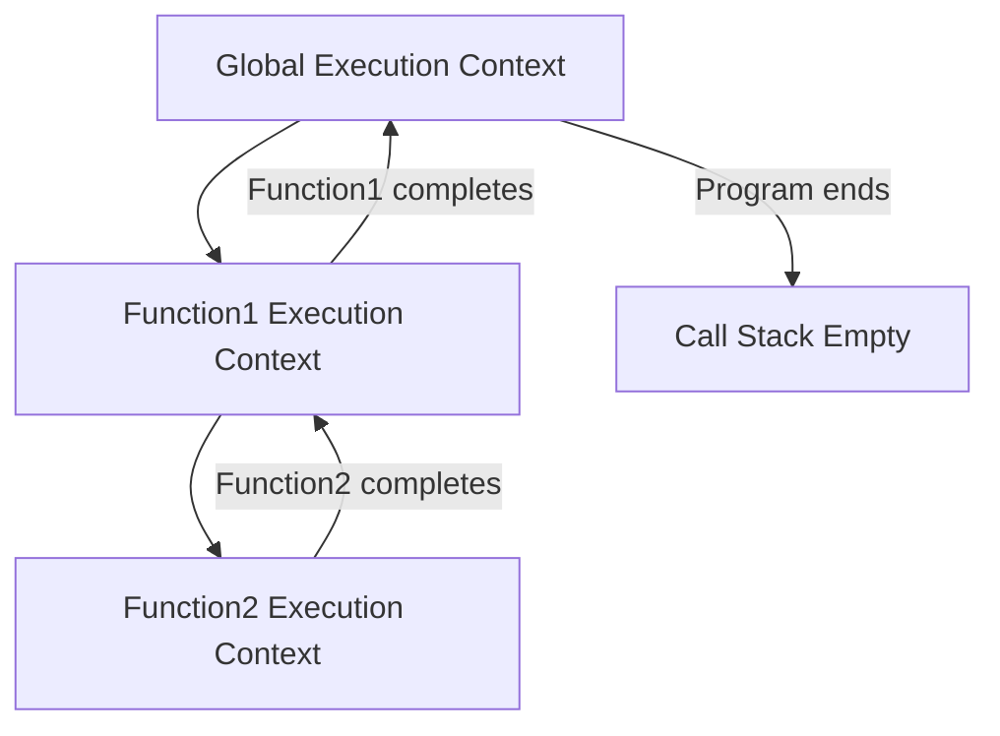

## Execution Context & Hoisting

### Core Concepts

- **Execution Context (EC):** An abstract concept representing the environment in which the current JavaScript code is being evaluated.
  - Every time JavaScript code runs, it does so within an EC.
  - It encompasses:
    - **LexicalEnvironment:** Stores variable, function, and parameter identifiers and their bindings. Used for variable resolution and defines the scope of variables declared with `let`, `const`, and `function` declarations.
    - **VariableEnvironment:** A specific environment record within the LexicalEnvironment, primarily used for `var` bindings.
    - **`this` binding:** The value of the `this` keyword for the current execution context.
- **Execution Context Stack (Call Stack):** A LIFO (Last-In, First-Out) stack that manages all execution contexts created during code execution.
  - The **Global Execution Context** is always at the bottom of the stack.
  - A new **Function Execution Context** is created and pushed onto the stack whenever a function is called.
  - When a function finishes, its EC is popped off the stack.
- **Hoisting:** JavaScript's default behavior of moving declarations to the top of the current scope during the compilation phase, before code execution begins.
  - **Variables declared with `var`** are initialized with `undefined` during the creation phase of their execution context.
  - **Function declarations** are hoisted with their entire definition, making them accessible before their actual declaration in code.
  - **`let` and `const`** declarations are also "hoisted" but are not initialized. They remain in a **Temporal Dead Zone (TDZ)** until their declaration line is executed. Accessing them before initialization results in a `ReferenceError`.

### Key Details & Nuances

- **Execution Context Phases:**
  1.  **Creation Phase:**
      - A new LexicalEnvironment is created.
      - **Hoisting occurs:**
        - Function declarations are fully placed into memory.
        - `var` variables are placed into memory and initialized to `undefined`.
        - `let`/`const` variables are placed into memory but remain uninitialized (in TDZ).
      - `this` binding is determined based on how the function was called.
  2.  **Execution Phase:**
      - Code is executed line by line.
      - Variables are assigned their actual values.
      - Function calls trigger creation of new ECs, pushing them onto the call stack.
- **Function Declaration vs. Function Expression Hoisting:**
  - **Function Declarations:** (e.g., `function foo() {}`) are fully hoisted, making them callable anywhere in their scope.
  - **Function Expressions:** (e.g., `const foo = function() {};` or `const foo = () => {};`) are treated like variable declarations. Only the variable name (`foo`) is hoisted (and initially `undefined` for `var`, or in TDZ for `let`/`const`). The function body is not associated until the assignment during the execution phase.
- **Scope Chain:** During variable resolution, if a variable is not found in the current LexicalEnvironment, JavaScript looks up the chain of outer (parent) LexicalEnvironments until it finds the variable or reaches the global scope. This chain is established during the creation of an EC, enabling closures.

### Practical Examples

```typescript
// --- Hoisting Examples ---

// 1. `var` hoisting: `varVariable` is hoisted and initialized to undefined
console.log(varVariable); // Output: undefined
var varVariable = 'I am var';
console.log(varVariable); // Output: I am var

// 2. `let`/`const` and Temporal Dead Zone (TDZ)
// console.log(letVariable); // ReferenceError: Cannot access 'letVariable' before initialization
let letVariable = 'I am let';

// 3. Function Declaration Hoisting: `declareFunction` is fully hoisted
declareFunction(); // Output: Hello from declared function!
function declareFunction() {
  console.log('Hello from declared function!');
}

// 4. Function Expression Hoisting: `expressionFunction` behaves like a `const` variable
// expressionFunction(); // ReferenceError: Cannot access 'expressionFunction' before initialization (if using let/const)
// Or TypeError: expressionFunction is not a function (if using var and called before assignment)
const expressionFunction = function () {
  console.log('Hello from expression function!');
};
expressionFunction(); // Output: Hello from expression function!
```



### Common Pitfalls & Trade-offs

- **Unexpected `undefined` with `var`:** Accessing `var` variables before their assignment line often leads to `undefined`, which can introduce subtle bugs that are hard to trace.
- **Confusing `var` with `let`/`const` hoisting:** A common misconception is that `let`/`const` behave identically to `var` regarding hoisting. This leads to `ReferenceError` when accessing `let`/`const` declarations within their TDZ.
- **Over-reliance on Hoisting:** While a language feature, explicitly declaring variables and functions before their first use generally leads to more readable, predictable, and maintainable code. `let`/`const` inherently encourage this by preventing access before declaration.

### Interview Questions

1.  **Explain the concept of an Execution Context in JavaScript. What are its main components and phases?**
    - **Answer:** An EC is the environment where JS code is evaluated. It consists of a LexicalEnvironment (for variables, functions), a VariableEnvironment (for `var` bindings), and a `this` binding. It has two phases: **Creation Phase** (where LexicalEnvironment is set up, `var` variables are initialized to `undefined`, functions are fully hoisted, `let`/`const` are in TDZ, and `this` is bound) and **Execution Phase** (where code runs line-by-line, and variable values are assigned).
2.  **What is Hoisting in JavaScript? Explain how it applies differently to `var`, `let`, `const`, and function declarations.**
    - **Answer:** Hoisting is the process where JS moves declarations to the top of their scope during the compilation phase.
      - `var` variables are hoisted and initialized to `undefined`.
      - `let` and `const` variables are hoisted but _not_ initialized; they enter a **Temporal Dead Zone (TDZ)** until their declaration, resulting in a `ReferenceError` if accessed before.
      - Function declarations are fully hoisted, meaning both their name and body are available before the declaration line.
      - Function expressions are treated like variable declarations (either `var`, `let`, or `const`), so only the variable name is hoisted, not the function body.
3.  **Describe the Temporal Dead Zone (TDZ). Why was it introduced for `let` and `const`?**
    - **Answer:** The TDZ is the period between the beginning of a `let`/`const` variable's scope and the actual line where it is declared. During this time, the variable exists but cannot be accessed; otherwise, a `ReferenceError` is thrown. It was introduced to catch common programming errors (like accessing variables before they are defined) that `var`'s hoisting behavior obscured, promoting better coding practices and reducing variable misuse by enforcing stricter rules around variable initialization.
4.  **How does the scope chain relate to Execution Contexts and variable resolution?**
    - **Answer:** Each Execution Context has a LexicalEnvironment that holds its local variables and functions. This LexicalEnvironment also contains a reference to its outer (parent) LexicalEnvironment. This chain of references forms the "scope chain." When JavaScript tries to resolve a variable, it first looks in the current EC's LexicalEnvironment. If not found, it moves up the scope chain to the outer LexicalEnvironment, and so on, until the variable is found or the global scope is reached. This mechanism determines variable accessibility and enables closure behavior.
