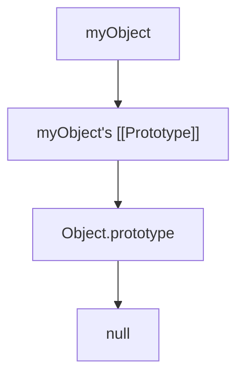

## Prototypal Inheritance

### Core Concepts

- **Definition:** Prototypal inheritance is JavaScript's core inheritance mechanism, where objects inherit properties and methods directly from other objects (their _prototypes_). There are no "classes" in the traditional sense; instead, objects link to other objects.
- **`[[Prototype]]` (Internal Slot):** Every JavaScript object has an internal `[[Prototype]]` slot, which is a reference to another object. This referenced object is the prototype of the current object. When a property or method is accessed on an object, if it's not found directly on the object itself, JavaScript looks up the `[[Prototype]]` chain.
- **`__proto__` (Accessor Property):** A non-standard (but widely implemented) accessor property on `Object.prototype` that exposes the internal `[[Prototype]]` of an object. While technically deprecated, it's often used in discussions to refer to the prototype link.
- **`Object.prototype`:** The base of almost all JavaScript objects. It's the ultimate object in the prototype chain for most built-in objects and user-defined objects. Its `[[Prototype]]` is `null`.

### Key Details & Nuances

- **Prototype Chain:** When attempting to access a property or method on an object:
  1.  JavaScript first checks if the property exists directly on the object itself.
  2.  If not found, it looks at the object's `[[Prototype]]`.
  3.  This process continues up the chain, recursively checking each object's `[[Prototype]]` until the property is found or the end of the chain (a `null` prototype) is reached.
  4.  If the property is not found anywhere in the chain, `undefined` is returned.
- **Setting the Prototype:**
  - **`Object.create(protoObject)`:** The most direct way to create a new object with a specified prototype. `protoObject` will be the new object's `[[Prototype]]`.
  - **Constructor Functions (`new` keyword):** When a function is called with `new`, a new object is created, and its `[[Prototype]]` is set to the `prototype` property of the constructor function.
  - **ES6 `class` syntax:** Syntactic sugar over prototypal inheritance. `class Child extends Parent {}` internally manages the prototype chain using `Object.setPrototypeOf()` and `Object.create()`.
- **`prototype` vs. `__proto__`:**
  - `prototype` is a property on **constructor functions** that points to the object whose properties will be inherited by instances created with `new`.
  - `__proto__` is an accessor property (often on `Object.prototype`) that exposes an object's internal `[[Prototype]]` link. It's how an _instance_ refers to its prototype.
- **`hasOwnProperty(propName)`:** A method on `Object.prototype` that returns `true` if the object has the specified property as its _own_ property (i.e., not inherited from its prototype chain), and `false` otherwise. Crucial for safe iteration (e.g., with `for...in`).
- **`instanceof` Operator:** Checks if the `prototype` property of a constructor function appears anywhere in the prototype chain of an object. `object instanceof Constructor` returns `true` if `Constructor.prototype` is present in `object`'s prototype chain.

### Practical Examples

```typescript
// Example 1: Basic Prototypal Inheritance with Object.create()
const animal = {
  speaks: true,
  eat() {
    console.log('Nom nom nom!');
  },
  introduce() {
    console.log(`I am a ${this.type} and I speak: ${this.speaks}`);
  },
};

const dog = Object.create(animal); // dog's [[Prototype]] is 'animal'
dog.type = 'dog';
dog.bark = function () {
  console.log('Woof!');
};

console.log(dog.speaks); // true (inherited from animal)
dog.eat(); // Nom nom nom! (inherited from animal)
dog.bark(); // Woof! (own property)
dog.introduce(); // I am a dog and I speak: true (uses 'this' context of 'dog')

console.log(dog.hasOwnProperty('type')); // true
console.log(dog.hasOwnProperty('speaks')); // false (inherited)
console.log(dog.__proto__ === animal); // true (direct link)
console.log(Object.getPrototypeOf(dog) === animal); // true (standard way to get prototype)

// Example 2: Constructor Functions (pre-ES6 class syntax)
function Person(name: string) {
  this.name = name;
}

Person.prototype.greet = function () {
  console.log(`Hello, my name is ${this.name}`);
};

const john = new Person('John'); // john's [[Prototype]] is Person.prototype
john.greet(); // Hello, my name is John

console.log(john.hasOwnProperty('name')); // true
console.log(john.hasOwnProperty('greet')); // false (inherited)
console.log(john.__proto__ === Person.prototype); // true
console.log(john instanceof Person); // true
```

#### Prototype Chain Lookup Diagram



**Explanation:** When you try to access a property `x` on `myObject`, JavaScript first checks `A`. If `x` isn't there, it looks at `B`. If `x` isn't there, it looks at `C`. If `x` isn't there, and `D` (`null`) is reached, `undefined` is returned.

### Common Pitfalls & Trade-offs

- **Modifying `Object.prototype`:** Never extend `Object.prototype` (or prototypes of built-in objects) directly, as it can lead to conflicts and unexpected behavior in libraries or other code.
- **Confusing `prototype` and `__proto__`:** This is a common source of confusion. Remember `prototype` is a property of the _constructor function_, defining what instances _will inherit_. `__proto__` is the actual _link_ from an _instance_ to its prototype.
- **Reference vs. Value Inheritance:** Primitive values (strings, numbers, booleans) on a prototype are copied by value if modified on an instance. Objects/arrays on a prototype are shared by reference, meaning modifying them on one instance affects all others inheriting the same reference. This can lead to unexpected side effects.
- **Performance:** While usually negligible, extremely long prototype chains can theoretically lead to slightly slower property lookup times. Keep chains reasonably shallow.
- **The "Class" Illusion:** Understanding that `class` syntax is merely syntactic sugar for prototypal inheritance is crucial for debugging and truly understanding JavaScript's object model.

### Interview Questions

1.  **What is prototypal inheritance in JavaScript, and how does it differ from classical inheritance found in languages like Java or C++?**

    - **Answer:** Prototypal inheritance is an object-to-object inheritance model where objects directly inherit properties and methods from other objects (their prototypes). In contrast, classical inheritance is class-based, where classes serve as blueprints for objects, and objects are instances of classes. The key difference is that JavaScript's inheritance is based on delegation through a prototype chain, rather than on a static class hierarchy.

2.  **Explain the prototype chain. How does JavaScript resolve property lookups when a property is accessed on an object?**

    - **Answer:** The prototype chain is a series of links where each object has a reference to its prototype (`[[Prototype]]`). When a property is accessed on an object, JavaScript first checks if the property exists on the object itself. If not, it traverses up the prototype chain, checking each object's prototype in sequence, until the property is found or the end of the chain (`null`) is reached.

3.  **When would you prefer using `Object.create()` over a constructor function with the `new` keyword for creating objects with inheritance, and what are the advantages of `Object.create()`?**

    - **Answer:** `Object.create()` is preferred when you want to directly specify the prototype of a new object without invoking a constructor function. It's cleaner for simple, direct prototypal delegation where you might not need a "class-like" structure or explicit initialization logic. Advantages include: 1) More direct and explicit control over the prototype linkage. 2) Avoids the need for `this` binding in the constructor. 3) Can create objects with `null` prototypes, useful for plain data objects without inherited `Object.prototype` methods.

4.  **What is the significance of the `hasOwnProperty` method when dealing with prototypal inheritance? Provide a scenario where it's particularly important.**

    - **Answer:** `hasOwnProperty()` is crucial because it differentiates between an object's own properties and those inherited from its prototype chain. It returns `true` only if the property is directly defined on the object itself. It's particularly important when iterating over an object's properties (e.g., using a `for...in` loop) to avoid processing inherited properties, which can lead to unexpected behavior or bugs, especially if `Object.prototype` has been polluted.

5.  **How do `__proto__` and `prototype` relate to each other in the context of JavaScript objects and functions?**
    - **Answer:** `prototype` is a property found on **constructor functions**. It points to the object that will serve as the `[[Prototype]]` for instances created by that constructor function using the `new` keyword. `__proto__` (the non-standard accessor for `[[Prototype]]`) is the actual link from an **object instance** to its prototype. Therefore, `instance.__proto__` will typically point to `Constructor.prototype`. In essence, `Constructor.prototype` defines what instances will inherit, and `instance.__proto__` is the link that facilitates that inheritance.
