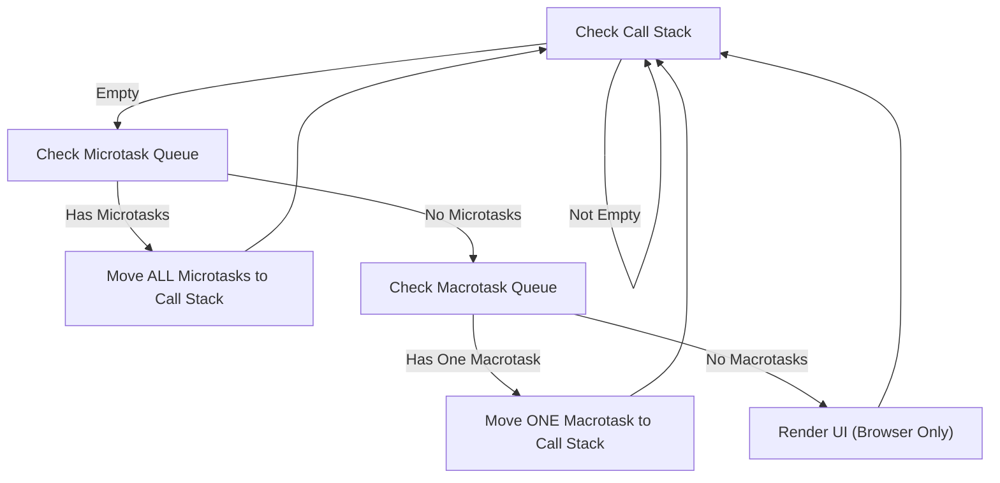

## The Event Loop

### Core Concepts

- **Single-threaded but Non-blocking:** JavaScript execution is single-threaded, meaning only one operation can run at a time. The Event Loop enables non-blocking I/O operations (like network requests, file operations, timers) by offloading them to the environment (browser's Web APIs, Node.js's C++ APIs).
- **Concurrency Model:** It's JavaScript's mechanism for handling asynchronous operations, coordinating between the Call Stack (for synchronous code), Web APIs, and different task queues.
- **Key Components:**
  - **Call Stack:** LIFO (Last-In, First-Out) stack where synchronous code execution contexts are pushed and popped.
  - **Web APIs / Node.js APIs:** Environment-provided functionalities (e.g., `setTimeout`, `fetch`, DOM events, file I/O) that run asynchronously outside the JS engine. They push callbacks to queues upon completion.
  - **Microtask Queue:** A high-priority queue for callbacks like `Promise.then()/catch()/finally()`, `queueMicrotask`, and `process.nextTick` (Node.js).
  - **Macrotask (Callback/Task) Queue:** A lower-priority queue for callbacks like `setTimeout`, `setInterval`, I/O operations, UI rendering, and `setImmediate` (Node.js).

### Key Details & Nuances

- **Event Loop Cycle:** The Event Loop continuously checks if the Call Stack is empty.
  1.  **Call Stack Empty Check:** If the Call Stack is not empty, the Event Loop waits.
  2.  **Microtask Processing:** If the Call Stack is empty, the Event Loop processes _all_ available tasks in the Microtask Queue.
  3.  **Macrotask Processing:** After the Microtask Queue is entirely empty, the Event Loop takes _one_ task from the Macrotask Queue and pushes it to the Call Stack.
  4.  **UI Rendering (Browser):** After one macrotask is processed (and if applicable), the browser may perform UI rendering and other internal work before the next macrotask.
  5.  **Loop Repetition:** The cycle then repeats, checking the Call Stack again.
- **Priority:** `Call Stack > process.nextTick (Node.js) > Microtask Queue > Macrotask Queue > UI Rendering`.
- **`setTimeout(fn, 0)`:** Despite a 0ms delay, the callback is placed in the Macrotask Queue and will only execute after the current Call Stack is empty and all pending microtasks are processed.
- **Node.js Specifics:** `process.nextTick()` callbacks are executed before _any_ pending microtasks or macrotasks within the current phase of the Event Loop. `setImmediate()` callbacks are handled in a separate "check" phase _after_ I/O and `setTimeout`/`setInterval` phases.

### Practical Examples

**Code Example - Execution Order:**

```typescript
console.log('1: Sync Start');

setTimeout(() => {
  console.log('5: Macrotask (setTimeout)');
}, 0);

Promise.resolve().then(() => {
  console.log('3: Microtask (Promise 1)');
  Promise.resolve().then(() => {
    console.log('4: Microtask (Promise 2 - nested)');
  });
});

console.log('2: Sync End');

// Expected Output:
// 1: Sync Start
// 2: Sync End
// 3: Microtask (Promise 1)
// 4: Microtask (Promise 2 - nested)
// 5: Macrotask (setTimeout)
```

**Mermaid Diagram - Event Loop Flow:**



### Common Pitfalls & Trade-offs

- **Blocking the Event Loop:** Performing long-running synchronous computations (e.g., complex loops, CPU-bound operations) directly on the Call Stack will freeze the application, preventing any asynchronous callbacks from running or UI updates (in browsers). This leads to unresponsiveness.
- **Misunderstanding "Async":** Asynchronous does not mean "parallel." It means "non-blocking" or "delayed execution."
- **Microtask Starvation:** A continuous stream of new microtasks being generated within existing microtasks can starve the Macrotask Queue, indefinitely delaying UI rendering or other I/O operations.
  - Example: A recursive `Promise.resolve().then(() => { /* ... */ Promise.resolve().then(() => { /* ... */ }) })` pattern.

### Interview Questions

1.  **Explain the JavaScript Event Loop and its core components.**

    - **Answer:** The Event Loop is JS's concurrency model, enabling non-blocking I/O despite its single-threaded nature. It continuously monitors the Call Stack, Microtask Queue, and Macrotask Queue. When the Call Stack is empty, it processes _all_ microtasks, then takes _one_ macrotask, and repeats. Key components are the Call Stack, Web APIs, Microtask Queue, and Macrotask Queue.

2.  **Differentiate between macrotasks and microtasks. Provide examples of each and explain their priority in the Event Loop.**

    - **Answer:** Microtasks have higher priority. The Event Loop processes _all_ available microtasks (e.g., `Promise.then`, `queueMicrotask`, `process.nextTick`) whenever the Call Stack is empty, before moving to _any_ macrotasks. Macrotasks (e.g., `setTimeout`, `setInterval`, I/O, UI rendering) are processed one at a time per Event Loop tick, only after all microtasks are cleared.

3.  **What happens if a long-running synchronous task is executed in JavaScript?**

    - **Answer:** It blocks the Event Loop. Since JavaScript is single-threaded, a synchronous task occupying the Call Stack prevents the Event Loop from processing any queued asynchronous callbacks (microtasks or macrotasks) and also blocks UI rendering in browsers. This leads to an unresponsive application, often resulting in a "script not responding" error.

4.  **Consider the following code. What will be the exact order of `console.log` statements?**

    ```javascript
    console.log('A');
    setTimeout(() => console.log('B'), 0);
    Promise.resolve().then(() => console.log('C'));
    console.log('D');
    ```

    - **Answer:** `A`, `D`, `C`, `B`. `A` and `D` run synchronously. `C` is a microtask, so it executes after synchronous code but before any macrotasks. `B` is a macrotask, so it runs last.

5.  **In Node.js, how does `process.nextTick()` relate to the Event Loop scheduling compared to `Promise.resolve().then()` and `setTimeout(fn, 0)`?**
    - **Answer:** `process.nextTick()` callbacks are handled immediately after the current synchronous operation finishes and _before_ the Event Loop advances to any other phase (including the microtask queue or timer/macrotask queue). `Promise.then()` callbacks are part of the microtask queue, which is processed after `nextTick` but still before macrotasks. `setTimeout(fn, 0)` is a macrotask, processed in the timer phase, much later in the Event Loop cycle. `nextTick` effectively "drains" its queue before the Event Loop can even begin its standard phase checks.
