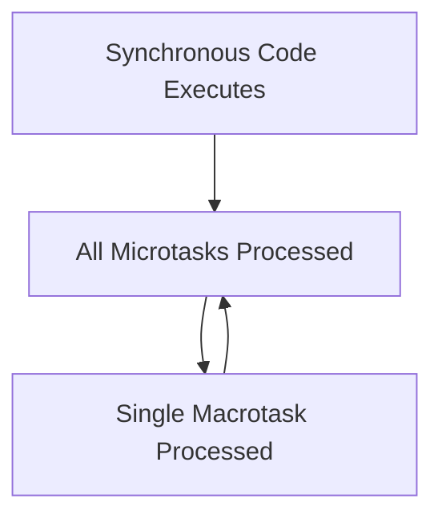

## Callbacks, Promises, and the Microtask Queue

### Core Concepts

- **Asynchronous JavaScript:** Non-blocking execution model. Tasks (e.g., network requests, timers) can be initiated without halting the main thread, allowing other code to run concurrently.
- **Callbacks:** Functions passed as arguments to other functions, executed once the asynchronous operation they depend on completes.
  - **Use Case:** Simplest form of async handling.
  - **Drawback:** Can lead to "Callback Hell" (Pyramid of Doom) for complex sequential async operations, making code hard to read and maintain.
- **Promises:** Objects representing the eventual completion (or failure) of an asynchronous operation and its resulting value.
  - **States:**
    - `pending`: Initial state, neither fulfilled nor rejected.
    - `fulfilled`: Operation completed successfully, resulting in a value.
    - `rejected`: Operation failed, resulting in an error.
  - **Benefits:** Address Callback Hell by enabling cleaner, chainable asynchronous code (`.then()`, `.catch()`, `.finally()`).
- **Event Loop:** Fundamental mechanism in JavaScript's concurrency model. Continuously checks if the Call Stack is empty and if there are tasks (from various queues) to push onto the stack.
- **Microtask Queue (Job Queue):** A queue with higher priority than the Macrotask Queue. Tasks here are executed immediately after the current synchronous code block finishes and before the next Macrotask.
  - **Includes:** Promise callbacks (`.then()`, `.catch()`, `.finally()`), `queueMicrotask`, `MutationObserver` callbacks.

### Key Details & Nuances

- **Promise Immutability:** Once a Promise is settled (fulfilled or rejected), its state and value/reason cannot change.
- **Promise Chaining:** `.then()` methods return new Promises, allowing for sequential asynchronous operations. Errors propagate down the chain until a `.catch()` is encountered.
- **Error Handling in Promises:**
  - `.catch(onRejected)`: Specifically handles rejections (errors).
  - Uncaught Promise rejections lead to unhandled promise rejection warnings/errors, potentially crashing the application in Node.js or logging to console in browsers. Always use `.catch()` or `await/try/catch`.
- **`finally()`:** Executed regardless of whether the Promise was fulfilled or rejected. Useful for cleanup.
- **Microtask vs. Macrotask (Task Queue):**
  - **Execution Order:** Synchronous code runs first, then all tasks in the Microtask Queue are processed. Only _after_ the Microtask Queue is empty does the Event Loop pick one task from the Macrotask Queue. This cycle repeats.
  - **Macrotask Queue (Task Queue):** Less priority than Microtasks. Includes `setTimeout`, `setInterval`, I/O operations (network, file), UI rendering.
- **`async/await`:** Syntactic sugar built on top of Promises. Makes asynchronous code look and behave more like synchronous code, improving readability. An `await` pauses execution until the Promise resolves, then continues.

### Practical Examples

**Event Loop Execution Order (Microtask vs. Macrotask)**

```typescript
console.log('1. Start sync');

setTimeout(() => {
  console.log('4. setTimeout (Macrotask)');
}, 0);

Promise.resolve().then(() => {
  console.log('3. Promise.then (Microtask)');
});

console.log('2. End sync');

// Expected Output:
// 1. Start sync
// 2. End sync
// 3. Promise.then (Microtask)
// 4. setTimeout (Macrotask)
```

**Asynchronous Flow of Execution (Event Loop simplified)**



### Common Pitfalls & Trade-offs

- **Callback Hell:** The primary problem Promises aim to solve. Nested callbacks become unmanageable.
- **Uncaught Rejections:** Forgetting to handle rejections with `.catch()` or `try/catch` in `async/await` can lead to silent failures or unhandled promise rejection warnings.
- **Blocking the Event Loop:** Long-running synchronous computations can freeze the UI or block server responses. Asynchronous operations are crucial for responsiveness.
- **Overuse of `await` in loops:** A common mistake is using `await` inside `forEach` or `map` without understanding that `await` pauses the `async` function, not the `forEach` loop itself. This can lead to inefficient sequential processing when parallel is possible, or unexpected behavior. Use `Promise.all` for parallel execution.

### Interview Questions

1.  **Explain the JavaScript Event Loop, distinguishing between the Call Stack, Microtask Queue, and Macrotask Queue. Describe their interaction and processing order.**

    - **Answer:** The Call Stack is where synchronous code executes. When it's empty, the Event Loop checks the Microtask Queue. All pending microtasks (e.g., Promise callbacks) are executed consecutively. Once the Microtask Queue is empty, the Event Loop takes _one_ task from the Macrotask Queue (e.g., `setTimeout`, I/O, UI rendering) and pushes it to the Call Stack. This cycle repeats, ensuring UI responsiveness and non-blocking I/O.

2.  **When would you prefer using Promises over Callbacks for asynchronous operations? What advantages do Promises offer?**

    - **Answer:** Promises are preferred for managing multiple or sequential asynchronous operations. They solve "Callback Hell" by providing a cleaner, chainable syntax (`.then().catch()`) that improves readability and maintainability. Promises also offer standardized error handling through `.catch()` and `.finally()`, simplifying error propagation compared to nested callbacks.

3.  **Describe the lifecycle of a Promise. How is error handling managed within a Promise chain?**

    - **Answer:** A Promise starts in a `pending` state. It then transitions to either `fulfilled` (on success, with a value) or `rejected` (on failure, with a reason/error). Once settled (fulfilled or rejected), a Promise's state is immutable. Error handling is managed via `.catch()` which intercepts rejections in the chain. An uncaught rejection will propagate down the chain until a `.catch()` is found or result in an unhandled promise rejection.

4.  **What's the difference in execution order between `setTimeout(fn, 0)` and `Promise.resolve().then(fn)`? Provide an example.**

    - **Answer:** `Promise.resolve().then(fn)`'s callback is placed in the Microtask Queue, which has higher priority. `setTimeout(fn, 0)`'s callback is placed in the Macrotask Queue. This means the Promise callback will execute immediately after the current synchronous code finishes, but _before_ any Macrotasks (like `setTimeout` callbacks) are processed.

5.  **What is 'Callback Hell' and how do `Promises` (or `async/await`) address it?**
    - **Answer:** 'Callback Hell' (or Pyramid of Doom) occurs when multiple asynchronous operations depend on each other, leading to deeply nested callback functions. This makes code hard to read, debug, and maintain. Promises address this by allowing chaining of `.then()` calls for sequential operations and centralized error handling with `.catch()`, resulting in flatter, more readable code. `async/await` further improves this by allowing asynchronous code to be written in a synchronous-looking style, completely eliminating nesting.
