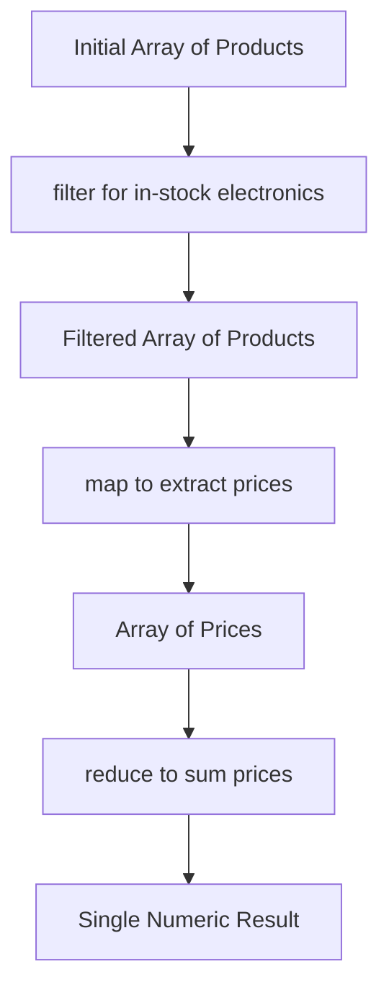

## Array Methods & Higher-Order Functions (map, filter, reduce)
### Core Concepts
*   **Higher-Order Functions (HOFs):** Functions that take one or more functions as arguments, or return a function as their result. In JavaScript, `map`, `filter`, and `reduce` are prime examples.
*   **Immutability:** A core principle promoted by these methods. They do not modify the original array; instead, they return a new array (or a single value for `reduce`) with the results. This enhances predictability and simplifies state management.
*   **Functional Programming:** These methods encourage a functional style by enabling transformations and computations on data without side effects, making code cleaner, more modular, and easier to test.

### Key Details & Nuances
*   **`Array.prototype.map()`:**
    *   **Purpose:** Transforms each element in an array based on a provided callback function.
    *   **Returns:** A *new* array of the *same length* as the original, containing the results of calling the callback on every element.
    *   **Use Cases:** Converting data types, extracting specific properties, rendering lists in UI frameworks.
*   **`Array.prototype.filter()`:**
    *   **Purpose:** Creates a new array containing all elements that pass a test implemented by the provided callback function.
    *   **Returns:** A *new* array containing a *subset* of the original elements (or an empty array), based on the callback returning `true` for an element.
    *   **Use Cases:** Removing unwanted items, selecting items based on criteria, search functionality.
*   **`Array.prototype.reduce()`:**
    *   **Purpose:** Executes a "reducer" callback function on each element of the array, resulting in a single output value.
    *   **Returns:** A single value (number, string, object, array, etc.) which is the accumulated result.
    *   **Parameters:** Takes a callback function and an optional `initialValue` for the accumulator.
    *   **Flexibility:** Can perform complex aggregations, flatten arrays, group data, and even replicate `map` and `filter` functionality.
*   **Chaining:** These methods can be chained together (e.g., `array.filter(...).map(...)`) because `map` and `filter` always return new arrays. This creates readable, declarative data pipelines.
*   **`thisArg` Parameter:** All three methods accept an optional `thisArg` as their second argument, which sets the `this` context for the callback function. This is less common with arrow functions due to lexical `this`.

### Practical Examples

```typescript
interface Product {
    id: number;
    name: string;
    category: 'electronics' | 'clothing' | 'books';
    price: number;
    inStock: boolean;
}

const products: Product[] = [
    { id: 1, name: 'Laptop', category: 'electronics', price: 1200, inStock: true },
    { id: 2, name: 'T-Shirt', category: 'clothing', price: 25, inStock: true },
    { id: 3, name: 'Mouse', category: 'electronics', price: 30, inStock: false },
    { id: 4, name: 'Keyboard', category: 'electronics', price: 75, inStock: true },
    { id: 5, name: 'Novel', category: 'books', price: 15, inStock: true },
];

// Chaining map, filter, and reduce to calculate the total price of in-stock electronics
const totalElectronicsPrice = products
    .filter(product => product.category === 'electronics' && product.inStock) // Filter for in-stock electronics
    .map(product => product.price)                                            // Extract prices
    .reduce((sum, price) => sum + price, 0);                                  // Sum the prices

console.log(`Total price of in-stock electronics: $${totalElectronicsPrice}`); // Output: $1275

// Example of filter recreating map (less efficient, but demonstrates flexibility)
const productNames = products.reduce((acc: string[], product) => {
    acc.push(product.name);
    return acc;
}, []);
// console.log(productNames); // ["Laptop", "T-Shirt", "Mouse", "Keyboard", "Novel"]
```



### Common Pitfalls & Trade-offs
*   **`reduce` Complexity:** While powerful, `reduce` can lead to less readable code if overused for tasks better suited for `map` or `filter`. Prefer `map`/`filter` for their specific, clearer intentions.
*   **Side Effects:** Avoid modifying variables outside the callback function or the original array itself within `map`, `filter`, or `reduce` callbacks. This violates functional programming principles and can lead to unexpected behavior.
*   **Performance (Multiple Passes):** Chaining `map` and `filter` involves multiple passes over the data. For extremely large datasets, a single `reduce` or a traditional `for...of` loop might offer minor performance benefits by processing items in one pass, but readability often outweighs this in typical applications.
*   **Initial Value for `reduce`:** Always provide an `initialValue` for `reduce`. If omitted, the first element of the array becomes the initial accumulator value, and the iteration starts from the second element. This can lead to unexpected results, especially with empty arrays.
*   **Sparse Arrays:** These methods skip missing elements in sparse arrays, behaving as if they don't exist. Be aware of this if dealing with non-dense arrays.

### Interview Questions

1.  **Explain the core difference between `map`, `filter`, and `reduce`. When would you use each?**
    *   **Answer:** `map` transforms each element into a new one, returning a new array of the same length (1-to-1 transformation). `filter` selects a subset of elements based on a condition, returning a new array with equal or fewer elements. `reduce` iterates and accumulates a single result from all elements, returning a single value (or object/array). Use `map` for transformations, `filter` for selection, and `reduce` for aggregations or more complex data restructuring.

2.  **How do these methods promote functional programming principles in JavaScript? Discuss immutability.**
    *   **Answer:** They promote functional programming by being "pure" functions in concept: they take input, apply a transformation/selection/reduction, and produce output without causing side effects. Crucially, they achieve immutability by returning *new* arrays/values instead of modifying the original array in place. This makes code more predictable, easier to debug, and supports declarative programming styles, which are fundamental to functional paradigms.

3.  **Can `reduce` replicate the functionality of `map` and `filter`? If so, provide a conceptual example.**
    *   **Answer:** Yes, `reduce` is the most versatile and can indeed replicate `map` and `filter`.
    *   **`map` with `reduce`:** `array.reduce((acc, item) => { acc.push(transform(item)); return acc; }, [])`
    *   **`filter` with `reduce`:** `array.reduce((acc, item) => { if (condition(item)) acc.push(item); return acc; }, [])`
    *   While possible, it's generally less readable and less performant than using the dedicated `map` and `filter` methods, which are optimized for their specific tasks.

4.  **What are the performance considerations when chaining multiple array methods versus using a single loop?**
    *   **Answer:** Chaining `map` and `filter` leads to multiple "passes" over the array data. Each method creates an intermediate array, which incurs memory allocation and iteration overhead. A single `for` loop (e.g., `for...of`) can perform all operations in a single pass, potentially offering a minor performance advantage for very large datasets by avoiding intermediate array creation. However, for most applications, the readability, maintainability, and declarative nature of chained methods outweigh this negligible performance difference. Modern JavaScript engines also have optimizations (like "fusion") that can mitigate some of the multi-pass overhead.

5.  **Discuss a scenario where you would use `reduce` and why it's a better choice than a `for` loop.**
    *   **Answer:** A prime scenario is calculating a sum or average of values, counting occurrences of items, or grouping data. For example, calculating the total price of items in a shopping cart, or grouping transactions by category.
    *   `reduce` is often a better choice because it's more declarative: it expresses *what* you want to achieve (an accumulation) rather than *how* to do it (explicit loop control, index management, and manual accumulator updates). This leads to more concise, readable, and less error-prone code, especially when the accumulation logic is straightforward. It encapsulates the iteration and accumulation logic neatly into a single, chained operation.