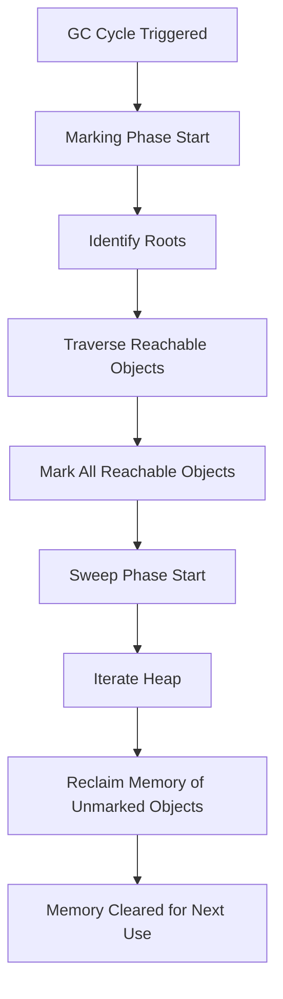

## Memory Management & Garbage Collection
### Core Concepts

*   **Automatic Memory Management:** Unlike C/C++, JavaScript engines (like V8 for Chrome/Node.js) automatically manage memory allocation and deallocation. Developers don't manually free memory.
*   **Heap vs. Stack:**
    *   **Stack:** Used for static memory allocation (fixed-size values, primitive types, function call frames). Allocation/deallocation is fast and follows LIFO.
    *   **Heap:** Used for dynamic memory allocation (objects, functions, arrays). Memory is allocated/deallocated in a less structured way, requiring a garbage collector.
*   **Garbage Collection (GC):** The process by which the JavaScript engine reclaims memory occupied by objects that are no longer "reachable" or "referenced" by the running program. Its goal is to prevent memory leaks and optimize memory usage.
*   **Reachability:** The core principle of GC. An object is considered "reachable" if it can be accessed from a set of "roots" (e.g., global objects like `window` or `global`, the current call stack, active DOM nodes). Objects that are not reachable are considered "garbage" and eligible for collection.

### Key Details & Nuances

*   **Mark-and-Sweep Algorithm:** The most common GC algorithm in JS engines.
    1.  **Marking Phase:** The collector starts from the root objects and traverses all reachable objects, marking them as "active."
    2.  **Sweeping Phase:** The collector iterates through the entire heap and reclaims memory from unmarked objects (garbage).
*   **Generational Collection (V8 example):**
    *   **Young Generation (Nursery):** Where new objects are allocated. Many objects are short-lived.
        *   **Scavenger (Minor GC):** Runs frequently, quickly collecting short-lived objects. It copies live objects from one "space" to another (e.g., from `Eden` to `To space`, then to `From space`). Efficient for ephemeral objects.
    *   **Old Generation (Tenured):** Objects that survive multiple Minor GC cycles are promoted here.
        *   **Major GC (Mark-Sweep-Compact):** Runs less frequently.
            *   **Mark-Sweep:** Identifies and reclaims dead objects.
            *   **Compaction:** Moves remaining live objects together to reduce fragmentation, improving allocation speed and cache efficiency.
*   **Incremental GC:** Modern GCs perform collection in small, incremental chunks to avoid long "stop-the-world" pauses that could freeze the main thread and impact user experience. This involves breaking the mark phase into smaller steps.
*   **Concurrent GC:** Some parts of the GC process can run on background threads without pausing the main JavaScript thread.

### Practical Examples

#### Simplified Mark-and-Sweep Process



#### Example of a Common Memory Leak (Closure Leak)

```typescript
// This function creates a closure that captures 'largeArray',
// preventing it from being garbage collected as long as 'callback' is referenced.
let someGlobalReference: Function | null = null;

function createLeak() {
    const largeArray = new Array(1000000).fill('some data');
    const callback = () => {
        // This closure captures largeArray.
        // Even if createLeak() finishes, largeArray is still referenced by callback.
        console.log(largeArray.length);
    };
    someGlobalReference = callback; // The leak: a global reference to the closure.
}

createLeak();

// At this point, even though createLeak() has finished,
// largeArray is still in memory because someGlobalReference holds a reference to callback.
// To fix, you'd set someGlobalReference = null; when no longer needed.
// someGlobalReference = null; // Releasing the reference allows GC.
```

### Common Pitfalls & Trade-offs

*   **Unnecessary References:** Holding references to objects (especially large ones or DOM elements) longer than needed, preventing GC.
    *   **Closures:** Functions that "close over" outer scope variables can inadvertently keep those variables in memory.
    *   **Global Variables:** Objects assigned to global variables persist for the entire application lifecycle unless explicitly nulled out.
    *   **Detached DOM Elements:** Removing an element from the DOM but still holding a JavaScript reference to it (or its children) will prevent its memory from being reclaimed.
    *   **Event Listeners:** Attaching event listeners and not removing them when the element/component is destroyed.
    *   **Timers (setInterval/setTimeout):** If a timer's callback references objects, those objects won't be collected until the timer is cleared.
*   **Cache Bloat:** Implementing caches that grow indefinitely without proper eviction policies.
*   **Performance vs. Memory Footprint:** More aggressive GC (running more often) can reduce memory footprint but might introduce more frequent, albeit short, pauses. Less frequent GC might lead to higher memory usage but fewer pauses. Modern GCs aim to balance this.
*   **De-optimizations:** While not directly a GC issue, actions like polymorphic operations or frequently changing object shapes can make the V8 engine less efficient in optimizing code, potentially leading to more object allocations and thus more GC pressure.

### Interview Questions

1.  **Explain the core concept of "reachability" in JavaScript's garbage collection. How does it differ from traditional reference counting?**
    *   **Answer:** Reachability means an object is considered "live" if it can be accessed from a root (e.g., global object, call stack) through a chain of references. If no such path exists, it's unreachable and garbage. This differs from simple reference counting, which only tracks the number of direct references; reference counting cannot detect circular references (where A refers to B, and B refers to A, but neither is reachable from roots), leading to memory leaks. Mark-and-sweep, based on reachability, correctly identifies and collects circular references.

2.  **Describe the Mark-and-Sweep algorithm. How do modern JavaScript engines like V8 optimize this process to minimize performance impact?**
    *   **Answer:** Mark-and-Sweep involves a "Marking" phase (traverse from roots, mark all reachable objects) and a "Sweeping" phase (iterate heap, reclaim unmarked objects). V8 optimizes this with:
        *   **Generational Collection:** Separating objects into Young (new, frequently collected by Scavenger/Minor GC) and Old (survivors, collected by Major GC). Short-lived objects are quickly disposed of.
        *   **Incremental GC:** Breaking down the Mark phase into smaller tasks that run in short bursts, allowing the main thread to stay responsive and avoiding long "stop-the-world" pauses.
        *   **Concurrent/Parallel GC:** Running parts of the GC on separate threads in parallel with the main thread or concurrently in the background, further reducing main thread blocking time.
        *   **Compaction:** In the Old Generation, live objects are moved to contiguous memory to reduce fragmentation, improving allocation speed and cache locality.

3.  **Identify three common causes of memory leaks in JavaScript applications. How would you debug or prevent them?**
    *   **Answer:**
        1.  **Unresolved Closures:** A function forming a closure over a large outer-scope variable that remains referenced globally (or in a long-lived scope).
        2.  **Detached DOM Elements:** Removing a DOM element from the document but retaining a JavaScript reference to it or its children, preventing their memory from being collected.
        3.  **Unremoved Event Listeners/Timers:** Attaching event listeners or setting up `setInterval`/`setTimeout` calls that reference objects, but failing to explicitly remove the listeners (`removeEventListener`) or clear the timers (`clearTimeout`/`clearInterval`) when the associated component or object is destroyed.
    *   **Debugging/Prevention:** Use Chrome DevTools' Memory tab (Heap Snapshot to analyze retained objects and their retainers, or Allocation Timeline to track memory growth over time). Proactively nullify references, remove event listeners, and clear timers when objects/components are no longer needed. Design components with clear lifecycle methods for cleanup.