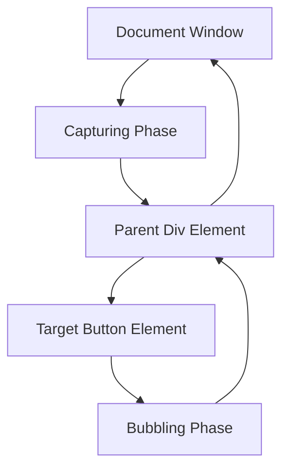

## Event Bubbling, Capturing, and Delegation
### Core Concepts

*   **Event Bubbling (Default):** The process where an event, triggered on an element, first handles the event on that element, then propagates upwards through its ancestors in the DOM tree (e.g., from `BUTTON` to `DIV` to `BODY` to `HTML` to `DOCUMENT` to `WINDOW`). Most events bubble by default.
*   **Event Capturing (Trickling/Tunneling):** The inverse of bubbling. When an event is triggered, it first propagates downwards from the DOM `WINDOW` to the `DOCUMENT`, then to `HTML`, `BODY`, and through ancestor elements until it reaches the target element where the event originated.
*   **Event Delegation:** A pattern that leverages event bubbling (or capturing) to handle events. Instead of attaching separate event listeners to multiple child elements, a single event listener is attached to a common parent element. This listener then determines which descendant element actually triggered the event.

### Key Details & Nuances

*   **Event Flow Stages:**
    1.  **Capturing Phase:** Event travels down from the `Window`/`Document` to the target's direct parent.
    2.  **Target Phase:** Event reaches the actual element where it was triggered.
    3.  **Bubbling Phase:** Event travels up from the target's direct parent back to the `Window`/`Document`.
*   **`addEventListener(type, listener, options)`:**
    *   `type`: The event type (e.g., `'click'`, `'mouseover'`).
    *   `listener`: The function to be called when the event occurs.
    *   `options` (or `useCapture` boolean):
        *   If `true` (or `{ capture: true }`), the listener is registered for the **capturing phase**.
        *   If `false` (default, or `{ capture: false }`), the listener is registered for the **bubbling phase**.
*   **`event.target` vs. `event.currentTarget`:**
    *   `event.target`: The actual element on which the event *originally occurred* (the deepest element in the DOM tree). This remains constant throughout the event flow.
    *   `event.currentTarget`: The element *on which the event listener is currently attached* and being executed. This changes as the event propagates up (or down) the DOM tree. This distinction is crucial for event delegation.
*   **Stopping Propagation:**
    *   `event.stopPropagation()`: Prevents further propagation of the current event in both the capturing and bubbling phases. It stops the event from reaching ancestor (during bubbling) or descendant (during capturing) elements' listeners. Other listeners *on the same element* will still execute.
    *   `event.stopImmediatePropagation()`: Prevents further propagation of the current event AND prevents any other listeners attached to the *same element* from being executed.

### Practical Examples

#### Event Flow Visualized



#### Event Bubbling, Capturing, and `stopPropagation`

```typescript
// HTML Structure:
// <div id="parent">
//   <button id="child">Click Me</button>
// </div>

const parentDiv = document.getElementById('parent');
const childButton = document.getElementById('child');

// Parent listeners
parentDiv?.addEventListener('click', (e) => {
  console.log('Parent (Capturing): Clicked!', e.currentTarget.id, 'Target:', e.target.id);
}, true); // True for capturing phase

parentDiv?.addEventListener('click', (e) => {
  console.log('Parent (Bubbling): Clicked!', e.currentTarget.id, 'Target:', e.target.id);
}, false); // False (default) for bubbling phase

// Child listener
childButton?.addEventListener('click', (e) => {
  console.log('Child (Target): Clicked!', e.currentTarget.id, 'Target:', e.target.id);
  // e.stopPropagation(); // Uncommenting this will stop "Parent (Bubbling)" from logging
});

/*
Expected Output when clicking the button (without stopPropagation):
Parent (Capturing): Clicked! parent Target: child
Child (Target): Clicked! child Target: child
Parent (Bubbling): Clicked! parent Target: child
*/
```

#### Event Delegation Example

```typescript
// HTML Structure:
// <ul id="myList">
//   <li id="item1">Item 1</li>
//   <li id="item2">Item 2</li>
//   <li id="item3">Item 3</li>
//   <!-- Dynamically added items will also work -->
// </ul>

const myList = document.getElementById('myList');

myList?.addEventListener('click', (event) => {
  const clickedElement = event.target as HTMLElement; // The actual element clicked (e.g., <li> or text inside <li>)

  // Check if the clicked element is an <li> or is a child of an <li>
  // .closest() is useful for checking ancestors
  const listItem = clickedElement.closest('li');

  if (listItem) {
    console.log(`Clicked on list item: ${listItem.textContent} (ID: ${listItem.id})`);
    listItem.style.backgroundColor = '#e0f7fa'; // Highlight the item
  }
});

// Benefits:
// 1. Only one event listener for potentially many list items.
// 2. Works automatically for dynamically added <li> elements without needing to attach new listeners.
```

### Common Pitfalls & Trade-offs

*   **Confusing `event.target` and `event.currentTarget`:** A very common mistake. Always remember `target` is *where the event originated*, `currentTarget` is *where the listener is attached*.
*   **Overuse of `stopPropagation()`:** Indiscriminate use can lead to unpredictable behavior and make debugging event flow issues very difficult, breaking expected interactions. Use it judiciously when you explicitly need to prevent an event from reaching ancestors.
*   **Performance overhead of many direct listeners:** Attaching separate event listeners to a large number of individual elements is memory-intensive and can negatively impact performance, especially during page load or when elements are frequently added/removed. Event delegation solves this.
*   **Complexity in Event Delegation Logic:** While delegation is powerful, the event handler logic might become more complex as you need to differentiate between various types of child elements (`event.target.tagName`, `event.target.matches()`, `event.target.closest()`).
*   **Events that don't bubble:** Some events (e.g., `focus`, `blur`, `scroll`, `load`, `unload`, `resize`, `error`, `submit` for form elements directly) do not bubble by default. For these, event delegation based on bubbling won't work directly (though `focus` and `blur` have `focusin`/`focusout` bubbling alternatives).

### Interview Questions

1.  **Explain the JavaScript event propagation model, distinguishing between bubbling and capturing.**
    *   **Answer:** The event propagation model describes the order in which event listeners are triggered on nested elements. When an event occurs on an element, it goes through three phases:
        1.  **Capturing Phase:** The event starts from the `Window` and trickles down through ancestor elements (e.g., `Document`, `HTML`, `Body`, `Div`) to reach the target element. Listeners registered with `useCapture: true` (or `{ capture: true }`) are executed in this phase.
        2.  **Target Phase:** The event reaches the actual element where it originated.
        3.  **Bubbling Phase:** The event then bubbles up from the target element through its ancestors back to the `Window`. Listeners registered with `useCapture: false` (default) are executed in this phase. Bubbling is the default behavior for most events.

2.  **What is event delegation, and why is it considered a best practice for performance and dynamic content?**
    *   **Answer:** Event delegation is a technique where you attach a single event listener to a common ancestor element, rather than attaching separate listeners to many descendant elements. It leverages the event bubbling phase.
    *   **Best Practice Reasons:**
        *   **Performance/Memory Efficiency:** Significantly reduces the number of event listeners on the page, saving memory and improving performance, especially with a large number of interactive elements.
        *   **Dynamic Content:** Automatically handles events for elements that are added to the DOM *after* the initial page load, without needing to re-attach listeners. The single parent listener will catch events from new children as they bubble up.
        *   **Simplified Code:** Centralizes event handling logic, making the code cleaner and easier to manage.

3.  **Describe the difference between `event.target` and `event.currentTarget` in the context of event handling. Provide an example where this distinction matters.**
    *   **Answer:**
        *   `event.target`: Refers to the specific DOM element *where the event originally occurred* (i.e., the element that was directly clicked, focused, etc.). This value does not change as the event propagates.
        *   `event.currentTarget`: Refers to the DOM element *to which the event listener is currently attached* and being executed. As an event bubbles or captures, `currentTarget` changes to the element whose listener is currently being processed.
    *   **Example (Delegation):** If you have a `<ul>` with a click listener (delegation) and a user clicks an `<li>` inside it, `event.target` would be the `<li>` (or a `<span>` inside the `<li>`), while `event.currentTarget` would be the `<ul>`. This distinction allows the delegation handler on the `<ul>` to identify *which* specific `<li>` was clicked using `event.target` or `event.target.closest('li')`.

4.  **When would you use `event.stopPropagation()` versus `event.stopImmediatePropagation()`?**
    *   **Answer:**
        *   **`event.stopPropagation()`:** Used to prevent an event from continuing its propagation up (or down) the DOM tree. It stops the event from reaching parent (during bubbling) or child (during capturing) elements that might also have listeners for the same event type. However, other event listeners *attached to the same element* will still execute. Use this when you want to handle an event at a specific element and ensure no ancestor/descendant elements react to it.
        *   **`event.stopImmediatePropagation()`:** A more aggressive version. It does everything `stopPropagation()` does (prevents further propagation up/down the tree) AND it also prevents any *other* event listeners registered on the *same current element* from executing. Use this in rare cases where an event should be handled exclusively by one listener on an element, and no other listeners on that same element should fire.

5.  **Imagine you have a large table with hundreds of rows, and you want to detect clicks on individual cells. How would you implement this efficiently, and why?**
    *   **Answer:** I would implement this using **event delegation**.
        1.  Attach a single click event listener to the `<table>` element (or its `<tbody>` if preferred).
        2.  Inside this event listener, use `event.target` to identify the element that was actually clicked.
        3.  Check if `event.target` is a `<td>` element, or if it's a child of a `<td>` (using `event.target.closest('td')`).
        4.  If it is a `<td>`, then perform the desired action on that cell.
    *   **Why efficient:** This approach avoids attaching hundreds or thousands of individual click listeners to each `<td>` element, which would be very memory-intensive and impact performance. Instead, only one listener is active on the parent table, which efficiently handles clicks for all current and future `<td>` elements through bubbling.