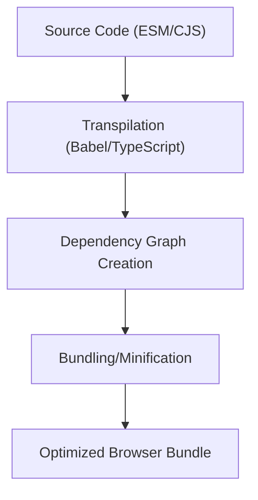

## Modules & Bundlers (ESM vs CommonJS, Webpack/Vite basics)
### Core Concepts

*   **Modules:** Self-contained units of code that encapsulate logic and expose specific functionalities. They improve code organization, reusability, maintainability, and prevent global namespace pollution.
    *   **ES Modules (ESM):** The official, standardized module system for JavaScript, supported natively by modern browsers and Node.js (with `.mjs` or `"type": "module"`). Uses `import`/`export` syntax.
    *   **CommonJS (CJS):** A module system primarily used in Node.js environments. Uses `require`/`module.exports` syntax.
*   **Bundlers:** Tools that combine multiple JavaScript modules (and often other assets like CSS, images) into a smaller number of optimized files suitable for deployment in a browser. They resolve dependencies, transpile code, minify, and apply various optimizations.
    *   **Webpack:** A highly configurable and powerful module bundler, widely adopted for complex applications.
    *   **Vite:** A "next-generation frontend tooling" that leverages native ES Modules during development for faster cold starts and uses `esbuild` for bundling in production.

### Key Details & Nuances

*   **ESM vs. CommonJS:**

    | Feature        | ES Modules (ESM)                                       | CommonJS (CJS)                                        |
    | :------------- | :----------------------------------------------------- | :---------------------------------------------------- |
    | **Syntax**     | `import`/`export`                                      | `require`/`module.exports`                            |
    | **Loading**    | Static (parsed at compile time); asynchronous in browsers | Dynamic (at runtime); synchronous                     |
    | **Tree Shaking** | Yes (due to static analysis)                           | No (dynamic `require` makes static analysis hard)     |
    | **`this`**     | `undefined` at top-level                               | `module.exports` at top-level                         |
    | **Strict Mode** | Default                                                | Opt-in                                                |
    | **Environments** | Browser, Node.js, Deno                                 | Primarily Node.js                                     |
    | **Top-level await** | Supported (modern JS)                              | Not directly supported                                |
    *   **Interoperability:** Node.js allows CJS modules to `require` ESM (asynchronously) and ESM modules to `import` CJS (synchronously, but with a `default` export wrapper). Best practice is to stick to one system where possible.

*   **Bundlers (Webpack vs. Vite):**

    | Feature            | Webpack                                                | Vite                                                              |
    | :----------------- | :----------------------------------------------------- | :---------------------------------------------------------------- |
    | **Dev Server**     | Bundles entire app before serving                      | Serves native ESM; bundles on demand/browser requests             |
    | **Dev Speed**      | Can be slow for large apps (cold start)                | Extremely fast (no initial bundling overhead for dev)             |
    | **Build Tool**     | Custom bundling logic, relies on various plugins       | `esbuild` for transpilation, `Rollup` for production bundling     |
    | **Configuration**  | Extensive, often complex `webpack.config.js`           | Minimal, convention over configuration, uses `vite.config.js`     |
    | **Plugin Ecosystem** | Mature, vast                                           | Growing, uses Rollup plugins for build, Vite-specific for dev     |
    *   **Tree Shaking:** The process of eliminating dead code (unused exports) from the final bundle. ESM's static nature enables this effectively.
    *   **Code Splitting:** Dividing the application code into smaller, on-demand chunks. This reduces the initial load time by only loading what's immediately needed. Bundlers facilitate this (e.g., dynamic `import()`).

### Practical Examples

**1. ESM vs. CommonJS Syntax**

```typescript
// --- ESM Example (e.g., src/utils.ts) ---
export const add = (a: number, b: number): number => a + b;
export function subtract(a: number, b: number): number { return a - b; }

// --- ESM usage (e.g., src/app.ts) ---
import { add, subtract } from './utils';
import * as MathUtils from './utils'; // Import all as namespace

console.log(add(5, 3));
console.log(MathUtils.subtract(10, 4));
```

```javascript
// --- CommonJS Example (e.g., utils.js) ---
const add = (a, b) => a + b;
function subtract(a, b) { return a - b; }

module.exports = {
  add: add,
  subtract: subtract
};

// --- CommonJS usage (e.g., app.js) ---
const { add, subtract } = require('./utils'); // Destructuring
const MathUtils = require('./utils'); // Import all as an object

console.log(add(5, 3));
console.log(MathUtils.subtract(10, 4));
```

**2. Basic Bundling Process**



### Common Pitfalls & Trade-offs

*   **CJS/ESM Interoperability:**
    *   **Pitfall:** Importing CommonJS `module.exports` into an ESM file often requires treating it as a `default` export, which can be confusing (e.g., `import CjsModule from 'cjs-package';`). Named exports from CJS are not directly available as named ESM imports.
    *   **Trade-off:** Mixing can lead to less optimal tree-shaking and increased bundle size, as CJS isn't statically analyzable.
*   **Bundler Configuration Complexity:**
    *   **Pitfall:** Webpack's extensive configuration can lead to "config hell" for beginners or for complex setups. Misconfigurations can cause slow builds, incorrect output, or broken HMR.
    *   **Trade-off:** The complexity offers unparalleled flexibility and optimization opportunities for specific project needs. Vite sacrifices some deep configurability for speed and simplicity.
*   **Bundle Size vs. Build Speed:**
    *   **Trade-off:** Heavily optimizing for the smallest bundle size (e.g., aggressive minification, many loaders) can significantly increase build times. Balancing these is crucial for developer experience and deployment efficiency.
*   **Dev vs. Prod Bundling:**
    *   **Pitfall:** Assuming development server behavior is identical to production. Vite's native ESM in dev means it serves unbundled code directly, while production builds (using Rollup) are highly optimized and bundled.
    *   **Trade-off:** Faster development iteration with Vite vs. the need for a separate, slower production build step.

### Interview Questions

1.  **Compare and contrast CommonJS and ES Modules, highlighting their key differences in syntax, loading mechanism, and suitability for tree shaking. When would you choose one over the other in a modern project?**
    *   **Answer:** ESM uses `import`/`export` (static, compile-time) while CJS uses `require`/`module.exports` (dynamic, runtime). ESM is static, enabling tree shaking and better for browser/standard JS. CJS is synchronous, primarily for Node.js. In modern projects, prefer ESM for browser compatibility, build tool optimizations (tree shaking), and future-proofing. Use CJS only if integrating with legacy Node.js code or specific npm packages that haven't transitioned to ESM.

2.  **Explain the role of a bundler like Webpack or Vite in a modern JavaScript application development workflow. What specific problems do they solve that native browser capabilities or Node.js alone wouldn't address?**
    *   **Answer:** Bundlers transform modular source code into optimized assets for the browser. They solve:
        1.  **Browser Incompatibility:** Browsers didn't natively support modules (pre-ESM) or don't optimize modules for production.
        2.  **Dependency Resolution:** Manages complex dependency graphs across numerous files and npm packages.
        3.  **Optimization:** Performs minification, uglification, tree shaking (dead code removal), code splitting (lazy loading), and asset optimization (images, CSS).
        4.  **Transpilation:** Converts modern JS/TS/JSX to browser-compatible JS (e.g., ES5) and handles various asset types (loaders).
        5.  **Development Experience:** Provides features like hot module replacement (HMR), development servers, and source maps.

3.  **Describe tree shaking and code splitting. How do they relate to modularity, and what impact do they have on web performance?**
    *   **Answer:**
        *   **Tree Shaking:** A build optimization that eliminates dead code (unused exports) from the final bundle. It relies on the static nature of ES Modules, as bundlers can analyze imports/exports without executing code.
        *   **Code Splitting:** Dividing the application's code into smaller, on-demand chunks that are loaded only when needed (e.g., when a user navigates to a specific route or clicks a button).
        *   **Relation to Modularity:** Both heavily leverage modular design. Tree shaking depends on explicit `import`/`export` from modules, and code splitting works by identifying module boundaries for dynamic imports.
        *   **Performance Impact:** Both significantly improve initial page load time by reducing the bundle size, leading to faster downloads, less parsing/execution time, and a better user experience, especially on slower networks or devices.

4.  **Vite leverages native ES Modules in development, while Webpack traditionally bundles most code during development. What are the performance implications of this difference during development, particularly for large applications or cold starts?**
    *   **Answer:** Vite's approach of serving native ES Modules directly to the browser (with minimal transformation by `esbuild`) leads to significantly faster cold starts compared to Webpack. Webpack traditionally has to bundle the entire application before it can be served, which becomes slow for large codebases. Vite only transforms and serves files on demand as the browser requests them, eliminating the upfront bundling step. This difference makes Vite's development experience much snappier, especially for initial server startup and rebuilding after changes that don't trigger Hot Module Replacement (HMR) for the entire app.