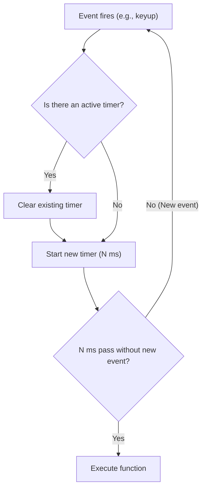

## Debouncing and Throttling
### Core Concepts

*   **Debouncing:** Limits the rate at which a function is called by delaying its execution until a specified amount of time has passed *without* any further invocations. If the function is called again within that delay, the previous timer is reset.
    *   **Purpose:** Ensures a function only fires once the user has "stopped" performing an action for a period (e.g., typing in a search bar, resizing a window).
    *   **Analogy:** A "pause" button on a timer that resets if pressed again too quickly.

*   **Throttling:** Limits the rate at which a function can be called to a maximum frequency (e.g., once every X milliseconds). The function will execute at most once per a given time interval.
    *   **Purpose:** Ensures a function fires regularly but not excessively, even if the event triggers continuously (e.g., scroll events, button clicks, game updates).
    *   **Analogy:** A "gate" that only opens every X milliseconds, regardless of how many times you try to open it.

### Key Details & Nuances

*   **Mechanism:** Both primarily use `setTimeout` and `clearTimeout` to manage invocation timing. They typically leverage closures to maintain state (e.g., the timer ID, last invocation time).
*   **`this` Context:** A common issue is losing the `this` context when the original function is called inside the debounced/throttled wrapper. Solutions involve `Function.prototype.apply` or `call` to explicitly set `this`.
*   **Arguments:** The arguments passed to the debounced/throttled function must be correctly forwarded to the original function.
*   **Leading vs. Trailing Edge:**
    *   **Trailing Edge (Default for Debounce):** The function executes *after* the specified delay, once events have ceased.
    *   **Leading Edge (Option for Throttling/Debounce):** The function executes *immediately* on the first invocation, then ignores subsequent invocations for the duration of the delay. Useful for immediate feedback (e.g., first click of a button, then subsequent clicks are ignored for a cool-down).
    *   Throttling often benefits from both: an immediate leading edge execution, and then a trailing edge execution if calls occurred during the cool-down.
*   **Cancellation/Reset:** For debounced functions, the ability to cancel the pending execution (e.g., if a component unmounts) or reset the timer immediately is sometimes required.

### Practical Examples

**Debounce Implementation (Trailing Edge)**

```typescript
function debounce<T extends (...args: any[]) => any>(
  func: T,
  delay: number
): (...args: Parameters<T>) => void {
  let timeoutId: ReturnType<typeof setTimeout> | null = null;

  return function(this: ThisParameterType<T>, ...args: Parameters<T>) {
    const context = this;

    if (timeoutId) {
      clearTimeout(timeoutId);
    }

    timeoutId = setTimeout(() => {
      func.apply(context, args);
      timeoutId = null; // Clear timeoutId after execution
    }, delay);
  };
}

// Example Usage:
// const handleSearchInput = debounce((query: string) => {
//   console.log("Searching for:", query);
// }, 500);
// document.getElementById("search-input")?.addEventListener("keyup", (e) => {
//   handleSearchInput((e.target as HTMLInputElement).value);
// });
```

**Throttling Implementation (Leading and Trailing Edge)**

```typescript
function throttle<T extends (...args: any[]) => any>(
  func: T,
  limit: number
): (...args: Parameters<T>) => void {
  let inThrottle: boolean;
  let lastFn: ReturnType<typeof setTimeout> | null;
  let lastTime: number;

  return function(this: ThisParameterType<T>, ...args: Parameters<T>) {
    const context = this;
    if (!inThrottle) {
      func.apply(context, args); // Leading edge execution
      lastTime = Date.now();
      inThrottle = true;
    } else {
      clearTimeout(lastFn!); // Clear previous trailing edge if exists
      lastFn = setTimeout(() => {
        if (Date.now() - lastTime >= limit) {
          func.apply(context, args); // Trailing edge execution
          lastTime = Date.now();
          inThrottle = false;
        }
      }, Math.max(limit - (Date.now() - lastTime), 0)); // Ensure non-negative delay
    }
  };
}

// Example Usage:
// const handleScroll = throttle(() => {
//   console.log("Scrolled!");
// }, 200);
// window.addEventListener("scroll", handleScroll);
```

**Debouncing Logic Flow:**



### Common Pitfalls & Trade-offs

*   **Incorrect `this` Context:** Forgetting to use `apply` or `call` to preserve the `this` context of the original function can lead to runtime errors or incorrect behavior.
*   **Argument Mismatch:** Not correctly forwarding arguments from the wrapper to the original function can cause unexpected behavior.
*   **Memory Leaks:** If a debounced/throttled function is attached to a DOM element or event listener that is removed, but the debounced/throttled function itself is not cleared, it can lead to memory leaks (though less common in modern React/Vue where lifecycle methods handle cleanup).
*   **Over-Optimization:** Applying debouncing/throttling to events that don't frequently fire, or to functions that are not computationally expensive, can add unnecessary complexity without significant performance gains.
*   **Testing Complexity:** Functions wrapped with debouncing/throttling can be harder to unit test due to their asynchronous nature and reliance on timers. Mocking `setTimeout`/`clearTimeout` is often required.

### Interview Questions

1.  **Explain the core difference between debouncing and throttling. Provide a clear use case for each.**
    *   **Answer:** Debouncing delays function execution until a "pause" in events, resetting the timer if events continue (e.g., search input, window resize). Throttling limits execution to a maximum frequency, firing at most once per interval (e.g., scroll events, button clicks).

2.  **Implement a `debounce` function in TypeScript/JavaScript. Your implementation should handle the `this` context and pass arguments correctly.**
    *   **Answer:** (Provide the `debounce` implementation shown in "Practical Examples" above). Emphasize `setTimeout`, `clearTimeout`, closure for `timeoutId`, and `func.apply(context, args)`.

3.  **When implementing a throttled function, discuss the concept of "leading edge" and "trailing edge" invocations. Why might you choose one over the other, or combine them?**
    *   **Answer:**
        *   **Leading Edge:** Executes the function immediately on the first trigger, then ignores subsequent triggers for the duration. Good for instant feedback (e.g., a "click" event that you want to fire immediately but prevent rapid re-clicks).
        *   **Trailing Edge:** Executes the function after the delay has passed, once the event sequence has stopped or the interval has completed. Good for processing final state (e.g., user finishes typing) or ensuring all "bursts" of events are eventually processed.
        *   **Combined:** Often desired for throttling scroll events, where you want an immediate response, but also want to ensure the function runs one last time after the scrolling stops to capture the final position.

4.  **What are some common pitfalls or considerations when integrating debouncing or throttling into an existing codebase?**
    *   **Answer:** Common pitfalls include incorrect handling of `this` context, not correctly forwarding arguments to the original function, and making functions harder to test due to their asynchronous nature. Developers should also consider if the optimization is truly necessary (avoiding over-optimization) and how to handle cleanup if the debounced/throttled function is tied to a component's lifecycle.

5.  **You are building a game that fires a `mousemove` event frequently. Explain how you would optimize performance using debouncing or throttling, and justify your choice.**
    *   **Answer:** For a game's `mousemove` event, **throttling** is almost always the correct choice. You want the game to react to mouse movement *continuously* (not just when the user stops moving the mouse, which debouncing would do), but not so frequently that it bogs down the rendering loop. Throttling ensures the game updates its state or UI based on mouse position at a consistent, manageable rate (e.g., every 50ms or 100ms), providing smooth responsiveness without excessive computation.