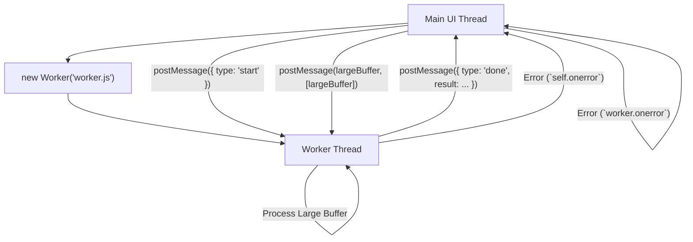

## Web Workers & Concurrency
### Core Concepts
*   **Web Workers:** JavaScript scripts running in a separate, isolated thread from the main browser thread. They allow for the execution of computationally intensive tasks without blocking the UI or causing the page to become unresponsive.
    *   **Purpose:** To achieve concurrency and improve perceived performance/responsiveness of web applications.
    *   **Shared-Nothing Architecture:** Workers operate in their own global context, distinct from the `window` object of the main thread. They cannot directly access the DOM.
    *   **Types:**
        *   **Dedicated Workers:** Single main thread communicates with a single worker.
        *   **Shared Workers:** Multiple browsing contexts (e.g., tabs, iframes) can communicate with a single worker instance.
        *   **Service Workers:** Act as a programmable network proxy, enabling offline capabilities, push notifications, and asset caching. (Beyond scope for core concurrency, but relevant to 'Workers' concept).

### Key Details & Nuances
*   **Isolation & Context:**
    *   Workers run in their own thread with a distinct global scope (`self` or `DedicatedWorkerGlobalScope`).
    *   They have access to a subset of browser APIs (e.g., `XMLHttpRequest`, `fetch`, `IndexedDB`, `setTimeout`, `setInterval`, `self.importScripts()`).
    *   **No DOM Access:** Crucial limitation. They cannot manipulate the HTML page directly.
*   **Communication Model (Event-driven):**
    *   **`postMessage()`:** Used by both main thread and worker to send messages. Messages are copied (`structured clone algorithm`).
    *   **`onmessage` / `addEventListener('message', ...)`:** Listeners on both sides to receive messages. The event object contains `data` property with the message payload.
    *   **Transferable Objects:** For large data (e.g., `ArrayBuffer`, `MessagePort`, `OffscreenCanvas`), `postMessage()` can transfer ownership instead of copying. This is significantly faster as it avoids serialization/deserialization. Once transferred, the original object in the sender's thread becomes unusable.
*   **Error Handling:**
    *   `worker.onerror` event listener on the main thread catches errors originating in the worker.
    *   The event object provides `message`, `filename`, and `lineno` for debugging.
*   **Termination:**
    *   `worker.terminate()`: Immediately stops the worker's execution, releasing resources.
    *   `self.close()`: A worker can terminate itself.
*   **SharedArrayBuffer & Atomics:**
    *   Allow true shared memory concurrency between main thread and workers (or multiple workers).
    *   `Atomics` object provides atomic operations to ensure data integrity when multiple threads access the same `SharedArrayBuffer` concurrently, preventing race conditions.
    *   **Security Implications:** Due to speculative execution vulnerabilities (Spectre/Meltdown), `SharedArrayBuffer` availability has been restricted (e.g., requiring COOP/COEP HTTP headers).

### Practical Examples

**Main Thread (`app.js`):**
```typescript
// app.js
const myWorker = new Worker('worker.js'); // Create a new worker

// Send data to the worker
myWorker.postMessage({ type: 'startComputation', payload: 1000000000 });

// Listen for messages from the worker
myWorker.onmessage = (event) => {
    console.log('Main Thread: Message from worker:', event.data);
    if (event.data.type === 'computationComplete') {
        console.log('Main Thread: Result:', event.data.result);
    }
};

// Handle errors from the worker
myWorker.onerror = (error) => {
    console.error('Main Thread: Worker error:', error.message);
};

// Example of sending a transferable object
const arrayBuffer = new ArrayBuffer(1024 * 1024); // 1MB buffer
myWorker.postMessage({ type: 'processBuffer', payload: arrayBuffer }, [arrayBuffer]);
// After this, arrayBuffer in main thread is detached and unusable
```

**Worker Thread (`worker.js`):**
```typescript
// worker.js
self.onmessage = (event) => {
    const { type, payload } = event.data;

    if (type === 'startComputation') {
        let sum = 0;
        for (let i = 0; i < payload; i++) {
            sum += i; // Simulate heavy computation
        }
        self.postMessage({ type: 'computationComplete', result: sum });
    } else if (type === 'processBuffer') {
        console.log('Worker: Received buffer of size:', payload.byteLength);
        // Process the buffer...
        self.postMessage({ type: 'bufferProcessed', status: 'done' });
    }
};

// Example of self-termination (if needed)
// self.close();
```

**Conceptual Flow:**


### Common Pitfalls & Trade-offs
*   **Serialization Overhead:** `postMessage` involves copying data via the Structured Clone Algorithm, which can be slow for very large or complex objects. Use **Transferable Objects** to mitigate this.
*   **Over-engineering:** Not all tasks benefit from Workers. For very quick operations, the overhead of creating a worker, message passing, and termination can outweigh the benefits.
*   **Debugging Complexity:** Debugging code running in a separate thread can be more challenging than single-threaded JS. Browser developer tools offer specific support for Workers.
*   **State Management:** Managing application state when parts of it are modified by a worker (and then passed back) requires careful synchronization to avoid race conditions or stale data on the main thread.
*   **Resource Usage:** While improving responsiveness, creating too many workers can consume significant memory and CPU, potentially degrading overall system performance.

### Interview Questions

1.  **When would you choose to use a Web Worker in your application, and what are its primary benefits?**
    *   **Answer:** Use Web Workers for computationally intensive, long-running tasks (e.g., complex calculations, large data processing, image manipulation, encryption) that would otherwise block the main UI thread, causing the application to become unresponsive. The primary benefits are improving UI responsiveness and overall application performance by offloading work to a separate thread, enabling true concurrency in the browser.

2.  **Web Workers operate in an isolated environment. What are the key limitations due to this isolation, especially regarding direct interaction with the main page?**
    *   **Answer:** The most significant limitation is that Web Workers **cannot directly access the DOM** (Document Object Model) or manipulate the user interface. They also lack access to some browser APIs like `alert()`, `prompt()`, or `window.localStorage` directly (though they can access `IndexedDB`, `XMLHttpRequest`, `fetch`, etc.). Communication is strictly asynchronous via message passing.

3.  **How do the main thread and a Web Worker communicate with each other? Discuss the mechanism and how you would handle passing large amounts of data efficiently.**
    *   **Answer:** Communication occurs asynchronously using the `postMessage()` method and `onmessage` event handlers (or `addEventListener('message', ...)`). Data passed via `postMessage()` is typically copied using the Structured Clone Algorithm. For large amounts of data, **Transferable Objects** (e.g., `ArrayBuffer`, `MessagePort`, `OffscreenCanvas`) should be used. This transfers ownership of the data from the sender to the receiver, avoiding costly copying and improving performance significantly. Once transferred, the original object in the sender's thread becomes unusable.

4.  **Explain the difference between a `Worker` (Dedicated Worker) and a `Service Worker`. When would you choose one over the other?**
    *   **Answer:** A **Dedicated Worker** is designed for general-purpose background scripting to offload heavy computations from the main thread, primarily for performance within a single tab/window. It is tightly coupled to the script that creates it.
    *   A **Service Worker** acts as a programmable network proxy, intercepting network requests made by the browser. Its primary use cases are enabling offline capabilities, caching assets, push notifications, and background synchronization. It has a lifecycle independent of the page and can control multiple tabs/windows within its scope.
    *   Choose a Dedicated Worker for CPU-bound tasks that need to run in the background for a specific UI session. Choose a Service Worker for network-related tasks, offline support, or features that need to operate even when the user is not actively interacting with your site.