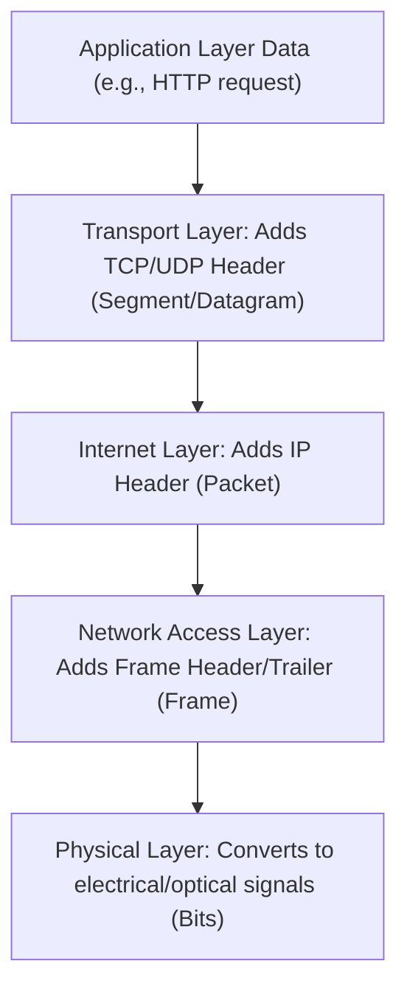

## OSI vs. TCP/IP Model
### Core Concepts
*   **Network Models**: Conceptual frameworks that define how network communication occurs in a structured, layered manner. They promote interoperability, modularity, and easier troubleshooting by breaking down complex processes.
*   **OSI (Open Systems Interconnection) Model**:
    *   A theoretical, 7-layer reference model for how applications communicate over a network.
    *   Focuses on strict separation of concerns, providing a universal standard. Not widely implemented directly.
*   **TCP/IP (Transmission Control Protocol/Internet Protocol) Model**:
    *   A practical, 4 or 5-layer model (often considered 4) that forms the basis of the Internet.
    *   Developed before the OSI model and is the actual protocol suite used for network communication.

### Key Details & Nuances
*   **Layer Comparison**:
    *   **OSI (7 Layers)**
        1.  **Application**: Network services for applications (HTTP, FTP, SMTP).
        2.  **Presentation**: Data formatting, encryption, compression, syntax conversion.
        3.  **Session**: Manages dialogue between applications (session establishment, management, termination).
        4.  **Transport**: End-to-end data delivery, segmentation, flow control (TCP, UDP).
        5.  **Network**: Logical addressing (IP), routing of packets across networks (IP, ICMP).
        6.  **Data Link**: Physical addressing (MAC), error detection, access to physical medium. Divided into LLC and MAC sub-layers.
        7.  **Physical**: Transmission of raw bit stream over physical medium (cables, connectors, voltage).
    *   **TCP/IP (4/5 Layers)**
        1.  **Application**: Combines OSI's Application, Presentation, Session layers (HTTP, FTP, DNS, SMTP).
        2.  **Transport**: End-to-end communication, segmentation (TCP, UDP). Corresponds to OSI Transport.
        3.  **Internet (Network)**: Logical addressing, routing (IP, ICMP, ARP). Corresponds to OSI Network.
        4.  **Network Access (Link)**: Combines OSI's Data Link and Physical layers (Ethernet, Wi-Fi).
            *   *Note*: Sometimes viewed as 5 layers: Application, Transport, Network, Data Link, Physical. The 4-layer view is more common for practical discussion.
*   **Key Differences**:
    *   **Number of Layers**: OSI has 7, TCP/IP typically 4.
    *   **Development**: OSI after TCP/IP (initially), attempt to standardize; TCP/IP developed as a working protocol suite.
    *   **Protocol Dependence**: OSI is protocol-independent; TCP/IP is protocol-dependent (specific protocols defined within layers).
    *   **Robustness**: TCP/IP is more robust and adaptable due to its simpler design and practical implementation.
    *   **Usage**: OSI is a conceptual reference; TCP/IP is the actual communication standard for the Internet.
*   **Encapsulation**: Data at each layer is wrapped with a header (and sometimes a footer) from the current layer, forming a new PDU (Protocol Data Unit). This PDU is then passed down to the next lower layer.
    *   Application Data (L7) -> Segment (L4, TCP/UDP Header) -> Packet (L3, IP Header) -> Frame (L2, MAC Header/Footer) -> Bits (L1).

### Practical Examples

**Data Encapsulation Flow (TCP/IP Model)**

### Common Pitfalls & Trade-offs
*   **Misconception**: Believing the OSI model is actively used for network implementation or troubleshooting on its own. While useful for conceptual understanding, practical network analysis often directly refers to TCP/IP layers.
*   **Layer Confusion**: Not clearly distinguishing the responsibilities of the Transport (end-to-end, ports) vs. Network (logical addressing, routing) vs. Data Link (MAC, local delivery) layers.
*   **Trade-off (OSI vs. TCP/IP)**: OSI's strict layering offers more clear-cut division of labor and potential for future protocol independence, but it's more complex. TCP/IP's more integrated and pragmatic approach led to its widespread adoption due to its simplicity and efficiency for real-world networking.

### Interview Questions

1.  **"Compare and contrast the OSI and TCP/IP models, highlighting their primary differences and why TCP/IP is more widely adopted."**
    *   **Answer**: The OSI model is a 7-layer theoretical reference, providing a clear conceptual framework, while the TCP/IP model is a 4 or 5-layer practical implementation that underpins the Internet. Key differences include the number of layers (OSI separates Session, Presentation, and combines Physical/Data Link into Network Access), protocol dependence (OSI is generic, TCP/IP defines specific protocols), and development (OSI was a later attempt at standardization, TCP/IP evolved organically). TCP/IP is more widely adopted due to its pragmatic, simpler design, proven robustness in real-world scenarios, and direct mapping to the technologies that power the internet.

2.  **"Describe the concept of encapsulation as it relates to network models. Provide an example of how data transforms as it moves down the TCP/IP stack."**
    *   **Answer**: Encapsulation is the process where data from an upper layer is wrapped with a header (and sometimes a trailer) from the current layer before being passed down to the next lower layer. Each layer adds its own control information. For example, in the TCP/IP stack:
        *   **Application Layer** data is passed to the **Transport Layer**.
        *   The **Transport Layer** adds a TCP or UDP header (e.g., source/destination port numbers), forming a **Segment** (TCP) or **Datagram** (UDP).
        *   This Segment/Datagram is passed to the **Internet Layer**.
        *   The **Internet Layer** adds an IP header (e.g., source/destination IP addresses), forming a **Packet**.
        *   This Packet is passed to the **Network Access Layer**.
        *   The **Network Access Layer** adds a frame header and trailer (e.g., source/destination MAC addresses, error checking), forming a **Frame**.
        *   Finally, the Frame is converted into raw **Bits** by the **Physical Layer** for transmission.

3.  **"Which layer of the TCP/IP model is responsible for logical addressing (IP addresses) and routing decisions? What about MAC addresses and local network delivery?"**
    *   **Answer**: Logical addressing (IP addresses) and routing decisions across different networks are handled by the **Internet Layer** (or Network Layer) of the TCP/IP model. MAC addresses and delivery within a single local network segment (e.g., Ethernet LAN) are the responsibility of the **Network Access Layer** (or Link Layer).

4.  **"Explain how the OSI model's Session and Presentation layers are handled in the TCP/IP model."**
    *   **Answer**: In the TCP/IP model, the functionalities of the OSI model's Session and Presentation layers are not distinct separate layers. Instead, their responsibilities are typically handled either by the **Application Layer** itself or by the underlying operating system and specific application protocols. For example, session management (like maintaining a continuous dialogue) is often built directly into application protocols (e.g., HTTP sessions), and data formatting/encryption (presentation) is handled by libraries or protocols within the application layer (e.g., TLS/SSL for encryption).