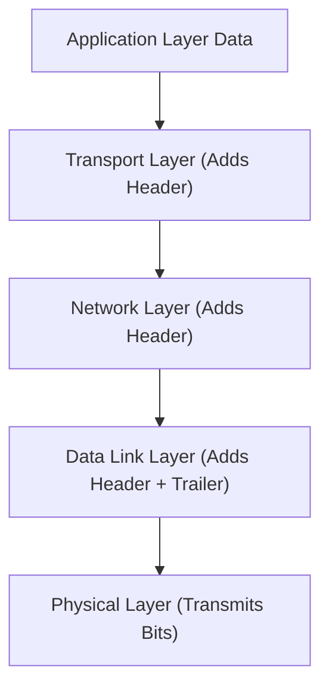

## Data Encapsulation
### Core Concepts
*   **Definition:** Data encapsulation is the process by which protocol data units (PDUs) at each layer of a network model (e.g., OSI, TCP/IP) are wrapped with header and/or trailer information from the current layer. This information includes control data, addresses, and other layer-specific details.
*   **Layering Principle:** It's fundamental to layered network architectures. Each layer treats the PDU from the layer above as its data payload and then adds its own control information before passing it down to the next lower layer.
*   **Abstraction:** It provides abstraction, allowing each layer to operate independently without needing to understand the internal workings of other layers, only their interfaces. This modularity simplifies design, development, and troubleshooting.

### Key Details & Nuances
*   **PDU Transformation:**
    *   **Application Layer Data:** User data (e.g., HTTP request).
    *   **Transport Layer:** Adds TCP/UDP header (ports, sequence numbers) to form a **Segment** (TCP) or **Datagram** (UDP).
    *   **Network Layer:** Adds IP header (source/destination IP, TTL) to the segment/datagram to form a **Packet**.
    *   **Data Link Layer:** Adds Frame header (MAC addresses, type) and Frame trailer (FCS/CRC for error checking) to the packet to form a **Frame**.
    *   **Physical Layer:** Converts the frame into a bitstream (electrical signals, light pulses) for transmission.
*   **De-encapsulation:** The reverse process occurs at the receiving end. As data moves up the protocol stack, each layer removes its corresponding header/trailer, processes the information, and passes the remaining data payload to the layer above.
*   **Layer-Specific Control:** Each header/trailer contains information essential for that specific layer's function (e.g., MAC addresses for local delivery, IP addresses for end-to-end routing, port numbers for process-to-process communication).

### Practical Examples

*   **Conceptual Flow:**
    1.  User types `google.com` in a browser (Application Data).
    2.  Browser's HTTP client hands it to the OS's TCP stack. TCP adds a header (e.g., source port 50000, dest port 80) creating a **TCP Segment**.
    3.  TCP stack hands the segment to the IP layer. IP adds an IP header (e.g., source IP 192.168.1.100, dest IP 142.250.72.10) creating an **IP Packet**.
    4.  IP layer hands the packet to the Ethernet driver. Ethernet adds an Ethernet header (e.g., source MAC AA:BB:CC:DD:EE:FF, dest MAC Router's MAC) and a trailer (FCS) creating an **Ethernet Frame**.
    5.  The Ethernet NIC converts the frame into electrical signals and sends them over the wire (Physical Layer).

### Common Pitfalls & Trade-offs
*   **Overhead:** Each layer adds control information, increasing the overall size of the data unit. This "protocol overhead" consumes bandwidth and can impact performance, especially for small data payloads.
*   **MTU (Maximum Transmission Unit):** If a packet at the Network Layer is larger than the MTU of the underlying Data Link Layer (e.g., Ethernet's 1500 bytes), fragmentation occurs, splitting the packet into smaller frames. This adds complexity and can reduce efficiency.
*   **Header Processing Cost:** Each device (routers, switches) that processes a PDU at a particular layer must parse its header/trailer, adding processing overhead. This is why routers operate at Layer 3 (IP) and switches at Layer 2 (MAC) – they only need to understand headers up to their respective layers for forwarding decisions.

### Interview Questions
1.  **Question:** Explain the purpose of data encapsulation in the context of network communication. Why is it beneficial?
    **Answer:** Data encapsulation ensures modularity and abstraction in network protocols. Each layer adds its specific control information (headers/trailers) to the data received from the layer above. This allows layers to operate independently, simplifying protocol design, troubleshooting, and updates, as changes in one layer don't necessarily affect others as long as interfaces are maintained.

2.  **Question:** Describe the typical transformation of data as it passes through the TCP/IP model, specifically mentioning the names of the PDUs at each key layer.
    **Answer:** User data starts at the Application layer. It's then passed to the Transport layer, becoming a **Segment** (TCP) or **Datagram** (UDP) after adding the transport header. The Network layer adds an IP header, forming a **Packet**. Finally, the Data Link layer adds a frame header and trailer, creating a **Frame** before it's sent as bits over the Physical layer.

3.  **Question:** What is the trade-off associated with data encapsulation, particularly concerning network performance?
    **Answer:** The primary trade-off is protocol overhead. Each layer adds its own header and sometimes a trailer, increasing the total size of the data unit being transmitted. This consumes more bandwidth and can lead to lower effective throughput, especially for small data payloads or on networks with limited bandwidth. It also adds processing overhead for devices that need to parse these headers.

4.  **Question:** How does data encapsulation contribute to network security, and are there any security risks associated with it?
    **Answer:** Encapsulation itself doesn't directly provide security but facilitates it by creating distinct layers where security mechanisms can be applied (e.g., IPsec at the Network layer, SSL/TLS at the Transport/Application layer). However, security risks can arise if headers are spoofed or maliciously crafted, potentially leading to denial-of-service attacks or routing misdirection. The de-encapsulation process also means each layer needs to trust the integrity of the data passed up from below.