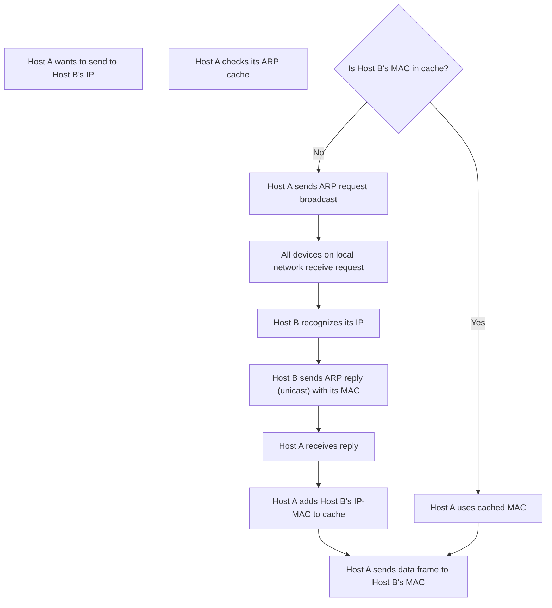

## IP Addresses vs. MAC Addresses
### Core Concepts

*   **IP Address (Internet Protocol Address):**
    *   **Logical Address:** Operates at the Network Layer (Layer 3) of the OSI model.
    *   **Purpose:** Identifies a device *on a network* (specifically, a network interface) and is used for routing data packets across different networks (e.g., the Internet).
    *   **Scope:** Global and hierarchical. Allows for efficient routing across large, complex networks.
    *   **Assignment:** Can be assigned dynamically (DHCP) or statically. Can change.

*   **MAC Address (Media Access Control Address):**
    *   **Physical Address:** Operates at the Data Link Layer (Layer 2) of the OSI model.
    *   **Purpose:** Identifies a specific Network Interface Card (NIC) and is used for communication *within a local network segment* (e.g., Ethernet, Wi-Fi).
    *   **Scope:** Local and flat. Not routable across routers.
    *   **Assignment:** "Burned-in" to the NIC by the manufacturer; theoretically unique worldwide. Generally fixed, though can be spoofed.

### Key Details & Nuances

*   **Layer Association:**
    *   **IP:** L3 (Network Layer) - Responsible for end-to-end communication across multiple network segments.
    *   **MAC:** L2 (Data Link Layer) - Responsible for local communication within a single network segment (hop-by-hop).
*   **Routability:**
    *   **IP:** Routable. Routers use IP addresses to forward packets between different subnets.
    *   **MAC:** Non-routable. MAC addresses are only relevant within a broadcast domain (LAN). Routers strip the L2 header and create a new one for the next hop.
*   **Format & Length:**
    *   **IP (IPv4):** 32-bit number, typically written as four decimal numbers separated by dots (e.g., `192.168.1.1`).
    *   **IP (IPv6):** 128-bit number, typically written as eight groups of four hexadecimal digits separated by colons (e.g., `2001:0db8:85a3:0000:0000:8a2e:0370:7334`).
    *   **MAC:** 48-bit number, typically written as six groups of two hexadecimal digits separated by colons or hyphens (e.g., `00:1A:2B:3C:4D:5E`). The first half often indicates the manufacturer (OUI).
*   **Relationship (ARP):** The Address Resolution Protocol (ARP) is used to map an IP address (L3) to its corresponding MAC address (L2) on the same local network segment. This is crucial for a device to deliver an IP packet to a specific host on its local network.

### Practical Examples

**1. Viewing IP and MAC Addresses on a System:**

```sh
# On Linux/macOS (using ip command, recommended over ifconfig)
ip a show eth0 # Replace eth0 with your network interface name
# Example Output Snippet:
# 2: eth0: <BROADCAST,MULTICAST,UP,LOWER_UP> mtu 1500 qdisc pfifo_fast state UP group default qlen 1000
#     link/ether 00:1a:2b:3c:4d:5e brd ff:ff:ff:ff:ff:ff # <-- MAC Address
#     inet 192.168.1.10/24 brd 192.168.1.255 scope global dynamic eth0 # <-- IP Address

# On Windows (using ipconfig)
ipconfig /all
# Example Output Snippet:
# Wireless LAN adapter Wi-Fi:
#    Connection-specific DNS Suffix  . :
#    Physical Address. . . . . . . . . : 00-1A-2B-3C-4D-5E # <-- MAC Address
#    IPv4 Address. . . . . . . . . . . : 192.168.1.10(Preferred) # <-- IP Address
```

**2. ARP Process for Local Communication:**

This diagram illustrates how a host discovers the MAC address for a known IP address on its local network.



### Common Pitfalls & Trade-offs

*   **Misconception of "Physical" vs. "Logical" Address Uniqueness:** While MAC addresses are *designed* to be globally unique, they can be spoofed. IP addresses are logical and can be reassigned, but within a network, an IP address should ideally be unique for active hosts.
*   **Routability Confusion:** A common mistake is assuming MAC addresses are used for routing across the internet. Emphasize that MAC addresses are only for local frame delivery, while IP addresses are for global packet delivery.
*   **Security Implications of MAC:** Since MAC addresses are local identifiers, relying solely on them for authentication is insecure (e.g., MAC filtering on Wi-Fi is easily bypassed by spoofing).
*   **Scalability Trade-off:** MAC addresses' flat structure would lead to massive routing tables and broadcast storms if used for global routing. IP's hierarchical structure (network prefix + host ID) allows for aggregation and efficient routing in large networks like the Internet.

### Interview Questions

1.  **Explain the fundamental difference between an IP address and a MAC address, and when each is used in network communication.**
    *   **Expert Answer:** An IP address is a logical, Network Layer (L3) address used for routing data packets across different networks (inter-network communication). It's software-configurable and can change. A MAC address is a physical, Data Link Layer (L2) address burned into a network interface card (NIC) and is used for direct communication within a single local network segment (intra-network communication). When a device wants to send data, it uses the destination IP to determine if it's local or remote. If local, ARP resolves the IP to a MAC; if remote, the packet is sent to the default gateway's MAC address, but its IP header contains the ultimate destination IP.

2.  **Describe how ARP facilitates communication between devices on the same local network segment.**
    *   **Expert Answer:** When a host (Host A) needs to send an IP packet to another host (Host B) on the same local network, and Host A doesn't know Host B's MAC address, it uses ARP. Host A sends an ARP request as a broadcast frame, containing Host B's IP address. All devices on the local segment receive it. Host B recognizes its IP address in the request and replies with an ARP response, a unicast frame containing its MAC address. Host A receives this response, updates its ARP cache, and can then encapsulate IP packets into Ethernet frames addressed directly to Host B's MAC address for local delivery.

3.  **Why are MAC addresses not used for routing data across the Internet, and what are the implications of this design choice?**
    *   **Expert Answer:** MAC addresses are not used for Internet routing because they represent a flat address space, making them non-hierarchical. If every device's MAC address needed to be known globally for routing, routing tables would be prohibitively large and inefficient, leading to massive performance bottlenecks and scalability issues. The implications are that routers operate primarily at Layer 3, stripping the incoming L2 header (with its destination MAC) and creating a new L2 header for the next hop based on the destination IP. This modularity allows for diverse underlying L2 technologies (Ethernet, Wi-Fi, Fibre Channel) to interoperate seamlessly at the IP layer.

4.  **Consider a scenario where you have two devices, Host A (192.168.1.10) and Host B (192.168.2.20), on different subnets connected by a router (Router's interface 1: 192.168.1.1, interface 2: 192.168.2.1). Trace the path of an IP packet from Host A to Host B, explaining how IP and MAC addresses are used at each hop.**
    *   **Expert Answer:**
        1.  **Host A to Router (1st Hop):**
            *   Host A determines Host B is on a different subnet by comparing their IP addresses.
            *   Host A sets the **destination IP** of the packet to `192.168.2.20` (Host B).
            *   Host A needs to send the packet to its default gateway (`192.168.1.1`). It uses ARP to resolve `192.168.1.1` to Router's MAC address (e.g., `Router_MAC_1`).
            *   Host A encapsulates the IP packet in an Ethernet frame with **destination MAC** `Router_MAC_1` and **source MAC** `HostA_MAC`.
        2.  **Router Processing:**
            *   The Router receives the frame on its `192.168.1.1` interface. It checks the destination MAC (`Router_MAC_1`) and accepts the frame.
            *   The Router de-encapsulates the frame, examining the IP packet header. It sees the destination IP is `192.168.2.20`.
            *   The Router performs a routing table lookup. It finds that `192.168.2.0/24` is directly connected via its `192.168.2.1` interface.
        3.  **Router to Host B (2nd Hop):**
            *   The Router performs ARP on the `192.168.2.1` interface to resolve Host B's IP (`192.168.2.20`) to its MAC address (e.g., `HostB_MAC`).
            *   The Router constructs a *new* Ethernet frame. The **destination MAC** is `HostB_MAC`, and the **source MAC** is `Router_MAC_2` (the MAC of the router's `192.168.2.1` interface). The original IP packet remains unchanged within this new frame.
            *   The Router sends this new frame out its `192.168.2.1` interface.
        4.  **Host B Reception:**
            *   Host B receives the frame, checks the destination MAC (`HostB_MAC`), and accepts it.
            *   Host B de-encapsulates the frame to reveal the IP packet, whose destination IP (`192.168.2.20`) matches its own. It then processes the packet.