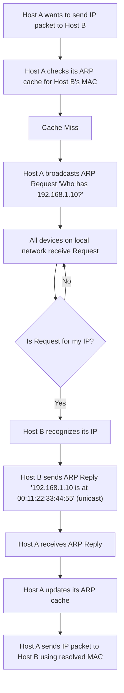

## ARP (Address Resolution Protocol)
### Core Concepts
*   **Purpose:** ARP (Address Resolution Protocol) maps a logical IP address to a physical MAC (Media Access Control) address on a local network segment (Layer 2). It's crucial for devices to communicate within the same broadcast domain.
*   **Necessity:** While IP addresses identify devices globally (Layer 3), data transfer on a local network requires MAC addresses to frame packets for delivery to the correct physical NIC (Network Interface Card). ARP bridges this gap.
*   **Scope:** Operates at the network interface layer (Layer 2.5), between Layer 2 (Data Link) and Layer 3 (Network).

### Key Details & Nuances
*   **ARP Cache:**
    *   Each device maintains a cache of recently resolved IP-to-MAC mappings.
    *   When an IP packet needs to be sent to a destination on the local network, the sending device first checks its ARP cache.
    *   **TTL (Time-to-Live):** Entries in the ARP cache have a timeout (e.g., 20 minutes for dynamic entries on Windows) after which they are removed, forcing a new ARP resolution. Static entries can be added manually.
*   **ARP Request:**
    *   If a mapping is not found in the cache, the sending device broadcasts an ARP request.
    *   The request contains the sender's IP and MAC, and the target's IP address (target MAC is unknown/zero).
    *   The Layer 2 destination MAC address for a broadcast is `FF:FF:FF:FF:FF:FF`.
*   **ARP Reply:**
    *   Only the device with the matching target IP address responds.
    *   The reply is sent unicast directly to the requesting device's MAC address (found in the request).
    *   The reply contains the sender's IP and MAC (which is the MAC address the original requester needed).
*   **Gratuitous ARP:**
    *   A device sends an ARP reply *without* an ARP request.
    *   **Uses:**
        *   **Duplicate IP Detection:** Sent when a device boots up or an interface comes online to see if any other device is using its configured IP address.
        *   **MAC Address Update:** Notifies other devices of a MAC address change for a given IP (e.g., after a failover in a high-availability cluster), allowing them to update their ARP caches without waiting for their current entry to expire.
*   **Proxy ARP:** A router or Layer 3 switch responds to ARP requests for IP addresses that are not on the local segment but reachable via that router, making the router appear as the target device.
*   **RARP (Reverse ARP):** Obsolete protocol (replaced by BOOTP/DHCP) used by a diskless workstation to discover its own IP address from its MAC address.

### Practical Examples

#### ARP Request/Reply Flow


#### Checking ARP Cache (Linux/macOS)
```sh
# View current ARP cache entries
arp -a

# Add a static ARP entry (requires root)
# sudo arp -s 192.168.1.10 00:11:22:33:44:55
```

### Common Pitfalls & Trade-offs
*   **Broadcast Overhead:** ARP requests are broadcasts. While caching reduces frequent broadcasts, a large number of cache misses can generate significant network traffic.
*   **ARP Spoofing/Poisoning:** A malicious actor sends forged ARP replies, associating their MAC address with another device's IP address (e.g., the default gateway). This allows them to intercept, modify, or drop traffic (Man-in-the-Middle attack).
    *   **Mitigation:** Static ARP entries (impractical for large networks), ARP inspection on switches, port security, DHCP snooping.
*   **ARP Cache Issues:** Incorrect or stale entries in the cache can lead to connectivity problems. Clearing the cache (`arp -d *` on Windows, `ip neigh flush all` on Linux) can resolve these issues.

### Interview Questions

1.  **Explain the role of ARP in the OSI model and how it enables communication between devices.**
    *   **Answer:** ARP operates between Layer 2 (Data Link) and Layer 3 (Network) – sometimes referred to as Layer 2.5. Its primary role is to resolve Layer 3 IP addresses to Layer 2 MAC addresses. When an IP packet needs to be sent to a destination on the local network, the sender needs the destination's MAC address to correctly frame the Ethernet packet. ARP facilitates this translation, allowing IP-based communication to traverse the local physical medium.

2.  **Describe the step-by-step process of how a host resolves an IP address to a MAC address using ARP, including the roles of ARP request and ARP reply.**
    *   **Answer:**
        1.  **Cache Check:** Host A (sender) first checks its local ARP cache for the MAC address corresponding to the target IP address.
        2.  **ARP Request (Broadcast):** If not found, Host A broadcasts an ARP request packet on the local network segment. This packet contains Host A's IP and MAC address, and the target IP address. The Layer 2 destination MAC is `FF:FF:FF:FF:FF:FF`.
        3.  **Reception & Identification:** All devices on the local segment receive the broadcast. Only the device whose IP address matches the target IP in the request processes it.
        4.  **ARP Reply (Unicast):** The target host (Host B) then sends a unicast ARP reply directly back to Host A. This reply contains Host B's IP and MAC address.
        5.  **Cache Update:** Host A receives the reply, updates its ARP cache with the new IP-to-MAC mapping, and can now send the IP packet using the resolved MAC address.

3.  **What is an ARP cache, why is it important, and what are the implications of its Time-to-Live (TTL)?**
    *   **Answer:** An ARP cache is a local table maintained by each network device that stores recently resolved IP-to-MAC address mappings. It's crucial for efficiency because it prevents the need for an ARP broadcast for every new packet sent to a known local destination, significantly reducing network traffic and improving communication speed. Each entry in the ARP cache has a TTL. When this TTL expires, the entry is removed, forcing a new ARP resolution process. This is important for network fluidity (e.g., if a device changes its MAC address due to a NIC replacement or failover) and to prevent stale entries, but it also introduces the overhead of re-discovery.

4.  **When and why is Gratuitous ARP used? Provide at least two scenarios.**
    *   **Answer:** Gratuitous ARP is an unsolicited ARP reply, meaning it's sent without a prior ARP request. It serves two primary purposes:
        1.  **Duplicate IP Address Detection:** When a device initializes its network interface or is assigned an IP address, it sends a gratuitous ARP to check if any other device on the network is already using that IP. If it receives a reply, it indicates an IP address conflict.
        2.  **Updating ARP Caches:** In scenarios like failover in a high-availability cluster (e.g., VRRP/HSRP) or after a MAC address change, a device can send a gratuitous ARP. This proactively updates the ARP caches of other devices on the network, preventing them from sending traffic to an old or incorrect MAC address and ensuring smooth traffic flow without waiting for ARP cache entries to expire.

5.  **Discuss the security implications associated with ARP and how common attacks like ARP spoofing work.**
    *   **Answer:** ARP is stateless and trusts replies by default, making it vulnerable to various attacks, primarily **ARP Spoofing** (also known as ARP Poisoning).
        *   **How it works:** A malicious actor (attacker) sends forged ARP replies to other devices on the network. For example, the attacker sends a crafted ARP reply to Host A, claiming that the default gateway's IP address (Router R) is associated with the attacker's MAC address. Simultaneously, the attacker sends a forged ARP reply to Router R, claiming that Host A's IP address is associated with the attacker's MAC address.
        *   **Impact:** All traffic between Host A and Router R (and thus the internet) is then routed through the attacker's machine, allowing the attacker to perform a **Man-in-the-Middle (MitM)** attack, intercepting, inspecting, modifying, or dropping the traffic. This can lead to data theft, session hijacking, or denial of service.
        *   **Mitigation:** Techniques like static ARP entries (not scalable), ARP inspection/dynamic ARP inspection (DAI) on managed switches, port security, and DHCP snooping are used to combat ARP spoofing.