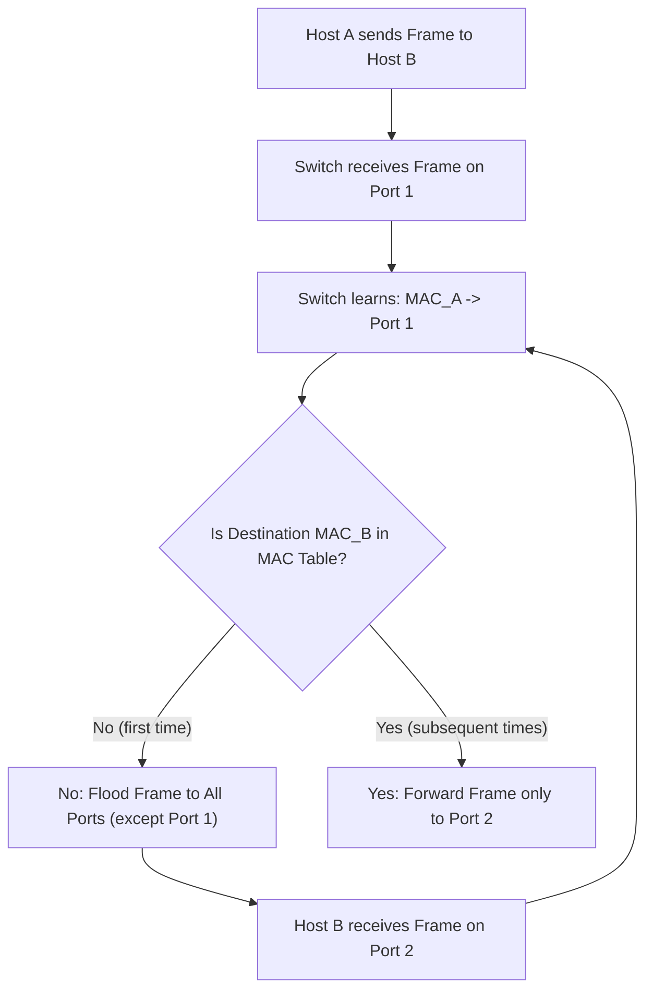

## Switches vs. Routers vs. Hubs
### Core Concepts

*   **Hub (Layer 1 - Physical):**
    *   Acts as a multi-port repeater.
    *   Receives data bits on one port and broadcasts them to all other connected ports.
    *   Operates at the Physical Layer, without understanding frames or packets.
    *   All devices connected to a hub share the same collision domain and broadcast domain.
*   **Switch (Layer 2 - Data Link):**
    *   Intelligent device that forwards Ethernet frames based on **MAC addresses**.
    *   Learns MAC-to-port mappings and stores them in a **MAC address table (CAM table)**.
    *   Forwards frames only to the intended destination port, reducing unnecessary traffic.
    *   Each switch port creates its own **collision domain**. All ports typically belong to a single **broadcast domain** by default.
*   **Router (Layer 3 - Network):**
    *   Connects different IP networks (e.g., LAN to WAN, different subnets).
    *   Forwards IP packets based on **IP addresses** and a **routing table**.
    *   Acts as a default gateway for devices on connected networks.
    *   Each router interface separates **broadcast domains** and **collision domains**.

### Key Details & Nuances

*   **Collision Domains:**
    *   **Hub:** All devices on a hub are in a single collision domain. Collisions are common in half-duplex environments.
    *   **Switch:** Each port on a switch is its own collision domain. This allows for full-duplex communication and minimizes collisions.
    *   **Router:** Each interface on a router is its own collision domain.
*   **Broadcast Domains:**
    *   **Hub:** All devices on a hub are in the same broadcast domain.
    *   **Switch:** By default, all ports on a switch are in a single broadcast domain. VLANs (Virtual LANs) can be configured on a switch to segment a single physical switch into multiple logical broadcast domains.
    *   **Router:** Routers do not forward broadcast traffic between interfaces by default, effectively separating broadcast domains.
*   **Forwarding Logic:**
    *   **Hub:** Simple electrical signal repetition.
    *   **Switch:**
        1.  **Learning:** When a frame arrives, the switch records the source MAC address and its incoming port.
        2.  **Forwarding:**
            *   If the destination MAC is known, forward only to that specific port.
            *   If the destination MAC is unknown or it's a broadcast/multicast frame, flood the frame out all ports (except the source port).
    *   **Router:**
        1.  Receives an IP packet.
        2.  Examines the destination IP address.
        3.  Consults its routing table to find the best path (next hop IP or outgoing interface).
        4.  Decrements TTL (Time-to-Live) and recalculates checksum.
        5.  Encapsulates the packet into a new Layer 2 frame (e.g., Ethernet frame) appropriate for the outgoing interface, using the next hop's MAC address.

### Practical Examples

**Switch MAC Address Learning and Forwarding Process:**

### Common Pitfalls & Trade-offs

*   **Hubs:**
    *   **Pitfall:** High collision rates lead to poor performance and network slowdowns, especially with increased traffic. Security risk as all traffic is visible on all ports.
    *   **Trade-off:** Low cost (historically), simple to set up. Almost entirely obsolete in modern networks.
*   **Switches:**
    *   **Pitfall:** Can lead to **broadcast storms** in large flat networks if not segmented with VLANs, affecting performance. Requires management for advanced features like VLANs or QoS.
    *   **Trade-off:** Significant performance improvement over hubs. Cost-effective for local network connectivity. Intelligent forwarding provides better security than hubs.
*   **Routers:**
    *   **Pitfall:** Introduces higher latency due to Layer 3 processing (packet inspection, routing table lookup, TTL decrement, checksum recalculation). More complex to configure compared to switches. More expensive.
    *   **Trade-off:** Essential for inter-network communication and internet access. Provides network segmentation, security (ACLs), and NAT capabilities.

### Interview Questions

1.  **Question:** Explain the primary function of a Hub, Switch, and Router, and identify the OSI layer at which each operates.
    **Answer:**
    *   **Hub (Layer 1 - Physical):** Repeats incoming electrical signals to all other ports, functioning as a shared connection point for devices in a network segment.
    *   **Switch (Layer 2 - Data Link):** Forwards data frames intelligently based on MAC addresses, learning the location of devices on specific ports. It creates separate collision domains per port.
    *   **Router (Layer 3 - Network):** Forwards data packets between different IP networks (subnets) based on IP addresses and routing tables. Each interface separates broadcast domains.

2.  **Question:** Differentiate between collision domains and broadcast domains, and explain how Hubs, Switches, and Routers affect them.
    **Answer:**
    *   **Collision Domain:** A network segment where data packets can collide, requiring retransmission.
        *   **Hub:** One large collision domain for all connected devices.
        *   **Switch:** Each port is its own collision domain (eliminating most collisions).
        *   **Router:** Each interface is its own collision domain.
    *   **Broadcast Domain:** A logical division of a computer network where all nodes can reach each other by broadcast at the data link layer.
        *   **Hub:** One large broadcast domain.
        *   **Switch:** Typically one broadcast domain across all ports by default; can be segmented using VLANs.
        *   **Router:** Each interface defines a separate broadcast domain (routers do not forward broadcasts).

3.  **Question:** In what scenarios would you choose a switch over a router, and vice-versa, for network connectivity?
    **Answer:**
    *   **Choose a Switch when:** You need to connect multiple devices within the *same local network* (e.g., all devices in one office building or a single subnet). Switches provide efficient intra-network communication, reduce collisions, and can segment broadcast domains using VLANs within that local network.
    *   **Choose a Router when:** You need to connect *different networks* (e.g., your internal LAN to the Internet, or two different subnets within a large organization). Routers are essential for inter-network communication, provide security through ACLs, and handle network address translation (NAT).

4.  **Question:** Describe how a switch builds and uses its MAC address table (CAM table).
    **Answer:** A switch builds its MAC address table through a process called **MAC learning**.
    *   When a switch receives a frame, it inspects the **source MAC address** of the frame and the **port** on which it was received. It then records this MAC-to-port mapping in its CAM table.
    *   When the switch needs to forward a frame, it looks up the **destination MAC address** in its CAM table.
        *   If the destination MAC is found, the switch forwards the frame *only* to the associated port (unicast).
        *   If the destination MAC is not found (or it's a broadcast/multicast frame), the switch floods the frame out all ports except the one it came in on. This helps it learn the location of the destination device when it eventually responds.
    *   Entries in the MAC table have a timeout and are periodically refreshed to ensure accuracy.