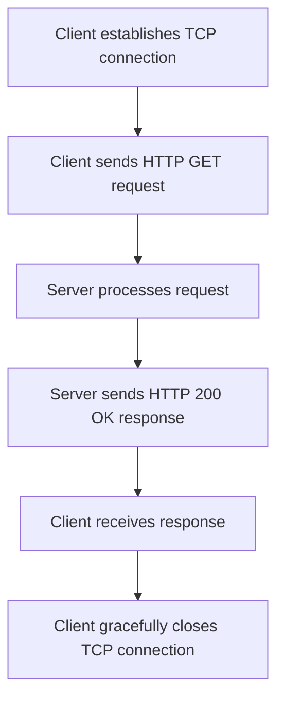

## TCP vs. UDP
### Core Concepts

*   **Transport Layer Protocols:** TCP (Transmission Control Protocol) and UDP (User Datagram Protocol) operate at the Transport Layer (Layer 4) of the TCP/IP model. They provide end-to-end communication between applications.
*   **TCP (Transmission Control Protocol):**
    *   **Connection-Oriented:** Establishes a connection (via a three-way handshake) before data transfer.
    *   **Reliable:** Guarantees delivery of data, retransmits lost segments, and provides acknowledgments.
    *   **Ordered:** Ensures data segments are delivered in the order they were sent.
    *   **Flow Control:** Prevents a fast sender from overwhelming a slow receiver (using sliding windows).
    *   **Congestion Control:** Manages network traffic to prevent network collapse (e.g., slow-start, congestion avoidance).
    *   **Full-duplex:** Data can be sent in both directions simultaneously.
    *   **Applications:** HTTP(S), FTP, SMTP, SSH, WebSockets.
*   **UDP (User Datagram Protocol):**
    *   **Connectionless:** No prior connection establishment required; data (datagrams) sent directly.
    *   **Unreliable:** No guarantee of delivery, order, or duplication prevention. No acknowledgments or retransmissions built-in.
    *   **Minimal Overhead:** Faster due to less protocol overhead and no connection setup/teardown.
    *   **No Flow/Congestion Control:** Leaves these responsibilities to the application layer.
    *   **Applications:** DNS, VoIP, Video Streaming, Online Gaming, SNMP.

### Key Details & Nuances

*   **Header Size:** TCP headers are typically 20 bytes (plus options), while UDP headers are a fixed 8 bytes. This contributes to UDP's lower overhead.
*   **Reliability Mechanism (TCP):** Uses sequence numbers to order segments, acknowledgments (ACKs) for received data, and timers for retransmission of unacknowledged segments.
*   **Three-Way Handshake (TCP):**
    1.  **SYN:** Client sends a SYN (synchronize sequence numbers) segment to the server.
    2.  **SYN-ACK:** Server responds with a SYN-ACK (synchronize-acknowledge) segment.
    3.  **ACK:** Client sends an ACK (acknowledge) segment, establishing the connection.
*   **Four-Way Handshake (TCP Connection Teardown):**
    1.  **FIN:** One side sends a FIN (finish) segment.
    2.  **ACK:** The other side acknowledges the FIN.
    3.  **FIN:** The other side then sends its own FIN.
    4.  **ACK:** The first side acknowledges the second FIN.
*   **Port Numbers:** Both TCP and UDP use port numbers to multiplex/demultiplex data to/from specific applications on a host.
*   **Head-of-Line Blocking (TCP):** If a segment is lost, all subsequent segments, even if received, must wait for the retransmission of the lost segment to be processed in order. This can introduce latency. UDP does not suffer from this at the transport layer, but applications built on top of it might introduce their own ordering and blocking.
*   **Building Reliability over UDP:** For certain applications (e.g., QUIC, custom gaming protocols), developers might choose UDP for its speed and then implement selective reliability, ordering, and congestion control at the application layer to achieve specific performance goals not easily met by TCP.

### Practical Examples

**1. TCP HTTP Request/Response Flow (Conceptual)**

This diagram illustrates the ordered and reliable data exchange characteristic of TCP, fundamental for protocols like HTTP.



**2. UDP Datagram Exchange (Node.js)**

This example shows the connectionless nature of UDP, where a client sends a message and a server can respond without a prior handshake.

```typescript
// --- UDP Server (receiver) ---
const dgram = require('dgram');
const server = dgram.createSocket('udp4');

server.on('message', (msg, rinfo) => {
  console.log(`[UDP Server] Received: "${msg}" from ${rinfo.address}:${rinfo.port}`);
  // Respond to the client directly
  server.send('ACK: ' + msg, rinfo.port, rinfo.address, (err) => {
    if (err) console.error('[UDP Server] Error sending ACK:', err);
    else console.log(`[UDP Server] Sent ACK to ${rinfo.address}:${rinfo.port}`);
  });
});

server.on('listening', () => {
  const address = server.address();
  console.log(`[UDP Server] Listening on ${address.address}:${address.port}`);
});

server.on('error', (err) => {
  console.error(`[UDP Server] Error: ${err.stack}`);
  server.close();
});

server.bind(41234); // Server listens on port 41234

// --- UDP Client (sender) ---
// (Run this in a separate process or after the server is listening)
const client = dgram.createSocket('udp4');
const message = Buffer.from('Hello UDP World!');

client.send(message, 41234, 'localhost', (err) => {
  if (err) console.error('[UDP Client] Error sending message:', err);
  else console.log('[UDP Client] Message sent.');
});

client.on('message', (msg, rinfo) => {
  console.log(`[UDP Client] Received response: "${msg}" from ${rinfo.address}:${rinfo.port}`);
  client.close(); // Close client after receiving response
});

client.on('error', (err) => {
  console.error(`[UDP Client] Error: ${err.stack}`);
  client.close();
});

// To run this:
// 1. Save as e.g., `udp_example.js`
// 2. Run `node udp_example.js` (server starts)
// 3. In another terminal, run `node -e "require('./udp_example.js'); client.send(message, 41234, 'localhost', console.log);"` (client sends, then logs response and closes)
```

### Common Pitfalls & Trade-offs

*   **Misconception of "Unreliable":** UDP being "unreliable" doesn't mean it's bad. It means the application *must* handle reliability if needed. For many use cases (e.g., streaming), dropping a few packets is preferable to retransmitting and delaying the entire stream.
*   **Choice of Protocol:** Incorrectly choosing TCP for real-time, loss-tolerant applications (e.g., VoIP) can lead to higher latency due to retransmissions of packets that are no longer useful. Conversely, using UDP for applications requiring high data integrity (e.g., file transfer) without building robust reliability mechanisms is a major design flaw.
*   **TCP Overhead vs. Application Complexity:** While TCP handles reliability, flow, and congestion control, this comes with overhead (larger headers, connection management, latency for retransmissions). Building similar features on top of UDP adds application complexity, but offers fine-grained control and can potentially achieve lower latency or higher throughput for specific scenarios by avoiding TCP's general-purpose mechanisms.
*   **Network Address Translation (NAT) Issues with UDP:** UDP's connectionless nature can make it harder to traverse NATs reliably without techniques like NAT punch-through or relay servers, as there's no persistent "connection" state for the NAT to maintain.

### Interview Questions

1.  **When would you choose UDP over TCP for an application, and what are the trade-offs involved?**
    *   **Answer:** Choose UDP when real-time performance, low latency, and minimal overhead are critical, and occasional packet loss is acceptable or can be handled at the application layer. Examples include VoIP, video streaming, online gaming, and DNS lookups. The trade-offs are sacrificing built-in reliability, ordering, flow control, and congestion control, requiring the application to manage these aspects if necessary, or tolerate their absence.
2.  **Explain the TCP three-way handshake and its purpose. What is the significance of the sequence numbers exchanged?**
    *   **Answer:** The three-way handshake (SYN, SYN-ACK, ACK) establishes a full-duplex, reliable connection. Its purpose is to synchronize initial sequence numbers between the client and server. The sequence numbers define the order of bytes transmitted, ensuring reliable, in-order delivery. They also allow each side to acknowledge the bytes it has received and indicate the next expected byte, facilitating flow control and retransmission.
3.  **How does TCP manage network congestion? Describe one mechanism.**
    *   **Answer:** TCP uses several mechanisms to manage congestion, primarily by dynamically adjusting the sending rate based on network conditions. One key mechanism is **Slow Start**, where TCP initially starts sending data at a low rate (small congestion window) and exponentially increases it with each acknowledgment received, until a loss event occurs or a threshold is reached. Another is **Congestion Avoidance**, where after slow start, the congestion window increases linearly to probe for available bandwidth, backing off upon packet loss.
4.  **Can you implement a reliable file transfer protocol using UDP? If so, what challenges would you face and how might you address them?**
    *   **Answer:** Yes, it's possible (e.g., TFTP, QUIC). Challenges include:
        *   **Reliability:** Implementing acknowledgments and retransmission timers for lost packets.
        *   **Ordering:** Using sequence numbers to reassemble packets in the correct order and handle duplicates.
        *   **Flow Control:** Managing the sender's rate to prevent overwhelming the receiver's buffer.
        *   **Congestion Control:** Preventing network overload by adapting to perceived congestion.
        *   **Error Detection:** Implementing checksums for data integrity.
    *   These are essentially rebuilding much of what TCP provides, but with the flexibility to optimize for specific use cases (e.g., faster connection setup, multi-streaming without head-of-line blocking).
5.  **What is TCP's head-of-line blocking (HOLB), and why is it a concern for certain applications?**
    *   **Answer:** TCP's HOLB occurs because TCP guarantees ordered delivery. If a segment in the stream is lost or delayed, all subsequent segments that have arrived cannot be processed by the application until the missing segment is successfully retransmitted and placed in its correct order. This is a concern for applications sensitive to latency, especially those that can tolerate some packet loss (e.g., real-time video streaming), because a single lost packet can cause a delay for *all* subsequent packets, impacting user experience. Protocols like QUIC (built on UDP) mitigate this by allowing multiple independent streams within a single connection.