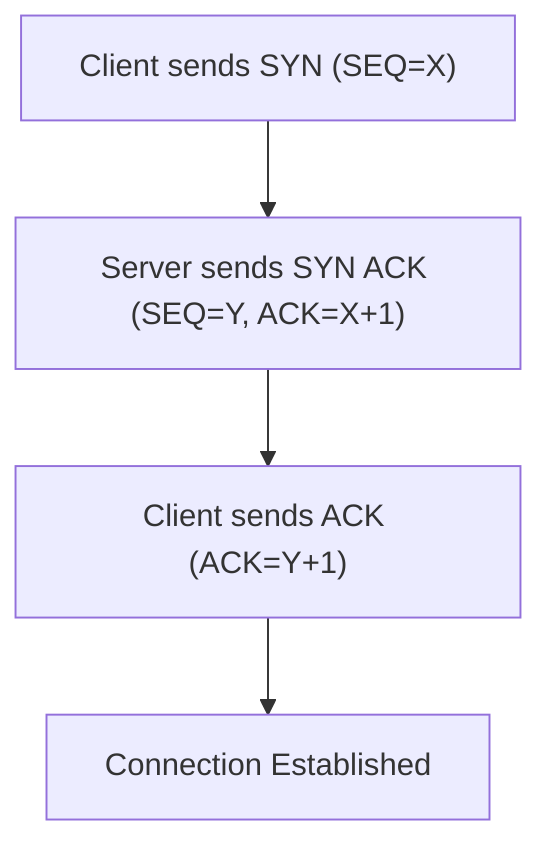
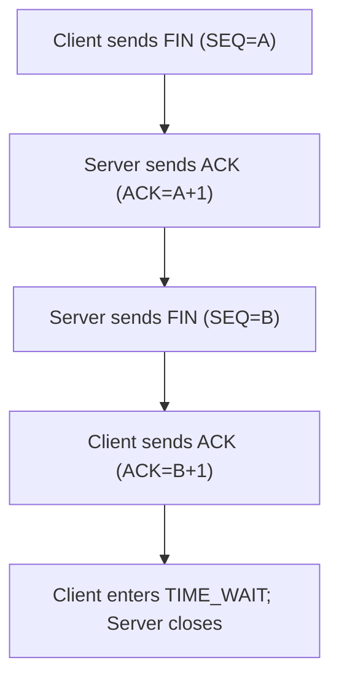

## TCP 3-Way Handshake & Connection Termination
### Core Concepts

*   **TCP (Transmission Control Protocol):** A connection-oriented, reliable, byte-stream protocol built on IP. It ensures data delivery, order, and error checking.
*   **3-Way Handshake (Connection Establishment):** The process used by TCP to establish a reliable connection between a client and a server. It involves three steps to synchronize sequence numbers and acknowledge readiness for communication.
*   **4-Way Handshake (Connection Termination):** The process used by TCP to gracefully close a connection. It's typically a four-step process, allowing both sides to independently signal that they have no more data to send and acknowledge the other's termination request.

### Key Details & Nuances

#### TCP 3-Way Handshake

*   **Purpose:**
    *   Synchronize initial sequence numbers (ISNs) for both client and server.
    *   Ensure both parties are ready to send and receive data.
    *   Negotiate connection parameters (e.g., Maximum Segment Size - MSS, window scale, SACK support).
*   **Steps (SYN, SYN-ACK, ACK):**
    1.  **SYN (Synchronize Sequence Number):** Client sends a segment with its ISN to the server.
    2.  **SYN-ACK (Synchronize-Acknowledge):** Server responds with its own ISN and acknowledges the client's ISN.
    3.  **ACK (Acknowledge):** Client acknowledges the server's ISN.
*   **Why 3 Steps?**
    *   **Avoid Old Duplicate Connections:** Prevents a retransmitted SYN from a previous, defunct connection from establishing a new one. The 3rd ACK confirms the server received the client's acknowledgement of its SYN-ACK, ensuring both sides agree on the connection's validity.
    *   **Symmetric Setup:** Allows both sides to simultaneously verify initial sequence numbers and ensure half-duplex communication is ready in both directions.

#### TCP Connection Termination (4-Way Handshake)

*   **Purpose:** Gracefully close a TCP connection, ensuring all pending data is transmitted and acknowledged before full closure.
*   **Steps (FIN, ACK, FIN, ACK):**
    1.  **FIN (Finish):** One side (e.g., Client) sends a FIN segment, indicating it has no more data to send.
    2.  **ACK (Acknowledge):** The other side (Server) acknowledges the received FIN. At this point, the connection is half-closed: Client won't send more data, but Server can still send data.
    3.  **FIN (Finish):** After the Server finishes sending its data, it sends its own FIN segment.
    4.  **ACK (Acknowledge):** The Client acknowledges the Server's FIN.
*   **Why 4 Steps?** TCP connections are full-duplex. Each side must independently close its sending half of the connection. The `FIN` is a request to close the sending half, and `ACK` is an acknowledgment of that request. The 4-way exchange allows for this independent closure.
*   **TIME_WAIT State:** After the last ACK in the 4-way handshake, the side that initiated the final ACK (typically the client) enters `TIME_WAIT` state for `2 * MSL` (Maximum Segment Lifetime).
    *   **Purpose:**
        *   **Reliable FIN ACK Delivery:** Ensures the last ACK reaches the server. If the ACK is lost, the server retransmits its FIN, and the client in `TIME_WAIT` can re-ACK it.
        *   **Prevent Old Duplicates:** Prevents segments from the old connection (delayed in the network) from being misinterpreted by a new connection using the same source/destination port pair.
    *   **Trade-offs:** Can lead to "port exhaustion" on busy servers if many connections are rapidly opened and closed, as ports remain unavailable during `TIME_WAIT`.

### Practical Examples

#### TCP 3-Way Handshake Diagram



#### TCP 4-Way Handshake (Termination) Diagram



#### Conceptual Node.js Server/Client Interaction

```typescript
// Server side (Conceptual)
import * as net from 'net';

const server = net.createServer((socket) => {
  console.log('Client connected.');

  socket.on('data', (data) => {
    console.log(`Server received: ${data.toString()}`);
    socket.write('Hello from server!');
  });

  socket.on('end', () => {
    // Client has sent a FIN and its sending half is closed
    console.log('Client disconnected gracefully (FIN received).');
  });

  socket.on('close', () => {
    // Both sides of the connection are fully closed
    console.log('Socket fully closed.');
  });

  // To initiate server-side termination after some logic:
  // socket.end('Goodbye from server!'); // Sends FIN
});

server.listen(3000, () => {
  console.log('Server listening on port 3000');
});

// Client side (Conceptual)
import * as net from 'net';

const client = new net.Socket();

client.connect(3000, 'localhost', () => {
  console.log('Connected to server.');
  client.write('Hello from client!');
});

client.on('data', (data) => {
  console.log(`Client received: ${data.toString()}`);
  client.end(); // Client initiates FIN to close its sending half
});

client.on('close', () => {
  // Client's socket is fully closed (after TIME_WAIT if client initiated last ACK)
  console.log('Client socket fully closed.');
});

client.on('end', () => {
  // Server has sent a FIN and its sending half is closed
  console.log('Server disconnected gracefully (FIN received).');
});
```

### Common Pitfalls & Trade-offs

*   **SYN Flood Attack:** A denial-of-service attack where an attacker sends a large number of SYN requests with spoofed source IPs. The server allocates resources for each half-open connection (in `SYN_RCVD` state) and exhausts its connection table or memory.
    *   **Mitigation:** SYN cookies, firewall rules, increasing backlog queue size, SYN proxy.
*   **TIME_WAIT State Issues:** Excessive `TIME_WAIT` connections can lead to "port exhaustion" on client machines (or servers acting as clients), as ports are held for `2 * MSL`.
    *   **Trade-offs:** Shortening `MSL` or reusing ports (`SO_REUSEADDR`) can mitigate port exhaustion but increases the risk of old packets interfering with new connections. `SO_REUSEPORT` is often a better option for load balancing.
*   **CLOSE_WAIT State:** Occurs when the local application has received a FIN from the remote host but has not yet called `close()` or `end()` on the socket. This indicates the remote side has closed its sending half, but the local application is still holding the connection open.
    *   **Pitfall:** A `CLOSE_WAIT` state that persists indefinitely often signals an application bug (e.g., not closing resources or sockets properly).
*   **Abrupt Termination (RST):** TCP `RST` (Reset) segment immediately terminates a connection without a graceful handshake or `TIME_WAIT` state.
    *   **Use Cases:** Error conditions (e.g., trying to connect to a non-existent port), ungraceful application crashes.
    *   **Trade-offs:** Any unacknowledged data is discarded, which can lead to data loss. `RST` is not part of normal graceful shutdown.

### Interview Questions

1.  **Why is the TCP handshake a 3-way process and not a 2-way process?**
    *   **Answer:** A 3-way handshake is necessary to establish a reliable, full-duplex connection by synchronizing initial sequence numbers (ISNs) for both sides and ensuring that both parties are ready to transmit data. A 2-way handshake (SYN, SYN-ACK) risks establishing connections based on old, delayed duplicate SYNs, leading to false connections or data corruption if one of the initial SYN or SYN-ACK packets is lost or delayed. The third ACK explicitly confirms the receipt of the server's SYN-ACK and the client's readiness to proceed, completing the ISN synchronization for both directions.

2.  **Explain the purpose of the `TIME_WAIT` state in TCP connection termination. What are its potential downsides and how can they be mitigated?**
    *   **Answer:** `TIME_WAIT` ensures reliable delivery of the final ACK to the peer and prevents delayed segments from a previous incarnation of the connection from being confused with segments of a new connection. Without it, if the last ACK is lost, the server would retransmit its FIN, but the client would have already closed its port, leading to an RST. The downside is "port exhaustion" on busy systems, where rapidly closing connections tie up ports for `2 * MSL` (typically 1-4 minutes), preventing new connections from using those ports. Mitigation includes using `SO_REUSEADDR` (carefully, as it reuses a port even if it's in `TIME_WAIT`, potentially leading to issues), `SO_REUSEPORT` (allowing multiple sockets to bind to the same port), or reducing the `MSL` value on the OS, though the latter is generally not recommended due to reliability risks.

3.  **How does a SYN Flood attack work, and what are common techniques to defend against it?**
    *   **Answer:** A SYN Flood attack is a DoS attack where an attacker sends a large volume of SYN requests to a server, often with spoofed source IP addresses. The server responds with SYN-ACKs and allocates resources (e.g., in its connection backlog queue) for each half-open connection, waiting for the final ACK that never arrives. This exhausts the server's resources, making it unable to handle legitimate connection requests. Common defenses include:
        *   **SYN Cookies:** A server-side technique where the server doesn't store state for the half-open connection but encodes information (like the client's ISN) in the SYN-ACK's sequence number. Only if a valid ACK is received is the connection state created.
        *   **Increasing Backlog Queue Size:** Allows the server to handle more half-open connections, but this is a temporary measure and doesn't solve the core problem.
        *   **Firewall Rules:** Rate-limiting SYN requests from suspicious IPs.
        *   **SYN Proxies/Load Balancers:** Intercept SYN requests and only forward them to the backend server once the 3-way handshake is complete.

4.  **Describe the difference between a graceful TCP connection termination (4-way handshake) and an abrupt termination using an RST flag. When would you typically use each?**
    *   **Answer:**
        *   **Graceful Termination (4-way handshake):** This is the standard, polite way to close a TCP connection. Both sides independently signal `FIN` when they have no more data to send and acknowledge the other's `FIN`. This ensures all data in transit is acknowledged and no data is lost. It's typically used for normal application shutdown, client disconnecting politely, etc.
        *   **Abrupt Termination (RST):** Sending a `RST` (Reset) flag immediately tears down the connection. Any unacknowledged data on either side is discarded without notification. It's used in error conditions, such as:
            *   Trying to connect to a non-existent port (server sends RST).
            *   Detecting an invalid segment for an active connection.
            *   Application crash or forced termination where immediate closure is required, or data loss is acceptable/expected.

5.  **What role do sequence numbers and acknowledgment numbers play in TCP, particularly during connection establishment and termination?**
    *   **Answer:**
        *   **Sequence Numbers (SEQ):** Indicate the byte offset of the first byte of data in the current segment relative to the first byte sent in the entire connection. During the handshake, the Initial Sequence Number (ISN) is chosen, acting as a starting point. They ensure data order and detect lost or duplicate segments.
        *   **Acknowledgment Numbers (ACK):** Indicate the next sequence number (i.e., the next byte) that the sender expects to receive from the other side. They provide reliable data transfer by confirming receipt of previous data.
        *   **During Handshake:** Both SEQ and ACK numbers are crucial for synchronizing the ISNs of the client and server. The client sends its ISN (SYN), the server acknowledges it and sends its own ISN (SYN-ACK), and the client then acknowledges the server's ISN (ACK).
        *   **During Termination:** `FIN` segments also carry sequence numbers. The `ACK` segments during termination confirm the receipt of the `FIN` request, ensuring that both sides acknowledge the desire to close the connection and that any pending data has been fully received.