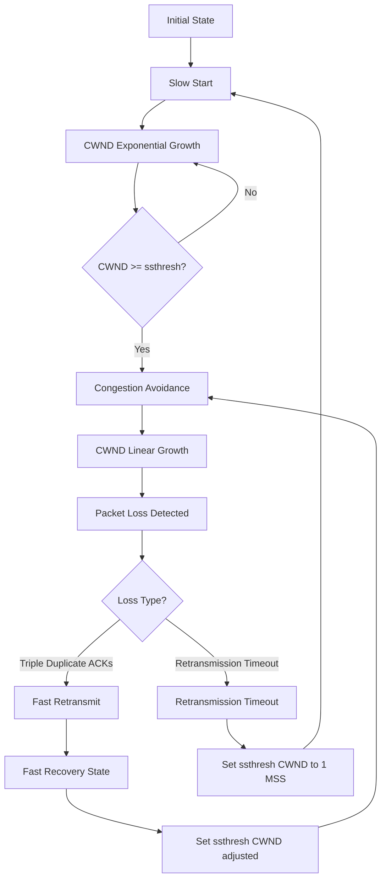

## TCP Flow Control & Congestion Control
### Core Concepts

*   **TCP Flow Control:**
    *   **Purpose:** Prevents a fast sender from overwhelming a slow receiver. It ensures the sender transmits data only as fast as the receiver can process it and buffer it.
    *   **Mechanism:** Receiver-driven. The receiver advertises its available buffer space (Receiver Window, `RWND`) in every TCP ACK segment. The sender must not send more unacknowledged data than the advertised `RWND`.

*   **TCP Congestion Control:**
    *   **Purpose:** Prevents a sender (or multiple senders) from overwhelming the network itself, leading to congestion collapse (packet loss, increased latency, retransmissions). It aims to find the optimal sending rate that the network can sustain.
    *   **Mechanism:** Network-driven (indirectly, via packet loss/ACKs). The sender maintains a Congestion Window (`CWND`), an estimate of how much data the network can handle. The sender's effective sending window is `min(RWND, CWND)`.

### Key Details & Nuances

*   **Flow Control Details:**
    *   **Sliding Window Protocol:** TCP uses a sliding window for both flow control and reliable delivery. The `RWND` indicates the size of the receiver's available buffer for incoming data.
    *   **Zero Window Probe:** If the `RWND` becomes 0 (receiver buffer full), the sender stops transmitting. To prevent deadlock, the sender periodically sends a small (1-byte) "zero window probe" to elicit a new `RWND` advertisement from the receiver.

*   **Congestion Control Details (AIMD principle: Additive Increase, Multiplicative Decrease):**
    *   **Congestion Window (`CWND`):** Represents the sender's estimate of the network's capacity. It is dynamically adjusted based on network conditions.
    *   **`ssthresh` (Slow Start Threshold):** A dynamic variable that dictates the transition point from Slow Start to Congestion Avoidance. Its value is often initialized to a high value, but significantly reduced upon congestion detection.
    *   **Phases:**
        *   **Slow Start:**
            *   **Initial `CWND`:** Typically 1-10 MSS (Maximum Segment Size).
            *   **Growth:** `CWND` increases exponentially. For every ACK received, `CWND` increases by 1 MSS. This means `CWND` doubles every Round-Trip Time (RTT).
            *   **Transition:** Continues until `CWND` reaches `ssthresh` or congestion is detected.
        *   **Congestion Avoidance:**
            *   **Growth:** `CWND` increases linearly (additively). For every RTT (or group of ACKs covering the current `CWND`), `CWND` increases by 1 MSS.
            *   **Purpose:** Probes the network for additional capacity slowly to avoid causing congestion.
        *   **Fast Retransmit:**
            *   **Trigger:** Reception of three duplicate ACKs (signaling a single packet loss without waiting for an RTO).
            *   **Action:** Sender immediately retransmits the suspected lost segment.
        *   **Fast Recovery:**
            *   **Follows Fast Retransmit:** Enters this state upon receiving triple duplicate ACKs.
            *   **`ssthresh` set:** `ssthresh = CWND / 2`.
            *   **`CWND` set:** `CWND = ssthresh + (3 * MSS)` (the 3 MSS accounts for the 3 duplicate ACKs which indicated data left the network).
            *   **Operation:** For each additional duplicate ACK, `CWND` increases by 1 MSS. When an ACK for the retransmitted segment arrives, `CWND` is set back to `ssthresh` and TCP transitions back to Congestion Avoidance.
        *   **Retransmission Timeout (RTO):**
            *   **Trigger:** If an ACK is not received for a segment within a calculated RTO. This indicates more severe congestion (possibly multiple losses or a network partition).
            *   **Action:** `ssthresh = CWND / 2`, then `CWND = 1 MSS`. TCP enters Slow Start again. This is a much more drastic reduction than Fast Recovery.

*   **Modern TCP Variants:** While basics remain, algorithms like CUBIC (Linux default), BBR, and Vegas use different strategies (e.g., latency, RTT measurements) to infer congestion and adjust `CWND`.

### Practical Examples

The following diagram illustrates the primary phases of TCP congestion control, including the response to packet loss.

### Common Pitfalls & Trade-offs

*   **Confusing Flow Control & Congestion Control:** A common mistake. Remember: Flow control is about the *receiver's buffer*, congestion control is about the *network's capacity*. They are independent but both limit the sender's effective window (`min(RWND, CWND)`).
*   **Impact of RTT:** High RTT significantly limits TCP throughput, especially in Slow Start (due to exponential growth being RTT-bound) and Congestion Avoidance (linear growth also RTT-bound). Each `CWND` increment takes at least one RTT.
*   **Buffer Bloat:** Large router buffers can mask congestion for a while, leading to increased latency rather than packet loss, which can trick traditional TCP into thinking there's no congestion. This can lead to very high RTTs.
*   **`CWND` vs. `RWND` dominance:** If `RWND` is very small (e.g., due to receiver resource constraints), it might be the dominant factor limiting throughput, making `CWND` irrelevant in practice.
*   **Trade-off: Aggressiveness vs. Fairness:** More aggressive TCP variants (e.g., faster growth) can achieve higher throughput for a single connection but might unfairly starve other connections sharing the same bottleneck. Less aggressive variants are fairer but might not fully utilize available bandwidth.

### Interview Questions

1.  **"Differentiate TCP Flow Control from Congestion Control. Provide an example where one might be the limiting factor over the other."**
    *   **Answer:** Flow Control prevents overwhelming the receiver's buffer (`RWND`), while Congestion Control prevents overwhelming the network (`CWND`). Flow control is receiver-driven (advertises `RWND`), congestion control is network-driven (infers `CWND` from loss/ACKs).
    *   **Example:** If a fast server sends to a slow client (e.g., mobile device) with a small receive buffer, `RWND` will be the limiting factor. If a client downloads from a server over a saturated internet link, `CWND` will be the limiting factor due to network congestion.

2.  **"Describe the phases of TCP Congestion Control and how they interact. How does TCP detect congestion?"**
    *   **Answer:** Phases are Slow Start (exponential growth), Congestion Avoidance (linear growth), Fast Retransmit (retransmit on 3 duplicate ACKs), and Fast Recovery (adjust `CWND` and `ssthresh` after Fast Retransmit). If a Retransmission Timeout (RTO) occurs (more severe loss), TCP resets `CWND` to 1 MSS and re-enters Slow Start. Congestion is primarily detected via packet loss (either through duplicate ACKs or RTOs).

3.  **"How does TCP handle packet loss, and what are the implications for throughput based on the detection method?"**
    *   **Answer:** TCP handles packet loss through two main mechanisms: Fast Retransmit (triggered by 3 duplicate ACKs) and Retransmission Timeout (RTO).
        *   **Fast Retransmit:** Indicates isolated or minor loss. TCP retransmits quickly, sets `ssthresh = CWND / 2`, and enters Fast Recovery, maintaining relatively high `CWND`. Throughput loss is minimal as it avoids a full `CWND` reset.
        *   **RTO:** Indicates severe congestion or multiple losses. TCP assumes network is heavily congested, sets `ssthresh = CWND / 2`, and drastically reduces `CWND` to 1 MSS, restarting Slow Start. This leads to a significant and noticeable drop in throughput.

4.  **"Explain the role of the `ssthresh` in TCP Congestion Control."**
    *   **Answer:** `ssthresh` (Slow Start Threshold) is a dynamic variable that governs the transition between Slow Start and Congestion Avoidance. During Slow Start, `CWND` grows exponentially until it reaches `ssthresh`. At that point, TCP switches to Congestion Avoidance, where `CWND` grows linearly. When congestion is detected (via duplicate ACKs or RTO), `ssthresh` is typically set to half of the `CWND` at the time of congestion, helping TCP gracefully recover and avoid overshooting the network's capacity again.

5.  **"How would a large RTT (Round-Trip Time) impact TCP throughput, and why?"**
    *   **Answer:** A large RTT significantly limits TCP throughput.
        *   **Slow Start:** `CWND` doubles per RTT. If RTT is large, it takes longer to reach higher `CWND` values, slowing initial ramp-up.
        *   **Congestion Avoidance:** `CWND` increases by 1 MSS per RTT. Each increment takes longer, directly limiting the rate at which the window can expand and thus throughput.
        *   **Loss Recovery:** Longer RTT means longer waits for duplicate ACKs or RTOs, delaying loss detection and recovery, which further impacts effective throughput. In essence, a large RTT slows down all `CWND` adjustments and acknowledgments, making TCP less responsive to available bandwidth.