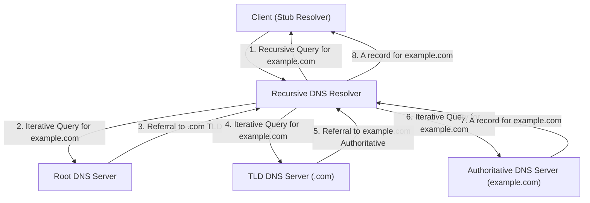

## DNS Resolution Process (Recursive vs. Iterative)
### Core Concepts

*   **DNS (Domain Name System):** A hierarchical, decentralized naming system for computers, services, or any resource connected to the Internet or a private network. It translates human-readable domain names (e.g., `google.com`) into machine-readable IP addresses (e.g., `172.217.160.142`).
*   **DNS Resolver:** A server (often provided by an ISP or a public service like Google DNS) that clients (web browsers, applications) query for IP addresses. It's responsible for finding the authoritative server for a domain name.
*   **Recursive Query:** A request made by a client to a DNS resolver. The client expects a complete answer (the IP address) or an error. The resolver takes on the responsibility of finding the answer.
*   **Iterative Query:** A request made by a DNS resolver to other DNS servers (Root, TLD, Authoritative). The queried server responds with the best answer it has, which might be the IP address or a referral to another DNS server that can provide a more specific answer. The resolver then iteratively queries the referred servers until it finds the answer.

### Key Details & Nuances

*   **Roles in DNS Resolution:**
    *   **Client (Stub Resolver):** Your computer/browser initiates the request. It typically performs only *recursive* queries to a local DNS resolver.
    *   **Recursive DNS Resolver:** (e.g., ISP's DNS, Google DNS `8.8.8.8`). This server acts on behalf of the client. It performs *iterative* queries to find the authoritative server for a domain.
    *   **Root Name Servers:** Top of the DNS hierarchy. They know where to find the TLD servers. There are 13 logical root servers globally (operated by different organizations).
    *   **TLD (Top-Level Domain) Name Servers:** (e.g., `.com`, `.org`, `.net`, `.io`). They know where to find the authoritative servers for domains under their TLD.
    *   **Authoritative Name Server:** The server that holds the actual DNS records (A, AAAA, CNAME, MX, etc.) for a specific domain (e.g., `example.com`). It's the final source of truth for a domain.
*   **The Full Resolution Process (Client to Authoritative):**
    1.  Client sends a **recursive query** for `example.com` to its configured Recursive DNS Resolver.
    2.  Resolver checks its cache. If found, returns immediately.
    3.  If not in cache, Resolver sends an **iterative query** for `example.com` to a Root DNS Server.
    4.  Root Server responds with a referral to the `.com` TLD Server.
    5.  Resolver sends an **iterative query** for `example.com` to the `.com` TLD Server.
    6.  TLD Server responds with a referral to the Authoritative DNS Server for `example.com`.
    7.  Resolver sends an **iterative query** for `example.com` to the Authoritative DNS Server.
    8.  Authoritative Server responds with the IP address (A record) for `example.com`.
    9.  Resolver caches the record (respecting TTL) and returns the IP address to the Client.
*   **Caching:** DNS records are cached at multiple levels (browser, OS, local resolver) to reduce latency and load on upstream servers.
    *   **TTL (Time-To-Live):** Specifies how long a record should be cached. Lower TTLs allow quicker updates but increase queries. Higher TTLs reduce queries but mean changes take longer to propagate.

### Practical Examples

The following Mermaid diagram illustrates the complete DNS resolution process, highlighting the recursive and iterative query types.



**Using `dig` to observe DNS resolution:**

```sh
# Perform a standard recursive lookup
dig example.com

# Perform an iterative lookup, mimicking a resolver
# Start by querying a root server directly, then follow referrals
# Note: This is an advanced use for demonstration, not typical client behavior.
dig @a.root-servers.net example.com
```

### Common Pitfalls & Trade-offs

*   **Misconception of "Recursive Server":** Clients send *recursive* queries to *recursive* resolvers. *Recursive resolvers* then perform *iterative* queries on behalf of the client. A common mistake is thinking a client performs iterative queries.
*   **Caching Invalidation:** Issues often arise when DNS records are updated. If old records are heavily cached (high TTL), it can take a long time for clients to see the new records, leading to "DNS propagation delay" issues.
*   **Performance vs. Freshness:** High TTL values improve performance (fewer lookups) but reduce freshness. Low TTL values ensure freshness but increase load on DNS servers and introduce more latency for clients due to frequent lookups. Choosing an appropriate TTL is a common trade-off.
*   **DDoS Attacks:** DNS infrastructure is a common target for DDoS attacks (e.g., DNS amplification attacks), leveraging open recursive resolvers.

### Interview Questions

1.  **"Explain the difference between a recursive and an iterative DNS query. Who initiates each type?"**
    *   **Answer:** A *recursive query* is sent by a client (e.g., your browser) to a DNS resolver, expecting a complete answer. An *iterative query* is performed by the DNS resolver (acting on behalf of the client) to other DNS servers (Root, TLD, Authoritative). In an iterative query, the queried server provides the best answer it has, often a referral, and the resolver continues the process until it finds the authoritative answer.

2.  **"Walk me through the full DNS resolution process when you type `www.example.com` into your browser. Be specific about the roles of different servers."**
    *   **Answer:** (Refer to "The Full Resolution Process" in Key Details. Key points: browser/OS cache check -> recursive query to resolver -> iterative queries from resolver to Root, TLD, Authoritative servers -> response back through resolver -> client caches/uses IP.)

3.  **"What is the significance of TTL in DNS, and how do you choose an appropriate TTL for a DNS record?"**
    *   **Answer:** TTL (Time-To-Live) determines how long DNS resolvers and clients should cache a DNS record. A high TTL reduces DNS query load and lookup latency but makes DNS changes propagate slowly. A low TTL allows quick propagation of changes but increases query load and latency. An appropriate TTL depends on the record's stability: critical, frequently changing records (e.g., during a failover) might use low TTLs (300-600s), while stable records (e.g., website A records) might use higher TTLs (3600-86400s).

4.  **"Imagine you've just updated your website's IP address. Some users are seeing the old site, while others see the new one. What's the most likely cause, and how would you troubleshoot it?"**
    *   **Answer:** The most likely cause is DNS caching. Users seeing the old site have stale DNS records cached locally (browser, OS, or ISP resolver) due to the previous record's TTL not having expired yet. Troubleshooting involves:
        1.  Checking the updated record's TTL to estimate propagation time.
        2.  Using `dig` or `nslookup` to query various DNS servers (local resolver, Google DNS, authoritative) to see if they've updated.
        3.  Suggesting users clear their local DNS cache (e.g., `ipconfig /flushdns` on Windows, `sudo dscacheutil -flushcache` on macOS) or try a different DNS resolver.
        4.  Waiting for TTLs to expire naturally.

5.  **"Why don't clients (like your web browser) typically perform iterative DNS queries directly?"**
    *   **Answer:** Clients use recursive resolvers for several reasons:
        1.  **Simplicity:** Clients don't need complex DNS resolution logic.
        2.  **Performance:** Resolvers typically have large caches, reducing the need for full resolution.
        3.  **Scalability:** Centralized resolvers offload work from authoritative servers.
        4.  **Security:** Resolvers can provide filtering, caching, and security features (DNSSEC validation) that clients might not implement.
        5.  **Network Overhead:** Iterative queries involve many small requests, which is inefficient for individual clients but efficient for a dedicated resolver.