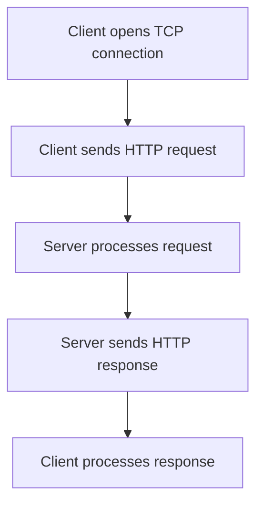

## HTTP/HTTPS (Request/Response, Methods, Status Codes)
### Core Concepts

*   **HTTP (Hypertext Transfer Protocol):** An application-layer protocol for transmitting hypermedia documents, such as HTML. It's the foundation of data communication for the World Wide Web.
    *   **Request/Response Model:** Client sends a request, server sends a response.
    *   **Stateless:** Each request is independent; the server doesn't retain knowledge of past requests. Session management (e.g., cookies) is built on top.
*   **HTTPS (Hypertext Transfer Protocol Secure):** HTTP communicated over TLS (Transport Layer Security) or SSL (Secure Sockets Layer). It provides encryption, authentication, and data integrity.
    *   **Security:** Protects against eavesdropping, tampering, and message forgery.
    *   **Foundation:** Operates at the application layer but leverages TLS/SSL at the transport layer (or below) for security.

### Key Details & Nuances

*   **HTTP Request Structure:**
    *   **Request Line:** `Method URI HTTP/Version` (e.g., `GET /users HTTP/1.1`)
        *   **Methods:**
            *   `GET`: Retrieve data. **Safe** (read-only), **Idempotent** (multiple identical requests have same effect).
            *   `POST`: Submit data to be processed (e.g., creating a resource). **Not safe**, **Not idempotent**.
            *   `PUT`: Update/replace a resource or create if it doesn't exist at a specific URI. **Idempotent**.
            *   `DELETE`: Delete a resource. **Idempotent**.
            *   `PATCH`: Apply partial modifications to a resource. **Not idempotent**.
            *   `HEAD`: Retrieve headers only, no body. **Safe**, **Idempotent**.
            *   `OPTIONS`: Describe the communication options for the target resource. **Safe**, **Idempotent**.
    *   **Headers:** Key-value pairs providing metadata (e.g., `Host`, `User-Agent`, `Content-Type`, `Authorization`, `Cookie`, `Cache-Control`).
    *   **Body:** Optional payload data for methods like `POST`, `PUT`, `PATCH`.

*   **HTTP Response Structure:**
    *   **Status Line:** `HTTP/Version Status_Code Status_Text` (e.g., `HTTP/1.1 200 OK`)
        *   **Status Codes (Key Ranges):**
            *   `1xx` Informational: Request received, continuing process. (e.g., `100 Continue`)
            *   `2xx` Success: Action successfully received, understood, accepted.
                *   `200 OK`: Standard success.
                *   `201 Created`: Resource successfully created.
                *   `204 No Content`: Request successful, but no content to return.
            *   `3xx` Redirection: Further action needed to complete the request.
                *   `301 Moved Permanently`: Resource moved, update bookmarks.
                *   `302 Found`: Resource temporarily moved.
                *   `304 Not Modified`: Client's cached version is current.
            *   `4xx` Client Error: Client seems to have erred.
                *   `400 Bad Request`: Server cannot process due to client error.
                *   `401 Unauthorized`: Authentication required or failed.
                *   `403 Forbidden`: Server understood request but refuses to authorize it.
                *   `404 Not Found`: Resource not found.
                *   `405 Method Not Allowed`: Method not supported for resource.
                *   `409 Conflict`: Request conflicts with current state of resource.
            *   `5xx` Server Error: Server failed to fulfill an apparently valid request.
                *   `500 Internal Server Error`: Generic server error.
                *   `503 Service Unavailable`: Server not ready to handle the request (e.g., overload, maintenance).
    *   **Headers:** Key-value pairs providing metadata (e.g., `Content-Type`, `Content-Length`, `Set-Cookie`, `Location`, `Cache-Control`, `Access-Control-Allow-Origin`).
    *   **Body:** Optional payload data (e.g., HTML, JSON, images).

*   **HTTPS Mechanics:**
    *   **TLS Handshake:** Complex process involving asymmetric and symmetric encryption to establish a secure channel.
        1.  Client Hello: Proposes TLS versions, cipher suites.
        2.  Server Hello: Selects version, cipher suite, sends server certificate.
        3.  Client Verifies Certificate: Checks validity via Certificate Authority (CA).
        4.  Key Exchange: Client and server exchange keys (often using Diffie-Hellman) to derive a shared symmetric session key.
        5.  Encrypted Communication: All subsequent communication is encrypted using the session key.
    *   **Certificate Authority (CA):** Trusted third party that issues digital certificates validating the identity of websites.
    *   **Purpose:**
        *   **Confidentiality:** Encryption prevents eavesdropping.
        *   **Integrity:** Ensures data isn't altered in transit.
        *   **Authentication:** Verifies server identity (and optionally client identity).

*   **HTTP Versioning:**
    *   **HTTP/1.1:** Default, uses persistent connections (`keep-alive`). Suffers from **Head-of-Line (HOL) blocking**, where one slow request can delay others on the same TCP connection.
    *   **HTTP/2:** Addresses HOL blocking with **multiplexing** (multiple requests/responses over single TCP connection). Introduces **header compression (HPACK)** and **server push**.
    *   **HTTP/3:** Built on **QUIC** (UDP-based protocol). Eliminates HOL blocking at the transport layer (not just application layer). Faster connection establishment, improved connection migration.

### Practical Examples

**1. Basic HTTP Request/Response Flow**



**2. Fetching Data with `GET` in JavaScript**

```typescript
// Fetch data from an API using GET
async function fetchData(url: string) {
    try {
        const response = await fetch(url, {
            method: 'GET',
            headers: {
                'Accept': 'application/json', // Client prefers JSON
            },
        });

        if (!response.ok) { // Check if HTTP status is 2xx
            throw new Error(`HTTP error! Status: ${response.status}`);
        }

        const data = await response.json();
        console.log('Fetched data:', data);
        return data;
    } catch (error) {
        console.error('Error fetching data:', error);
        throw error; // Re-throw for further handling
    }
}

// Example usage:
fetchData('https://api.example.com/users/123');
```

**3. Sending Data with `POST` in JavaScript**

```typescript
// Send data to an API using POST
async function postData(url: string, data: object) {
    try {
        const response = await fetch(url, {
            method: 'POST',
            headers: {
                'Content-Type': 'application/json', // Body content type
                'Accept': 'application/json'
            },
            body: JSON.stringify(data), // Convert JS object to JSON string
        });

        if (!response.ok) {
            throw new Error(`HTTP error! Status: ${response.status}`);
        }

        const responseData = await response.json();
        console.log('Response from POST:', responseData);
        return responseData;
    } catch (error) {
        console.error('Error posting data:', error);
        throw error;
    }
}

// Example usage:
const newUser = { name: 'Alice', email: 'alice@example.com' };
postData('https://api.example.com/users', newUser);
```

### Common Pitfalls & Trade-offs

*   **Statelessness vs. State Management:**
    *   **Pitfall:** Assuming server inherently remembers client state.
    *   **Trade-off:** Achieved via cookies (client-side state), session IDs (server-side state reference), or JWTs (token-based, stateless on server). Each has security/scalability trade-offs.
*   **Caching Issues:**
    *   **Pitfall:** Stale data, inefficient resource fetching.
    *   **Trade-off:** Proper use of `Cache-Control` headers (`max-age`, `no-cache`, `no-store`), `ETag`, `Last-Modified`. Balances performance (faster load times) with data freshness.
*   **CORS (Cross-Origin Resource Sharing):**
    *   **Pitfall:** Browser security preventing requests from different origins (`Access-Control-Allow-Origin` missing/incorrect).
    *   **Trade-off:** Essential security mechanism to prevent malicious sites from making requests on behalf of users. Requires explicit server configuration (`Access-Control-Allow-Origin` header).
*   **Performance (General HTTP):**
    *   **Pitfall:** Excessive requests, large payloads, uncompressed data, many redirects.
    *   **Trade-off:** Use HTTP/2 or HTTP/3, enable compression (`Accept-Encoding`, `Content-Encoding`), minimize redirects, optimize image/asset sizes.
*   **Security (Beyond HTTPS):**
    *   **Pitfall:** Only relying on HTTPS. Still vulnerable to XSS (Cross-Site Scripting), CSRF (Cross-Site Request Forgery), SQL Injection, etc.
    *   **Trade-off:** HTTPS encrypts data in transit. Application-level security (input validation, output encoding, CSRF tokens, secure cookie flags like `HttpOnly`, `Secure`, `SameSite`) is crucial.

### Interview Questions

1.  **Explain the core difference between HTTP and HTTPS. How does HTTPS achieve its security guarantees, specifically covering confidentiality, integrity, and authentication?**
    *   **Answer:** HTTP is a plain text, application-layer protocol; HTTPS is HTTP layered over TLS/SSL for secure communication.
        *   **Confidentiality:** Achieved through **encryption** (symmetric keys, derived during TLS handshake) of data in transit, preventing eavesdropping.
        *   **Integrity:** Ensured by **message authentication codes (MACs)** or **digital signatures** within TLS, which detect any tampering with the data during transmission.
        *   **Authentication:** Primarily provides **server authentication** through digital **certificates** issued by trusted Certificate Authorities (CAs). The client verifies the server's certificate during the TLS handshake, ensuring it's communicating with the legitimate server and not a Man-in-the-Middle attacker.

2.  **Compare and contrast the HTTP methods GET, POST, PUT, and DELETE. Focus on their typical use cases, idempotency, and safety characteristics. Provide an example scenario where differentiating between PUT and PATCH is important.**
    *   **Answer:**
        *   **GET:** Retrieves data. **Safe** (no side effects on server), **Idempotent**. Used for fetching resources (e.g., `/users/1`).
        *   **POST:** Submits data to create a new resource or perform non-idempotent operations. **Not Safe**, **Not Idempotent**. Used for creating users (e.g., `/users` with user data in body).
        *   **PUT:** Replaces an entire resource or creates it if it doesn't exist at a specific URI. **Idempotent**. Used for full updates (e.g., `PUT /users/1` with complete user object).
        *   **DELETE:** Removes a resource. **Idempotent**. Used for deleting resources (e.g., `DELETE /users/1`).
        *   **Idempotent:** Multiple identical requests have the same effect as a single request.
        *   **Safe:** The request does not alter the state of the server.
        *   **PUT vs. PATCH Example:**
            *   **PUT:** If you have a user resource `{ "id": 1, "name": "Alice", "email": "alice@example.com" }` and you send `PUT /users/1` with `{ "name": "Bob" }`, the entire resource will be replaced, and `email` will be deleted from the user object on the server.
            *   **PATCH:** If you send `PATCH /users/1` with `{ "name": "Bob" }`, only the `name` field will be updated, and the `email` field will remain untouched. PATCH is for partial updates, PUT for complete replacements.

3.  **You're debugging an API call in a web application. The network tab shows a 401 Unauthorized status code for a request to `/api/data`. What are the likely causes, and what steps would you take to diagnose this? How would your approach differ if the status code was 500 Internal Server Error?**
    *   **Answer:**
        *   **401 Unauthorized:** Indicates the client's request has not been authenticated or authentication failed.
            *   **Likely Causes:** Missing or incorrect `Authorization` header (e.g., invalid Bearer token, expired JWT, incorrect basic auth credentials), session expired, user not logged in.
            *   **Diagnosis Steps:**
                1.  Check request headers: Verify `Authorization` header exists and contains a valid token/credentials.
                2.  Token validity: If using JWT, inspect the token (e.g., on jwt.io) for expiration or malformation.
                3.  Login state: Confirm the user is logged in and has an active session.
                4.  Server logs: Check server-side authentication logs for specific failures.
                5.  CORS: (Less common for 401, but possible if preflight `OPTIONS` fails for auth reasons).
        *   **500 Internal Server Error:** Indicates a generic server-side error that prevented it from fulfilling a valid request.
            *   **Likely Causes:** Bug in server-side code (null pointer, unhandled exception), database connection issues, misconfiguration, external service dependency failure.
            *   **Diagnosis Steps (Differently):**
                1.  **Focus on server logs:** This is paramount. Detailed error messages, stack traces, and timestamps will be there.
                2.  Check server health: Ensure the server process is running, database is accessible, and other dependencies are up.
                3.  Input validation: Though 500 implies server error, sometimes unexpected valid input can trigger a bug.
                4.  Recent deployments: Identify any recent code changes that might have introduced the bug.
                5.  Reproduce: Try to reproduce the exact request that caused the 500.

4.  **Discuss the evolution of HTTP from 1.1 to 2 and then to 3. What fundamental problem does each new version primarily aim to solve, and what are the key architectural changes introduced?**
    *   **Answer:**
        *   **HTTP/1.1:** Introduced persistent connections (keep-alive) to reuse TCP connections, reducing overhead. However, it suffers from **Head-of-Line (HOL) blocking**, where one slow or stalled request on a TCP connection blocks subsequent requests from being processed until it completes.
        *   **HTTP/2:** Primarily solves HTTP/1.1's **HOL blocking at the application layer**.
            *   **Architectural Changes:** Introduces **multiplexing**, allowing multiple concurrent request/response streams over a single TCP connection, eliminating HOL blocking. Also includes **header compression (HPACK)** to reduce overhead and **server push** to proactively send resources.
        *   **HTTP/3:** Primarily solves HTTP/2's **HOL blocking at the transport layer** and improves connection establishment.
            *   **Architectural Changes:** Built on **QUIC (Quick UDP Internet Connections)**, a new UDP-based transport protocol. Since streams are independent at the transport layer, a lost packet for one stream doesn't block others (unlike TCP). Offers faster handshakes (0-RTT for resumed connections) and improved connection migration (maintaining connection across network changes).

5.  **What are HTTP cookies, and how are they used in web applications? Discuss the security implications and how developers can mitigate common cookie-related vulnerabilities.**
    *   **Answer:**
        *   **Definition:** Small pieces of data (key-value pairs) sent from a web server to a client's browser and stored locally. The browser sends these cookies back to the server with subsequent requests to the same domain.
        *   **Usage:** Primarily for **session management** (maintaining user login state), **personalization** (user preferences), and **tracking** (user behavior).
        *   **Security Implications:**
            *   **Session Hijacking:** If an attacker steals a session cookie, they can impersonate the user.
            *   **XSS (Cross-Site Scripting):** Malicious scripts injected into a page can steal cookies.
            *   **CSRF (Cross-Site Request Forgery):** If a user is logged into a site and visits a malicious site, the malicious site can trick the browser into sending requests to the legitimate site with the user's cookies.
        *   **Mitigation:**
            *   **`HttpOnly` flag:** Prevents client-side JavaScript from accessing the cookie, mitigating XSS attacks.
            *   **`Secure` flag:** Ensures the cookie is only sent over HTTPS (encrypted connections), preventing interception.
            *   **`SameSite` attribute:** Mitigates CSRF by controlling when cookies are sent with cross-site requests (`Strict`, `Lax`, `None`). `Lax` is often a good default, preventing cookies for third-party navigations but allowing for top-level navigations.
            *   **Expiration:** Set appropriate expiration times to limit the window of vulnerability.
            *   **Prefixes:** `__Secure-` and `__Host-` prefixes can enforce additional security constraints (e.g., `__Host-` requires `Secure`, `Path=/`, and no `Domain`).
            *   **Strong Session IDs:** Use long, random, unpredictable session IDs.