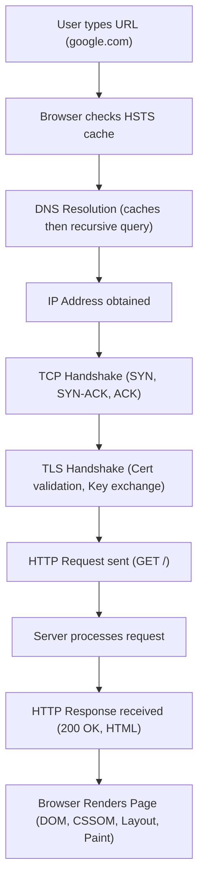

## What happens when you type google.com in your browser?
### Core Concepts
*   **End-to-End Journey:** When you type `google.com`, a complex series of steps unfolds, involving the browser, operating system, DNS servers, and web servers, orchestrated across various network layers to fetch and render the webpage.
*   **Layered Model:** This process highlights the interaction between Application (HTTP, DNS), Transport (TCP, UDP), Network (IP), and Data Link layers of the OSI model or TCP/IP model.
*   **Core Goal:** Translate a human-readable domain name (`google.com`) into a machine-readable IP address, establish a secure, reliable connection, send an HTTP request, receive a response, and render the content.

### Key Details & Nuances
1.  **URL Parsing & HSTS Check:**
    *   **Browser Parsing:** Splits the URL into protocol (HTTP/HTTPS), domain (`google.com`), port (default 443 for HTTPS, 80 for HTTP), and path.
    *   **HSTS (HTTP Strict Transport Security):** Browser checks its preloaded HSTS list or its HSTS cache for `google.com`. If found, it immediately upgrades the connection to HTTPS, preventing insecure HTTP attempts. This avoids a redirect roundtrip.
2.  **DNS Resolution:**
    *   **Caching Layers:** Browser cache -> OS cache (`/etc/hosts` on Linux/macOS, DNS Client service on Windows) -> Router cache -> ISP's local DNS resolver cache.
    *   **Recursive Query:** If not cached, the local DNS resolver performs a recursive query:
        *   Queries a **Root DNS Server** for the `.com` TLD server.
        *   Queries the **TLD (Top-Level Domain) DNS Server** for `google.com`'s authoritative name server.
        *   Queries the **Authoritative DNS Server** for `google.com` to get the IP address (A record) or IPv6 address (AAAA record).
    *   **TTL (Time To Live):** DNS records have a TTL, which determines how long a resolver can cache the record.
3.  **TCP (Transmission Control Protocol) Handshake (Layer 4 - Transport):**
    *   Once the browser has the server's IP address, it initiates a TCP three-way handshake to establish a reliable connection:
        *   **SYN:** Client sends a SYN (synchronize) segment.
        *   **SYN-ACK:** Server responds with SYN-ACK (synchronize-acknowledge).
        *   **ACK:** Client sends ACK (acknowledge).
    *   **Purpose:** Ensures both parties are ready to communicate, negotiates sequence numbers, and sets up connection state.
4.  **TLS (Transport Layer Security) Handshake (Layer 6/7 - Presentation/Application):**
    *   **Client Hello:** Client sends supported TLS versions, cipher suites, random bytes, and SNI (Server Name Indication).
    *   **Server Hello:** Server responds with chosen TLS version, cipher suite, random bytes, and its digital certificate.
    *   **Certificate Validation:** Client validates the server's certificate (trust chain, expiration, domain matching). If invalid, a warning is shown.
    *   **Key Exchange:** Client uses the server's public key (from certificate) to encrypt a pre-master secret. Both parties derive symmetric session keys from this secret and random bytes.
    *   **Change Cipher Spec:** Both parties signal they will switch to encrypted communication using the symmetric keys.
    *   **Finished:** Encrypted messages confirm the handshake is complete.
    *   **Purpose:** Secure, encrypted, and authenticated communication.
5.  **HTTP (Hypertext Transfer Protocol) Request/Response (Layer 7 - Application):**
    *   **Request:** Browser sends an HTTP GET request (e.g., `GET / HTTP/1.1`) over the established TLS-encrypted TCP connection, including headers like `Host`, `User-Agent`, `Accept`, `Cookie`, `Cache-Control`, `Referer`.
    *   **Server Processing:**
        *   Request hits a **Load Balancer** (e.g., L7 ELB, Nginx) which distributes traffic.
        *   Request is routed to a **Web Server** (e.g., Nginx, Apache) or **Application Server** (e.g., Node.js, Python Flask) which processes the request.
        *   May involve querying a **Database** (e.g., SQL, NoSQL), interacting with other services (microservices), or fetching static files.
    *   **Response:** Server sends an HTTP response, including:
        *   **Status Line:** HTTP version, Status Code (e.g., `200 OK`, `301 Redirect`, `404 Not Found`, `500 Internal Server Error`).
        *   **Headers:** `Content-Type`, `Content-Length`, `Set-Cookie`, `Cache-Control`, `ETag`, `Server`.
        *   **Body:** The actual HTML content, CSS, JavaScript, images, etc.
6.  **Browser Rendering:**
    *   **HTML Parsing & DOM (Document Object Model):** Browser parses HTML to construct the DOM tree.
    *   **CSS Parsing & CSSOM (CSS Object Model):** Parses CSS to construct the CSSOM tree.
    *   **Render Tree Construction:** Combines DOM and CSSOM to create a render tree (layout tree), containing visual elements and their computed styles.
    *   **Layout (Reflow):** Calculates the exact position and size of each element in the render tree.
    *   **Paint:** Fills in pixels for each element using its calculated styles and layout.
    *   **Compositing:** Combines painted layers into a final image on the screen.
    *   **JavaScript Execution:** Downloads and executes JavaScript, which can modify DOM/CSSOM, trigger reflows/repaints.
    *   **Sub-resource Loading:** The browser concurrently fetches other resources (images, CSS, JS files) referenced in the HTML, repeating many of the above steps for each.
7.  **Connection Teardown/Keep-Alive:**
    *   **HTTP/1.1 Persistent Connections (Keep-Alive):** Allows multiple requests/responses over a single TCP connection, reducing overhead.
    *   **HTTP/2 & HTTP/3:** Further optimize by multiplexing multiple requests/responses over a single connection (HTTP/2) or using UDP (HTTP/3 - QUIC) for reduced latency and better handling of packet loss.

### Practical Examples

#### End-to-End Request Flow (Simplified)



#### Inspecting HTTP Headers with cURL

```sh
# Basic GET request for Google's homepage, showing response headers
curl -v https://www.google.com/

# Example output snippet (simplified)
# *   Trying 142.250.190.132:443...
# * Connected to www.google.com (142.250.190.132) port 443 (#0)
# * ALPN: offers h2
# * ALPN: offers http/1.1
# *  CAfile: /etc/ssl/certs/ca-certificates.crt
# *  CApath: /etc/ssl/certs
# * TLSv1.3 (OUT), TLS handshake, Client hello (1):
# * TLSv1.3 (IN), TLS handshake, Server hello (2):
# * TLSv1.3 (IN), TLS handshake, Encrypted extensions (8):
# * TLSv1.3 (IN), TLS handshake, Certificate (11):
# * TLSv1.3 (IN), TLS handshake, Certificate verify (15):
# * TLSv1.3 (IN), TLS handshake, Finished (20):
# * TLSv1.3 (OUT), TLS change cipher spec (9):
# * TLSv1.3 (OUT), TLS handshake, Finished (20):
# * SSL connection using TLSv1.3 / TLS_AES_256_GCM_SHA384
# * ALPN: server accepted h2
# * Server certificate:
# *  subject: CN=*.google.com
# *  start date: Sep  4 10:27:01 2023 GMT
# *  expire date: Nov 27 10:27:00 2023 GMT
# *  subjectAltName: host "www.google.com" matched common name "*.google.com"
# *  Issuer: C=US; O=Google Trust Services LLC; CN=GTS R1
# *  SSL certificate verify ok.
# * Using HTTP2, server supports multiplexing
# * Connection state changed (HTTP/2 confirmed)
# * h2h3 current client is now http
# > GET / HTTP/2
# > Host: www.google.com
# > user-agent: curl/7.81.0
# > accept: */*
# >
# < HTTP/2 200
# < date: Mon, 09 Oct 2023 12:00:00 GMT
# < expires: -1
# < cache-control: private, max-age=0
# < content-type: text/html; charset=ISO-8859-1
# < p3p: CP="This is not a P3P policy! See g.co/P3Phelp for more info."
# < server: gws
# < x-xss-protection: 0
# < x-frame-options: SAMEORIGIN
# < set-cookie: <sanitized_cookie_data>
# < alt-svc: h3=":443"; ma=2592000,h3-29=":443"; ma=2592000
# < connection: close
# < content-security-policy: report-uri https://csp.withgoogle.com/csp/gws/other-hp;object-src 'none';base-uri 'self';script-src 'nonce-R0mYpQ...' 'strict-dynamic' 'report-sample' 'unsafe-eval' 'unsafe-inline' https: http: data:;worker-src 'self' blob:;report-to csp-gws-other-hp;
# <
# < <!doctype html><html itemscope="" ... (HTML content)
```

### Common Pitfalls & Trade-offs

*   **DNS Latency:** Slow DNS resolution (due to misconfiguration, slow resolvers, or high TTLs) can significantly delay initial page load. Caching and CDNs mitigate this.
*   **TCP/TLS Overhead:** Initial connection establishment (TCP 3-way handshake + TLS handshake) adds latency. HTTP/2 and HTTP/3 aim to reduce this by reusing connections and using UDP-based QUIC respectively.
*   **Blocking Resources:** JavaScript and CSS can be render-blocking if not optimized (e.g., `async`/`defer` for JS, critical CSS inlined).
*   **Caching Strategy:** Ineffective caching (browser, CDN, server-side) leads to redundant requests and slower performance. Over-aggressive caching can lead to stale content.
*   **Security (HTTPS by default):** Not using HTTPS (or HSTS) exposes traffic to eavesdropping and tampering. Mixed content (HTTP resources on an HTTPS page) can break security and be blocked by browsers.
*   **Large Payloads:** Unoptimized images, unminified CSS/JS, or large HTML files increase download time.
*   **Network Congestion/Packet Loss:** TCP's retransmission and congestion control mechanisms ensure reliability but can add latency under poor network conditions.

### Interview Questions

1.  **Describe the role of DNS in the context of typing a URL. What are the different levels of DNS caching involved, and why is caching critical?**
    *   **Answer:** DNS translates human-readable domain names to IP addresses. When a URL is typed, the browser first checks its own cache, then the OS cache, then the local DNS resolver cache (often at the router or ISP level). If not found, a recursive query occurs (local resolver -> root -> TLD -> authoritative server). Caching at each layer drastically reduces lookup latency, reduces load on DNS infrastructure, and improves overall page load times by minimizing network round-trips.
2.  **Explain the TCP three-way handshake and its significance. How does HTTP/1.1 typically leverage TCP connections, and what improvements do HTTP/2 and HTTP/3 offer?**
    *   **Answer:** The TCP three-way handshake (SYN, SYN-ACK, ACK) establishes a reliable, full-duplex connection. It negotiates initial sequence numbers and confirms both client and server are ready to transmit data. HTTP/1.1 uses persistent connections (Keep-Alive) to reuse a single TCP connection for multiple requests, reducing handshake overhead. HTTP/2 improves this with multiplexing, allowing multiple requests/responses concurrently over one TCP connection without head-of-line blocking. HTTP/3 builds on QUIC (over UDP), offering further latency reduction by integrating TLS into the handshake, providing faster connection establishment, and mitigating head-of-line blocking at the transport layer.
3.  **Walk me through the TLS handshake process. What security guarantees does TLS provide, and what happens if a browser cannot validate a server's certificate?**
    *   **Answer:** The TLS handshake involves client and server agreeing on protocol versions and cipher suites, server presenting its certificate, client validating the certificate (trust chain, expiration, domain match), and then key exchange to establish a shared symmetric session key. This symmetric key is then used for all subsequent encrypted communication. TLS provides confidentiality (encryption), integrity (data not tampered with), and authentication (verifying server identity). If a browser cannot validate a certificate (e.g., expired, untrusted CA, domain mismatch), it will display a security warning to the user, blocking or advising against proceeding, as the connection cannot be guaranteed secure.
4.  **Beyond fetching the HTML, what are the subsequent steps a browser takes to render a complex webpage? How can developers optimize this rendering process?**
    *   **Answer:** After receiving HTML, the browser constructs the DOM tree. Concurrently, it parses CSS to build the CSSOM tree. These two are combined to form the Render Tree, which contains visible elements and their computed styles. Then, layout (reflow) calculates element positions/sizes, followed by paint, which fills pixels. Finally, compositing combines layers for display. Developers can optimize by:
        *   Minimizing render-blocking resources (e.g., `async`/`defer` for JS, inlining critical CSS).
        *   Optimizing image sizes and formats.
        *   Leveraging browser caching with proper HTTP headers.
        *   Reducing DOM complexity and avoiding unnecessary reflows/repaints (e.g., by batching DOM manipulations).
        *   Using CSS transformations (`transform`, `opacity`) for animations where possible, as they can be GPU accelerated and avoid layout/paint.