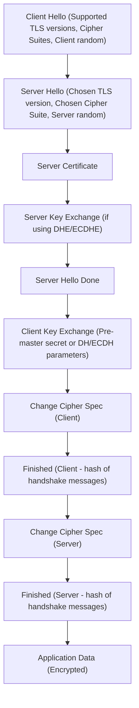

## TLS/SSL Handshake
### Core Concepts

*   **Purpose**: The TLS (Transport Layer Security) handshake is the initial negotiation phase between a client and a server to establish a secure, encrypted communication channel over an insecure network (typically TCP/IP).
*   **Authentication & Key Exchange**: It involves authenticating the server (and optionally the client), agreeing on cryptographic algorithms (cipher suite), and securely exchanging cryptographic keys to be used for the subsequent symmetric encryption of application data.
*   **Confidentiality, Integrity, Authenticity**: Ensures that data exchanged is private (encrypted), has not been tampered with (integrity checks), and originates from the legitimate server (authentication).

### Key Details & Nuances

*   **Phases of the Handshake (TLS 1.2 & earlier):**
    1.  **Hello**: Client and server exchange `ClientHello` and `ServerHello` messages to negotiate the TLS version, cipher suite, and exchange random numbers (for session keys).
    2.  **Server Authentication & Key Exchange**:
        *   Server sends its X.509 `Certificate`.
        *   Server may send `ServerKeyExchange` if using DHE/ECDHE (for Perfect Forward Secrecy).
        *   Server sends `ServerHelloDone`.
    3.  **Client Key Exchange & Authentication (optional)**:
        *   Client sends `ClientKeyExchange` (e.g., encrypted pre-master secret using server's public key, or Diffie-Hellman parameters).
        *   Client sends `Certificate` and `CertificateVerify` if mutual TLS is enabled.
    4.  **Change Cipher Spec & Finished**:
        *   Both client and server send `ChangeCipherSpec` to indicate they will switch to encrypted communication.
        *   Both send encrypted `Finished` messages, which are hashes of all previous handshake messages, serving as the first test of the negotiated keys and algorithms.
    5.  **Application Data**: Secure communication begins.

*   **Key Exchange Algorithms**:
    *   **RSA**: Client encrypts a pre-master secret with server's public key. Prone to retrospective decryption if server's private key is compromised.
    *   **Diffie-Hellman (DH/DHE/ECDHE)**: Clients and server independently derive a shared secret without ever sending the secret over the wire. Crucial for **Perfect Forward Secrecy (PFS)**, meaning a compromise of the server's long-term private key won't compromise past session keys. **ECDHE is preferred and widely adopted.**

*   **Cipher Suite**: A set of algorithms for key exchange, digital signature, bulk encryption, and message authentication code (MAC). E.g., `TLS_ECDHE_RSA_WITH_AES_256_GCM_SHA384`.
    *   `ECDHE`: Key exchange (Ephemeral Elliptic Curve Diffie-Hellman).
    *   `RSA`: Digital signature (for server authentication).
    *   `AES_256_GCM`: Bulk encryption (Advanced Encryption Standard, 256-bit key, Galois/Counter Mode for authenticated encryption).
    *   `SHA384`: Hashing algorithm (for integrity and Finished messages).

*   **TLS 1.3 Improvements**:
    *   **Reduced RTT**: Handshake typically takes only one Round Trip Time (1-RTT) instead of two. Client sends key share in `ClientHello`.
    *   **Simplified Handshake**: Removed old, insecure features (e.g., RSA key exchange, weak cipher suites).
    *   **Encrypted Handshake Messages**: Most handshake messages (after ServerHello) are encrypted, improving privacy.
    *   **0-RTT Resumption**: Allows clients to send application data immediately on reconnection if they have a pre-shared key, significantly reducing latency.

*   **Session Resumption**:
    *   **Session ID**: Server assigns an ID. Client sends it back on reconnection. Server finds cached session.
    *   **TLS Session Tickets (RFC 5077)**: Server encrypts session state into a ticket and sends it to the client. Client presents the ticket on reconnection. Server decrypts and resumes. More scalable than Session IDs.

### Practical Examples

The classic TLS 1.2 Handshake Flow:

### Common Pitfalls & Trade-offs

*   **Performance Overhead**: TLS handshake adds latency (additional RTTs) and CPU overhead due to cryptographic operations.
    *   **Trade-off**: Security vs. Performance. Mitigation: Session resumption, TLS 1.3's 1-RTT/0-RTT, hardware offloading.
*   **Perfect Forward Secrecy (PFS) Absence**: Using plain RSA key exchange (`TLS_RSA_...`) means if the server's long-term private key is compromised, all past recorded sessions encrypted with that key can be decrypted.
    *   **Trade-off**: Simpler setup for RSA vs. higher security (PFS) with DHE/ECDHE. **Always prefer PFS-enabled cipher suites.**
*   **Certificate Validation Issues**: Clients often don't properly validate server certificates (e.g., not checking trust chain, expiry, hostname).
    *   **Risk**: Man-in-the-Middle (MITM) attacks. **Best practice**: Implement strict certificate pinning for critical applications.
*   **Protocol Downgrade Attacks**: An attacker forces the connection to use an older, less secure TLS version.
    *   **Mitigation**: TLS 1.3 removed many legacy features. Servers should disable old protocols (SSLv2, SSLv3, TLS 1.0, TLS 1.1) and implement `SCSV` (Signaling Cipher Suite Value) in TLS 1.2 to prevent this.
*   **Heartbleed (Example Vulnerability)**: A flaw in OpenSSL's implementation of the TLS Heartbeat extension. Allowed attackers to read arbitrary memory from servers, including private keys and session data.
    *   **Lesson**: Implementations can have bugs; strong cryptographic primitives are not enough. Regular patching and security audits are essential.

### Interview Questions

1.  **Walk me through the major steps of a TLS 1.2 handshake. How does TLS 1.3 improve upon this?**
    *   **Answer**: Describe ClientHello/ServerHello (negotiation), Server Certificate/Key Exchange (authentication/key agreement), Client Key Exchange (key contribution), Change Cipher Spec/Finished (finalization). For TLS 1.3, highlight 1-RTT handshake (Client sends key share immediately), removal of older algorithms, and encryption of more handshake messages.
2.  **What is Perfect Forward Secrecy (PFS), and why is it critical for modern TLS implementations? Name a key exchange algorithm that provides PFS.**
    *   **Answer**: PFS ensures that if a server's long-term private key is compromised, past session keys derived from ephemeral keys cannot be retroactively decrypted. It's critical because it protects historical communication. ECDHE (Elliptic Curve Diffie-Hellman Ephemeral) is a primary example providing PFS.
3.  **Explain the role of symmetric vs. asymmetric encryption during the TLS handshake and subsequent data transfer.**
    *   **Answer**: Asymmetric (public/private key) encryption is used during the handshake for server authentication (digital signatures using server's private key, client verifies with public key) and secure key exchange (e.g., client encrypts pre-master secret with server's public key, or DHE/ECDHE for shared secret derivation). Once a master secret is established, symmetric encryption (e.g., AES, ChaCha20) is used for the bulk of application data transfer due to its significantly higher performance.
4.  **How does TLS session resumption work, and what problem does it solve?**
    *   **Answer**: Session resumption (via Session IDs or TLS Session Tickets) allows a client to quickly re-establish a TLS connection with a server without going through the full handshake. It solves the performance overhead problem by reducing the number of round trips (latency) and the CPU cost associated with cryptographic computations for repeated connections.
5.  **What are some common security vulnerabilities or considerations related to the TLS handshake, beyond just implementation bugs?**
    *   **Answer**: Protocol downgrade attacks (forcing clients to use older, weaker TLS versions), lack of Perfect Forward Secrecy (if non-ephemeral key exchange like RSA is used exclusively), weak cipher suite negotiation, and improper certificate validation (leading to MITM risks). Certificate pinning can mitigate MITM but introduces operational complexity.