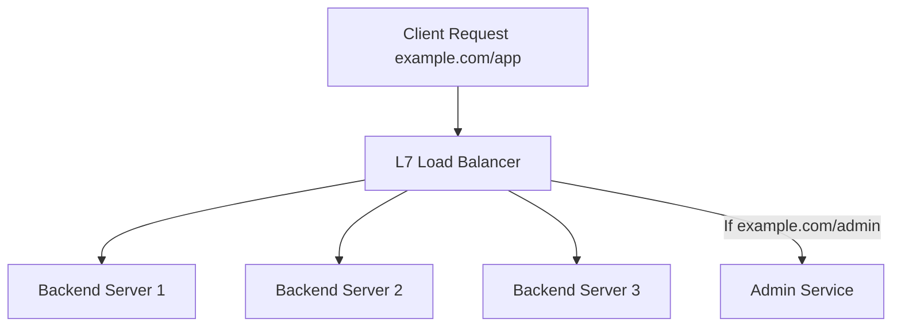

## Load Balancers (L4 vs. L7) & Reverse Proxies
### Core Concepts

*   **Load Balancer (LB):**
    *   Distributes incoming network traffic across multiple backend servers to ensure high availability, scalability, and optimal resource utilization.
    *   Acts as a single point of contact for clients, abstracting the complexity of the backend server pool.
    *   Supports various load balancing algorithms (e.g., Round Robin, Least Connections, IP Hash).
*   **Reverse Proxy:**
    *   A server that retrieves resources on behalf of a client from one or more servers.
    *   Positioned in front of web servers, forwarding client requests to them.
    *   Provides centralized control for security, caching, SSL termination, compression, and A/B testing, often without clients being aware of the actual backend servers.
    *   All requests to the actual servers pass through the reverse proxy.

### Key Details & Nuances

*   **L4 (Transport Layer) Load Balancers:**
    *   **Operation:** Work at the TCP/IP layer (Layer 4 of OSI model). Base routing decisions on IP addresses and ports.
    *   **Characteristics:**
        *   **Fast & Efficient:** Operates at a lower level, minimal processing overhead.
        *   **Protocol Agnostic:** Can balance any TCP/UDP traffic (HTTP, FTP, SSH, database connections).
        *   **Limited Visibility:** Cannot inspect HTTP headers, cookies, or URL paths.
        *   **Common Use Cases:** High-volume, raw TCP balancing; non-HTTP services.
    *   **Health Checks:** Basic TCP handshake or ping.
*   **L7 (Application Layer) Load Balancers:**
    *   **Operation:** Work at the HTTP/HTTPS layer (Layer 7 of OSI model).
    *   **Characteristics:**
        *   **Application-Aware:** Can inspect entire request content (headers, URL, cookies, body).
        *   **Advanced Features:**
            *   **SSL Termination:** Decrypts incoming SSL traffic, offloading computation from backend servers.
            *   **Content-Based Routing:** Route requests based on URL path, hostname (`Host` header), or specific headers.
            *   **Session Stickiness (Persistence):** Route subsequent requests from the same client to the same backend server (e.g., via cookie insertion).
            *   **Web Application Firewall (WAF):** Integrates security rules to protect against common web exploits.
            *   **Caching & Compression:** Can cache responses or compress data before sending to client.
        *   **Higher Overhead:** More CPU intensive due to deeper packet inspection.
    *   **Health Checks:** Can perform deep health checks (e.g., HTTP status code responses from a specific endpoint).
*   **Reverse Proxy vs. L7 Load Balancer:**
    *   An **L7 Load Balancer** is a specialized type of reverse proxy, specifically designed for distributing traffic among a pool of identical servers.
    *   A **Reverse Proxy** has broader capabilities, which may include load balancing, but also focuses on security, caching, SSL, and request modification, often for a single or few distinct backend applications. Many modern L7 LBs act as sophisticated reverse proxies.

### Practical Examples

**1. Basic Load Balancer Flow (L7)**



**2. Nginx as an L7 Load Balancer and Reverse Proxy**

This Nginx configuration demonstrates load balancing for `/app` requests and content-based routing for `/api` requests, while also handling basic proxy headers.

```nginx
# Load balancing backend pool
upstream backend_app_servers {
    server 192.168.1.10:8080; # Backend app server 1
    server 192.168.1.11:8080; # Backend app server 2
    # You can specify balancing methods here, e.g., least_conn;
}

server {
    listen 80;
    server_name myapp.com;

    # SSL Termination (example - requires SSL cert configuration)
    # listen 443 ssl;
    # ssl_certificate /etc/nginx/certs/myapp.com.crt;
    # ssl_certificate_key /etc/nginx/certs/myapp.com.key;

    # Load balance requests to /app to backend_app_servers pool
    location /app {
        proxy_pass http://backend_app_servers;
        # Essential headers to pass client info to backend
        proxy_set_header Host $host;
        proxy_set_header X-Real-IP $remote_addr;
        proxy_set_header X-Forwarded-For $proxy_add_x_forwarded_for;
        proxy_set_header X-Forwarded-Proto $scheme;
    }

    # Content-based routing: /api requests go to a dedicated API service
    location /api {
        proxy_pass http://internal-api-service.com:3000;
        proxy_set_header Host $host;
        proxy_set_header X-Real-IP $remote_addr;
    }

    # Default location for other requests
    location / {
        root /var/www/html; # Serve static files or redirect
        index index.html;
    }
}
```

### Common Pitfalls & Trade-offs

*   **Performance vs. Features:** L4 LBs are faster and have lower latency due to simpler processing, suitable for pure performance needs. L7 LBs offer richer features (SSL termination, content routing, WAF) but introduce more overhead and latency.
*   **SSL Termination Location:**
    *   **At LB:** Offloads CPU-intensive SSL decryption from backend servers, simplifies certificate management. However, traffic between LB and backend might be unencrypted (unless re-encrypted), potentially exposing data on internal networks.
    *   **At Backend:** End-to-end encryption, higher security, but increases CPU load on backend servers.
*   **Session Stickiness/Affinity:**
    *   Required for stateful applications (e.g., user sessions in e-commerce).
    *   Can reduce the effectiveness of load balancing by unevenly distributing load if specific users generate more traffic.
    *   Mitigated by designing stateless services whenever possible.
*   **Single Point of Failure (SPOF):** The load balancer itself can become a SPOF. High Availability (HA) setups with redundant LBs (active-passive or active-active) are critical for production systems.
*   **Increased Complexity:** L7 LBs and reverse proxies add another layer to the architecture, which can complicate troubleshooting and introduce configuration management challenges.

### Interview Questions

1.  **"What are the key differences between an L4 and an L7 Load Balancer? When would you choose one over the other?"**
    *   **Answer:** L4 operates at the transport layer, routing based on IP/port; it's fast, protocol-agnostic, but lacks application insight. L7 operates at the application layer, inspecting HTTP/HTTPS headers, URLs, and cookies; it enables advanced features like SSL termination, content-based routing, and WAF, but adds processing overhead. Choose L4 for raw TCP/UDP, high-throughput, simple balancing (e.g., database clusters). Choose L7 for web applications requiring intelligent routing, security features, or SSL offloading.

2.  **"Explain the role of a Reverse Proxy. How does it differ from a traditional Forward Proxy, and what benefits does it offer?"**
    *   **Answer:** A Reverse Proxy sits in front of backend servers, intercepting client requests and forwarding them to the appropriate server. A Forward Proxy sits in front of clients, forwarding their requests to external servers, often for security/access control. Reverse proxies offer benefits like load balancing, enhanced security (WAF, hiding backend IPs), SSL termination, caching, compression, and simplified URL management, improving performance and maintainability for backend services.

3.  **"How do Load Balancers handle 'session stickiness' or 'session affinity,' and what are the implications of using it?"**
    *   **Answer:** Session stickiness ensures that subsequent requests from a specific client are always routed to the same backend server. This is typically achieved using client IP addresses, cookies (inserted by the LB), or SSL session IDs. The implication is that while it supports stateful applications, it can lead to uneven load distribution across backend servers if one server handles many 'sticky' high-traffic sessions, potentially negating some load balancing benefits. It also complicates server maintenance as draining traffic from a server becomes harder.

4.  **"Discuss the trade-offs of performing SSL termination at the Load Balancer versus at the backend servers."**
    *   **Answer:** Terminating SSL at the **Load Balancer** offloads CPU-intensive decryption from backend servers, improving their performance. It also centralizes certificate management. However, traffic between the LB and backend might then be unencrypted (unless re-encrypted by the LB), which is a security concern in untrusted internal networks. Terminating SSL at the **backend servers** provides end-to-end encryption, increasing security. The trade-off is increased CPU load on each backend server, requiring more powerful instances or scaling out more aggressively.