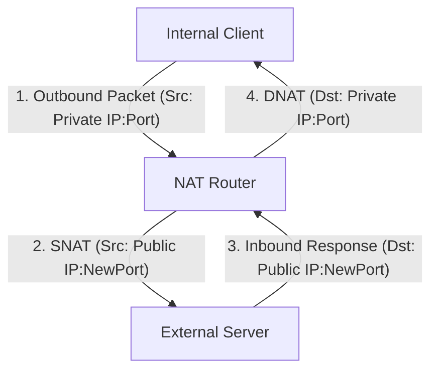

## NAT (Network Address Translation)
### Core Concepts

*   **Definition:** **Network Address Translation (NAT)** is a method of remapping one IP address space into another by modifying network address information in the IP header of packets while they are in transit across a traffic routing device.
*   **Primary Use Cases:**
    *   **IPv4 Address Conservation:** Allows multiple devices on a private network to share a single public IPv4 address, mitigating the depletion of IPv4 addresses.
    *   **Security by Obscurity:** Hides the internal network topology from the outside world, making it harder for external attackers to directly target internal hosts.
    *   **Network Mergers:** Facilitates the connection of two IP networks that have conflicting address spaces.

### Key Details & Nuances

*   **Private vs. Public IP Addresses:**
    *   **Private IPs:** Used within private networks (e.g., `10.0.0.0/8`, `172.16.0.0/12`, `192.168.0.0/16`). Not routable on the public internet.
    *   **Public IPs:** Globally unique and routable on the public internet.
*   **Types of NAT:**
    *   **Static NAT (SNAT 1:1):** Maps a private IP address to a unique public IP address on a one-to-one basis. Primarily used for making an internal server accessible from the internet with a dedicated public IP.
    *   **Dynamic NAT:** Maps private IP addresses to a pool of public IP addresses. When an internal device requests external access, an available public IP from the pool is assigned dynamically for the duration of the session.
    *   **Port Address Translation (PAT) / NAPT (Network Address Port Translation) / NAT Overload:**
        *   The most common form of NAT, used by most home routers.
        *   Allows multiple internal private IP addresses to share a single public IP address by using different source **port numbers** for each connection.
        *   The NAT device maintains a translation table mapping `(internal IP:port)` to `(public IP:new_public_port)`.
        *   Crucial for IPv4 conservation.
*   **How it Works (PAT Example - Outbound Traffic):**
    1.  An internal host (e.g., `192.168.1.10:12345`) sends a packet to an external server.
    2.  The NAT router intercepts the packet.
    3.  It changes the packet's source IP address from `192.168.1.10` to its own public IP (e.g., `203.0.113.5`) and may change the source port (e.g., `12345` to `54321`) to ensure uniqueness if multiple internal hosts use the same original source port.
    4.  It records this mapping (`192.168.1.10:12345` -> `203.0.113.5:54321`) in its translation table.
    5.  When the external server replies, the response packet is addressed to `203.0.113.5:54321`.
    6.  The NAT router receives the response, consults its translation table, changes the destination IP/port back to `192.168.1.10:12345`, and forwards it to the original internal host.
*   **Destination NAT (DNAT) / Port Forwarding:**
    *   Used for inbound traffic.
    *   Maps a specific public IP address and port to a private IP address and port on an internal host.
    *   Enables external users to access services running on an internal server (e.g., accessing an internal web server `192.168.1.5` via `public.ip.address:80`).

### Practical Examples

**NAT (PAT) Outbound Flow:**



**`iptables` (Linux) example for PAT (Masquerading):**

```sh
# This command enables PAT (masquerading) on the eth0 interface
# for all outgoing traffic from the internal network (192.168.1.0/24).
# This assumes eth0 is the external interface.
sudo iptables -t nat -A POSTROUTING -o eth0 -j MASQUERADE
```

**`iptables` (Linux) example for DNAT (Port Forwarding):**

```sh
# Forward incoming TCP traffic on public interface eth0, port 80
# to internal host 192.168.1.100, port 8080.
sudo iptables -t nat -A PREROUTING -i eth0 -p tcp --dport 80 -j DNAT --to-destination 192.168.1.100:8080
```

### Common Pitfalls & Trade-offs

*   **End-to-End Connectivity Loss:** Breaks the direct end-to-end communication model of IP, making it difficult for external hosts to initiate connections to internal devices without explicit port forwarding (DNAT). This impacts P2P applications, VoIP, and some gaming protocols.
*   **Application Layer Gateway (ALG) Requirement:** Protocols that embed IP addresses within their payload (e.g., FTP active mode, some SIP/VoIP) require NAT routers to have ALGs to inspect and rewrite these internal IP addresses in the application data. Without ALGs, such applications might fail.
*   **Security (Misconception):** While NAT hides internal IP addresses, it is **not a firewall**. It doesn't filter traffic based on content or block malicious packets; it only translates addresses. Proper firewalls are still necessary.
*   **Troubleshooting Complexity:** Tracing connections becomes harder as packets' source/destination IPs change, obscuring the true origin/destination.
*   **Performance Overhead:** While typically minimal for modern hardware, NAT adds a small overhead due to address rewriting and translation table lookups.
*   **IPv6 Irrelevance:** NAT is largely irrelevant for IPv6 due to its vast address space, which provides globally unique addresses for every device, restoring end-to-end connectivity.

### Interview Questions

1.  **Explain the primary purpose of NAT and differentiate between SNAT (Source NAT) and DNAT (Destination NAT).**
    *   **Answer:** NAT's primary purpose is to conserve IPv4 addresses and hide internal network topology. **SNAT** (typically PAT) changes the source IP/port of outgoing packets, allowing multiple internal devices to share a single public IP. **DNAT** (port forwarding) changes the destination IP/port of incoming packets, allowing external access to specific internal services.
2.  **How does PAT (Port Address Translation) enable multiple internal hosts to share a single public IP address, and what information does the NAT device use to achieve this?**
    *   **Answer:** PAT maps multiple private IP:port pairs to a single public IP using unique public port numbers for each outbound connection. The NAT device maintains a translation table (or state table) that records the mapping of `(internal IP:internal Port)` to `(public IP:translated Port)` for each active session. When a response comes back to the `public IP:translated Port`, the table is consulted to forward it to the correct internal `IP:Port`.
3.  **What are the significant limitations or potential problems introduced by NAT, particularly for modern applications and services?**
    *   **Answer:** NAT breaks end-to-end connectivity, making it difficult for external parties to initiate connections to internal hosts without explicit port forwarding. It complicates protocols that embed IP addresses in their payload (requiring ALGs). While it offers some security by obscurity, it is not a firewall. It also adds a small overhead and can complicate troubleshooting.
4.  **In what specific scenarios would you choose to use DNAT (Destination NAT) or port forwarding? Provide an example.**
    *   **Answer:** DNAT is used when you need to make an internal service accessible from the internet. For example, if you host a web server at `192.168.1.100` on your private network, you would use DNAT to map incoming traffic on your public IP, port 80 (or 443), to `192.168.1.100` on port 80 (or 443), allowing external users to access your website. Another common use is remote access via SSH to an internal machine.
5.  **Discuss the relevance of NAT in the context of IPv6. Will it still be necessary?**
    *   **Answer:** NAT becomes largely unnecessary with IPv6. IPv6's vast address space (2^128 addresses) allows for every device globally to have a unique, publicly routable IP address, restoring end-to-end connectivity. This eliminates the need for address conservation and the associated complexities of NAT. While there are niche IPv6 NAT implementations for specific edge cases (e.g., protocol translation, privacy concerns), the primary driver for NAT (IPv4 address exhaustion) is gone.