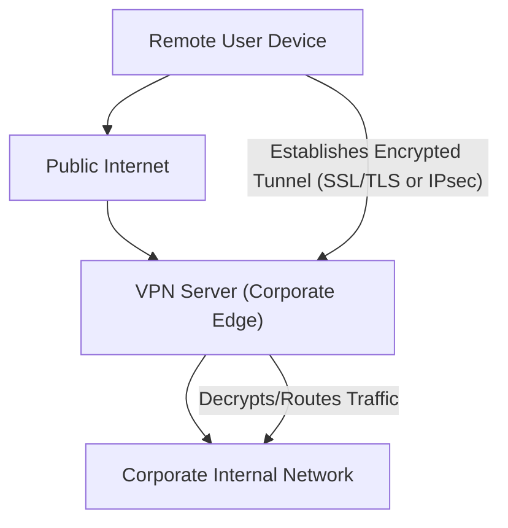

## Firewalls and VPNs
### Core Concepts

*   **Firewalls:** Network security devices that monitor and filter incoming and outgoing network traffic based on a defined set of security rules. They act as a barrier between a trusted internal network and untrusted external networks (like the Internet).
    *   **Primary Goal:** Enforce access control, block malicious traffic, prevent unauthorized access.
*   **Virtual Private Networks (VPNs):** Technologies that create a secure, encrypted "tunnel" over a less secure network (typically the Internet), allowing users to send and receive data as if their computing device were directly connected to the private network.
    *   **Primary Goal:** Provide secure remote access, extend private networks over public infrastructure, ensure data confidentiality and integrity.

### Key Details & Nuances

*   **Firewall Types & Operation:**
    *   **Packet-Filtering (Stateless):** Operates at Layer 3/4 (IP, TCP/UDP headers). Filters based on IP addresses, port numbers, protocols. Treats each packet in isolation, no awareness of connection state.
        *   **Pros:** Simple, fast.
        *   **Cons:** Vulnerable to spoofing, cannot protect against attacks that exploit legitimate connections.
    *   **Stateful Inspection:** Operates at Layer 3/4. Tracks the state of active connections. Only allows incoming traffic if it's part of an established, allowed outbound connection.
        *   **Pros:** Much more secure than stateless, handles complex protocols better.
        *   **Cons:** More resource-intensive.
    *   **Application-Layer Gateway (ALG) / Proxy Firewall:** Operates at Layer 7 (Application Layer). Inspects payload content, understands specific application protocols (HTTP, FTP, SMTP). Can block specific commands or content.
        *   **Pros:** Highest level of security, deep packet inspection.
        *   **Cons:** Performance overhead, protocol-specific, can be a bottleneck.
    *   **Web Application Firewall (WAF):** Specifically designed to protect web applications (Layer 7) from common attacks like SQL Injection, Cross-Site Scripting (XSS), etc.
        *   **Pros:** Specialized protection for web apps.
        *   **Cons:** Not a replacement for network firewalls; specific to HTTP/S traffic.
*   **VPN Protocols & Types:**
    *   **IPsec (Internet Protocol Security):** A suite of protocols that provides cryptographic security for IP communications. Operates at Layer 3 (Network Layer).
        *   **Modes:** **Tunnel Mode** (encrypts and authenticates entire IP packet) and **Transport Mode** (encrypts and authenticates only the IP payload). Tunnel mode is common for VPNs.
        *   **Protocols:** **Authentication Header (AH)** for data integrity and authentication; **Encapsulating Security Payload (ESP)** for encryption, integrity, and authentication.
        *   **Phases:** **Phase 1 (IKE)** establishes a secure channel for negotiating security associations (SAs); **Phase 2** negotiates SAs for the actual data transfer.
        *   **Use Case:** Site-to-site VPNs, secure server-to-server communication.
    *   **SSL/TLS VPNs (OpenVPN, FortiClient SSL-VPN, etc.):** Utilize Secure Sockets Layer/Transport Layer Security. Operates at Layer 4-7.
        *   **Pros:** Easier to traverse firewalls (uses common ports like 443), simpler client deployment (often browser-based or lightweight client).
        *   **Use Case:** Remote access VPNs (individual users connecting to a corporate network).
    *   **VPN Architectures:**
        *   **Site-to-Site:** Connects entire networks (e.g., branch office to headquarters), appears as one logical network.
        *   **Remote Access:** Connects individual users to a private network (e.g., remote employee accessing corporate resources).

### Practical Examples

#### Firewall Rule (Linux `iptables`)

This `iptables` rule allows incoming SSH connections (port 22) only from a specific IP address `192.168.1.100` and drops all other SSH attempts.

```sh
# Allow established and related incoming traffic
sudo iptables -A INPUT -m conntrack --ctstate ESTABLISHED,RELATED -j ACCEPT

# Allow incoming SSH from a specific IP
sudo iptables -A INPUT -p tcp --dport 22 -s 192.168.1.100 -j ACCEPT

# Drop all other incoming SSH traffic (be specific to avoid locking yourself out)
sudo iptables -A INPUT -p tcp --dport 22 -j DROP

# Set default policy for INPUT chain (e.g., to DROP, if not already done, requires careful planning)
# sudo iptables -P INPUT DROP
```

#### VPN Remote Access Flow



### Common Pitfalls & Trade-offs

*   **Performance Overhead:** Both firewalls (especially stateful/proxy) and VPNs (due to encryption/decryption) introduce latency and consume CPU resources. This is a critical trade-off for security.
*   **Misconfiguration:**
    *   **Firewalls:** Overly permissive rules can negate security benefits. Incorrectly blocking legitimate traffic can cause outages. Rule order matters significantly.
    *   **VPNs:** Weak encryption algorithms, poor key management, or incorrect routing settings (e.g., "split tunneling") can undermine security.
*   **Complexity:** Managing large firewall rule sets or complex VPN deployments can be challenging, increasing the risk of errors and requiring specialized expertise.
*   **Single Point of Failure:** A single, unredundant firewall or VPN server can become a bottleneck or a critical point of failure for network access and security.
*   **Split Tunneling (VPN Specific):**
    *   **Concept:** Allows a remote user's traffic destined for the corporate network to go through the VPN tunnel, while other internet traffic (e.g., browsing Google) goes directly to the internet outside the tunnel.
    *   **Trade-off:**
        *   **Pros:** Reduces load on VPN server, better performance for non-corporate traffic, saves corporate bandwidth.
        *   **Cons:** Security risk – traffic not routed through the corporate network isn't subject to corporate security policies/monitoring (e.g., malware protection, DLP), potentially exposing the corporate network if the remote device is compromised.

### Interview Questions

1.  **Differentiate between a stateful and a stateless firewall. When would you prefer one over the other?**
    *   **Answer:** A **stateless firewall** (packet filter) inspects each packet independently, based on basic header info (IP, port). It's fast but lacks context. A **stateful firewall** tracks the state of network connections (e.g., TCP sessions). It only permits incoming traffic if it's part of an established, allowed outbound connection. Prefer **stateful** for most modern network perimeters due to enhanced security (prevents spoofing, better handles legitimate replies). Use **stateless** for very high-performance, simple filtering scenarios (e.g., initial DDoS mitigation at the edge) or when state tracking is impractical.
2.  **Explain the key differences between an IPsec VPN and an SSL/TLS VPN. Provide scenarios where each would be the more appropriate choice.**
    *   **Answer:** **IPsec VPNs** operate at Layer 3 (Network Layer), providing end-to-end encryption for IP packets. They are complex to configure but offer robust security and are ideal for **site-to-site** connections (connecting two networks). **SSL/TLS VPNs** operate at Layer 4-7 (Transport/Application Layer), using common web ports (like 443), making them easier to traverse firewalls and more flexible for **remote access** users with lightweight clients or web browsers. IPsec is chosen for network-to-network persistent secure links, while SSL/TLS is preferred for individual remote users needing secure access to corporate resources.
3.  **Describe the security implications of "split tunneling" in a remote access VPN. How can these risks be mitigated?**
    *   **Answer:** Split tunneling allows some traffic (e.g., corporate resources) to go through the VPN tunnel while other traffic (e.g., personal internet browsing) goes directly to the internet. The security implication is that non-tunneled traffic bypasses corporate security controls (firewalls, IDS/IPS, content filtering). This creates a potential vulnerability where a remote compromised device could introduce malware or exfiltrate data directly to the internet without corporate visibility or protection. Mitigation includes enforcing **full tunneling** (all traffic through VPN), implementing robust endpoint security (antivirus, EDR) on remote devices, and network segmentation combined with strict access controls within the corporate network.
4.  **How do Firewalls and VPNs complement each other in a typical enterprise network architecture?**
    *   **Answer:** Firewalls and VPNs are foundational and complementary. The **firewall** acts as the primary gatekeeper, enforcing access rules at the network perimeter, protecting internal resources from unauthorized external access, and filtering malicious traffic. The **VPN** provides a secure tunnel *through* the firewall for authorized remote users or branch offices, allowing them to bypass the general internet and securely access internal resources as if they were directly connected. The firewall secures the entry point to the VPN server, and the VPN provides secure transport, creating a layered defense strategy.
5.  **You're designing a security architecture for a new cloud-native application. When would you consider a WAF (Web Application Firewall) over a traditional network firewall, or vice-versa?**
    *   **Answer:** A **traditional network firewall** operates at lower layers (L3/L4, sometimes L7 for basic proxying) and focuses on protecting the network infrastructure (VMs, subnets) by filtering IP addresses and ports, and managing stateful connections. It protects against network-level attacks. A **WAF** operates specifically at Layer 7 (HTTP/HTTPS) and inspects the actual content of web requests, protecting the application itself from common web vulnerabilities like SQL injection, XSS, CSRF, and bot attacks. For a cloud-native application, you'd use a **network firewall** (e.g., cloud security groups, network ACLs) to control network access to the application's underlying infrastructure. You'd use a **WAF** in *addition* to the network firewall to specifically protect the web application from application-layer exploits, as the network firewall might not understand the nuances of HTTP traffic well enough to detect these advanced attacks. They are best used in tandem.