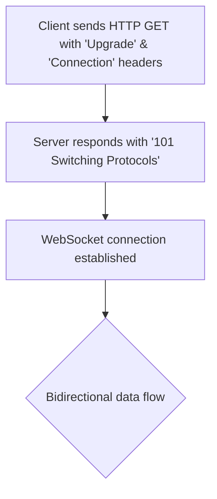

## WebSockets
### Core Concepts

*   **Full-Duplex Communication:** WebSockets provide a persistent, two-way communication channel over a single TCP connection. Unlike HTTP's request/response model, both client and server can send data at any time once the connection is established.
*   **Persistent Connection:** After an initial HTTP "upgrade" handshake, the connection remains open, allowing for low-latency, real-time data exchange without the overhead of repeated HTTP handshakes.
*   **Use Cases:** Ideal for real-time applications like chat applications, live dashboards, gaming, collaborative editing, and push notifications where continuous data streaming is required.

### Key Details & Nuances

*   **Protocol:** WebSockets run over TCP, using `ws://` for unencrypted connections and `wss://` for TLS-encrypted connections (secure WebSockets).
*   **HTTP Handshake (Upgrade Mechanism):**
    *   A client initiates a WebSocket connection via a standard HTTP/1.1 GET request with specific headers:
        *   `Connection: Upgrade`
        *   `Upgrade: websocket`
        *   `Sec-WebSocket-Key`: A randomly generated key for security (to prevent proxy cache poisoning).
        *   `Sec-WebSocket-Version`: Indicates the protocol version (currently 13).
    *   If the server supports WebSockets, it responds with a `101 Switching Protocols` status code and a `Sec-WebSocket-Accept` header (derived from the client's `Sec-WebSocket-Key`).
    *   Upon this response, the underlying TCP connection is "upgraded" from HTTP to the WebSocket protocol.
*   **Framing:** Data is sent over the WebSocket connection in frames, not as raw bytes. This framing mechanism handles message boundaries, allowing the transmission of text (UTF-8) or binary data.
*   **Ping/Pong (Heartbeat):** Built-in mechanism to keep the connection alive, measure latency, and detect unresponsive peers. Clients and servers can send `Ping` frames, and the recipient must reply with a `Pong` frame.
*   **Connection Closure:** Connections can be closed gracefully by either side using a control frame with a status code (e.g., `1000` for normal closure, `1001` for going away, `1006` for abnormal closure).

### Practical Examples

#### WebSocket Handshake Process



#### Client-side (Browser JavaScript/TypeScript)

```typescript
// Basic WebSocket Client
const ws = new WebSocket('ws://localhost:8080'); // Use wss:// for production with TLS

ws.onopen = (event) => {
    console.log('WebSocket connection opened:', event);
    ws.send('Hello from client!');
};

ws.onmessage = (event) => {
    console.log('Message from server:', event.data);
    // Example: Parse JSON messages
    // const message = JSON.parse(event.data);
    // console.log('Parsed message:', message);
};

ws.onclose = (event) => {
    console.log('WebSocket connection closed:', event.code, event.reason);
};

ws.onerror = (error) => {
    console.error('WebSocket error:', error);
};

// To send a message after some time
setTimeout(() => {
    if (ws.readyState === WebSocket.OPEN) {
        ws.send(JSON.stringify({ type: 'statusUpdate', data: 'online' }));
    }
}, 3000);

// To close the connection
// ws.close(1000, 'Client initiated close');
```

### Common Pitfalls & Trade-offs

*   **Stateful Nature & Scaling:** Because WebSockets are persistent, stateful connections, scaling horizontally requires careful design. Load balancers often need "sticky sessions" to ensure a client always reconnects to the same server, or a message queue/broker (e.g., Redis Pub/Sub, RabbitMQ, Kafka) is needed for inter-server communication to propagate messages across a cluster.
*   **Network Intermediaries:** Proxies, firewalls, and load balancers must be configured to support the WebSocket `Upgrade` header and long-lived connections. Misconfiguration can lead to connection failures or timeouts.
*   **Backpressure Management:** When one side produces messages faster than the other can consume them, buffers can overflow. Proper flow control and backpressure mechanisms are crucial to prevent memory exhaustion and ensure reliable delivery.
*   **Reconnection Logic:** Clients need robust reconnection strategies with exponential backoff to handle transient network issues or server restarts.
*   **Security:**
    *   **Origin Validation:** Essential to prevent cross-site WebSocket hijacking (CSWSH) by verifying the `Origin` header.
    *   **Input Validation & Rate Limiting:** All incoming messages from clients must be validated and sanitized. Implement rate limiting to prevent abuse or denial-of-service attacks.
    *   **Authentication & Authorization:** Integrate with existing authentication systems (e.g., JWT) during or after the handshake to secure communication.

### Interview Questions

1.  **When would you choose WebSockets over traditional HTTP/REST or Server-Sent Events (SSE)?**
    *   **Answer:** Choose WebSockets for real-time applications requiring true bi-directional, low-latency communication (e.g., chat, online gaming, collaborative editing). HTTP/REST is stateless and request-response, suitable for CRUD operations. SSE is uni-directional (server-to-client only), better for simple push notifications where the client doesn't need to send frequent data back.

2.  **Describe the WebSocket handshake process. What role do the `Sec-WebSocket-Key` and `Sec-WebSocket-Accept` headers play?**
    *   **Answer:** The handshake starts as an HTTP GET request with `Upgrade: websocket` and `Connection: Upgrade` headers. The client sends a `Sec-WebSocket-Key` (a random base64-encoded nonce). The server, if it accepts the upgrade, responds with `101 Switching Protocols` and calculates `Sec-WebSocket-Accept` by concatenating the client's key with a specific GUID ("258EAFA5-E914-47DA-95CA-C5AB0DC85B11") and then SHA-1 hashing and base64-encoding the result. This handshake confirms both parties agree to switch protocols and helps prevent proxy cache poisoning.

3.  **What are the primary challenges of scaling a WebSocket application, especially compared to a stateless REST API? How can these be addressed?**
    *   **Answer:** The primary challenge is the *stateful* nature of WebSocket connections. Unlike stateless REST, a client's connection is tied to a specific server. Scaling horizontally requires:
        *   **Sticky Sessions:** Load balancers must ensure a client consistently connects to the same backend server.
        *   **Message Brokers:** To enable communication between clients connected to different backend servers, a message broker (e.g., Redis Pub/Sub, Kafka) is essential. Servers publish messages to topics, and all relevant servers subscribe and then forward messages to their connected clients.

4.  **How do WebSockets handle network interruptions or disconnections, and what mechanisms are in place to ensure connection reliability?**
    *   **Answer:** WebSockets use `Ping` and `Pong` frames as heartbeats to detect unresponsive peers or network issues. If a peer doesn't respond to a `Ping`, the connection is typically closed. On the client side, robust applications implement reconnection logic with exponential backoff to automatically re-establish connections after a drop. The TCP layer itself provides some reliability, but WebSockets add application-level heartbeats for liveness detection.

5.  **What are common security considerations when implementing WebSockets?**
    *   **Answer:**
        *   **Origin Validation:** Crucial to prevent Cross-Site WebSocket Hijacking (CSWSH) by validating the `Origin` header on the server side against a whitelist of allowed domains.
        *   **Authentication & Authorization:** Secure the initial handshake and subsequent message exchange using tokens (e.g., JWT) or session-based authentication. Ensure users are authorized to perform actions.
        *   **Input Validation:** All messages received from clients must be rigorously validated and sanitized to prevent injection attacks, malformed data, or DoS.
        *   **Rate Limiting:** Implement limits on the frequency and volume of messages a client can send to prevent abuse or denial-of-service attacks.
        *   **TLS (wss://):** Always use `wss://` in production to encrypt traffic and prevent eavesdropping and man-in-the-middle attacks.