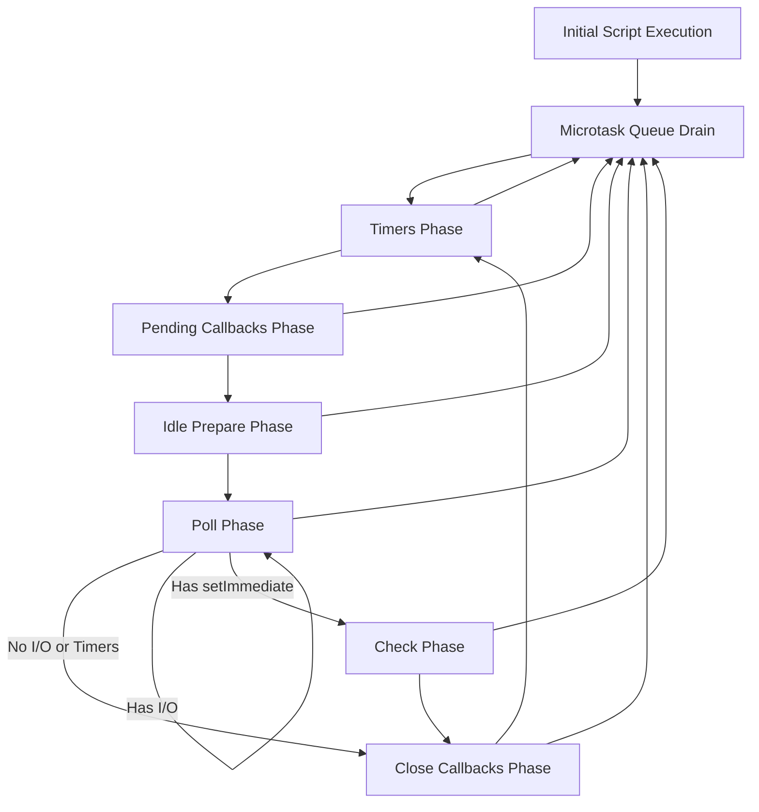

## The Event Loop: Phases & Micro/Macro Tasks
### Core Concepts

*   **Non-Blocking I/O & Concurrency:** Node.js uses a single-threaded JavaScript execution model but achieves concurrency through asynchronous, non-blocking I/O operations. The Event Loop is the core mechanism enabling this.
*   **Callback Queue Management:** It continuously checks for tasks in various queues (e.g., timers, I/O, `setImmediate`) and pushes their associated callbacks onto the call stack for execution once the stack is empty.
*   **Event-Driven Nature:** Node.js applications typically react to events (e.g., HTTP requests, file reads, database responses) via callbacks, and the Event Loop orchestrates when these callbacks run.

### Key Details & Nuances

*   **Event Loop Phases (Order of Execution):** The Event Loop iterates through distinct phases, each managing specific types of callbacks.
    1.  **`timers`**: Executes `setTimeout()` and `setInterval()` callbacks whose scheduled time has elapsed.
    2.  **`pending callbacks`**: Executes I/O callbacks deferred to the next loop iteration (e.g., some TCP errors).
    3.  **`idle, prepare`**: Internal Node.js phases, primarily for module loading.
    4.  **`poll`**:
        *   Retrieves new I/O events (e.g., file reads, network requests, database queries).
        *   If there are `setImmediate()` callbacks, it will execute them *after* processing any current I/O events in this phase.
        *   If no I/O events are pending and `setImmediate()` callbacks exist, the loop will move to the `check` phase.
        *   If no I/O events are pending and no `setImmediate()` callbacks exist, the loop will wait here for new I/O events, *or* if timers are scheduled, it will skip to the `timers` phase.
    5.  **`check`**: Executes `setImmediate()` callbacks.
    6.  **`close callbacks`**: Executes `close` event callbacks (e.g., `socket.on('close', ...)`, `server.close()`).

*   **Microtasks vs. Macrotasks:**
    *   **Macrotasks (Tasks):** Represent larger units of work. Examples: Callbacks for `setTimeout`, `setInterval`, `setImmediate`, I/O operations. Each turn of the Event Loop processes one macrotask from the current phase's queue.
    *   **Microtasks (Jobs):** Higher priority tasks that are executed immediately after the currently executing macrotask (or current synchronous code) completes, and *before* the Event Loop moves to the next phase.
        *   `process.nextTick()`: Has the highest priority. Executes before any Promise microtasks and before *any* other Event Loop phase work.
        *   `Promise.resolve().then()`, `async/await`, `queueMicrotask()`: Execute after `process.nextTick()` but still within the current phase's microtask queue.
    *   **Execution Flow:** After each macrotask (including initial script execution), Node.js completely drains the microtask queue *before* the Event Loop proceeds to the next phase or processes the next macrotask within the same phase.

*   **`process.nextTick()` vs. `setTimeout(fn, 0)` vs. `setImmediate()`:**
    *   `process.nextTick(fn)`: Executes `fn` at the end of the current operation, before the Event Loop advances to the next phase. This is effectively "now, but after everything else synchronous in this current run."
    *   `setTimeout(fn, 0)`: Schedules `fn` to run in the `timers` phase of the *next* (or a future) Event Loop turn. Its execution time is non-guaranteed `0ms` and depends on other pending operations.
    *   `setImmediate(fn)`: Schedules `fn` to run in the `check` phase of the *current* Event Loop turn. Generally executes before `setTimeout(fn, 0)` if both are called within an I/O callback.

### Practical Examples

**1. Event Loop Phases Flow**



**2. Microtask vs. Macrotask Execution Order**

```typescript
console.log('1. Start');

setTimeout(() => {
    console.log('5. setTimeout callback (Macrotask: Timers)');
    Promise.resolve().then(() => {
        console.log('6. Promise.resolve inside setTimeout (Microtask)');
    });
}, 0);

Promise.resolve().then(() => {
    console.log('3. Promise.resolve outside (Microtask)');
});

process.nextTick(() => {
    console.log('2. process.nextTick (Microtask)');
});

setImmediate(() => {
    console.log('7. setImmediate callback (Macrotask: Check)');
});

console.log('4. End');

// Expected Output:
// 1. Start
// 2. process.nextTick (Microtask)
// 3. Promise.resolve outside (Microtask)
// 4. End
// 5. setTimeout callback (Macrotask: Timers)
// 6. Promise.resolve inside setTimeout (Microtask)
// 7. setImmediate callback (Macrotask: Check)
```

**3. `setImmediate` vs `setTimeout(0)` in I/O Callback**

```typescript
import * as fs from 'fs';

fs.readFile(__filename, () => {
    console.log('1. readFile callback (Poll Phase Macrotask)');

    setTimeout(() => {
        console.log('3. setTimeout inside readFile (Timers Phase Macrotask)');
    }, 0);

    setImmediate(() => {
        console.log('2. setImmediate inside readFile (Check Phase Macrotask)');
    });
});

// Expected (usually, but not guaranteed due to system specifics):
// 1. readFile callback (Poll Phase Macrotask)
// 2. setImmediate inside readFile (Check Phase Macrotask)
// 3. setTimeout inside readFile (Timers Phase Macrotask)

// Explanation: When inside an I/O callback, the Event Loop is in the 'poll' phase.
// It will proceed to 'check' before looping back to 'timers'.
```

### Common Pitfalls & Trade-offs

*   **Blocking the Event Loop:** CPU-intensive synchronous operations (e.g., heavy computations, complex regex matching, large JSON parsing) will block the single Event Loop thread, preventing it from processing other events (I/O, timers), leading to application unresponsiveness and perceived freezing.
    *   **Mitigation:** Offload heavy computations to worker threads (`worker_threads` module) or break them into smaller, asynchronous chunks.
*   **Microtask Starvation:** Excessive use of `process.nextTick()` or long chains of Promises can continuously queue microtasks, effectively "starving" subsequent macrotasks (like I/O callbacks or timers) from being processed, as the microtask queue must be fully drained before the Event Loop can proceed.
*   **Race Conditions/Unpredictable Order:** Misunderstanding the exact phase execution order of `setTimeout(0)` and `setImmediate()` can lead to hard-to-debug race conditions, especially when mixed with I/O operations. `setImmediate` is generally preferred for immediate deferral within the same loop turn, especially from I/O callbacks.
*   **Error Handling:** Uncaught errors in asynchronous callbacks can crash the Node.js process if not handled with `try...catch` or domain-specific error handlers (`process.on('uncaughtException')` - use with extreme caution and only for logging/graceful shutdown, not recovery).

### Interview Questions

1.  **Explain the Node.js Event Loop and its phases in detail. Why is it crucial for Node.js's performance?**
    *   **Expert Answer:** The Event Loop is Node.js's core concurrency model, enabling non-blocking I/O. It allows a single JavaScript thread to handle many concurrent operations by offloading I/O to the kernel and efficiently managing callbacks in various queues. Its phases (`timers`, `pending callbacks`, `poll`, `check`, `close callbacks`) dictate the order in which different types of macrotasks (callbacks) are processed. This sequential processing through phases ensures fairness and prevents one type of callback from completely dominating CPU time, making Node.js highly performant for I/O-bound applications.

2.  **Differentiate between microtasks and macrotasks in the context of the Event Loop. When are microtasks executed relative to macrotasks and other phases?**
    *   **Expert Answer:** Macrotasks are higher-level units of work representing the major Event Loop phases (e.g., `setTimeout`, I/O callbacks). Microtasks are smaller, higher-priority tasks (`process.nextTick`, `Promises`). The critical difference is execution order: after *each* macrotask completes (or the initial script execution), the Node.js runtime completely drains its microtask queue *before* the Event Loop can move to the next macrotask in the current phase or proceed to the next phase. `process.nextTick` has the highest priority within the microtask queue, executing before Promises. This priority ensures immediate execution for critical tasks without waiting for a full loop iteration.

3.  **Compare and contrast `process.nextTick()`, `setTimeout(fn, 0)`, and `setImmediate()`. Provide a scenario where their execution order might differ significantly.**
    *   **Expert Answer:**
        *   `process.nextTick()`: Executes its callback *immediately* after the current synchronous code (or current macrotask) finishes, *before* the Event Loop advances to any phase. It's the highest priority deferral mechanism.
        *   `setTimeout(fn, 0)`: Schedules its callback to run in the `timers` phase. Its minimum delay is 0ms, but actual execution depends on Event Loop load and other pending tasks; it will always run in a future turn of the Event Loop.
        *   `setImmediate()`: Schedules its callback to run in the `check` phase of the *current* Event Loop turn.
        *   **Scenario (inside an I/O callback):** If you call all three inside an `fs.readFile` callback:
            ```javascript
            fs.readFile(__filename, () => {
                process.nextTick(() => console.log('nextTick'));
                setTimeout(() => console.log('timeout'), 0);
                setImmediate(() => console.log('immediate'));
            });
            // Output: nextTick -> immediate -> timeout
            ```
            `nextTick` runs immediately. `setImmediate` runs because the loop is in the `poll` phase and will naturally transition to `check` next. `setTimeout` runs last because the loop must complete `check`, `close`, and then cycle back to `timers`. If not in an I/O context, `setTimeout(0)` might run before `setImmediate` due to the initial Event Loop setup.

4.  **What happens if a long-running synchronous task is executed on the Event Loop? How would you mitigate this issue in a Node.js application?**
    *   **Expert Answer:** A long-running synchronous task (e.g., intensive CPU computation, large synchronous file read) will *block* the single Event Loop thread. This prevents Node.js from processing any other events (e.g., incoming HTTP requests, database responses, timers) until the task completes. The application will become unresponsive and appear "frozen."
    *   **Mitigation:**
        1.  **Worker Threads:** For truly CPU-bound tasks, use Node.js `worker_threads` module. This offloads the computation to a separate thread, keeping the main Event Loop free.
        2.  **Asynchronous APIs:** Always prefer asynchronous I/O operations (`fs.readFile` instead of `fs.readFileSync`).
        3.  **Chunking/Batching:** Break down large computations into smaller, manageable chunks that yield control back to the Event Loop using `setImmediate` or `process.nextTick` between chunks.
        4.  **External Services:** For extremely intensive tasks, consider offloading to dedicated services (e.g., message queues, microservices) rather than running directly in the Node.js process.