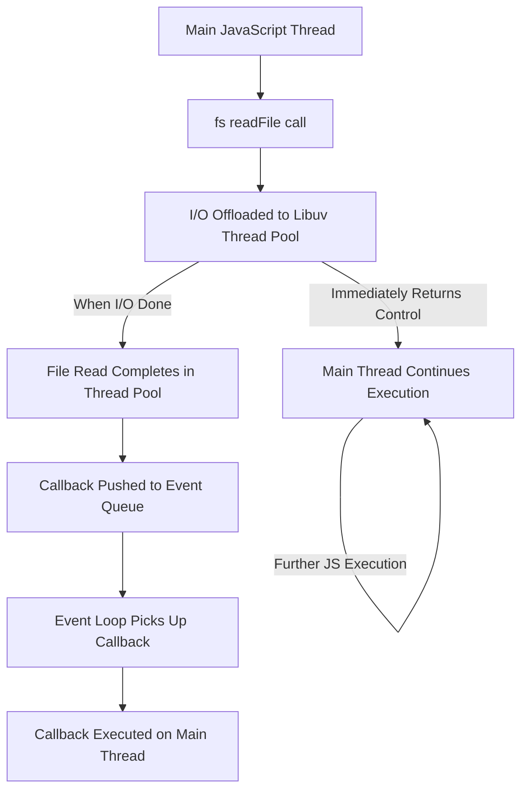

## Blocking vs. Non-Blocking I/O Deep Dive
### Core Concepts
*   **Blocking I/O:** An operation where the execution of the program pauses and waits until the I/O task (e.g., reading a file, network request, database query) is fully completed. During this wait, the thread performing the operation is idle and cannot perform other tasks.
*   **Non-Blocking I/O:** An operation where the program initiates the I/O task and immediately continues with subsequent code execution without waiting for the I/O to finish. The program is notified later (via a callback, Promise, or event) when the I/O operation completes, and the result is available.
*   **Node.js Design:** Node.js is inherently non-blocking and event-driven. It primarily uses a single-threaded JavaScript execution model coupled with an asynchronous I/O mechanism (Event Loop, `libuv`) to achieve high concurrency without needing multiple threads for most operations.

### Key Details & Nuances
*   **Event Loop:** Node's central orchestrator. It continuously checks for tasks in the call stack and event queue, pushing completed asynchronous operations' callbacks onto the call stack for execution. The Event Loop itself runs on a single thread.
*   **`libuv` and Thread Pool:**
    *   Node.js uses `libuv`, a C++ library, to abstract and manage asynchronous I/O operations across different operating systems.
    *   While Node.js JavaScript execution is single-threaded, `libuv` uses an internal **thread pool** (default size 4, configurable via `UV_THREADPOOL_SIZE`) for I/O operations that are *inherently blocking* at the OS level (e.g., synchronous file system operations, DNS lookups, some crypto functions, CPU-bound tasks).
    *   These blocking operations are offloaded to threads in this pool, allowing the main Event Loop to remain non-blocked and responsive. Once a thread pool operation completes, its callback is queued to the Event Loop.
*   **Synchronous JS vs. Blocking I/O:**
    *   It's critical to distinguish: A long-running CPU-bound *synchronous JavaScript function* will block the single Event Loop thread, making the entire application unresponsive. This is different from a "blocking I/O" call being handled by `libuv`'s thread pool, which does *not* block the main Event Loop.
*   **Asynchronous Patterns:**
    *   **Callbacks:** Traditional way to handle async results (`fs.readFile`). Can lead to "callback hell" with deeply nested operations.
    *   **Promises:** Provide a cleaner, chainable way to manage asynchronous operations (`.then()`, `.catch()`).
    *   **Async/Await:** Syntactic sugar built on Promises, allowing asynchronous code to be written and read in a more synchronous-like style, greatly improving readability and error handling (`try...catch`).

### Practical Examples

**1. Blocking I/O (`fs.readFileSync`)**
```typescript
import * as fs from 'fs';

console.log('1. Start of script');

try {
    // This call is blocking: Node.js waits here until the file is fully read
    const data = fs.readFileSync('test.txt', 'utf8');
    console.log('2. Blocking read completed. Data:', data.trim());
} catch (error) {
    console.error('Error during blocking read:', error);
}

console.log('3. End of script');

// Expected Output (assuming 'test.txt' exists with "Hello Blocking"):
// 1. Start of script
// 2. Blocking read completed. Data: Hello Blocking
// 3. End of script
```

**2. Non-Blocking I/O (`fs.readFile` with Callback)**
```typescript
import * as fs from 'fs';

console.log('1. Start of script');

// This call is non-blocking: Node.js initiates the read and moves on immediately
fs.readFile('test.txt', 'utf8', (err, data) => {
    if (err) {
        console.error('Error during non-blocking read:', err);
        return;
    }
    // This callback executes much later, after the file read completes
    console.log('3. Non-blocking read completed. Data:', data.trim());
});

console.log('2. End of script (executed before file read completion)');

// Expected Output (assuming 'test.txt' exists with "Hello Non-Blocking"):
// 1. Start of script
// 2. End of script (executed before file read completion)
// 3. Non-blocking read completed. Data: Hello Non-Blocking
```

**3. Non-Blocking I/O Flow (Mermaid Diagram)**


### Common Pitfalls & Trade-offs
*   **Blocking the Event Loop:** The most critical pitfall. Performing CPU-intensive synchronous operations (e.g., complex calculations, heavy data transformations, long loops without yielding) on the main thread will make the entire Node.js application unresponsive, preventing it from handling any new requests or I/O completions.
    *   **Trade-off/Solution:** For CPU-bound tasks, use Node.js `worker_threads` to offload computation to separate threads, or consider dedicated microservices.
*   **Callback Hell / Inversion of Control:** While largely mitigated by Promises and Async/Await, deeply nested callbacks can lead to unmanageable code, difficult error handling, and loss of control flow.
*   **Memory Consumption with `readFile`:** Reading entire large files into memory using `fs.readFile` can lead to high memory usage and potential out-of-memory errors.
    *   **Trade-off/Solution:** Use streaming I/O (`fs.createReadStream`) for large files to process data in chunks, which is more memory-efficient and keeps operations non-blocking.
*   **Error Handling Complexity:** Errors thrown within asynchronous callbacks (without Promises/Async/Await) cannot be caught by a standard `try...catch` block around the initiating call.
    *   **Trade-off/Solution:** Use `.catch()` for Promises or `try...catch` with `await` for `async/await` functions.

### Interview Questions

1.  **Q:** Explain the core difference between blocking and non-blocking I/O in Node.js, and articulate why Node.js prioritizes non-blocking I/O.
    *   **A:** Blocking I/O halts the program's execution until an operation completes, making the thread idle. Non-blocking I/O allows the program to continue immediately, processing the result later via callbacks/Promises. Node.js prioritizes non-blocking I/O (via its single-threaded Event Loop and `libuv`) to maximize concurrency and responsiveness. This prevents the main thread from waiting idly for slow I/O, allowing it to serve many simultaneous clients efficiently.

2.  **Q:** How does Node.js handle I/O operations that are *inherently blocking* at the operating system level (e.g., certain file system operations or DNS lookups) without blocking its main JavaScript thread?
    *   **A:** Node.js uses `libuv`, a cross-platform asynchronous I/O library. For OS-level operations that don't have non-blocking equivalents, `libuv` maintains an internal thread pool. Node.js offloads these "blocking" operations to a thread in this pool. This allows the main JavaScript Event Loop to remain free and continue processing other tasks. Once the operation in the thread pool completes, its result is queued back to the Event Loop to execute the corresponding callback.

3.  **Q:** Describe a scenario where a Node.js application, despite being designed for non-blocking I/O, might become unresponsive. How would you diagnose and resolve this issue?
    *   **A:** A common scenario is when the single-threaded Event Loop is "blocked" by a CPU-intensive *synchronous* JavaScript operation (e.g., a complex calculation, a large `for` loop, or synchronous JSON parsing). This prevents the Event Loop from processing any I/O completion callbacks or new incoming requests.
        *   **Diagnosis:** Monitoring CPU usage (high for the Node process), observing slow response times, or using Node.js diagnostic tools like `clinic doctor` or CPU profilers.
        *   **Resolution:** Offload the CPU-bound task to a Node.js `worker_threads` (for parallel JavaScript execution) or by breaking the task into smaller, asynchronous chunks using `setImmediate` or `process.nextTick` (though `worker_threads` is generally preferred for heavy computation).

4.  **Q:** Compare and contrast the common patterns for handling asynchronous operations in Node.js: callbacks, Promises, and `async/await`. Highlight their respective benefits and drawbacks from a maintainability perspective.
    *   **A:**
        *   **Callbacks:** Simple for single async operations. **Benefits:** Low overhead. **Drawbacks:** Can lead to "callback hell" (deep nesting), difficult error propagation, and inversion of control for complex flows. Poor maintainability for intricate logic.
        *   **Promises:** Objects representing the eventual completion or failure of an async operation. **Benefits:** Chainable (`.then()`, `.catch()`), cleaner structure than nested callbacks, better error handling. Improved readability and maintainability over raw callbacks.
        *   **Async/Await:** Syntactic sugar built on Promises. **Benefits:** Allows asynchronous code to be written and read in a synchronous-like, sequential manner, significantly enhancing readability and making error handling (`try...catch`) intuitive. Modern, highly maintainable approach. **Drawbacks:** Requires `await` keyword within an `async` function.

5.  **Q:** When dealing with very large files in Node.js, why is `fs.createReadStream` generally preferred over `fs.readFile`? Explain the underlying I/O implications.
    *   **A:** `fs.readFile` reads the *entire file into memory* before its callback is invoked. For very large files, this can lead to excessive memory consumption, potential out-of-memory errors, and might even block the Event Loop if the file is massive and the operation is synchronous (`fs.readFileSync`).
        `fs.createReadStream`, conversely, uses **streaming I/O**. It reads the file in small, manageable chunks as data becomes available, emitting `data` events. This is non-blocking, highly memory-efficient, and allows for processing the file incrementally. It avoids loading the entire file into RAM, making it ideal for large datasets and ensuring the Node.js process remains responsive.